大家都是怎么调试 React 组件的呢？

很多同学都会说，console.log 啊。

这样可以，但效率太低了，因为你只能看到你打印的一些零散值，看不到代码的具体执行路线，比如走了哪些分支、调用某个函数的时候参数是什么。

而如果你使用 debugger 断点调试的方式，就可以看到代码执行的细节，可以在关心的地方断住，单步执行来观察是否符合预期，可以帮你更好的理清代码逻辑。

所以说，学会断点调试 React 组件的代码，是提升你写代码和排查错误的水平的很重要的一步。

这节我们就来学下 React 组件的调试。

用 cra 创建个项目：

```lua
npx create-react-app --template typescript debug-test
```

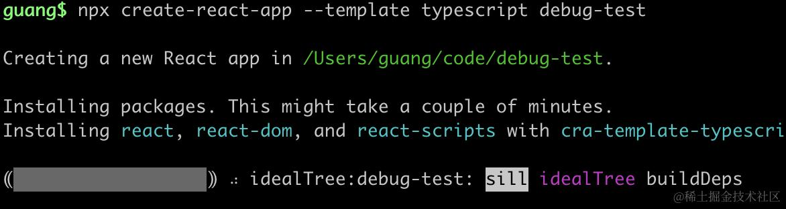

改下 index.tsx

```javascript
import ReactDOM from 'react-dom/client';
import App from './App';

const root = ReactDOM.createRoot(
  document.getElementById('root') as HTMLElement
);
root.render(<App />);
```

然后在 App.tsx 写个组件：

```javascript
import { useEffect, useLayoutEffect, useState } from "react";

async function queryData() {
  const data =
    (await new Promise()) <
    number >
    ((resolve) => {
      setTimeout(() => {
        resolve(666);
      }, 2000);
    });
  return data;
}

function App() {
  const [num, setNum] = useState(0);

  useLayoutEffect(() => {
    queryData().then((data) => {
      setNum(data);
    });
  }, []);

  return (
    <div
      onClick={(e) => {
        setNum((prevNum) => prevNum + 1);
      }}
    >
      {num}
    </div>
  );
}

export default App;
```

把开发服务跑起来：

```arduino
npm run start
```


点击 debug 面板的 create a launch.json file

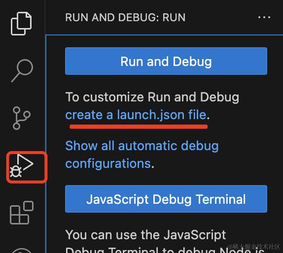

选择 chrome 类型的调试配置：

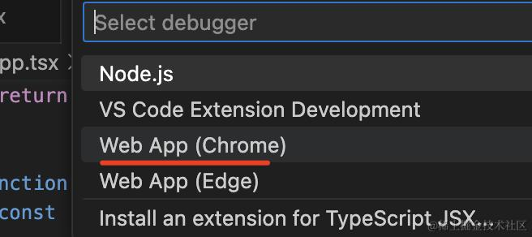

它会创建 .vscode/launch.json 文件：

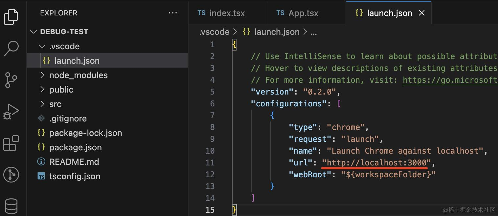

把端口改为 3000

然后点击调试按钮，会跑一个浏览器：

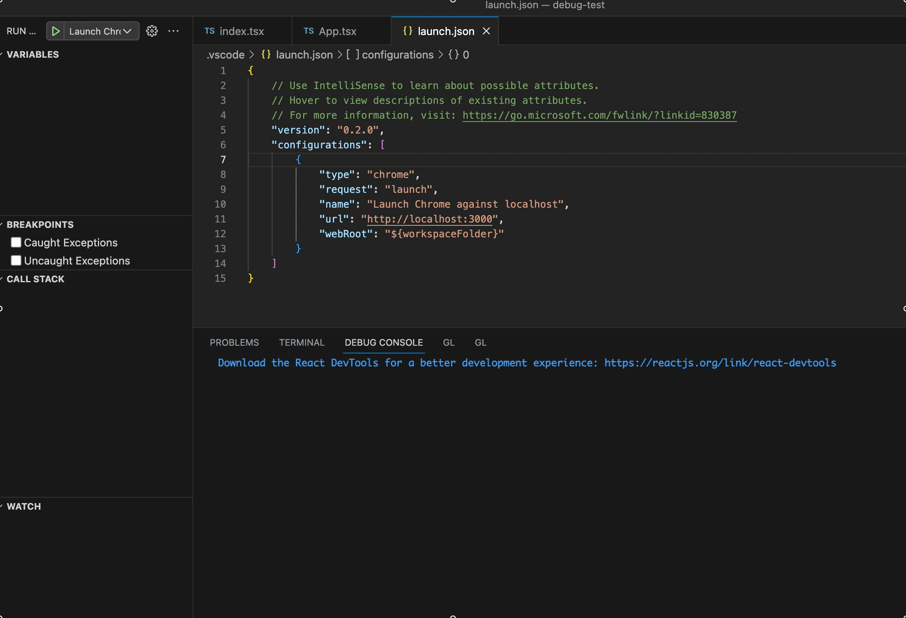

打几个断点，然后点击刷新：

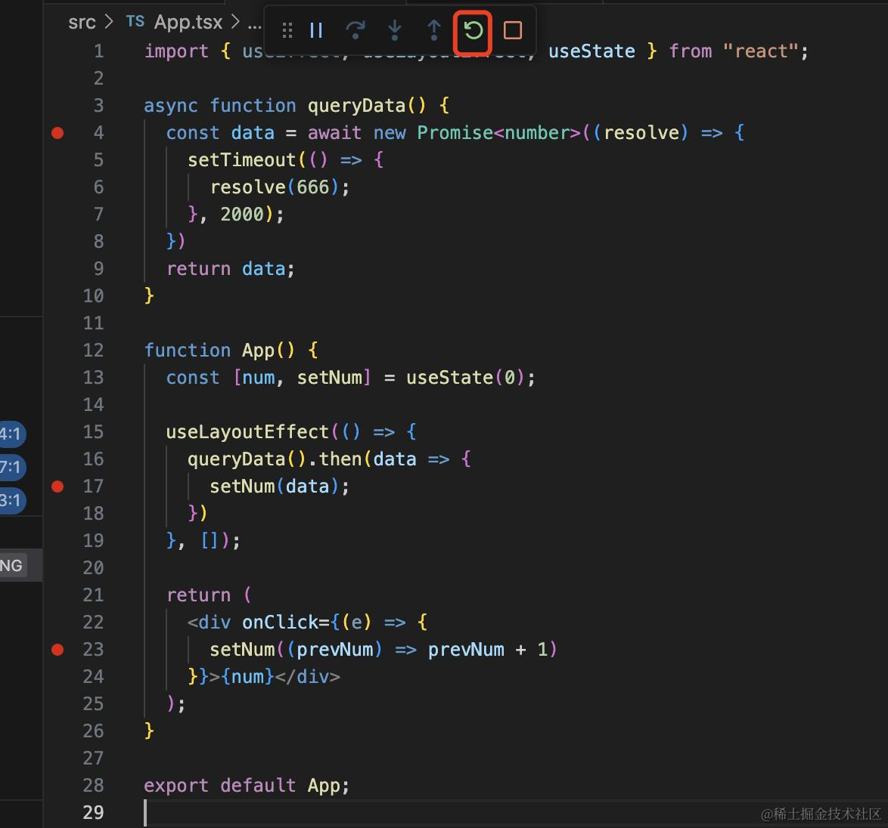

代码会在断点处断住，左边可以看到作用域、调用栈，鼠标 hover 到变量上可以看到变量值：

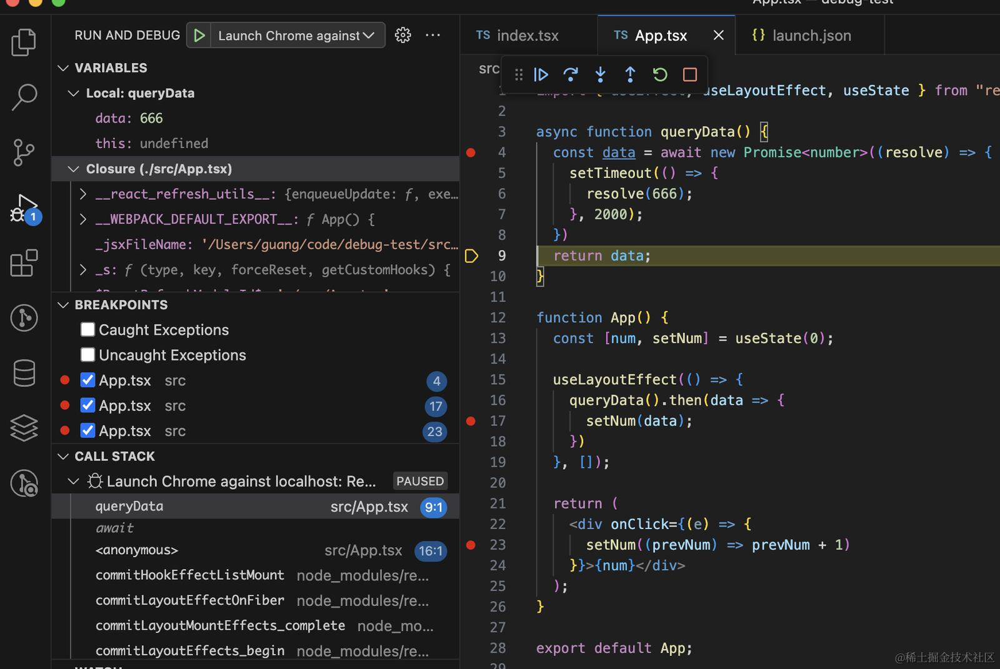

这几个按钮分别是跳断点执行、单步执行、进入函数、跳出函数、刷新、停止：


可以点点试试看。

在页面点击 div，会触发 click 事件，在断点处断住，

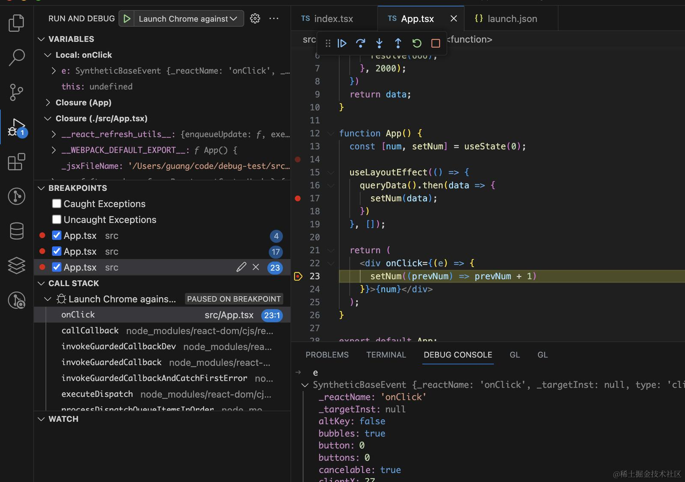

可以在下面的 debug console 输入变量或者表达式，会输出执行结果：

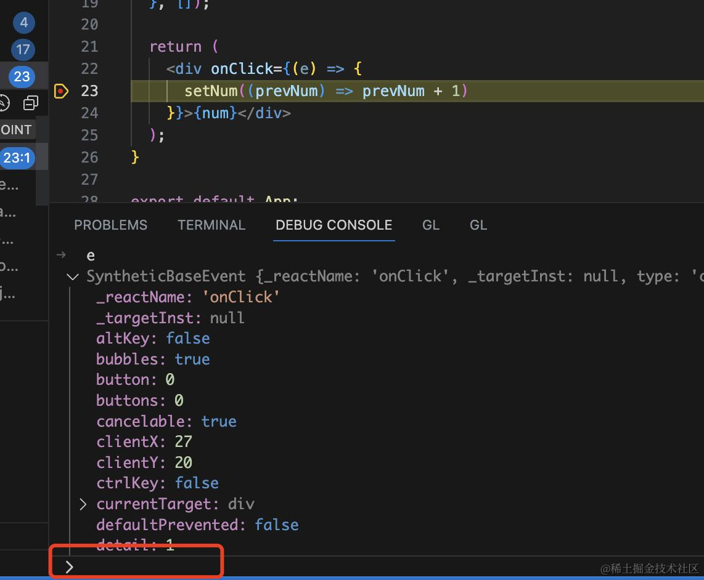

这样调试不比 console.log 方便多了？

而且还有其他几种断点类型：

右键可以选择添加一个条件断点:

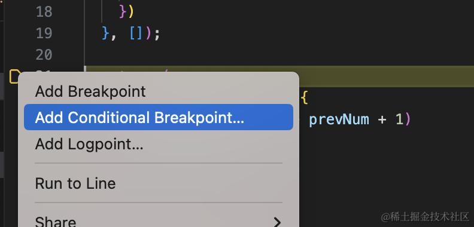

输入表达式，代码会在满足条件的时候断住：

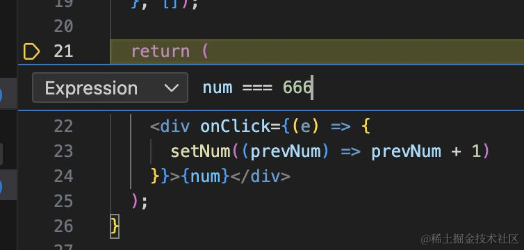


也可以选择 hit count，代码会在触发对应的次数的时候断住：

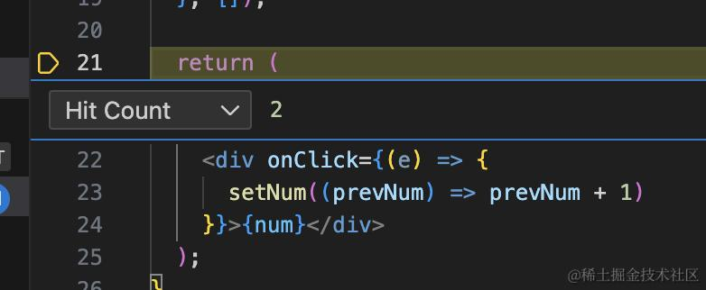

或者是 logpoint，它不会断住，但会在代码执行到这里的时候打印表达式的值：

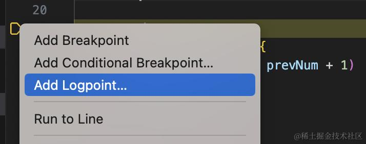

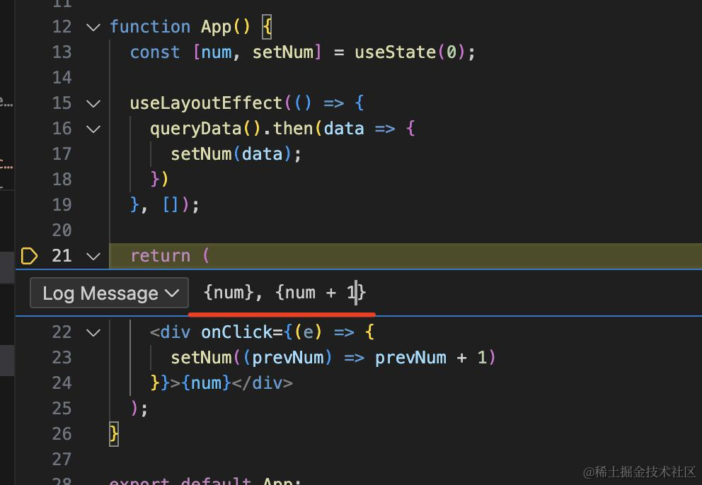

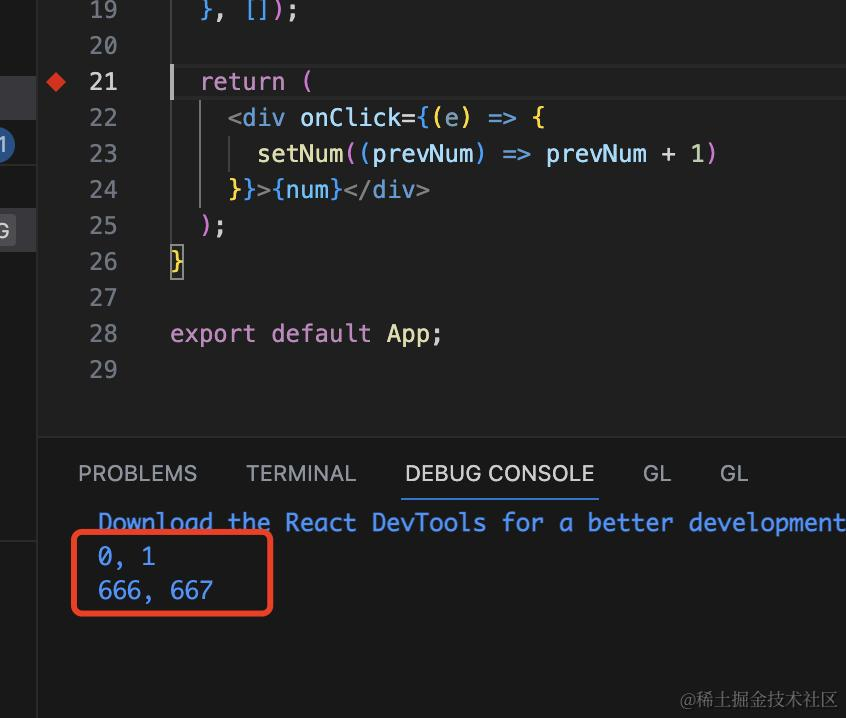

这些断点类型也都挺有用的。

这样我们就可以在 VSCode 里边写 React 组件边断点调试了。

不过，有同学可能会问，这个浏览器好像没有 React DevTools 啊。

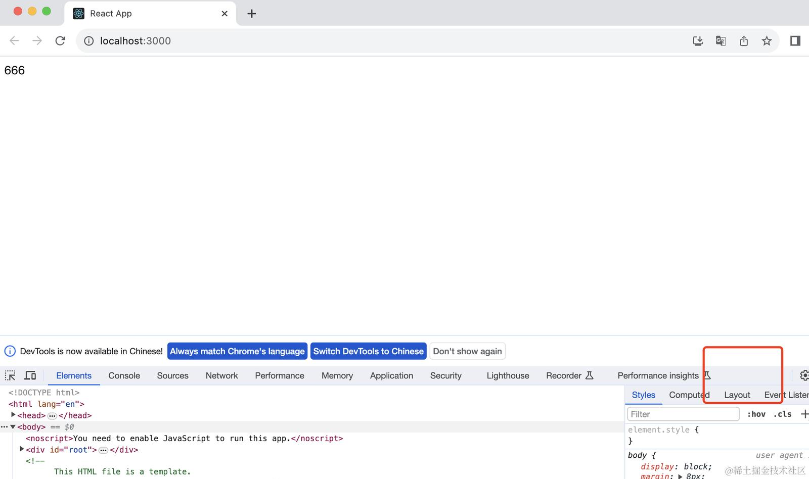

确实，因为这跑的是一个新的浏览器实例，没有之前的那些用户数据。

用户数据是保存在 userDataDir 里的，一个 userDataDir 对应一个浏览器实例。

不信我们试试看：

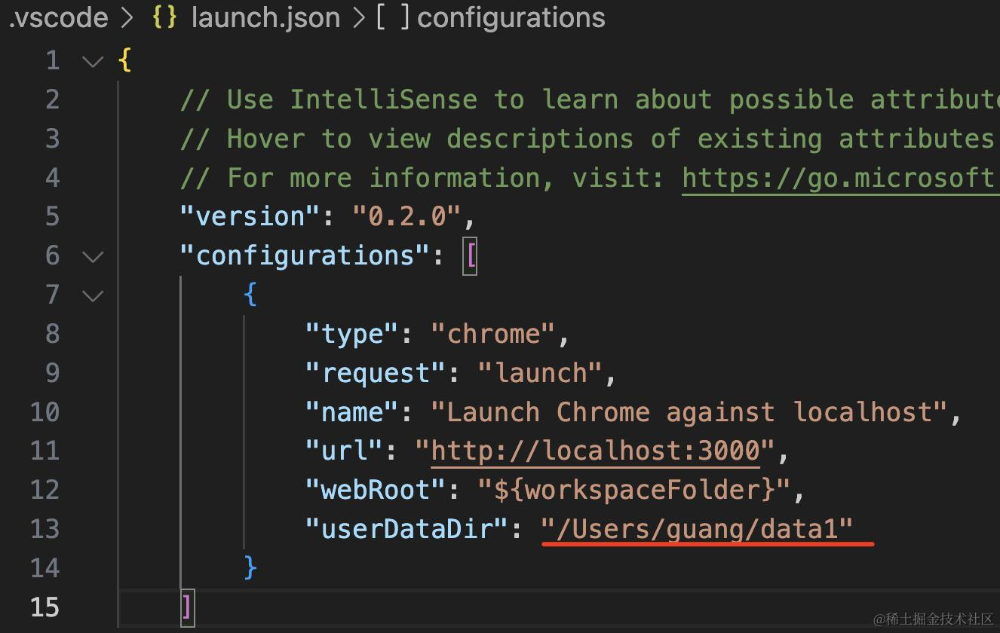

我指定一个 userDataDir，然后点击调试启动。

在启动的浏览器里把掘金收藏为书签：

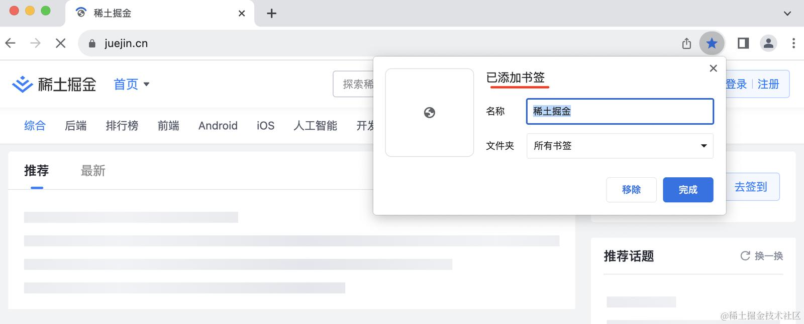

然后进入刚才那个 userDataDir，进入 defaults 目录，看一下 Bookmarks 文件的内容：

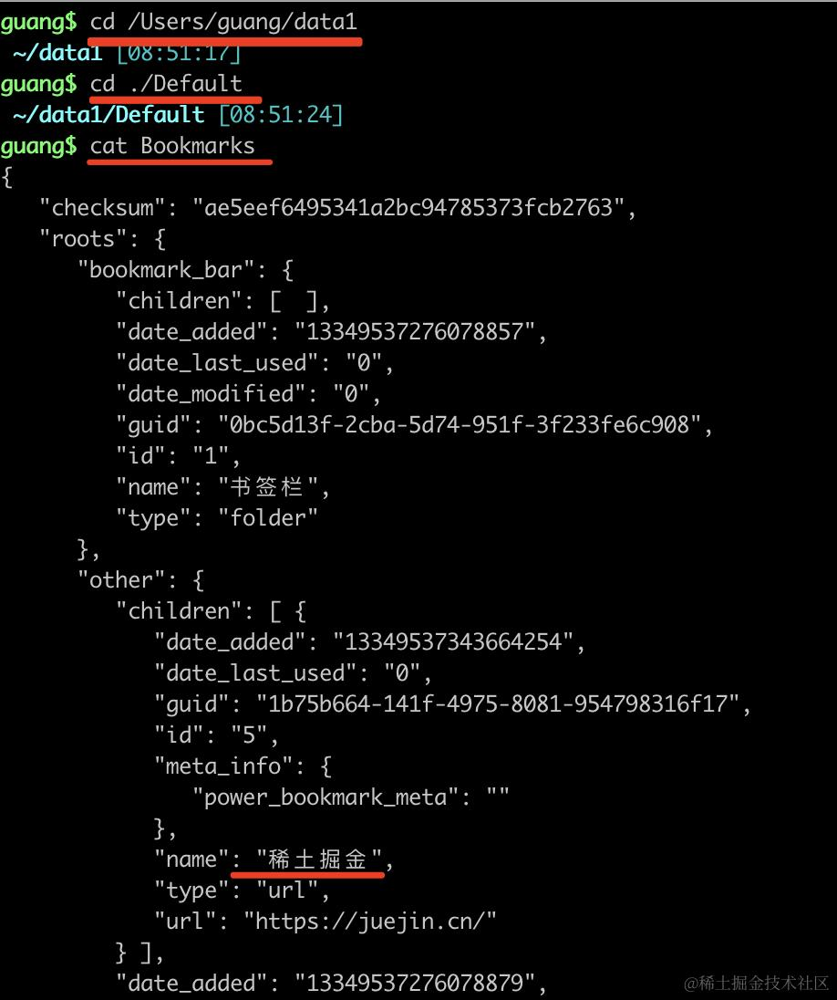

就有刚才保存的书签了。

同理，各种 chrome 插件、浏览记录、cookies 等等，所有用户数据都是保存在 userDataDir 里。

chrome 一个 userDataDir 只能跑一个实例。

我们调试的时候，如果没有指定 userDataDir，默认是临时创建一个新的 userDataDir。

所以这时候自然就没有 React DevTools 等你之前安装的插件了。

如果想调试的时候还用这些插件，那可以把 userDataDir 设置为 false，就是这样就是用默认的 userDatDir 来跑：

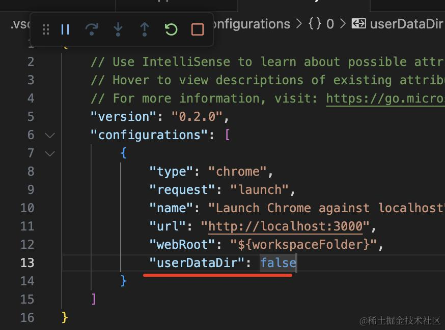

这时候需要你把之前跑的 chrome 关掉才能跑，因为一个 userDataDir 只能跑一个实例。

之后再点击调试，这次跑的浏览器就有你之前装的 React DevTools 了：


这样，我们就可以在 VSCode 里断点调试，并且跑的调试浏览器还有 React DevTools 可用了。

## 总结

这节我们学了如何用 VSCode 调试 React 组件。

点击创建 launch.json，输入 chrome 类型的调试配置，点击调试，这时候代码就会在打的断点处断住。

断点类型有普通断点、条件断点、hit count、logpoint 等。

用 debugger 可以在想调试的代码处断住，单步调试，看一些变量的变化，看代码执行路线，这样高效很多。

此外，chrome 的各种用户数据是保存在 userDataDir 下，一个 userDataDir 只能跑一个实例。

默认跑的浏览器是会创建新的临时 userDataDir，所以没有之前的用户数据，也就没有之前安装的 React DevTools 等插件。

可以把它设置为 false，然后关掉别的浏览器再跑，这时候就是在默认 userDataDir 跑的，各种用户的数据都有。

会断点调试 React 组件，是提高开发和排查问题效率的很重要的技能。
