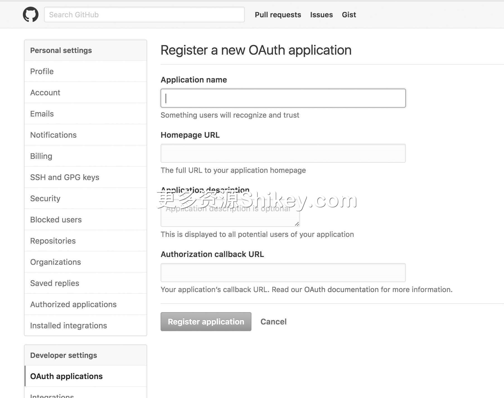
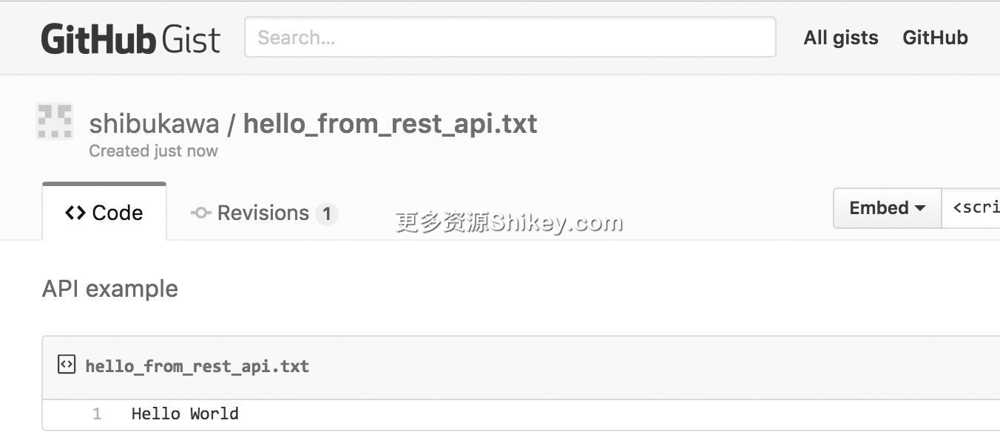

### 本资源由 itjc8.com 收集整理
# 第 10 章 从客户端的角度来看 RESTful API
在前面的章节中，笔者介绍了使用 curl 命令或者 Go 语言来进行与 Web 浏览器等价的 HTTP 通信的方法。本章将介绍通过 Go 语言使用 RESTful API 编写代码的方法。这是 Go 语言特有的话题。

本书的主题是“从浏览器的角度学习 HTTP”，所以书中并未站在服务器开发者的立场来介绍 RESTful API 的实现方法和 API 设计。关于这些内容，读者可以参考《RESTful Web Services
中文版》1 或前言中介绍的《Web API 的设计与开发》等书。不过，好的 API 是客户端也易于使用的 API，相信服务器开发者在读完本章后也能受到启发。

## 10.1　RESTfulAPI

10 年前，Mashup 一词非常盛行。Google Maps 等能够处理客户端都无法处理的大容量数据、天气预报等观测系统发来的实时信息的 Web 服务被大量创建。虽然这些服务以使用 Web 浏览器为前提，但它们也提供了
API，可以将这些 Web 服务组合起来使用。将 Web 服务组合起来以创造新的附加价值的方法就叫作 Mashup。像这样，作为 Web 服务的接口，基于 HTTP 的服务器和客户端之间的通信开始被广泛使用。

**REST**（Representational State Transfer，描述性状态迁移）是罗伊·菲尔丁（Roy Fielding）于 2000
年在基于网络的软件架构相关的论文中提出的概念。菲尔丁是 HTTP 的设计者之一，也是 Apache Web 服务器工程的创始人之一。RESTful 用来形容遵循 REST 架构规范。在 Mashup 开始盛行后，Web
的用途不断变广，不再仅限于在浏览器中使用，还可用于 Web 应用程序之间的联动，在此过程中，REST 被熟知和使用。根据 Google 的设计指南，2010 年，在全世界通过网络公开的 API 中大约有 74% 是
RESTful API。

REST 以 HTTP 语法为协议基础，通信的语义也效仿了 HTTP，其特性大致如下。

> - API 是通过 Web 服务器提供的
> - 像 `GET/users/[用户 ID]/repositories` 那样，通过向路径发送方法来获取服务
> - 通过状态码通知客户端 API 是否成功
> - URL 用来表示资源的位置，作为服务的界面，它非常重要
> - 有时也会根据需要发送 `GET` 参数和 `POST` 主体等附加信息
> - 服务器的返回值大多是 JSON 和 XML 之类的结构化文本，或者图像数据等

从客户端的角度来看，可以期待服务器实现以下内容。

> - URL 是表示资源层的路径，仅由名词构成
> - 通过向资源发送 HTTP 方法来进行获取、更新、添加等操作
> - 可以通过查看状态码来判断请求是否被正确处理
> - 无论调用多少次 `GET` 方法，都不会改变状态
> - 客户端并不管理状态，每次请求都是独立执行的
> - 不存在事务

### 10.1.1　RESTfulAPI 和 RPCAPI 的区别

Web 服务接口的设计架构并不只有 REST，第 5 章还介绍了 XML-RPC 和 JSON-RPC。RPC API 和 RESTful API 的设计思想并不相同。

在 RPC 中，URL 只有一个，在请求时通过传递服务名和方法名来指定做什么。如果从面向对象的角度进行说明，就是通过 URL 来查看通过 Web 服务器公开的静态对象的实例，并调用其方法。调用的接收口是 URL，HTTP
方法全部是 `POST`。向服务器发送的请求（面向对象的方法和参数）全部放入主体中发送。即使查看 HTTP 服务器的日志，也只能看到访问了同一个 URL。

在根据 REST 更新信息时，会附加上修改完的资源，发送“请覆盖此内容”。除使用 `GET` 获取的实际资源之外，其他全部是元数据。元数据的获取和修改是通过首部进行的。

在 RPC 中，不管是数据，还是元数据，在处理时都没有什么不同。修改和响应都分别使用专门的命令来进行。实际的动作取决于 API 的实现，但 API 很少设计成直接发送资源的形式。

因为应用程序各有不同，所以我们不能说哪种方式更容易处理。最近，随着 API 的版本升级，Dropbox 舍弃了 RESTful API，转而使用 RPC API，这一新闻引起了业界的关注。

### 10.1.2　WebAPI 和事务

无论什么样的应用程序，如果只是因为被同时访问，数据就遭到破坏，那就太麻烦了。关系数据库拥有事务这种结构，可提供在同时编辑数据库时保护数据的方法。事务内部不受外部的干扰，可同时进行变更操作，这就保证了结果的一致性。

在 Web 应用程序中，在数据库的前面存在通用的编程语言层。RESTful 中存在“客户端不管理状态，每次请求都能独立发起”的原则，因此，如果我们直接这样实现，那么方法就是在一个请求中调用原子的（不可分割的）API。虽然
RPC 也可以提供类似于事务的 API，但如今实际可行的做法是以事务为基本单位，提供原子的 API。

从客户端的角度来看，理想的状态是，即使存在需要汇总处理的多个对象，也一定有相应的 API，仅调用这一个 API 就能完成处理。

不过，这种理想状态也存在限制。《Web API 的设计与开发》中提到，许多开发者将使用的 API 解释成 LSUD（Large Set of Unknown Developers）。很多用户使用的 API
并不能针对某个用例，用户只能使用多个粒度较小的 API。设计者需要综合考虑可用性、性能和用例的广度等进行设计。在用例中需要调用不止一个 API 的情况下，以及在使用 LSUD 型的通用 API
服务器的情况下，存在如下几个方法。

**连续调用**

JSON-RPC 能够将多个请求汇总到数组中同时发起。在键值存储系统 Redis 的 API 中，使用 `MULTI` 也能够打包多个命令以同时执行。在 Redis
中，单个线程是执行命令的核心部分，在使用 `MULTI` 设置的命令队列中不可以插入其他进程的请求。虽然不是所有 RPC
都支持这种调用方式，但像这样（不会有其他进程的请求插入到命令队列中）执行多个命令，可以实现简单的类似于事务的操作。

要想获取并加工数据，然后将数据再次放入数据库中，仅通过打包多个命令是无法实现的，中途可能会出现中断，从而引起并发处理所特有的问题。例如，Redis 中有值递增等常用的加工既有数据的原子命令，只要调用这些命令就可以实现很多操作。


不过，这需要终端能够接收多个命令。在使用 RPC 的情况下，大多使用 Apache Thrift 或 Google 的 gRPC 等服务器或客户端的源代码生成器来实现。这时客户端不可以同时发起多个请求，HTTP
也是如此。HTTP 中每次访问只能调用一个方法，无法原子地执行多个请求。在 HTTP/2 中，调用顺序、API 服务器中处理的顺序、响应返回的顺序也不能确保一致。

作为 RESTful API 中的实现方法，Google 和 Microsoft 的 RESTful API 指南中都包含批处理的内容。我们准备一个执行批处理的专用终端，将 `Content-Type`
设为 `multipart/mixed`，就可以在一个 HTTP 方法中放入多个请求进行发送。服务器将各个响应放入 `multipart/mixed`
中进行发送。 `GET`、 `POST` 和访问目标的 URL 也都放入相应部分中。

**使用软件自建事务**

通过在服务器端执行更灵活的操作来保持数据的一致性，并且实现高级处理，这种方法在数据库中早就存在。例如，在 MongoDB 中，通过调用一个查询，就可以实现比单纯的递增更复杂的数据加工。在 Redis 中，使用 Lua
在服务器端进行处理，也可以实现复杂的操作。不过，由于这些实现必须在实现事务的服务器端保证一致，所以实际操作起来比较复杂。

使用 RESTful API 实现的方法中有微服务的设计模式 Saga。Saga 的意思是“长篇故事”，它将要实现的功能分解成小事务的功能。当使用 API 执行某个动作时，Saga 会变为 pending
状态来加工数据。如果调用其他功能（非事务）并满足所需条件，Saga 就会变为 accepted 状态。

**使用批处理执行检查程序**

这是《SRE：Google 运维解密》2 中介绍的方法，用于超大型系统。这本书是 Google 公司内部负责系统可靠性的 SRE
组织的最佳实践集，在介绍数据一致性的章节中提到，为了确保数据的完整性，要频繁执行大规模的批处理。

使用该方法的前提条件是我们需要处理拍字节（petabyte）或艾字节（exabyte）这种大规模的数据，这种数据是普通的关系数据库无法应对的，需要使用 NoSQL 才行。Google
强大的计算能力一部分用在了这方面，所以该方法是针对全球性的程序使用的，不会单独用来执行事务。

该方法对小型系统也有帮助。利用 Lambda 或消息队列等云服务，像毕达哥拉斯装置那样构建应用程序的事例也在不断增加。由于任何服务都无法确保 SLA 是 100%
的，所以我们可以添加一些用于确认错误的批处理来使主体代码变简洁。

### 10.1.3　HATEOAS

**HATEOAS**（Hypermedia As The Engine Of Application State）对 REST 中“接口通用化”的部分进行了标准化。HATEOAS
通过将资源之间的相关信息和资源的操作链接包含在响应中，来提高资源本身的记述能力。它位于 RESTful API 的成熟度模型的顶层。下面的代码引自 Wikipedia 的 HATEOAS 词条 3。

```
HTTP/1.1 200 OK

{
    "account": {
        "account_number": 12345,
        "balance": {
            "currency": "usd",
            "value": 100.00
        },
        "links": {
            "deposits": "/accounts/12345/deposits",
            "withdrawals": "/accounts/12345/withdrawals",
            "transfers": "/accounts/12345/transfers",
            "close-requests": "/accounts/12345/close-requests"
        }
    }
}
```

在上面的代码中，使用 `links` 标签附加的信息就是为 HATEOAS 而添加的，其中包含了能够对该对象执行的操作和相关对象的链接。这些信息中记述了用于各种操作的
URL。在该示例代码中有对数据的操作，也包含了相关资源的链接。

如果实现了完整的 HATEOAS，客户端通过查看首页，就能获得表示数据和操作的链接列表。也就是说，即使完全不具备 API 相关的前提知识，仅沿着链接也能够充分使用 API
的功能。用户在使用浏览器搜索网站时也会查看页面内容，沿着链接查找目标页面。HATEOAS 的理想状态是 API 能实现与此相同的功能。

实际查看一下 HATEOAS 的用例就会发现，不需要任何前提知识的导航还未实现。有的服务在返回数据时使用 HATEOAS 沿着链接将相关信息汇总到一起（比如 Cookpad 的 garage），有的在客户端创建 UI
时灵活运用 HATEOAS（比如 Nexedi 的 ERP5）等，但现在作为服务的一部分的客户端（浏览器的 JavaScript、限定微服务的后台服务的 BFF）已经成为 HATEOAS 解析的前提。

### 10.1.4　RESTful 和 REST-ish

RESTful API 的理想状态是，持有层次化的资源，具有遵循 HTTP 语法和语义的 API 结构。“使用 HTTP 语法”部分能够通过语言提供的 HTTP 请求的库等轻松实现，但 URL
的资源结构、方法选择和响应形式可能会与 REST 的思想不符。

例如，在 URL 中放入动词、 `/api` 字符、表示格式的字符（ `/json`）和版本等，在本应表示资源位置的 URL 中就会存在一些多余的信息。提出 REST
的菲尔丁极其反对将这样设计的 Web 服务称为 REST。最近 Microsoft 的 API 受到了质疑，借用菲尔丁的话就是“与 REST 没有多大关系的 API 应该叫 HTTP
API”。他之所以这么说，可能是因为将版本编号放入路径中会引起问题。

在 REST 风格中，最好将版本和格式放入 `Accept` 首部中，执行与 HTTP 一样的协商。而 Microsoft 选择了偏离此原则的版本过渡措施，即在同时支持多个版本的情况下，通过 URL
对在各版本之间执行不同动作的 API 进行区分，使维护变得更简单。

如果 API 基本上遵循 REST，但在没有信心确保肯定是 RESTful API 的情况下，可以称为“REST-ish（REST 风格的）API”。借用幻灯片“Building a REST-ish
API”中的话说，就是下面这样。

```
Whatever you do don't subject yourself to
the wrath of Roy--don't label your API a
"REST API"
```

## 10.2　方法

在使用 RESTful API 时需要使用服务指定的方法，基本的方法有如下 7 种（表 10-1）。

**表 10-1　RESTful API 中使用的方法**

方法

安全

幂等

请求中包含主体

说明

`GET`

√

√

获取数据

`POST`

√

创建数据

`PUT`

√

√

更新数据（在已经存在资源的情况下）

`DELETE`

√

删除资源

`PATCH`

√

更新部分数据（在已经存在资源的情况下）

`HEAD`

√

√

从 `GET` 方法中抽出主体

`OPTIONS`

√

√

获取可以使用的方法列表，可以用于 CORS

其中，经常使用的是前面 4 个。HTTP/1.1 中添加的 `TRACE` 和 `CONNECT` 方法不能用于 API 访问。另外，很少有人使用
`PATCH`。 `HEAD` 只用来获取首部， `OPTIONS` 主要用于第 14 章介绍的
CORS（跨域资源共享）的预检请求。它们都是确认通信手段的方法，不用于获取应用程序所需的数据，因此很少在 API 中使用。不过，在 HATEOAS 的实现中， `OPTIONS`
可以作为用于了解方法的统一接口。

HTTP
规范中以安全和幂等这两个指标对方法进行分类。安全是指在运行时不会改变资源。无论调用多少次，都不会损坏服务器的资源。幂等是指服务器的资源虽然会被修改，但不论执行多少次，结果都是一样的。安全与幂等是分不开的。 `GET`、 `HEAD`
和 `OPTIONS` 是安全方法， `PUT` 和 `DELETE` 是幂等方法。RESTful API 也应该遵循该规则。

正如在第 1 章介绍主体时提到的那样，不支持主体的发送的方法虽然也可以使用，但不推荐使用。另外，在使用 `GET` 和 `HEAD` 的情况下，第 5 章介绍的
XMLHttpRequest 即使在执行 `GET` 和 `HEAD` 时指定主体，也会被忽略。

有的 HTML 表单仅支持 `GET` 和 `POST`，有的 API 服务器只可以使用 `GET` 和
`POST`。使用首部等某些方法，在消息中加载 `PUT` 或者 `DELETE`，在实际的方法中使用
`POST`。严格来说，这叫作 **重载 POST** 4。Google 的 API
设计指南提议使用在路径的后面加上“ `: 方法名`”这种方式来使用自定义的方法。

```
POST /v3/events:clear
GET /v3/events:batchGet
```

### 幂等的 GET 不可以用于非幂等的操作

所谓幂等，就是无论谁执行多少次，都不会存在副作用。曾经有人为了实现车库门的自动开关，使用 `GET` 方法创建了开关状态（图 10-1）。在使用一段时间后，Safari
似乎会自动将该操作放到首页（Safari 的默认页面中有 Frequently Visited 项）。最终，每当打开新标签页时，车库门就会自动打开了。


**图 10-1　使用 GET 方法实现幂等的例子**

在使用 `POST` 方法的情况下，浏览器不可以自动执行访问操作，因为这种请求会改变结果。相信通过这个例子大家都理解幂等指标重要的原因了吧。

如果搜索引擎爬虫发现该 API，为了定期更新信息而收集信息，那就大事不妙了。

## 10.3　状态码

关于 HTTP 的状态码，附录中会介绍完整的列表，而本节将介绍一下 Web API 中使用的几个状态码。HTTP 的状态码中也有用于浏览器通信的，并不是所有的状态码都在 Web API 中使用，这里并不涉及用于 WebDAV
的状态码。在使用浏览器时，我们很少会详细查看状态码的数值，只会大致看一下是 2 字头还是 4 字头等。在使用 API 时，状态码是传递请求错误或服务器状态的重要信息，所以我们来进一步认识一下状态码。

常用的状态码如表 10-2 所示。

**表 10-2　Web API 中常用的状态码**

状态码

说明

`200 OK`

正常结束

`204 No Content`

有时在通过 `DELETE` 方法执行删除后返回

`400 Bad Request`

参数错误

`401 Unauthorized`

请求未被认证，比如认证错误等

`403 Forbidden`

请求虽被认证，但无操作对象资源的权限

`404 Not Found`

未找到资源、不存在 URL、不存在 RPC 方法

`405 Method Not Allowed`

发送了不允许使用的方法

`409 Conflict`

多人同时修改目标资源

`429 Too Many Requests`

用户请求数超出限制

`500 Internal Server Error`

服务器的内部处理发生错误

`501 Not Implemented`

未实现

`503 Service Unavailable`

服务现在无法使用

该表仅供参考，发生错误时返回的状态码会因服务而不同。在文件存储的情况下，我们会使用更多的状态码，比如对 Range 访问返回 `416 Requested Range Not Satisfiable`
等。在 Web 服务的情况下，针对各种错误返回的状态码一览表有时会记载在文档中。另外，我们也可以根据应用程序的情况来创建新的状态码。

不过，并不存在衡量状态码适用程度的统一标准。假设有返回用户一览表的 `/user/` 这一 URL，如果没有用户，是返回
`404 Not Found`，还是按照正常返回空数组的处理方式返回 `200 OK` 呢？ `404` 是用于终端不存在（例如，误写为复数形式的
`/users/`）的情况吗？在编写错误码含义一览表时，我们需要意识到这一点。

> 　在开发和使用 Web
> 服务时需要注意，当状态码中写着“不包含主体”时，即使通过服务器发送主体，也会被服务器忽略，或者客户端的库不读取主体，由此我们会认为数据没有被正确发送。Go 语言的标准库 `net/http` 的
> HTTP 客户端也会根据状态码来判断是否存在主体。

## 10.4　主体

响应主体中存储着从服务器返回的信息。在 Web API 开始公开时使用的基本上是 XML，但近年来使用 JSON 的情况不断增加。图 10-2 是使用 Google Trends 输出的比较图。


**图 10-2　Google Trends 对 XML API 和 JSON API 的比较**

按照 RESTful API 的严格规则，一般要加上 `Accept: application/json` 首部，与服务器进行协商，但如果仅支持 JSON，即使不加上
`Accept: application/json` 首部，服务器也会返回响应。不过，在发送 JSON 进行请求时，如果不加上
`Content-Type: application/json`，服务器的数据解析库可能会拒绝（忽略）读取。

> 　虽然是例外情况，但在 GitHub 的 Issue API17
> 中，现在 Beta 版的使用了表情文字的反馈信息如果不添加下述首部，就不会放入响应中。
>
> ```
> Accept: application/vnd.github.squirrel-girl-preview
> ```

## 10.5　查看实际的 RESTfulAPI（PAY.JP 的示例）

相信现在有的读者还未接触过 RESTful API，因不了解其使用方法而对其敬而远之。许多人不使用 RESTful
API，而是先搜索自己使用的编程语言的客户端库。利用前面所学的知识，我们来确认一下自己是否能够很快理解。GitHub 和 Slack 等服务提供了 RESTful API，能够自动实现需要在浏览器中执行的操作。

PAY.JP 是一个用于支付的平台。我们一边引用该服务的文档，一边来读一下它的内容。笔者会适当补充前面介绍 HTTP 时遗漏的内容。如果只是使用 PAY.JP，那么因为已经有了 Go 语言的
SDK，所以无须像本节介绍的方法这样通过查看 RESTful API 的说明来思考发送方法。

> **认证**
>
> 在使用 PAY.JP 时需要注册，获取 API Key。测试用的 Key 不会连接进行正式的支付处理的服务器，也不会被算作实际的支付信息。正式操作时使用的 Key 需要申请才可以使用。

笔者先来介绍一下认证的相关内容。RESTful API 运行在服务提供者的服务器中。当然，该服务器的费用、电费、通信费等都不为 0。大多数服务以某种形式来限制用量。GitHub API
等在获取信息时无须认证，但会限制单位时间内同一个 IP 地址的使用次数。

在访问 API 时，常用的方式是使用 PAY.JP 中也可以使用的访问令牌（Key）。API 使用者在登录服务的网站时可以创建并下载访问令牌。在进行 API
访问时，将访问令牌作为某个参数进行传递，以进行认证。在只局部访问客户端持有的信息时，经常使用第 5 章介绍的 OAuth2。

提起认证，大家首先想到的是使用用户 ID 和密码的认证方式。与此相比，访问令牌的方式更具优势。具体来说，即使令牌遭到泄露，也可以使其无效，但如果将用户 ID
设为无效，之后就很难恢复了。通过增加一个中间层，能够将令牌泄露时的风险和损失降到最小。

将令牌传递给服务的方式会因服务而不同，PAY.JP 将其作为 BASIC 认证的用户名进行传递，密码为空。将 Base64 编码后的访问令牌放入 `Authorization` 首部中，传递给服务器。


我们再来看一下服务文档中的说明。

> **协议**
>
> 为保证安全，需要使用 HTTPS 来进行针对 PAY.JP 的所有 API 通信。
>
> **方法**
>
> 在 PAY.JP API 的请求中，可以使用 `GET`、 `POST`、 `DELETE` 这 3 种 HTTP 方法。
>
> **响应形式**
>
> API 返回的响应数据都以 JSON 格式返回。

这些都是介绍过的内容。将 URL 改为 `https` 即可进行 HTTPS 通信。第 3 章中介绍了如何指定方法。响应是以 JSON 格式返回的，我们需要实现 JSON 的解析。

接下来跳过错误处理，来看一下对分页（pagination）的说明。

> 在所有的顶层 API 资源中都可以指定分页来获取数据。例如，在想获取最新的 10 条支付信息时，需要添加查询 `limit=10`。

查询是 `GET` 的参数，可以指定 `limit` 和 `offset`。要想请求从第 40 个元素开始的 20 个数据，就要在 URL 的末尾加上以下参数。


**分页的 URL**

`https://api.pay.jp/v1/customers?limit=20&offset=40`

如果可以理解前面的内容，实际执行 API 访问的部分看起来就非常简单了。API 访问的定义如下所示。

**获取顾客信息**

`GET https://api.pay.jp/v1/customers/:id`

其中，在写着 `:id` 的部分会放入顾客 ID。示例代码中记述了用于测试的访问令牌和顾客 ID。

```
$ curl https://api.pay.jp/v1/customers/cus_121673955bd7aa144de5a8f6c262 \
    -u sk_test_c62fade9d045b54cd76d7036:
```

这里直接使用了第 1 章和第 2 章中用到的 curl 命令。现在大家应该不会苦恼如何使用 API 了吧！使用 API 只需用到 JSON 解析。

> 　关于使用 Go 语言的 JSON 解析的详细内容，请参考附录。

## 10.6　查看实际的 RESTfulAPI（GitHub 的示例）

接下来我们访问一下 GitHub 的 API。实际上，Google 提供了用 Go 语言封装的访问 GitHub API
的库，因此自己可能并不需要像这样访问。不过，由于存在范例代码，所以当感到迷惑时，可以参考范例进行确认，这样也非常有助于学习。

### 10.6.1　GitHub 的授权

在访问 GitHub API 时，如果使用了 `GET` 之类的信息获取方法且信息是公开的，那就不需要登录和用户认证了。不过，同一个全球 IP 地址在单位时间内只能执行固定次数的请求 5。通过授权，我们可以使用能够修改信息的 API，IP 地址的次数限制也没有那么严格了。

认证方法有两种，分别是使用令牌的方法和使用 OAuth2 的方法。使用令牌的方法与 PAY.JP 一样。在网站上创建令牌，然后将其赋给首部。

```
$ curl -H "Authorization: token （复制到这里的令牌字符串）" https://api.github.com/
users/××××
```

这里，我们使用 OAuth2 来进行访问。在使用 OAuth2 的情况下，步骤没有太大的改变，所以我们只要知道做法，就能利用 Google Suites 等各种服务了。严格来说，OAuth2 属于给使用 API
的工具赋予需要的权限的“授权”，而不属于“认证”。

我们来获取处理 OAuth2 的准标准库。另外，正如第 5 章介绍的那样，在通过 OAuth2 进行授权时，会使用浏览器通过认证提供商的页面进行授权。我们把用于打开浏览器的多平台库也添加到代码中。

```
$ go get golang.org/x/oauth2
$ go get github.com/skratchdot/open-golang/open
```

首先，在 GitHub 的网站上注册应用程序（图 10-3）。打开用户设置，选择 Developer settings 中的 OAuth applications，创建合适的应用程序。Authorization
callback URL 中除了 `http://localhost:18888` 之外，可以设置任意的值。创建完成时显示的 `clientID` 和
`clientSecret` 在后面会用到。



**图 10-3　OAuth 应用程序的注册画面**

接下来选择 Scope。大多数站点中存在 Scope 一览表。这里我们使用 `user.email` 和 `gist`。选中的 Scope 会记述在程序发给服务的请求中进行发送。


代码清单 10-1 所示为进行 OAuth2 的授权并获取访问令牌的 JSON 文件的示例代码。

**代码清单 10-1　获取访问令牌的 JSON 文件**

```
package main

import (
    "context"
    "encoding/json"
    "fmt"
    "io"
    "net/http"
    "os"
    "strings"

    "github.com/skratchdot/open-golang/open"
    "golang.org/x/oauth2"
    "golang.org/x/oauth2/github"
)

// 请粘贴从 GitHub 获取的内容
var clientID = "xxxxxxxxxxxxxxx"
var clientSecret = "xxxxxxxxxxxxxxxxxxxxxxxxxx"
var redirectURL = "https://localhost:18888"
var state = "your state"

func main() {
    // OAuth2 的连接目标等信息
    conf := &oauth2.Config{
        ClientID:     clientID,
        ClientSecret: clientSecret,
        Scopes:       []string{"user:email", "gist"},
        Endpoint:     github.Endpoint,
    }
    // 之后对其进行初始化
    var token *oauth2.Token

    // 是否已经保存在本地？
    file, err := os.Open("access_token.json")
    if os.IsNotExist(err) {
        // 第一次访问
        // 首先获取授权画面的 URL
        url := conf.AuthCodeURL(state, oauth2.AccessTypeOnline)

        // 安装接收回调函数的 Web 服务器
        code := make(chan string)
        var server *http.Server
        server = &http.Server{
            Addr: ":18888",
            Handler: http.HandlerFunc(func(w http.ResponseWriter, r *http.Request) {
                // 通过查询参数获取 code，关闭浏览器
                w.Header().Set("Content-Type", "text/html")
                io.WriteString(w, "<html><script>window.open('about:blank','_
self').close()</script></html>")
                w.(http.Flusher).Flush()
                code <- r.URL.Query().Get("code")
                // 关闭服务器
                server.Shutdown(context.Background())
            }),
        }
        go server.ListenAndServe()

        // 使用浏览器打开授权画面
        // 在 GitHub 授权结束后，重定向到上述服务器，执行 Handler
        open.Start(url)

        // 将获取的代码换为访问令牌
        token, err = conf.Exchange(oauth2.NoContext, <-code)
        if err != nil {
            panic(err)
        }

        // 将访问令牌保存到文件中
        file, err := os.Create("access_token.json")
        if err != nil {
            panic(err)
        }
        json.NewEncoder(file).Encode(token)
    } else if err == nil {
        // 在授权后保存到本地
        token = &oauth2.Token{}
        json.NewDecoder(file).Decode(token)
    } else {
        panic(err)
    }
    client := oauth2.NewClient(oauth2.NoContext, conf.TokenSource(oauth2.NoContext,
token))
    // 此处执行各种处理
}
```

首先，设置 `oauth2.Config` 结构体来存储连接目标的信息。 `Endpoint` 是认证提供商的 URL。由于 Go 语言的 API 中放入了主要服务的 URL，所以要
`import` 并指定需要用到的包。这里读入 `github` 包。

获取访问令牌的流程如下所示。

> 1. 获取授权画面的 URL。询问 GitHub 需要什么权限（Scope）等信息，获取仅用一次的 URL。这里传递了 `state`
>     参数。它是任意的字符串，虽然代码中省略了该字符串，但在重定向时该字符串也会被传递，以判断是否是预期的请求的重定向。
> 2. 使用浏览器打开授权画面的 URL。授权后会重定向到设置画面中指定的 URL（ `http://localhost:18888`）。
> 3. 用于交换令牌的代码会作为查询字符串传递到被重定向的页面（在页面上显示在该程序中启动的 Web 服务器）。
> 4. 通过用于交换令牌的代码再次询问 OAuth2 服务器，获取访问令牌。

关于已经读取完毕时的流程，因为只是读取 JSON，所以这里不再介绍。

最后，调用 `oauth2.NewClient`。该客户端是第 3 章介绍的 `http.Client`。在使用 `GET` 和
`POST` 发送请求时，会附加授权信息的首部，这一点与以往不同。如果运用第 3 章介绍的请求的构建方式，就可以使用 API 了。

```
client := oauth2.NewClient(oauth2.NoContext, conf.TokenSource(oauth2.NoContext,
token))
```

这里，第 2 个参数中使用了 `conf.TokenSource()` 函数，由此便可以通过刷新令牌来自动重新获取访问令牌了。在 Google 服务和 GitHub 中，访问令牌都会在 1
个小时后到期，但通过刷新登录状态，获取的访问令牌在服务器端中无效之前都可以自由使用。

### 10.6.2　获取信息的 API 访问

我们来使用一下 API。开发者网站中记述了 URL、所需的参数和返回值。

我们先来获取邮箱地址。在使用 `GET` 方法获取时，邮箱地址会以 JSON 形式存储在主体中。代码清单 10-2 的代码用于将邮箱地址显示到控制台上。

**代码清单 10-2　获取邮箱地址**

```
// 获取邮箱地址
resp, err := client.Get("https://api.github.com/user/emails")
if err != nil {
    panic(err)
}
defer resp.Body.Close()
emails, err := ioutil.ReadAll(resp.Body)
if err != nil {
    panic(err)
}
fmt.Println(string(emails))

$ go run oauth2_sample.go
[{"email":"yoshiki@shibu.jp","primary":true,"verified":true}]
```

### 10.6.3　刷新信息的 API 访问

接下来，我们向 gist 发布代码，发布时使用 `POST` 发送 JSON。这里使用了常量来传递整理好的 JSON，返回值也以 JSON 的形式返回，JSON 中存储了 gist 的各种信息。

下面的代码仅用于获取所创建的文件的 URL，这里与前面一样，使用 `open.Start()` 函数，用浏览器打开创建的页面。

```
// gist 发布
gist := `{
    "description": "API example",
    "public": true,
    "files": {
        "hello_from_rest_api.txt": {
            "content": "Hello World"
        }
    }
}`
// 发布
resp2, err := client.Post("https://api.github.com/gists", "application/json",
strings.NewReader(gist))
if err != nil {
    panic(err)
}
fmt.Println(resp2.Status)
defer resp2.Body.Close()
// 解析结果
type GistResult struct {
    Url string `json:"html_url"`
}
gistResult := &GistResult{}
err = json.NewDecoder(resp2.Body).Decode(&gistResult)
if err != nil {
    panic(err)
}
if gistResult.Url != "" {
    // 使用浏览器打开
    open.Start(gistResult.Url)
}
```

发布的结果如图 10-4 所示。



**图 10-4　向 gist 自动发布的结果**

> **RESTful 的各种新标准**
>
> RESTful 始于罗伊·托马斯·菲尔丁（Roy Thomas Fielding）的一篇论文，后来出现了各种支持 RESTful 的 HTTP
> 规范。在以下内容中，有的已经实现了标准化，有些还未实现，本书不再对此进行详细介绍。
>
> - 表示 JSON 差异的 JSON Patch
> - 用于预告服务将来会关闭的 `Sunset` 首部
> - RESTful 服务返回错误时使用的 JSON 格式
> - 返回确认服务是否运行的健康检查的响应时使用的 JSON 格式

## 10.7　访问 RESTfulAPI 时的具体问题

### 10.7.1　超时

在前面的介绍中，在创建客户端时传递了 `oauth2.NoContext`。Go 语言从版本 1.7 开始引入 `Context`
作为统一处理取消、超时等操作的结构。在执行一些异步函数或跨 Goroutine 的处理时，如果自下而上地执行超时处理，就无法写出优秀的代码。另外，在执行分成多个部分的处理时，由于 `Context`
本身持有数据，所以可以持有会话之间共享的数据等。

代码清单 10-3 的代码设定为 2 秒后超时。在跳出函数时会调用 `cancel()`。在正常结束时，最后一定会调用 `cancel()`。

**代码清单 10-3　2 秒后超时**

```
import (
    "context"
)

func timeout() {
    ctx, cancel := context.WithTimeout(context.Background(), 2*time.Second)
    defer cancel()

    // 带超时功能的客户端
    oauth2.NewClient(ctx, conf.TokenSource(ctx, token))
    ︙
    // 较长的处理
}
```

`context.WithDeadline()` 指定结束时间，而非超时时间。虽然没有过期时间，但是为了在任意时间点取消， `context.WithCancel()`
仅返回取消函数。

在使用 `context.WithValue()` 时，可以将数据以键值的形式存储。

### 10.7.2　访问次数的限制

各种 Web 服务都会规定每秒的访问次数的上限，一般设置为每秒 10 次。如果发送的请求次数超过该限制，服务器就会返回 `Rate Limit Exceeded`
等错误。准标准库中存在调整访问速度的包，即令牌包。

由于准标准库不是标准库，所以和之前一样安装即可。

```
$ go get golang.org/x/time/rate
```

基本的代码如代码清单 10-4 所示。

**代码清单 10-4　限制访问次数**

```
package main

import (
    "time"
    "context"
    "golang.org/x/time/rate"
)

func main() {
    // 每秒的访问次数上限
    RateLimit := 10
    // 令牌的最大持有数
    BucketSize := 10
    ctx := context.Background()
    e := rate.Every(time.Second/RateLimit)
    l := rate.NewLimiter(e, BucketSize)

    for _, task := range tasks {
        err := l.Wait(ctx)
        if err != nil {
            panic(err)
        }
        // 在这里执行任务
    }
}
```

在 `rate.Every()` 中，令牌根据传递的时间间隔复活。 `Wait()`
方法会消耗一个令牌。令牌的最大持有数会受到处理时间、并发数和任务偏差等因素的影响，但如果与每秒的访问次数上限相同，就很少会发生问题。

`rate` 包是一个具有高级功能的包，能够应对消耗多个令牌等情况。

## 10.8　本章小结

本章介绍了使用 RESTful API 的方法、REST 的基本思想、RESTful API 与 RPC API 的区别，以及 HATEOAS 的相关内容等。另外，我们也复习了在进行 API
访问时需要按照严格的规则使用和解释的方法和状态码。本章还展示了查看文档并使用 Go 语言编写代码的步骤。我们以 PAY.JP 和 GitHub 的情况为例，介绍了
URL、参数、输入和输出的示例代码。这些内容对我们编写代码很有帮助。

本章还介绍了 OAuth2 授权、超时和流量限制等用 Go 语言实现的技术。