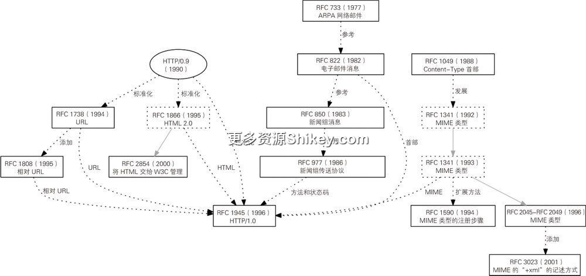
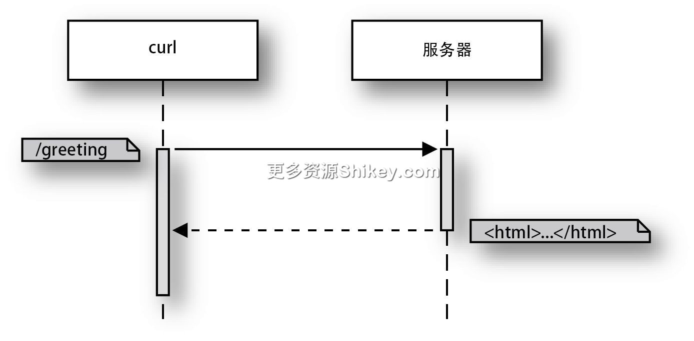
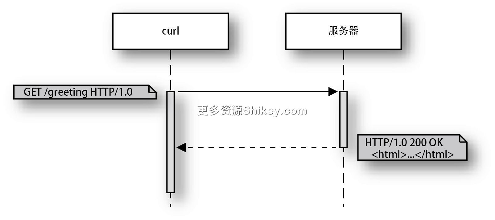
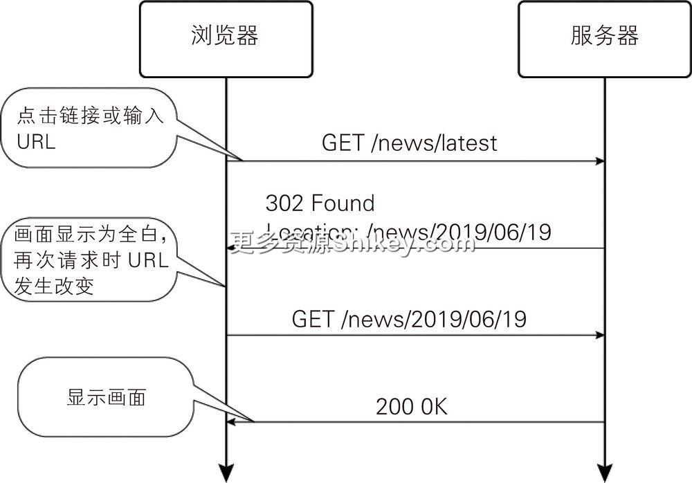

### 本资源由 itjc8.com 收集整理
# 第 1 章 HTTP/1.0 的语法：4 个基本元素
本章将一边介绍 HTTP 的发展历史，一边介绍 HTTP 的基础知识。如今 HTTP 已经发展为非常庞大的协议（通信规则），如果把它打印出来，得有词典那么厚，但最初的 HTTP 其实非常简单。要想理解
HTTP，与其从头开始阅读现在的规范，不如沿着 HTTP 的发展历史，了解 HTTP 为什么会变成现在的样子。这种做法更易于我们从整体上把握 HTTP。

本章我们将重点介绍 HTTP 的下面这 4 个基本元素。

> - 方法和路径
> - 首部
> - 主体
> - 状态码

另外，本章也会介绍处理 HTTP 的工具——curl 命令的用法。使用 curl 命令，我们可以将请求发送给服务器。如果用过 Python、Ruby 和 Node.js 等编程语言，那么你一定体验过对话模式或 REPL
模式。与此相同，通过像 Web API 的对话模式那样使用 curl，就可以验证服务器的动作，或者解释通信协议。

## 1.1　HTTP 的历史

HTTP 对 Web 浏览器与 Web 服务器进行通信时的步骤和格式进行了标准化。HTTP 既是在浏览器上显示网页时需要遵循的规范，也是从服务器获取信息时需要遵循的规范。除此之外，HTTP 也可以用作翻译 API、数据保存
API 等各种服务的接口 1，已经成为当代互联网的基础。自 1990 年 HTTP 最原始的实现公开以来，其版本不断升级。

> - 1990 年：HTTP/0.9
> - 1996 年：HTTP/1.0
> - 1997 年：HTTP/1.1
> - 2015 年：HTTP/2

最初的 HTTP/0.9 只是一个请求并获取 HTML 文档的协议。之后，随着人们对发送表单、更新信息、实现聊天功能等各种灵活、高级的功能产生需求，HTTP 也不断扩展。

虽然现在我们把最初的协议称为 HTTP/0.9，但其实这是在 HTTP/1.0 受到关注之后才开始这样叫的。因为在 HTTP/1.0 之前出现，所以使用了 HTTP/0.9 这个名字。

我们先来整理一下理解 HTTP 所必需的一些知识。首先看几个专有名词，如表 1-1 所示。

**表 1-1　与 HTTP 有关的专有名词**

名称

全称

说明

IETF

The Internet Engineering Task Force（国际互联网工程任务组）

为了增强互联网之间的互操作性而创建的自由组织

ISOC

Internet Society（国际互联网协会）

负责管理与互联网发展有关的活动的组织，是 IETF 的上级组织

RFC

Request For Comments（规范文档）

由 IETF 编写的规范文档

IANA

Internet Assigned Numbers Authority（互联网号码分配局）

管理端口号或文件类型（Content-Type）等与 Web 有关的数据库的组织

W3C

World Wide Web Consortium（万维网联盟）

制定 Web 相关标准的非营利组织

WHATWG

Web Hypertext Application Technology Working Group（网页超文本应用技术工作小组）

从 W3C 中独立出来的组织，负责讨论以 HTML 为中心的 Web 相关标准

RFC 中定义了各种协议。虽然大多数新的 Web 功能一开始是浏览器厂商或者服务器厂商开发的自有功能，但之后为了能够保持互操作性，这些功能使用了共同的协议。试想，如果只有 Microsoft Edge 可以访问
Microsoft 的服务器，该有多不方便。服务器和浏览器无论怎样组合都能运行，这是互联网世界的一种“美德”，因为不管是连接互联网，还是接收邮件，整个网络世界的体系都是遵循 RFC 中制定的规范构建而成的。

RFC 是以 IETF 为中心进行管理的、用于保持通信的互操作性的规范文档。RFC 的全称是“Request For
Comments”（征求意见稿），虽然把它翻译成“规范文档”有点不太贴切，但这是有历史缘由的。由于作为互联网前身的网络是用美国的国防预算创建的，其规范不能对外公开，所以才以“为了提高品质，从全世界收集意见”之名把规范公开，而“Request
For Comments”就是这段历史所留下的痕迹 2。

RFC 分很多种，各种 RFC 通过“RFC 1945”这种“RFC + 数值”的方式表示。较新的 RFC 也会引用事先定义好的格式。另外，当 RFC
中存在问题时，要么更新（update）版本，要么在全新的版本完成后将旧版本废除（obsolete）。本书中也介绍了几个版本的 RFC。不过大家无须记住各个版本，如果感兴趣，可以在网上查阅。

> 　其实，并不是所有与互联网有关的规范都是由前面介绍的组织制定的。例如，无线 LAN 是由美国电气电子工程师学会（The Institution of
> Electrical and Electronics Engineers，IEEE）制定的；JavaScript 是由 Ecma 国际（Ecma International）制定的；互联网动画的实际标准 h.264
> 是由国际标准化组织（International Organization for Standardization，ISO）和国际电工委员会（International Electrotechnical
> Commission，IEC）制定的。IETF 也会根据需要引用外部组织制定的规范。

在 RFC 确定之前，Web 浏览器和 Web 服务器的功能要通过多个软件来实现，之后在 RFC 中实现标准化，最初的体系就是这样的。欧洲核子研究组织（European Organization for Nuclear
Research，CERN）的在籍人员蒂姆·伯纳斯·李（Tim Berners-Lee）在 1990 年的圣诞节假期开发了最早的 Web 服务器 CERN HTTPd。1993
年，伊利诺伊大学的美国国家超级计算应用中心（National Center for Supercomputer Applications，NCSA）的罗伯特·麦克库尔（Robert Mccool）开发了 Apache 的前身
NCSA HTTPd，马克·安德森（Marc Andreessen）开发了浏览器的始祖 NCSA Mosaic3。安德森等在 1994 年创立了
Netscape。Netscape 开发的 JavaScript 和 SSL（Secure Sockets Layer，安全套接层）等技术后来实现了标准化。

图 1-1 展示了本章引用的 RFC 以及各 RFC 之间的关系。在阅读本章时，如果分不清楚各 RFC 之间的关系，可以回到这里进行确认。



**图 1-1　本章引用的 RFC 及各 RFC 之间的关系**

IANA 管理的不是通信协议（算法），而是文件类型（数据）等公共信息。IETF 将浏览器功能的规范制定工作移交给了 W3C。具体来说，就是将 HTML 规范的制定，以及 Server-Sent Events、WebSocket
等与 JavaScript API 相关的大部分通信协议交由 W3C 管理。最近，关于规范的制定的讨论也多在 WHATWG 这个组织中进行。W3C 主要发展以 XML 为中心的技术，而 WHATWG 在 W3C
的基础上聚集了一些旨在让网络活跃发展的成员，于 2004 年正式成立。HTML5 之后的许多规范就是由 WHATWG 主持制定的。2019 年 6 月，W3C 和 WHATWG 发表消息称 HTML 及 DOM
相关的规范制定主体不再是 W3C，而是 WHATWG。这些组织掌握着互联网规范的一手信息。如果大家需要了解规范详情，可以以这些组织为入手点。

WHATWG 公布的文档是“规格说明书”，而 MDN 网站上的内容才是面向应用程序开发者的。MDN 网站原本是浏览器厂商 Mozilla 提供的网站，如今成为浏览器厂商公共的文档集合，作为 Mozilla 竞争对手的浏览器厂商
Microsoft 和 Google 也在发布内容并进行管理。

### echo 服务器的运行

我们使用 Go 语言创建一个将通信内容直接显示到控制台上的 echo 服务器，同时确认一下环境配置是否完整。

```
package main

import (
    "fmt"
    "log"
    "net/http"
    "net/http/httputil"
)

func handler(w http.ResponseWriter, r *http.Request) {
    dump, err := httputil.DumpRequest(r, true)
    if err != nil {
        http.Error(w, fmt.Sprint(err), http.StatusInternalServerError)
        return
    }
    fmt.Println(string(dump))
    fmt.Fprintf(w, "<html><body>hello</body></html>\n")
}

func main() {
    var httpServer http.Server
    http.HandleFunc("/", handler)
    log.Println("start http listening :18888")
    httpServer.Addr = ":18888"
    log.Println(httpServer.ListenAndServe())
}
```

这里有两个函数。首先执行的是 `main()` 函数。该函数在 HTTP 服务器初始化时启动。初始化处理的步骤是，当顶端路径 `"/"` 被访问时调用
`handler` 函数，然后通过 18888 端口启动 HTTP 服务器。HTTP 的默认端口是 80，小于 80 的端口被用作公认端口（well known port）4。端口基本上是根据编号来确定其用途的，Web 或 FTP
等的客户端如无特别指定，都会访问公认端口。因为端口非常重要，所以很多端口已经被系统占用或者不让普通用户使用了。人们一般喜欢用 8000 端口、8080 端口和 8888 端口来代替 80 端口，这里我们使用了 18888
端口。

第二个函数是前面注册的 `handler` 函数。当浏览器等客户端进行访问时，该函数会被调用，其参数接收客户端的请求信息，并输出服务器的处理结果作为响应。一般情况下，HTTP
服务器会从请求的路径中接收客户端要显示的文件名信息，然后从硬盘读入内容，并将该内容发送给客户端。这里我们不执行任何处理，只使用标准库中的 `httputil.DumpRequest`
函数，将请求中包含的信息作为文本输出到画面上。

程序将等待的端口号作为日志输出后就结束了，如下所示。

```
$ go run server.go
2016/03/04 22:18:47 start http listening :18888
```

## 1.2　尝试 HTTP/0.9 能够实现的处理

HTTP/0.9 是一个非常简单的协议，只是将写入文本信息的页面路径指定给服务器，然后获取页面内容。我们使用 curl 命令来模拟一下该过程（代码清单
1-1）。提前说明一下，该实验中存在一些不正确的地方。由于现行协议没有向后兼容 HTTP/0.9，所以在使用普通方法的情况下，发送端和接收端都无法处理 HTTP/0.9。这里，我们尝试使用 HTTP/1.0（代码清单
1-2）。首先看一下 HTTP/0.9 与 HTTP/1.0 之间的区别。

**代码清单 1-1　执行 curl 命令的示例代码**

```
$ curl --http1.0 http://localhost:18888/greeting
<html><body>hello</body></html>
```

**代码清单 1-2　服务器端的日志**

```
GET /greeting HTTP/1.0
Host: localhost:18888
Connection: close
Accept: */*
User-Agent: curl/7.52.1
```

HTTP/0.9 只有一个基本功能：向服务器请求网站的页面，并接收网站的内容作为响应。这与 Hyper Text Transfer Protocol
这个名字所表达的内容一样。接收完毕后就切断与服务器的连接。请求中要指定端口号，以及主机名（这里为 `localhost`）或 IP 地址。如果没有指定端口号，则默认为 80 端口。虽然 curl
命令中使用的是包含了主机名和路径的 URI，但服务器只接收 `/greeting` 路径部分（图 1-2）。



**图 1-2　HTTP/0.9 协议**

另外，HTTP/0.9 还有一些功能成为当今互联网的基础，即表单和查找功能。在 HTML 文档中使用 `<isindex>` 标签，会创建一个文本输入框用于查找。反过来讲就是，没有
`<isindex>`
标签的文档不提供查找功能。在进行查找时，请求端在地址的末尾加上“ `?`”和词语（用“ `+`”隔开）来发送请求。服务器会创建并返回一个写入查找结果的
HTML。查找方法与现在一样，由服务器决定，请求端只具有发送要查找的词语的功能。

```
http://××××.com/?search+word
```

虽然现在的 HTML 中没有 `<isindex>` 标签，但在 URL 中加上查找的关键字来发送请求的方式至今也未发生改变。

我们使用 curl 来实现与此基本相同的通信功能。发送的命令如下所示。

```
$ curl --http1.0 --get --data-urlencode "search word" http://localhost:18888
```

我们还可以使用缩写 `-G` 来代替 `--get`。根据是否存在 `--get`， `--data-urlencode`
的动作会有所不同。当存在 `--get` 时， `--data-urlencode` 会像上面那样，在 URL 的末尾加上查询内容。当查询内容中存在空格或 URL
中禁止使用的字符时， `--data-urlencode` 就会执行替换功能。虽然替换规则会根据浏览器的不同而发生变化，但这并不影响 `--data-urlencode`
的动作。如果不存在禁止使用的字符，我们也可以使用更短的 `-data` 或者缩写 `-d`。

关于不存在 `--get` 时 `-d`、 `--data` 和 `--data-urlencode`
的动作及替换规则的细微差别，笔者会在下一章进行讲解。

在 4 个基本元素中，HTTP/0.9 只实现了主体的接收和路径。

> **现存的 HTTP/0.9 服务器**
>
> Python 中内置的 Web 服务器现在仍可用 HTTP/0.9 进行访问。本书中使用了 curl 命令，如果使用 `nc`（netcat）命令，虽然完全没有实用性，但是可以使用
> HTTP/0.9 发送数据。我们在有 HTML 文件的文件夹中启动服务器。这里使用的是本书执笔时的最新版本 3.7。
>
> ```
> $ python3 -m http.server
> Serving HTTP on 0.0.0.0 port 8000 (http://0.0.0.0:8000/) ...
> ```
>
> 这样服务器就启动了，很简单。组合使用 `echo` 和 `nc` 就可以发送请求，具体如下所示。
>
> ```
> $ echo -e "GET /memo.html\r\n" | nc localhost 8000
> ```

## 1.3　从 HTTP/0.9 到 HTTP/1.0 的发展过程

虽然 HTTP/0.9 非常简单，但是“浏览器请求文档，服务器返回数据”这种 Web 技术的基本框架可以说在这个时候就已经成形了。不过，该协议还是无法支持一些操作，具体如下所示。

> - 只有发送一个文档的功能
> - 由于假定所有通信内容都是 HTML 文档，所以服务器无法传递下载内容的格式
> - 除发送查找请求之外，客户端无法发送其他请求
> - 无法发送、刷新或删除新的文档

除此之外，HTTP/0.9 也没有提供确认请求是否正确、服务器是否正确返回响应等信息的方法。

HTTP/0.9 的文档是在 1990 年编写的，两年之后又加入了之前使用的电子邮件和新闻组（newsgroup）等协议功能，对记述的规范进行了大幅更新，还添加了很多面向 HTTP/1.0
的内容，从而形成了新的版本。虽然这个版本早于 HTTP/1.0 且未被编号，但它与现在的 HTTP 基本相同。我们试着在前面的 curl
命令中添加一个用来显示详细信息的选项（ `-v`）。首先来看一下客户端的内容。

```
$ curl -v --http1.0 http://localhost:18888/greeting

* Trying ::1...
* Connected to localhost (::1) port 18888 (#0)
> GET /greeting HTTP/1.0
> Host: localhost:18888
> User-Agent: curl/7.48.0
> Accept: */*
```

以“ `>`”开始的各行是客户端向服务器发送的内容。

在 1992 年的版本中，存在简化版和全功能版两种请求格式。简化版与 HTTP/0.9 兼容，而全功能版与 HTTP/1.0 几乎一样。在请求方面，1992 年的版本与 HTTP/0.9 的不同之处如下所示。

> - 请求时添加了方法（ `GET`）
> - 请求时添加了 HTTP 的版本（ `HTTP/1.0`）
> - 添加了首部（ `Host`、 `User-Agent`、 `Accept`）

1992 年的那一版 HTTP 为了兼容 HTTP/0.9，开始返回包含 HTTP 版本的状态码。请求方面有两处较大的修改，分别是方法和请求首部，具体内容会在后面进行介绍。

下面来看一下响应的详细内容。

```
* HTTP 1.0, assume close after body
< HTTP/1.0 200 OK
< Date: Tue, 05 Apr 2016 13:58:43 GMT
< Content-Length: 32
< Content-Type: text/html; charset=utf-8
<
<html><body>hello</body></html>
* Closing connection 0
```

以“ `<`”开始的各行是服务器返回的响应内容。与 HTTP/0.9 的不同之处如下所示。

> - 响应的开头包含 HTTP 的版本和 3 位状态码
> - 包含与请求格式相同的首部

本章也会对这些内容进行讲解。图 1-3 所示为 HTTP/1.0 协议。



**图 1-3　HTTP/1.0 协议**

## 1.4　HTTP 的祖先（1）：电子邮件

请求和响应中都会用到 HTTP 的首部。HTTP 首部源于互联网普及之前用户之间用来交换信息的邮件系统。虽然现在使用的 **电子邮件** 是在 1982 年的 RFC 822 中实现标准化的，但从 20
世纪 70 年代开始，在互联网的前身 ARPANET 中就使用了相同的结构，首部的原型在 1977 年制定的 RFC 733 中就已经被明文记载了。

我们来看一下朋友发送过来的电子邮件的原始信息 5。如果使用的是
Gmail，可通过“显示原始邮件”来查看原始信息。在电子邮件中，中继服务器会添加许多中继信息，这里我们省略掉这些内容。

```
Delivered-To: yoshiki@shibu.jp
（略）
MIME-Version: 1.0
Received: by 10.176.69.212 with HTTP; Wed, 6 Apr 2016 06:26:27 -0700 (PDT)
From: Yoichi Fujimoto <wozozo@example.com>
Date: Wed, 6 Apr 2016 22:26:27 +0900
Message-ID: <CAAw3=wyHz1cH=D_8uNRLAo5e4VCCO+c2CGPeEd4jCk0gnJJkDg@mail.gmail.com>
Subject: hi
To: yoshiki@shibu.jp
Content-Type: text/plain; charset=UTF-8

hello
```

首部以“ `字段名：值`”的形式添加在正文之前。每个首部占一行，与正文之间空一行。另外，首部名称不区分大小写。在使用程序进行处理时，为了给接收端的库提供方便，首部名称大多经过了正规化处理。通过查看首部，我们可以知道收件人、邮件格式的版本、发送日期、发件人、标题、邮件正文内容的格式和字符编码等信息。正文之外的所有信息都包含其中。


HTTP 中也导入了与该电子邮件形式相同的首部。首部是记录服务器和客户端之间添加的信息、命令和请求的地方。首部种类繁多，这里笔者摘录了一些容易理解的首部。首先是客户端发送给服务器的首部。

> `User-Agent`
>
> 记述客户端自己的应用程序名称。在 curl 命令的情况下就是 `curl/7.48.0` 这样的字符。具体内容将在下一章介绍。
>
> `Referer`
>
> 供服务器参考的附加信息。客户端在向服务器发送请求时，会在该首部中设置表示请求来源的 URL，服务器由此得知请求来自哪里。为了提高安全性，该首部的规范发生了很大改变，具体内容将在下一章介绍。
>
> `Authorization`
>
> 在只允许特殊的客户端进行通信时，该首部会将认证信息传送给服务器。RFC 中定义了几个标准形式（Basic/Digest/Bearer），但 AWS 和 GitHub API 等也在寻求属于自己的 Web 服务表述。

服务器响应客户端时添加的首部主要有以下几个。

> `Content-Type`
>
> 指定文件类型。这里记述的是名为 MIME 类型的标识符。MIME 类型是针对电子邮件创建的标识符。
>
> `Content-Length`
>
> 主体的大小。如果进行了下一个首部 `Content-Encoding` 中提到的压缩，主体则为压缩后的大小。
>
> `Content-Encoding`
>
> 在进行了某种压缩的情况下用于说明压缩形式。
>
> `Date`
>
> 文档的日期。

大家可能没有注意到，其实首部还可以按照其他方式分类。

> - 可根据对象分为通用首部（请求和响应都适用）、实体首部（针对发送和接收的内容使用）、请求首部和响应首部这 4 类
> - 可根据发送线路的处理分为端到端首部（传递给最终接收者）和逐跳首部（根据对通信线路的指示，如果线路发生变化，则删除该首部）这 2 类

在通信线路相关部分被二进制化的 HTTP/2 中，某些逐跳首部是不建议使用的。

另外，以前除 RFC 中定义的首部之外，以 `X-` 开头的首部也可以由各个应用程序自由使用。这类首部中有很多被保留下来，但现在的趋势是尽可能在 RFC 中定义首部，努力推广不带
`X-` 的名称。

本书的目的是帮助读者从历史和实践中学习 HTTP。它并不是一本用户手册，所以没有包含所有首部的相关内容。与其说没有包含，倒不如说无法包含所有内容，因为 HTTP 规范中的首部只是极小的一部分，很多首部是从 HTTP
之外添加进来的。所有注册的首部都可以在 IANA 的网站上查看。笔者将从第 2 章开始介绍规范中定义的首部。

### 1.4.1　发送首部

我们使用 curl 命令来实际发送一下首部。在发送首部时需要使用“ `--header=" 首部行 "`”或者其缩写“ `-H 首部行`”选项。这里我们加上
`X-` 来发送专门用于测试的首部。

```
$ curl --http1.0 -H "X-Test: Hello" http://localhost:18888
```

接收端显示如下内容。可以看到发送的首部加在了最后。另外，我们还可以发现，即使不添加任何内容，curl 命令也会默认发送 `User-Agent` 首部和 `Accept` 首部。


```
GET / HTTP/1.0
Host: localhost:18888
Connection: close
Accept: */*
User-Agent: curl/7.48.0
X-Test: Hello
```

RFC 中允许多次发送相同的首部。对于多个相同的首部，接收端有时使用以逗号分隔的字符来处理，有时使用数组把它们当作各个元素返回。服务器程序中使用的 Go 语言标准 `net/http`
包就是使用下面这样的数组进行处理的。

```
"X-Test": []string{
    "Hello",
    "Ni",
}
```

Go 语言的 `net/http` 包用“ `-`”（连字符）来分隔字段名，从而排列单词，并进行正规化，使单词的开头为大写，之后都为小写。

正规化的方法及多个同名首部的处理会根据编程语言和框架发生改变。例如，使用 Python 中有名的 Web 应用程序框架 Django 来创建一个测试服务器，然后使用 curl 命令发送相同的请求，这时 request.META
字典中采用下述格式存储请求，并将其传递给应用程序代码 6。

> 1. 字段名的间隔符替换为“ `_`”（下划线），各单词都转换为大写，并在开头加上“ `HTTP_`”。
> 2. 首部与首部之间用逗号相连，组成一个字符串。

对于第 2 点，虽然需要处理多个同名首部的情况很少，但是掌握自己经常使用的框架对字段名进行正规化时的规则也不是什么坏事。

```
{'HTTP_X_TEST': 'Hello,Ni'}
```

在使用常用的首部时，为了输入较少的内容，curl 命令中提供了别名功能。如果使用 `--user-agent`（缩写为
`-A`），从服务器上看到的客户端的种类就会发生变化。按照下面的方式操作，就可以将客户端伪装成 Windows 7 的 Internet Explorer 10。

```
$ curl -v --http1.0 -A "Mozilla/5.0 (compatible; MSIE 10.0; Windows NT 6.1;
Trident/6.0)" http://localhost:18888
```

我们也可以像下面这样使用 `-H` 来显式指定，结果也是一样的。

```
$ curl -v --http1.0 -H "User-Agent: Mozilla/5.0 (compatible; MSIE 10.0; Windows NT
6.1; Trident/6.0)" http://localhost:18888
```

curl 的缩写命令大多与 HTTP 的高级功能有关，笔者会在其他地方对这些缩写命令进行介绍。

### 1.4.2　接收首部

在 curl 命令中，当指定 `-v`
选项显示详细日志时，服务器发送的首部也会显示出来。客户端发送的首部与服务器发送的首部在格式上完全一样，但是它们使用的字段名不一样。有的首部仅在请求时使用，有的首部仅在响应时使用，有的首部既可以在请求时使用，也可以在响应时使用。


```
< Date: Tue, 05 Apr 2016 13:58:43 GMT
< Content-Length: 32
< Content-Type: text/html; charset=utf-8
```

这里，服务器返回了请求的日期、响应内容的字节数和内容的类型。

`Content-Type` 用于表示服务器返回的文件格式，其值是 MIME 类型的字符串。它也是由电子邮件引入的，相关内容随后会详细介绍。

**当前未实现标准化的首部**

下面介绍一些我们在学习发送方法时不常接触的没有定义在 RFC 中的首部，以及创建了但未被使用的首部。

> `Cost`
>
> 阅读页面所必需的成本。详细内容一直未定，该首部最终未成为规范。
>
> `Charge-To`
>
> 设想输入支付费用时的账户名。
>
> `From`
>
> 发件人的邮箱地址。虽然 HTTP/1.0 的规范中添加了这个首部，但由于存在安全方面的问题，所以该首部未被使用。
>
> `Title`
>
> 文档的标题。现在使用 HTML 文档的 `<title>` 标签成为主流。
>
> `Message-id`
>
> 据说是由电子邮件和后面介绍的新闻组导入的。世界上的消息不可以出现重复（在互联网存在期间）。
>
> `Version`
>
> 文档的版本。
>
> `Derived-From`
>
> 在修改文档时，该首部用于传递之前的版本号。

**当前没有必要使用的首部**

随着 HTTP 版本的升级，首部可以用来提供更加简练的功能。虽然 HTTP 规范保持向后兼容，但是除了安全相关的首部之外，大家最好使用新的首部。

> - 与缓存有关的首部（见第 2 章）
> - 介绍客户端身份的首部（见 2.11 节）
> - 介绍服务器身份的首部（见 5.5 节）
> - 与安全有关的首部（Internet Explorer 仍支持这些首部，见第 10 章）

### 1.4.3　MIME 类型

**MIME 类型** 是针对电子邮件创建的用来区分文件类型的字符串，最早出现在 1992 年的 RFC 1341 中。

互联网广泛普及于桌面操作系统 MS-DOS、Windows 3. _X_ 和 macOS 7 流行的年代。Windows 主要以文件的扩展名来区分文件类型，Mac 则通过名为资源分支（resource
fork）的元信息来区分文件类型，这在如今也基本没有发生改变。当我们对各种类型的文件执行双击等操作时，哪一个应用程序会启动是由操作系统管理的。笔者在 2000 年左右开始使用 Linux
等操作系统，不过记得当时还不能在桌面操作系统的 POSIX 环境中 7 通过扩展名来启动与文件相关联的应用程序。

目前广泛普及的网站大多以 HTML 文件为基础，并附有图像和音乐。如今，使用 JavaScript
和样式表来提供丰富的用户体验是必不可少的。除操作系统之外，浏览器也管理着各文件类型所对应的操作。浏览器提供根据文件类型在浏览器画面上进行显示或者弹出保存对话框的功能。这时用来表示文件类型的标识符就是 MIME 类型的。


从 Web 出现很久之前开始，MIME 类型的结构就被用作电子邮件标准了。 `Content-Type` 首部出现于 1988 年的 RFC 1049 中。当时设想的是使用
`POSTSCRIPT`、 `TEX` 等字符串，但没想到 RFC 1049 允许随意添加以 `X-` 开头的关键字，以达到记述未知类型的目的。1992 年的
RFC 1341 中已经采用了“主类型 `/` 子类型”这种与现在一样的方式。虽然当时还没有 HTML，但 RFC 1341 中定义了 `text/plain` 等格式和
`image/jpeg` 等图像格式的标识符。另外，当时还定义了将多个内容包含到一个消息中的 multipart 格式，这部分内容会在下一章进行介绍。

现在的 Web 服务器在发送 HTML 时，会在服务器返回的响应首部中按照下面的方式设置 MIME 类型。

```
Content-Type: text/html; charset=utf-8
```

在图像和视频的情况下，可以利用的格式也会因浏览器或环境的不同而存在一定差异。客户端和服务器就格式问题进行协商，更改实际返回的文件格式。关于协商，笔者将在下一章进行介绍。

MIME 类型的 RFC 后来也在不断添加和更新内容。在此过程中还定义了电子邮件中并不完善的多语种支持。RFC 1590 中还定义了新的 MIME 类型申请注册到 IANA 中的步骤。另外，在互联网中，JSON 和 XML
等通用格式还有一些特殊用途，这时使用的后缀也是在 RFC 3023 中添加的。这样一来，对于以 XML 为基础的 SVG 图像，我们就可以更加具体地记述为 `image/svg+xml`，而不是
`application/xml` 了。

另外，MIME 类型 `application/octet-stream` 表示无意义的单纯字节流。

### 1.4.4　Content-Type 与安全性

正如前面介绍的那样，浏览器中需要使用 `Content-Type` 首部中指定的 MIME 类型来确定文件类型。

即使想使用扩展名，在某些网站的情况下，扩展名有时也不会发送出去。大约在 15 年前，人们经常用到使用了 CGI 的访问计数器。访问计数器是一个用 Perl
之类的脚本语言编写的、生成数值图像的程序。这种访问计数器的扩展名一般会设置为 `.cgi`。从 HTML 中调用访问计数器的代码如下所示。

```

```

这样一来，我们是不是就不知道实际表示的文件类型了呢？实际上，因为该 CGI 程序会生成 `Content-Type: image/gif` 这样的首部，所以能够将图像正确显示在浏览器上。

Internet Explorer 通过 Internet 选项来查看内容（而非 MIME 类型），推测文件类型，这种操作称为内容嗅探（content
sniffing）。即使服务器设置错误，图像也能够正确显示，所以乍一看我们会认为这种操作对用户来说是有益的。然而，对于本该只显示为文本的 `text/plain`，由于编写了 HTML 和
JavaScript，所以浏览器会执行该内容，这样就可能会造成意想不到的安全漏洞。对此，当前的主流方法是，通过从服务器发送下面的首部来指示浏览器不进行推测。

```
X-Content-Type-Options: nosniff
```

### 1.4.5　HTTP 与电子邮件的区别

笔者在讲解首部时介绍了电子邮件的格式，这里把它与 HTTP 比较一下。

> - 结构同为“首部 \+ 正文”
> - HTTP 的请求开头添加了一行“方法 + 路径”的内容
> - HTTP 的响应开头添加了状态码

查看一下详细规范就会发现，在电子邮件的情况下，首部较长时可以进行换行。另外，电子邮件原本只在英文环境下使用，在支持多语种后，规范变得难以理解。不过二者总体来说还是一样的。简单来说，HTTP 通信就是电子邮件高速往返的情形。


> 　虽然 HTTP
> 也允许使用换行符对首部进行换行，但该操作在一些浏览器上并不能奏效，还可能被恶用于响应拆分攻击，因此 RFC 7230 中不推荐这种做法。

## 1.5　HTTP 的祖先（2）：新闻组

**新闻组** 或 USENET 是过去的一种用来阅读或发布消息的平台，如果你最开始接触的计算机操作系统是 Windows XP 或 macOS
X，那么你可能从未接触过这个词，甚至从未听说过。虽然名字中有“新闻”二字，但新闻组并不是大众传媒，而是大型的电子论坛。新闻组根据主题来划分小组，进行讨论，或者发布软件。据说 Ruby 是通过 fj.comp.oops 和
fj.lang.misc 等新闻组发布的，Python 是在 1991 年通过 alt.sources 新闻组发布的。在互联网出现之前，新闻组与 BBS（论坛）是主流通信媒介，不过现在已经没有人使用了。

新闻组是分布式架构。用户向服务器请求最新的订阅消息，如果有最新消息，则获取该消息。新闻组不像 Web
那样，所有的用户都去访问一个服务器。服务器与服务器之间采用主从（master/slave）结构联系在一起，从属服务器也会像客户端一样访问主服务器，获取信息，并将信息保存在本地。因为存储空间有限，所以并不是所有的消息都会被保存起来，旧的消息将被删除。这种客户端与服务器、主服务器与从属服务器之间的通信使用的是名为
NNTP（Network News Transfer Protocol，网络新闻传输协议）的协议。NNTP 于 1986 年在 RFC 977 中定义，也就是在 HTTP/0.9 出现的 5 年前、HTTP/1.0 出现的
10 年前。消息的格式是在 1983 年的 RFC 850 中定义的。该格式也受到了电子邮件的影响。与电子邮件一样，新闻组的结构中也包含首部和正文，首部和正文之间有一个空行。

HTTP 在新闻组的基础上导入了方法和状态码这两种功能。

### 1.5.1　方法

HTTP/1.0 中发送请求时的 `GET`
部分就是方法。与面向对象编程语言一样，方法指示服务器对指定地址中的资源进行操作。新闻组中存在获取小组列表（ `LIST`）、获取首部（ `HEAD`）、获取消息主体（ `BODY`）和投递（ `POST`）等方法。


在 HTTP 中，方法是基于文件系统的思想创建的。1992 年的版本中提出了许多方法，其中以下 3 个方法较为常用。

> `GET`
>
> 向服务器请求首部和内容。
>
> `HEAD`
>
> 只向服务器请求首部。
>
> `POST`
>
> 投递新的文档。

虽然下面的两个方法在 HTTP/1.0 之后的版本中仍然存在，但在 HTTP/1.0 中并不是必不可少的，而是根据具体实现来确定是否使用的可选功能。实际上，浏览器在标准功能中使用这些方法向服务器发送请求是之后的事情了，也就是在
JavaScript 支持 XMLHttpRequest 之后。HTML 的表单中仅支持 `GET` 和 `POST`。

> `PUT`
>
> 更新已经存在的 URL 的文档。
>
> `DELETE`
>
> 删除指定的 URL 的文档。如果删除成功，删除的 URL 则变为无效。

> 　关于 HTTP/1.1 之后新增的方法，笔者将在第 4
> 章进行介绍。

**当前规范中未添加的方法**

下面的方法存在于 HTTP/1.0 中，不过在 HTTP/1.1 中被删除了。

> `LINK`
>
> 创建文档间的链接。
>
> `UNLINK`
>
> 删除文档间的链接。

以下方法虽然在 1992 年版的 HTTP 中被提了出来，但在 HTTP/1.0 中又被删除了。

> `CHECKOUT`
>
> 与 `GET` 类似，但禁止他人执行写入操作。虽然 checkout（校验）一词用在各种版本管理中，但它其实和 RCS、Visual SourceSafe 系统的术语一样。
>
> `CHECKIN`
>
> 与 `PUT` 类似，用于解除 `CHECKOUT` 设置的锁。
>
> `SHOWMETHOD`
>
> 当对象提供单独的方法时，返回方法列表。
>
> `TEXTSEARCH`
>
> 在 HTTP/0.9 中也存在。与 HTTP/0.9 一样，该方法也通过 `GET` 来实现。
>
> `SEARCHJUMP`
>
> 该方法用于指定查找地图上的坐标，并查找该处的详细情况。参数中指定的是数值，而不是查找的词语。该方法也通过 `GET` 来实现。
>
> `SEARCH`
>
> 该方法仅作为提案出现。指定的 URL 中存在查询索引， `SEARCH` 用于对查询索引执行查找操作。

在 curl 命令中，我们需要使用“ `--request= 方法`”或者其缩写“ `-X 方法`”来发送方法。

```
$ curl --http1.0 -X POST http://localhost:18888/greeting
```

`--head` 选项和 `-I` 选项是 `-X HEAD` 的缩写。笔者在 1.8 节介绍主体时，会讲解用来发送数据的 `-d`
选项和 `-F` 选项。如果使用这些发送数据的选项，省略 `-X`，那么发送方法就变成了 `POST`。

### 1.5.2　状态码

**状态码** 也是通过新闻组添加的一个功能。服务器响应的开头是一个 3 位数字，用来表示状态，通过查看这个 3 位数字，我们一眼就能知道服务器是如何响应的。状态码大致可以分为以下 5 类。

> **1 字头**
>
> 表示正在处理的信息。1 字头的状态码有特殊用途，具体内容会在第 4 章介绍 HTTP/1.1 时提到。
>
> **2 字头**
>
> 成功时的响应。最常使用的状态码是“ `200 OK`”，它表示正常结束。
>
> **3 字头**
>
> 服务器给客户端的命令。属于正常处理的范畴，不是错误。这类状态码用于指示进行重定向或使用缓存。
>
> **4 字头**
>
> 当客户端发送的请求中存在异常内容时发送的状态码。
>
> **5 字头**
>
> 当服务器内部发生错误时发送给客户端的状态码。

状态码的后面写的是原因，也就是 `404 Not Found` 中的 `Not Found` 部分，各状态码的推荐文本是固定的。不管使用哪种语言或框架，只要设置了 3
位数字的状态码，就会被自动赋予相应的文本。

虽然文本可以被自由修改，但 RFC 规范中规定，客户端查看开头的 3 位数字，就可以改变动作。换句话说，就是开头的 3
位数字需要能够被机械地解释，而后面的文本部分是给用户看的。由于这也是判断能否缓存的基准，所以我们基本上不可以设置改变原意的内容。有的 Web 应用程序框架并不提供设置状态码推荐文本之外的文本的方法。另外，从 HTTP/2
开始只能返回状态码的数字，因此，我们也不必使用修改功能了。

各种状态码的详细内容将在附录中进行介绍。

**非标准状态码**

有些库和互联网上发布的服务返回的状态码并不符合 RFC 定义的标准。从前端和服务器端的实现来考虑，标准的状态码比较容易处理。这里简单介绍一下非标准状态码。

> `444`
>
> Web 服务器 Nginx 返回的状态码。当与客户端的网络连接中断时，会记录下 `444`，不再返回响应。由于网络中断，所以该状态码会输出到日志中，但不会发送给用户。
>
> `999`
>
> 如果 Yahoo! 服务的访问量不大，则允许抓取网站；如果访问量很大，则返回错误，这时返回的就是该状态码。

## 1.6　重定向

3 字头状态码中有一部分是服务器指示浏览器进行 **重定向** 的状态码。除状态码 `300` 以外，其他状态码表示服务器通过 `Location`
首部向客户端传送重定向目标。指示重定向的状态码如表 1-2 所示。

**表 1-2　指示重定向的状态码**

状态码

更改方法

永久的 / 临时的

缓存

说明

`301 Moved Permanently`

永久的

执行

域迁移、网站迁移、HTTPS 化

`302 Found`

临时的

当有指示时

临时维护、跳转到移动页面

`303 See Other`

允许

永久的

不执行

登录后的页面跳转

`307 Temporary Redirect`

临时的

当有指示时

RFC 7231 中添加

`308 Moved Permanently`

永久的

执行

RFC 7538 中添加

重定向可通过与浏览器的协作来实现。服务器返回状态码和 `Location` 首部。浏览器查看首部后，再次向该首部指定的 URL 发送请求（图
1-4）。在用户看来，“再次发送”这一操作是瞬间执行的，因此看起来只有浏览器的 URL 瞬间发生了变化。



**图 1-4　重定向的动作**

重定向是永久的还是临时的要根据转移之前的页面今后是否还存在来划分。如果在获取新的域后移动了服务器内容，或者将运用 HTTP 的页面变成运用 HTTPS
的页面，我们就看不到之前的页面了。这就是永久的重定向。如果仅在维护期间将所有的请求重定向到维护画面，由于将来可能会恢复页面，所以要使用临时的重定向。

“更改方法”一列是指如果第一次请求使用 `POST`，那么之后在使用 `GET` 或者 `HEAD` 时，是否可以在不经过用户确认的情况下执行。

关于是否允许更改方法，现在主要按如下方式区分使用状态码。

> `301`/ `308`
>
> 当请求的页面转移到其他地方时使用。这种转移是永久的。当收到该响应时，搜索引擎也会将旧页面的权重传递给新页面。Google 推荐使用 `301` 来告知搜索引擎进行页面转移。
>
> `302`/ `307`
>
> 临时转移。用于跳转到移动版的站点，或者显示维护画面。
>
> `303`
>
> 如果请求的页面中不存在应该返回的内容，或者返回的页面与预想的不同，则使用该状态码。例如，在使用登录页面进行登录后，如果想跳转到原来的页面，就可以使用该状态码。

客户端会查看 `Location` 首部的值，然后重新发送请求。再次发送请求时也会重新发送首部等内容。

如果在 curl 命令中加上 `-L`，当响应为 3 字头且响应首部中有 `Location` 首部时，客户端就会向该首部指定的 URL 再次发送请求。另外，当状态码为
`301`、 `302`、 `303` 且方法不是 `GET` 时，客户端会使用 `GET`
重新发送重定向。还有一些选项不允许方法发生改变，比如 `--post301`、 `--post302`、 `--post303`。默认最多可进行重定向 50
次。重定向次数可通过 `--max-redirs` 选项指定。

```
$ curl -L http://localhost:18888
```

据历史记录显示，重定向的规范在从 HTTP/1.0 过渡到 HTTP/1.1 的过程中被修改了。虽然在 RFC 2616 对 `302`
的说明中，更改方法需要经过允许，但原文也提到“现在大多数用户代理（浏览器）在重定向时将方法变为了 `GET`”。后来这一点变成了标准，最新的 HTTP/1.1 的 RFC 7231
开始允许更改方法，并添加了需要经过允许才可以更改方法的 `307` 和 `308`。

HTTP/1.0 最早的 RFC 规定重定向次数最多为 5 次，但在 RFC 2616 的 HTTP/1.1 中没有了该限制，取而代之的是客户端必须检查重定向的无限循环。GO 语言默认可进行 10 次重定向。另外，使用
`308 Moved Permanently` 进行重定向是在版本 1.8 中实现的。

重定向也存在一些缺点。如果重定向目标为其他服务器，当进行重定向时，就需要进行 2 次通信，即连接 TCP 会话、发送和接收 HTTP。当重定向次数增多时，显示所需的时间也会相应变长。Google 给出的方针是，重定向次数最好在
5 次以下，尽可能在 3 次以下。

表 1-3 中的状态码并不常用。

**表 1-3　不常用的状态码**

状态码

更改方法

永久的 / 临时的

缓存

说明

`300 Multiple Choices`

执行

当存在多种选择时

当存在推荐选项时，响应有时也会持有 `Location` 首部。虽然 RFC 7231 中写的是改为使用 `200 OK` 和
`406 Not Acceptable`，其他选项使用 `Link` 首部进行提示，但笔者从未见过这种做法。 `Link` 首部的其他用法将在第 11
章中进行介绍。

### 发送了 POST 却出现“GET 方法不被允许”的错误

在进行 Web 开发时，有时会出现一些奇怪的现象。比如在使用基于 Python 的 Web 应用程序框架 Django 进行开发时，有时虽然发送了 `POST`
方法，却出现了“ `GET 方法不被允许`”（ `405 Method Not Allowed`）的错误消息。这是为什么呢？

Django 中事先定义了应用程序可响应的 URL 列表（各应用程序文件夹下的 `urls.py`）。如果浏览器访问的 URL 与该列表不匹配且末尾无斜杠（ `/`），服务器会返回
`301 Moved Permanently`，使浏览器重定向到带斜杠的 URL。

在进行这类重定向时，有些浏览器可以改变方法，使用 `GET` 重新发送请求。如果未设置为可接收 `GET` 方法，就会出现
`405 Method Not Allowed` 的错误消息。这是因为发送了错误的 URL，需要纠正，我们需要通过该错误消息来发现问题。

在这种情况下，原本发送 `308 Moved Permanently` 就可以解决问题，现在大部分浏览器支持该状态码，但遗憾的是，Windows 7 和 Windows 8.1 中的 Internet
Explorer 11 不支持该状态码（Windows 10 中的 Internet Explorer 11 支持）。这种情况可能会持续到 Windows 8.1 结束维护的 2023 年。

另外，除了 Django，Nginx 和 Apache 中也有在访问目标是目录且结尾没有斜杠时进行重定向的情形。

## 1.7　URL

URL（Uniform Resource Locator，统一资源定位符）定义在 RFC 1738 中， **相对 URL** 定义在 RFC 1808 中，这些文档都早于 HTTP/1.0
出现。W3C 的网站上有关于寻址（addressing）的页面。查看该页面我们会发现，URL 正是基于 HTTP/0.9 的规范发展而来的。

另外，在 RFC 1738 之前的 RFC 1630 中，URL 作为 URI（Uniform Resource Identifier，统一资源标识符）的一部分出现了。RFC 1630
并不以标准化为目标，它只是汇总了信息而已。URI 和 URL 很容易让人混淆，不过 URI 中包含 URN（Uniform Resource Name，统一资源名称）这一命名规范，URL
则提供从某处查找文档等资源的方法。换句话说，URL 就是地址，URN 是名称本身。下面是表示 RFC 1738 的 URN 的示例。

```
urn:ietf:rfc:1738
```

假设有一个名为“梓二号”的电车，根据“ `urn:JR:梓二号`”这一规则起的名字是 URN，“ `电车://新宿站/9 号站台/梓二号`”为 URL8。当电车跑到长野县后，我们就无法使用 URL 访问“梓二号”了。URN 只是一个名称，因此我们需要通过其他信息来了解电车在哪里。

因为在处理 Web 系统时 URN 不常出现，所以 URL 和 URI 基本相同。虽然之后 RFC 3305 规定 URL 属于惯用表达，URI 是正式名称，但实际上还是 URL 更常用。W3C 对详细规范和
JavaScript 的 API 规范进行了标准化，使用的名称是 URL。在编程语言中，Ruby 和 C# 使用了 URI ；Go、Python 和 Node.js 使用了 URL ；Java 提供了 URI 和 URL
的类。

虽然 URL 是针对 HTTP 创建的，但它也是 FTP、新闻组和电子邮件的规范。

AWS 将与 URN 相似的 ARN（Amazon Resource Name，亚马逊资源名称）作为资源名称的形式使用。

### 1.7.1　URL 的结构

常见的 URL 大多是如下格式。

```
https://www.oreilly.co.jp/index.shtml
```

上面的 URL 由以下元素构成。

```
方案: //主机名/路径
```

各元素的内容如下。

> 方案： `https`
>
> 主机名： `www.oreilly.co.jp`
>
> 路径： `index.shtml`

将 URL 规范中包含的元素全部罗列出来，如下所示。

```
方案://用户: 密码@ 主机名: 端口/路径? 查询# 片段
```

常见的 **方案**（Scheme）除了 `http`，还有加密了通道的 `https`，以及启动电子邮件软件的
`mailto`。当用浏览器打开本地文件时，会显示 `file`。另外，从文件服务器下载过程序源代码的读者可能也见过 `ftp`。

浏览器负责解释这些方案。浏览器需要查看方案，然后选择合适的连接方法。实际上，通信目标是由主机名指定的服务器。端口类似于公寓门口的邮筒。每个地址（通过主机名找到的 IP 地址）存在 65 535
个端口。在地址相同而端口不同的情况下，也可以分别启动多个服务器来提供服务。在省略端口的情况下，则会使用各个方案的默认端口。 `http` 的默认端口号是 80， `https`
的默认端口号是 443。

虽然用户名和密码会在 `ftp` 等中用到，但这里用户名和密码是通过 Basic 认证的方式记述的，如果通信内容被他人看到，或者访问日志中留有 URL，密码就会被泄露。现在的 Web 系统中已经不使用
Basic 认证了。

**查询** 用于指定要搜索的关键词，或者给要显示的 Web 页面加上某些参数。查询是通过 `?` 后面的
`key1=value1&key2=value2` 的形式传递的。多对键值之间使用 `&`
连接。键值中可以使用的字符类型存在限制，这些字符可以转换为百分号编码（通常与表单编码合称为 URL 编码）格式，从而使用较少的字符类型来实现。在使用 JavaScript 的情况下，URL 编码可以通过
`encodeURIComponent()` 函数或 `URLSearchParams` 类轻松实现。

键名可以重复，但在 PHP 或 Ruby on Rails 等服务器端的实现中，如果重名，有时只会保留最后一个的值。在这种情况下，如果在键名的末尾加上 `[]` 符号（实际上是 URL 编码
`%5B%5D`），就会被认为存在多个同名的元素，形成字符串数组。这只是服务器端的问题，浏览器中不管有多少同名元素，都可以正常发送请求。

在 HTML 中，片段用来指定页面中链接的锚。以 `#` 开头的片段部分仅可用于浏览器内部，因此，即使在浏览器中输入带片段的 URL，服务器也只返回片段之前的部分。

URL 用来指定地址，它也是供用户阅读的“文章”。假设存在下面这个 URL。

```
https://www.oreilly.co.jp/books/9784873119038/
```

看到这个 URL 后，我们会先注意到主机名，得知这是 O'Reilly Japan 的网站。然后看到路径 `books`，知道这是关于图书的页面。最后的路径
`9784873119038` 虽然不清楚是什么，但可以推测出应该是图书的书号。从左到右，信息慢慢变得明晰了。另外，我们也可以看到，各项都是由名词构成的。

URL 中包含词语有时会对该词的搜索顺序产生一定的正面影响 9，Google
搜索引擎的页面就有这样的情况。当光标移动到浏览器上的链接时，或者当搜索引擎的结果画面等显示出来时，与符号化的 URL 相比，人们能够读懂的 URL 可以将更多的信息提前传达给用户。有的博客引擎（blog
engine）会直接将页面标题作为 URL 的一部分。构成 URL 的字符是 ASCII 字符串，只能用英文、数字和少许符号表示，但 RFC 2718 中允许使用 UTF-8 进行 URL
编码，因此也能处理日语等。但是，在目前的浏览器中，编码后的 URL 都显示为 `%E6%9D%B1%E6%80%A5%E7%9B%AE%E9%BB%92%E7%B7%9A` 这样的形式，因此日本的
URL 中很少包含页面标题。最近，页面标题等可以通过解码显示了。

让 URL 具有一定含义不仅对使用浏览器访问 Web 的用户有好处，从使用（基于 HTTP 的）Web API 的程序员的角度来看，程序也变得更容易理解了。在 RESTful API
的相关章节中，笔者会站在编程的角度介绍这些内容。

URL 如果像 Wikipedia 的日语词条那样包含编码后的日语，或者带有查询，就容易变得冗长。虽然 HTTP 规范中并未限制 URL 的长度，但 Internet Explorer 中只允许处理 2083
个字符，因此“不超过 2000 个字符”就成为 URL 长度的基准。由于最新的 Edge 中没有取消字符长度的限制，所以我们最好还是使用原来的基准。到 HTTP/2 时，RFC 7231 中添加了
`414 URI Too Long` 这个在 URL 过长时返回的状态码。

### 1.7.2　URL 与国际化

URL 的域名一开始只支持半角英文、数字和连字符，但 2003 年 RFC 3492 中确定了用来表示 **国际化域名**（Internationalized Domain
Name， **IDN**）的 Punycode 编码规范，由此，实现该编码规范的浏览器就可以使用国际化域名了。

实际的 Web 结构并不支持 UTF-8 等字符编码，而是根据一定的编码规范将日语、中文等半角英文和数字之外的字符转换为半角英文或数字，然后发送请求。该编码规范就是 Punycode。

大家可以在 Punycode 官网上进行尝试。例如，“ `中文域名.cn`”这样的站点会变为 `xn--fiq06l2rdsvs.cn`。Punycode 一定是以
`xn--` 开头的字符。另外，全角英文和全角数字会预先统一为半角英文和半角数字。

### 1.7.3　标准 URL

前面提到过，URL 是用于访问信息的地址。不过，大家或许会发现 URL 的写法存在不统一的情况。

> - `https://××××.com`
> - `http://www.××××.com`
> - `https://www.××××.com`
> - `https://mobile.××××.com`
> - `https://××××.com?utm_source=google`

例如，在省略 `www.` 访问网站时，大多数网站会显示相同的内容。另外，从 2017 年左右开始，日本也在积极推进 HTTPS，许多网站在使用 HTTP 和 HTTPS
时会显示相同的页面。近年来，为了在移动端网站和桌面端网站上显示不同的内容，URL 也有所不同。

上面最后一个 URL 示例中包含 Google Analytics 的查询。除此之外，大家在浏览网站时会发现 URL 中常常会带有追踪 ID 等，使 URL 变得很长。如果在 Amazon 上搜索“图解
HTTP”，点击搜索结果的相关图书中的《图解 HTTP》，链接就如代码清单 1-3 所示。

**代码清单 1-3　在 Amazon 上浏览图书页面时的 URL**

`https://www.amazon.cn/dp/B0153170B2/ref=sr_1_1?__mk_zh_CN=%E4%BA%9A%E9%A9%AC%E9%80%8A%E7%BD%91%E7%AB%99&keywords=%E5%9B%BE%E8%A7%A3HTTP&qid=1643728983&sr=8-1`

Amazon 网站应该是基于这些查询来收集图书的统计信息，从而检验推荐商品的优化效果的。因此，如果在带有追踪 ID 的状态下通过外部搜索引擎的链接进行跳转，Amazon 的统计结果就会受到干扰。如果在 HTML
页面中加入代码清单 1-4 中的标签，就可以通知搜索引擎“这是无追踪 ID 的 ID”，并能够检测出当前是从搜索结果直接跳转过来的。

**代码清单 1-4　指定无追踪代码的 URL**

```
<link rel="canonical" href="https://www.amazon.cn/dp/B0153170B2" />
```

对浏览网页的人来说，URL 是否标准并没有什么差别，但标准 URL 能为搜索引擎识别同一个网站并汇总信息提供帮助，还能帮助社会化书签在收集 URL 相关信息时避免信息分散。另外，当在 SNS
上分享页面时，如果在桌面上看到的是移动端的网站，就会让人觉得很奇怪。标准 URL 也可以避免这种情况发生。

另外，许多服务推荐指定绝对 URL 为标准 URL。这是因为只有绝对路径才可以体现 HTTP 与 HTTPS 等的区别。

### 1.7.4　协议相对 URL

URL 中可以省略方案，这种 URL 称为 **协议相对 URL**（Protocol-Relative URL）。

例如 `//××××.com/image.png`，如果将 `××××.com/index.html` 中的图像的 URL 写成这样，根据显示 HTML 页面时的方案是
`https://` 还是 `http://`，获取图像时的 URL 有所不同。

不过，现在基本上推荐使用 HTTPS，因此 Google 的指南中建议尽量不要使用协议相对 URL。

## 1.8　主体

HTTP/0.9 的规范要求请求中不能包含数据。响应就是文件内容本身，但由于在 HTTP/1.0 中，请求和响应都包含首部，所以需要将主体和首部分开。另外，请求中也包含内容，这就增加了新功能。

主体与首部之间有一个空行，空行之后是主体。这种结构与电子邮件完全相同。不过，保存发送数据的格式分两种，我们需要根据具体情况区分使用。

本节接下来提到的压缩，以及使用 HTML 表单和 XMLHttpRequest 发送主体的相关内容将分别在第 2 章和第 11 章中详细介绍。另外，第 4 章将介绍使用 Chunk 形式发送主体的相关内容。

```
首部 1 ：首部的值 1
首部 2：首部的值 2
Content-Length：首部的字节数

从这里开始包含指定字节数的主体
```

在 HTTP 中，响应的主体很简单，因为每次响应只返回一个文件。在编写处理 HTTP 主体的程序时，按指定字节数读取响应主体就可以了。另外，我们还可以使用表单或 XMLHttpRequest
从客户端向服务器发送数据。在这种情况下，因为请求中也包含主体，所以请求与响应不会有很大差别。读取的字节数通过 `Content-Length` 首部指定。

详细内容将在下一章中介绍。为了提高效率，主体会被压缩。在读取完成后，我们需要使用 `Content-Encoding`
指定的压缩算法来解压主体的数据。在这种情况下， `Content-Length`
并不是指压缩前的内容的长度，而是指压缩后的通信数据的大小。客户端通过与服务器之间建立通信的套接字来读取字节数，该字节数与还未压缩成 `Content-Length`
中指定的数据大小时的数据字节数是一样的。

使用只请求首部的 `HEAD` 方法发送请求时的动作也是大家容易误解的一点。这时 `HEAD` 方法也要返回本应由 `GET` 方法返回的
`Content-Length` 首部，还要正确发送用于缓存的 `ETag` 等。

在接收请求时，通过如表 1-4 所示的选项，就可以使用 curl 命令自动获取主体，我们不需要执行任何操作。本节将着重介绍一下发送请求的基本方法。

**表 1-4　与使用 curl 命令获取主体相关的选项**

选项

用途

`-d, --data, --data-ascii`

文本数据（编码后）

`--data-urlencode`

文本数据（通过 curl 命令编码）

`--data-binary`

二进制数据

“ `-T 文件名`”或者“ `-d @ 文件名`”

从文件中读取要发送的数据

在发送请求时，使用 `-d` 选项将主体发送给服务器。在默认情况下， `Content-Type` 会变成
`application/x-www-form-urlencoded`。在发送 JSON 时，我们可以按如下方式操作。

```
$ curl -d "{\"hello\": \"world\"}" -H "Content-Type: application/json" http://
localhost:18888
```

准确地说， `-d` 是 `--data` 或 `--data-ascii` 的省略形式，用于文本数据。这些选项不会对 URL 中不可以使用的字符进行编码。使用
`-d`、 `--data`、 `--data-ascii` 的前提是编码已完成。当我们想通过 curl 命令进行编码时，可以使用
`--data-urlencode`。在发送二进制数据时使用 `--data-binary`。

当本地存在名为 `test.json` 的 JSON 文件时，可以通过在文件名的前面加上“ `@`”来发送从文件中读取的内容。

`$ curl -d @test.json -H "Content-Type: application/json" http://localhost:18888`

`application/x-www-form-urlencoded` 并不是 HTTP/1.0 中的编码格式，详细内容将在下一章介绍。它是从 HTTP/0.9 中派生而来的、比 HTTP/1.0
稍早一些实现标准化的 HTML 2.0 中的规范，在 RFC 1866 中定义。在制定 RFC 2854 后，HTML 的规范的制定移交给了 W3C。

### GET 请求时的主体

在 HTTP 的方法中，有些方法“不希望”包含主体。

在使用 `GET` 方法发送属性时，通常使用的是 URL 中的查询字符串。curl 命令也默认这样执行，但即使是 `GET` 方法和无响应的 `HEAD`
方法，只要将 `--get` 替换为 `-X GET`，强制切换方法，也可以发送主体。

```
$ curl -X GET --data "hello=world" http://localhost:18888
```

这并不是 RFC 推荐的使用方法。Stack Overflow 上相关问题的回答引用了 HTTP/1.1 规范的创作者之一——罗伊·菲尔丁 10（Roy
Fielding）的论述。我们来看一下详细内容。

> Yes. In other words, any HTTP request message is allowed to contain
>
>
> a message body, and thus must parse messages with that in mind.
>
>
> Server semantics for `GET`, however, are restricted such that a body,
>
>
> if any, has no semantic meaning to the request. The requirements
>
>
> on parsing are separate from the requirements on method semantics.
>
>
> 是的。换句话说，任何一个 HTTP 请求消息都可以包含消息主体，一定要在了解这一点的基础上进行解析。不过，就算服务器存在 `GET`
> 的主体，其含义也是受限的，对请求来说没有什么意义。解析与否和方法的含义无关。
>
> So, yes, you can send a body with `GET`, and no, it is never useful
>
> to do so.
>
> 是的。虽然可以和 `GET` 一起发送主体，但这样做是没有意义的。
>
> （略）
>
> ...Roy

菲尔丁参与制定的 HTTP/1.1 的 RFC 2616 中提到，虽然服务器需要读取消息主体，但当请求的方法确定不了主体的含义时，处理请求时应忽略消息主体。

HTTP/1.1 的最新版 RFC 7231 中提到 `GET`、 `HEAD`、 `DELETE` 以及 HTTP/1.1 中添加的
`OPTIONS`、 `CONNECT` 等各个方法都可以持有 Payload 主体，但服务器可以根据实现拒绝接收。这就是 HTTP/1.1 中没有确定主体含义的方法。RFC
7231 中还强调了只有 HTTP/1.1 中添加的 `TRACE` 方法不可以包含 Payload 主体。

这表示如果服务器端有意解析主体，则也可以使用。搜索引擎 Elasticsearch 不想受“URL 的长度不得超过 2083 个字符”的限制，在使用 `GET`
方法进行搜索时，也允许在主体中添加搜索条件。

## 1.9　本章小结

1996 年，RFC 1945 中定义了 HTTP/1.0。正如本章介绍的那样，HTTP/1.0 广泛引入了过去各种通信系统中运行良好的元素，并妥善弥补之前结构的缺陷，尽可能地成为一个简单的协议。

在本章中，笔者在介绍 HTTP 历史的同时，讲解了作为 HTTP 基础的以下 4 个元素。

> - 方法和路径
> - 首部
> - 主体
> - 状态码

在 HTTP/2 和 HTTP/3 中，虽然网络中的数据表示形式变了，但这 4 个元素的语义（含义）没有发生改变。要想详细了解 HTTP 和浏览器的动作，首先就需要理解这 4
个元素。另外，本章还介绍了用来自由地发送和接收数据的 curl 命令。知道 curl 命令的使用方法后，就可以通过批处理使开发 Web 服务器时的调试自动进行，或者通过单步运行来详细确认动作。

本章并未介绍 HTTP/1.0 中包含的所有功能。将这些元素组合起来的更高级的控制是在浏览器内部定义的。下一章将介绍我们平时使用的浏览器是如何将这 4 个元素组合起来以实现复杂的动作的。