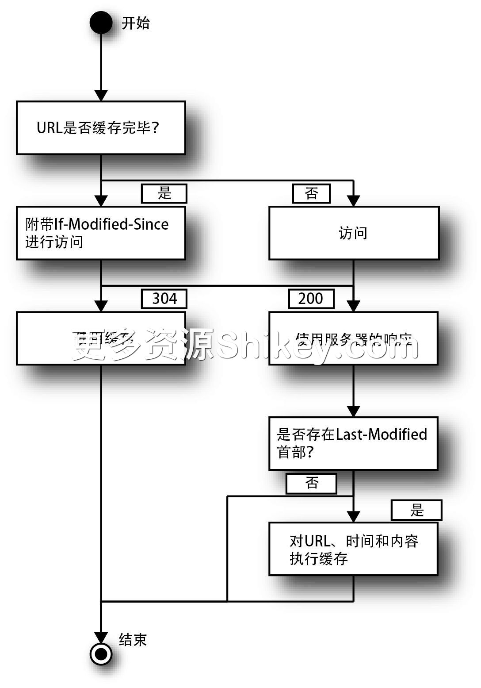
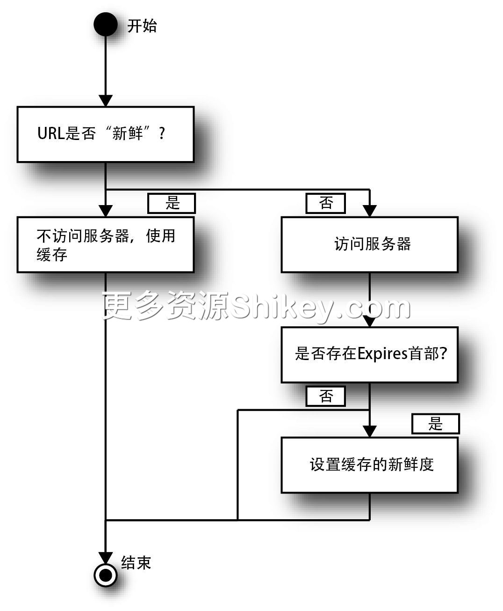
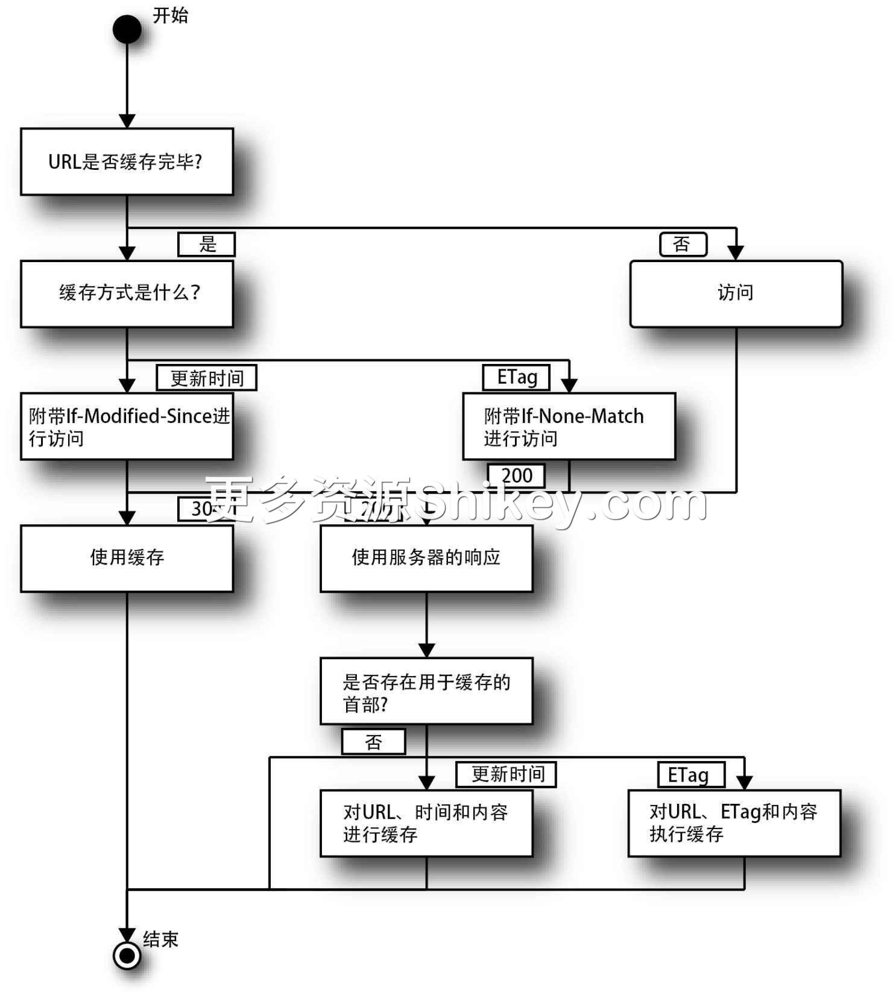
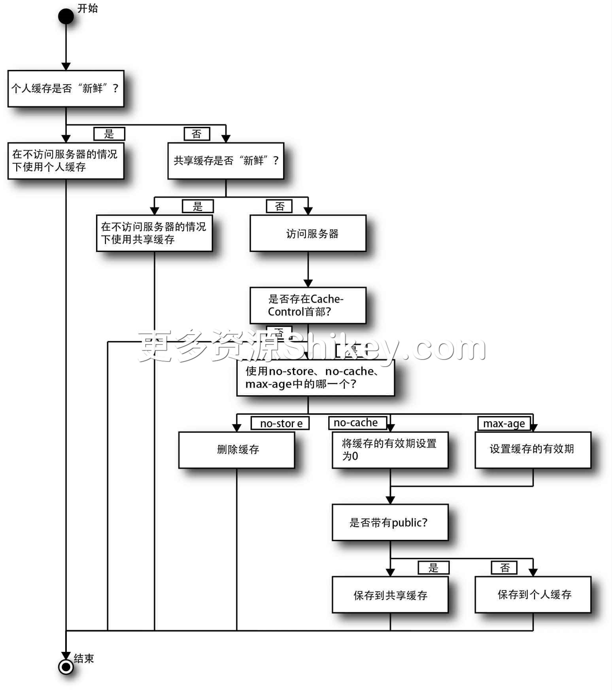
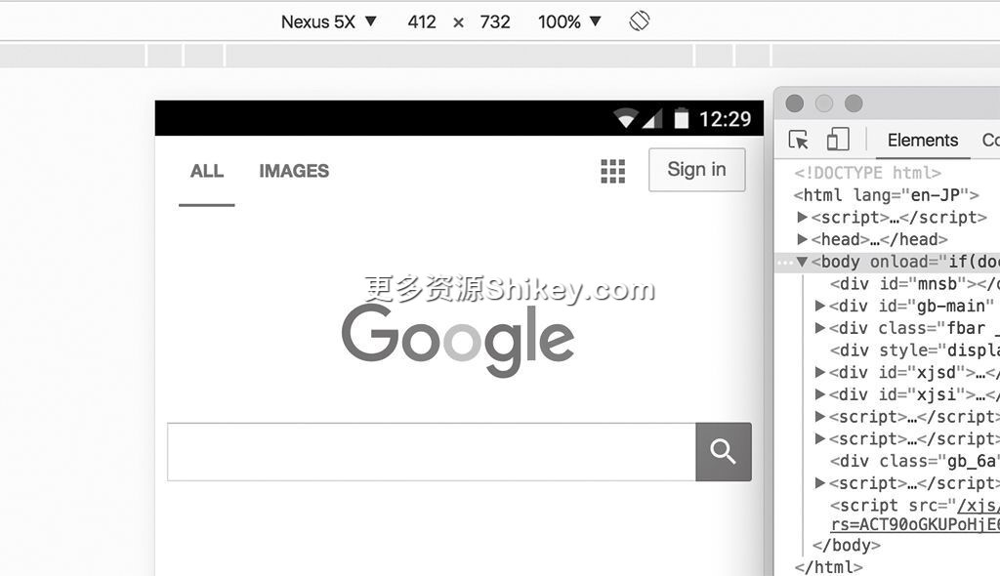
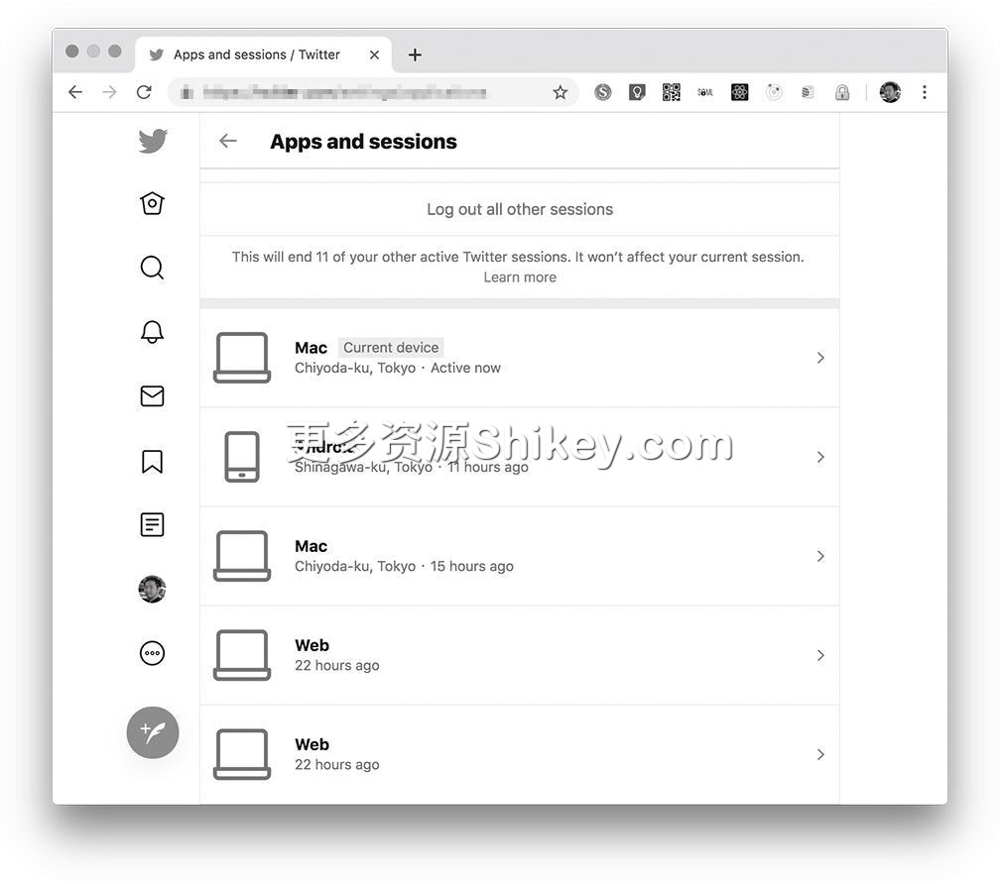

### 本资源由 itjc8.com 收集整理
# 第 2 章 HTTP/1.0 的语义：浏览器基本功能的背后(2)
## 2.7　代理

**代理**（proxy）是用于对 HTTP
通信等进行中继的一种结构。除了中继之外，代理还有各种附加功能。在公司或大学中，某个用户访问过的内容很可能被其他用户访问，如果将具有缓存功能的代理放置在公司或大学的网络出入口，就能减轻 Web
服务器的负担，还能让各个用户快速浏览页面。代理还有防火墙的作用，可以抵御来自外部的攻击。另外，代理还可以用作过滤器，针对低速的通信线路，压缩数据，提高速度（图像的视觉效果等会变差），或者用来过滤内容。代理的历史很悠久，HTTP/1.0
的规范中随处可见代理服务器的相关内容。在 1997 年，Microsoft 公司还将代理服务器作为服务器产品发售。

代理的实现很简单，只有 `GET` 等方法后面的路径名的形式会发生改变。跟在方法后面的路径名通常是 `/helloworld` 这种以斜杠开始的 UNIX
形式，而一旦设置了代理，路径名就会变成以 `http://` 或者 `https://` 开始的 URL 形式。从 HTTP/1.1 开始出现的 `Host`
首部也直接使用了最终接收请求的服务器的名称。关于 `Host` 首部的详细内容，大家可以参考第 4 章。实际上请求发送给了代理服务器。

虽然此次用于测试的服务器也会立即对面向代理的通信进行响应，但实际上我们希望的是将请求重定向到中继目的地，然后将结果返回给客户端。

```
GET /helloworld
Host: localhost:18888

GET http://××××.com/helloworld
Host: ××××.com
```

为了防止代理服务器被恶用，我们需要添加认证，对代理服务器加以保护。在这种情况下， `Proxy-Authenticate` 首部中会以与各个认证方式相应的形式写入值。代理会把中继途中的主机的 IP
地址记录到特定的首部中。这个特定的首部一直以来都是 `X-Forwarded-For`。很多代理服务器将该首部用作实际标准，该首部也在 2014 年的 RFC 7239 中实现了标准化。

```
X-Forwarded-For: client, proxy1, proxy2
```

我们使用 `-x/--proxy` 选项来设置代理。用于代理认证的用户名和密码需要通过 `-U/--proxy-user` 选项进行设置。

```
$ curl --http1.0 -x http://localhost:18888 -U user:pass http://××××.com/
helloworld
```

还可以使用 `--proxy-basic`、 `--proxy-digest` 等选项来改变代理的认证方式。

**网关**（gateway）与代理相似。二者在 HTTP/1.0 中的定义如下所示。

> **代理**
>
> 用于理解通信内容。根据需要改变内容，或者代替服务器进行响应。
>
> **网关**
>
> 用于直接转发通信内容。不允许改变内容。客户端感觉不到其存在。

HTTPS 通信的代理是通过 HTTP/1.1 中添加的 `CONNECT` 方法来实现的，这部分内容将在第 4 章介绍。

## 2.8　缓存

网站日趋丰富，显示一个页面有时需要几十个文件，总容量也增加到以 MB
为单位。如果每次都得下载这些文件，就算通信速度再快，也要花费大量时间来显示页面。而提前下载好文件，如果内容没有变化，就不用再次下载，这种机制就是 **缓存**，可以有效提升性能。

如今，与缓存相关的规则变得十分复杂，而其实早期版本中的规则很简单。我们按照版本来了解一下缓存的结构。缓存大致分为两种：浏览器上的缓存；在 Web 服务与浏览器之间运行的代理服务器或 CDN（Content Delivery
Network，内容分发网络）。后者将在第 13 章中进行介绍。

本书不会一一讲解 RFC 规范，因为实际的运行情况有时取决于浏览器的实现。本书的宗旨是满足基本需求，在此基础上让读者充分理解。

### 2.8.1　基于更新时间的缓存

首先来看一下 HTTP/1.0 中的缓存结构。当时缓存以静态内容为主，因此我们只比较内容的新旧即可。使用 Go 语言创建的用于测试的服务器没有发送内容，但许多 Web 服务器会在响应中包含下面的首部。时间采用 RFC 1123
格式，时区设置为 GMT。

```
Last-Modified: Wed, 08 Jun 2016 15:23:45 GMT
```

HTTP/1.0 中的缓存结构如图 2-2 所示，Web 浏览器在重新读入已缓存的 URL 时，会将服务器返回的时间直接放入 `If-Modified-Since` 首部中来发送请求。

```
If-Modified-Since: Wed, 08 Jun 2016 15:23:45 GMT
```

Web 服务器会将请求中的时间与服务器上的内容的时间进行比较。如果有改变，就像往常一样返回状态码 `200 OK`，并将内容放到响应主体中发送。如果没有改变，则返回状态码
`304 Not Modified`，不在响应中包含主体。



**图 2-2　HTTP/1.0 中的缓存结构**

### 2.8.2　Expires 首部

光速存在物理极限，再考虑到光纤的主要原料石英玻璃的折射率，即使完全没有损耗，光信号从地球的一端到另一端往返一次也需要 0.2
秒。另外，光信号还会途经各种电路，再加上服务器的处理时间，通信消耗的时间会更久。在缓存使用了更新后的时间的情况下，为了确认缓存的有效性，通信在所难免。HTTP/1.0 中引入了消除通信的结构，即
`Expires` 首部。

`Expires` 首部中存储有时间。缓存在有效期内是“新鲜的”，在这种情况下，客户端会强制使用缓存。也就是说，客户端不再发送请求。如果过期，缓存就不是“新鲜的”了。

```
Expires: Fri, 05 Aug 2016 00:52:00 GMT
```

在图 2-3 中的“访问服务器”处存在使用 `Expires` 首部进行缓存的逻辑。



**图 2-3　利用了 Expires 首部的缓存结构**

另外，Expires 这个名称容易让人误会，其实即使设定为“3 秒后内容过期”，也不会在 3
秒后自动重新加载内容。这里设置的时间只用来判断是否访问服务器。另外，在进行针对“返回”按钮等的“历史”操作的情况下，客户端有时会直接使用过期的旧内容。

在使用 `Expires` 首部时需要注意的是，由于客户端不会询问服务器是否发生改变，所以 `Expires` 首部不能用在 SNS
的首页之类的地方。这是因为指定时间内发生的变化会被搁置一旁，我们完全看不到新的内容。 `Expires` 首部最好用于样式表等很少进行更新的静态内容。

HTTP/1.1 的 RFC 2068 中增加了一条指导方针：不管什么样的内容，最长只有 1 年的寿命。

### 2.8.3　Pragma：no-cache

前面介绍了使用代理进行缓存的相关内容。另外，客户端也会向代理服务器发送指示。 `Pragma` 首部最早定义在 HTTP/1.0 中。 `no-cache` 是唯一定义在 HTTP
规范中的、能包含在 `Pragma` 首部中的有效负载（payload）。

`no-cache` 会对代理服务器发出指示——即使请求的内容已经缓存完毕，也希望代理服务器向原本的服务器（源服务器）发送请求。在 HTTP/1.1 中， `no-cache`
被归并到了 `Cache-Control` 中。为了保证向后兼容，HTTP/1.1 之后的版本把 `no-cache` 保留了下来。

在缓存机制中，像 `Pragma: no-cache` 这种来自客户端的指示或对代理服务器的指示，大家可能并不怎么使用。HTTP 是无状态的，第 10 章介绍的 REST
的目标就是“客户端事先并不持有内容的含义等知识”。信息的寿命和信息的性质由客户端来管理是一件很奇怪的事情。

另外，代理能够多大程度上理解这些指令，并按预期进行动作，这也是无法预估的事情。如果有一个代理忽视了 `no-cache`，运行结果就和我们预想的不同了。

### 2.8.4　不执行缓存的条件

无论添加多么详细的首部，只要满足下面任意一个条件，或者内容原本就不在缓存对象的范围内，就不会执行缓存。我们来逐一确认一下这些条件。

> - `GET` 与 `HEAD` 之外的非幂等 7 的方法
> - `Cache-Control` 首部中设置了 `private`
> - `Cache-Control` 首部中设置了 `no-stor`
> - 虽然有 `Authorization` 首部，但 `Cache-Control` 首部中无 `public`
> - 状态码不是
>    `200`、 `203`、 `207`、 `302`、 `410`、 `404`

说到缓存，人们通常想到的是浏览器中保存的内容，其实代理服务器或 CDN 等共享服务器也会执行缓存。因为是共享服务器，所以如果有一个人访问，内容被缓存下来，在其他人访问时服务器就可能会返回该内容。

### 2.8.5　添加 ETag

到目前为止所列举的只是根据时间来比较缓存，并不能覆盖所有情形。比如，我们可以想象一下电商网站 8 的 Web 服务。假设用户 A 正在查看特定的商品页面，用户 B、C、D、E
也在查看同一个页面。A 和 B 买过该商品，因此页面顶部显示“已购买”。A 和 C 是该网站的高级会员。B 和 D 不是高级会员，所以页面会显示加入高级会员的广告。而 E 连普通会员也不是。在这种情况下，服务器必须提供 5
种 HTML 文件。

像这样，会动态发生改变的元素越多，就越难判断应该以哪个时间为依据来判定缓存的有效性。我们必须想办法将缓存的有效性数值化。

在这种情况下，可以使用在 RFC 2068 的 HTTP/1.1 中添加的 `ETag`，通过与文件相关的散列值来进行比较。如图 2-4 所示，和根据时间确认缓存时一样，服务器会在响应中加上
`ETag` 首部。之后，在进行下载时，客户端会在 `If-None-Match` 首部中添加下载好的缓存中持有的 `ETag`
值，然后发送请求。服务器将该值与要发送的文件的 `ETag` 进行比较，如果相同，则返回 `304 Not Modified` 作为响应。这里介绍的缓存控制结构在 HTTP/1.0
中也存在。

服务器可以自由决定是否返回 `ETag`。例如，Amazon S3 中就使用了对文件内容进行散列计算后的内容。服务器端可以生成除了时间之外的更新信息的散列值。 `ETag`
可以选择使用更新的时间。不过，在 Apache 2.3.15 之后，Nginx 和 h2o 等服务器赋给静态文件的 `ETag` 是“更新的时间 `-`
文件大小”（将纪元秒和字节大小转换为十六进制数进行连接）这种形式。虽然 `ETag` 留有通过程序动态生成的余地，但在传送静态文件的情况下，它与 `Last-Modified`
相同。

除了时间和大小之外，旧版的 Apache 中还使用了 inode 编号。inode 编号是表示硬盘内容的索引值，在同一个驱动器内是唯一的。不过，在存在多台服务器的情况下，即使内容相同，如果 ID
不同， `ETag` 也会发生变化，这样缓存就变得没有意义了。这会给攻击者提供潜在的攻击机会，因此默认的设置就被修改了。除此之外，子进程的 ID 可能会超出 multipart 类型的 MIME
边界这一问题也得到了解决。



**图 2-4　利用了 ETag 的缓存结构**

### 2.8.6　Cache-Control

`Cache-Control` 首部与 `ETag` 是在同一时期添加到 HTTP/1.1 中的。 `Cache-Control`
首部可以让服务器指定更灵活的缓存控制方式，优先于 `Expires` 首部。我们先来介绍一下服务器发送的响应首部。常用的键有以下几种。

> `public`
>
> 使用同一个计算机的多个用户之间可以重复使用缓存。
>
> `private`
>
> 使用同一个计算机的不同用户不可以重复使用缓存。该键用于从同一个 URL 针对不同用户返回不同内容。
>
> `max-age=n`
>
> 以秒为单位设置缓存新鲜度。如果指定为 `86400`，缓存有效期就为一天，在此期间，客户端可以在不询问服务器的情况下直接使用缓存。缓存过期后就要询问服务器，在服务器返回
> `304 Not Modified` 时才能使用缓存。
>
> `no-cache`
>
> 用于询问服务器缓存是否有效。基本与 `max-age=0` 相同。
>
> `no-store`
>
> 不缓存。
>
> `immutable`
>
> 表示内容不会发生改变。它是一个非标准指令，Firefox、Safari 和 Edge 对其提供了支持，但 Chrome 并未提供支持。

`no-cache` 与 `Pragma:no-cache` 一样，并非不进行缓存，只是不会在不访问服务器的情况下重复使用内容。但它会使用更新的时间和
`ETag`，当服务器返回 `304` 时，缓存是有效的。不进行缓存的是 `no-store`。

我们还要注意缓存和隐私之间的关系。 `Cache-Control` 是用来限制重新加载的结构，并不用来保护隐私。 `private` 的作用是当相同的 URL
针对不同的用户返回不同的结果时，避免出现异常结果。如果链接不安全，通信过程中的内容就会被看到。 `no-store` 只是不在缓存服务器上保存内容而已，它无法阻止缓存服务器监视通信内容。

> 　当要浏览内容而不进行缓存时，我们可以不使用
> `Cache-Control` 首部，而是在 URL
> 末尾加上随机数值或内容的散列的查询（ `?random=15431`），这种做法如今仍然可以看到，这是一种叫作缓存破坏的技术。执行 JavaScript 编译的 WebPack
> 会生成加上散列值的文件名，如 `vendor.abc123.js` 等，这也是缓存破坏。缓存破坏用于在部署时读取新内容等时。如果想每次都在不使用缓存的情况下读取内容，最好使用
> `no-cache`。

我们可以指定多个值，值与值之间用逗号隔开。不过从内容方面来说，各个值需要按照下面的方式进行组合。

> - 设置为 `private` 或 `public`，或者不设置（默认为 `private`）
> - 使用 `max-age`、 `no-cache` 和 `no-store` 中的一个

在图 2-5 中的“访问服务器”处存在基于前面介绍的时间和 `ETag` 进行缓存的逻辑。



**图 2-5　利用了 Cache-Control 首部的缓存结构**

图 2-5 大致展示了客户端是如何根据各个首部的设定值来执行相应的动作的，不过笔者无法保证图中的内容永远正确。RFC 中并没有提到设置发生冲突时（ `no-cache` 和
`max-age` 等）的优先顺序。另外， `Expires` 和 `Cache-Control:public` 也可以组合使用。

> 　Google Developers 中详细介绍了缓存的相关内容。

### 2.8.7　Vary

在介绍 `ETag` 时，我们提到了即使是同一个 URL，如果用户不同，结果也可能不同。 `Vary` 首部就可以让同一个 URL 根据客户端返回不同的结果。

例如，当用户使用的浏览器为智能手机的浏览器时显示移动端的页面，根据用户使用的语言显示相应的内容，在这种情况下通过在 `Vary` 中列举相当于改变显示的理由的首部名称，就能避免用错缓存。

```
Vary: User-Agent, Accept-Language
```

如果是需要登录的网站， `Vary` 首部也会指示 Cookie。

`Vary` 首部也可以作为搜索引擎的提示使用。内容会根据浏览器的种类发生改变就意味着移动端的浏览器和非移动端的浏览器会显示不同的内容。 `Vary`
首部还可以用来将英文版、中文版等多语种版本的内容正确地进行索引化。相反，如果不设置 `Vary` 首部，在本应返回不同内容的情况下，有可能返回异常的结果。

移动端的浏览器的判定方法主要有两种。一种是已经介绍过的 `User-Agent`。如图 2-6 所示，我们点击一下 Chrome 开发者工具上方的类似于智能手机的图标。



**图 2-6　使用开发者工具查看移动端的网站**

在该模式下，向服务器发送如下所示的用户代理（user agent）。

```
User-Agent: Mozilla/5.0 (Linux; Android 6.0; Nexus 5 Build/MRA58N)
AppleWebKit/537.36 (KHTML, like Gecko) Chrome/55.0.2883.95 Mobile Safari/537.36
```

服务器能够基于该信息区分内容。不过，用户代理的名称是按惯例加上的，它不是标准的信息。正如“用户代理嗅探”这个名称所表达的那样，服务器只能对信息进行推测，所以判断错误的情况也时有发生。如今，Google
的指导方针中推荐的是响应式 Web 设计，具体来说就是将相同的内容（HTML、CSS、JavaScript）传送给所有浏览器，由浏览器进行设置。笔者将在第 8 章介绍响应式 Web 设计。

## 2.9　Referer

`Referer` 是由客户端发送给服务器的首部，其目的是让服务器掌握用户是通过哪条路径到达网站的。 `Referer` 之所以与英语单词 referrer 拼写不同，是因为该首部在
RFC 1945 中提出时出现了拼写错误，于是错误的写法就保留到了现在。

当客户端点击 `http://www.××××.com/link.html` 而跳转到其他网站时，会以下面的形式向跳转到的服务器发送链接源页面的 URL。另外，在 Web
页面获取图像和脚本的情况下，当请求这些资源时，使用这些资源的 HTML 文件的 URL 就会作为 `Referer` 发送出去。

```
Referer: http://www.××××.com/link.html
```

如果选择书签或者在地址栏中手动输入网址，发送的就不是 `Referer` 标签本身，而是 `Referer: about:blank`。

例如，搜索引擎会将搜索结果显示为“ `?q= 搜索词`”这种形式的 URL。当浏览器将该 URL 作为 `Referer`
发送时，服务器就可以知道用户是通过什么样的搜索词到达网站的。另外，Web 服务通过收集 `Referer` 信息，可以知道哪一个页面能链接到自己的服务。

Web 服务的设计者在制作设计文档时，不可以将隐私信息作为 `GET` 参数显示。 `GET` 参数是通过 `Referer`
发送到外部服务的，因此存在泄漏隐私的危险。我们也可以通过对浏览器进行设置来避免将 `Referer` 发送出去。

`Referer` 可以作为一种保护措施使用。比如，为了防止直接链接到图像，在下载图像时，如果未设置 `Referer`，则禁止下载。另外， `Referer`
还可以用来防止跨站请求伪造，避免请求从未设置表单的其他站点发送。但如果不让浏览器发送请求，功能就无法正常运行。因此，现在不采取这种安全措施了。

HTTP/1.1 中添加了 HTTPS，对用户的通信内容进行加密，但为了防止受保护的通信内容泄露给不受保护的通信线路，RFC 2616 规定客户端在发送 `Referer`
时要添加一些限制。访问源和访问目标的方案组合与是否发送 `Referer` 的关系如表 2-3 所示。

**表 2-3　方案组合与是否发送 Referer 的关系**

访问源

访问目标

是否发送

HTTPS

HTTPS

是

HTTPS

HTTP

否

HTTP

HTTPS

是

HTTP

HTTP

是

如果完全按照该规则操作，那么服务间的协作也会出现问题。Referer Policy 于 2014 年提出，2020 年仍处于草案的状态。在浏览器的实现方面，现在除了 Internet Explorer 和 Android
4.4 之前版本的 Android Browser，其他浏览器都遵循该规则。Referer Policy 可以通过以下任意一种方法进行设置。请注意，此处纠正了拼写错误。

> - `Referrer-Policy` 首部
> - `<meta name="referrer" content=" 设置值 ">`
> - `<a>` 标签等几个元素的 `referrerpolicy` 属性和
>    `rel="noreferrer"` 属性

Referer Policy 中可以设置的值有如下几种。

> `no-referrer`
>
> 不发送 `Referer`。
>
> `no-referrer-when-downgrade`
>
> 与现在的默认动作相同，在发生协议降级时不发送 `Referer`。
>
> `same-origin`
>
> 仅对同一个域中的链接发送 `Referer`。
>
> `origin`
>
> `origin` 作为首页（非详细页面）中的链接，仅发送域名。
>
> `strict-origin`
>
> 与 `origin` 相同，但在发生协议降级时不发送 `Referer`。
>
> `origin-when-crossorigin`
>
> 如果是同一个域，则发送完整的 `Referer`；如果不是同一个域，则只发送首页的域名。
>
> `strict-origin-when-crossorigin`
>
> 与 `origin-when-crossorigin` 相同，但在发生协议降级时不发送 `Referer`。
>
> `unsafe-url`
>
> 不论哪种情况都会发送 `Referer`。

除此之外，我们还可以按照下面的方式使用 `Content-Security-Policy` 首部进行设置。

```
Content-Security-Policy: referrer origin
```

`Content-Security-Policy` 首部可以同时改变多个与安全有关的设置，相关内容会在第 14 章中介绍。

## 2.10　面向搜索引擎的内容访问控制

互联网最初是作为使用浏览器查阅文档的结构出现的，但之后搜索引擎中用于收集信息的自动巡检程序得到广泛运用。这种自动巡检程序有爬虫、机器人、BOT 和蜘蛛等叫法，这些叫法表达的含义基本相同。本书采用爬虫这一叫法。BOT
现在也作为自动聊天程序的名称使用。

针对爬虫的访问控制方法主要有以下两种。

> - robots.txt
> - 站点地图

另外，作为对此处内容的补充与扩展，第 8 章还会介绍语义网和开放内容协议等内容。

### 2.10.1　robots.txt

robots.txt 协议的作用是帮助服务器的内容提供者告诉爬虫是否可以访问。robots.txt 适合作为记述该协议的文件名称，而机器人排除标准（Robots Exclusion
Standard，RES）更适合作为规范名称。但从认知度来说，robots.txt 更胜一筹。该协议制定于 1994
年，是在成员为爬虫作者的邮件列表中讨论完成的。阅读并分析该协议后就能发现，实际上取消访问的是爬虫一方，这可以说是爬虫作者之间的一个绅士协议。如今，Google、Bing 等搜索引擎的爬虫都遵循 robots.txt。

robots.txt 采用如下形式指定禁止读取内容的爬虫的名称和位置。

```
User-agent: *
Disallow: /cgi-bin/
Disallow: /tmp/
```

这里禁止所有爬虫访问 `/cgi-bin` 文件夹和 `/tmp` 文件夹。用户代理也可以像 Googlebot 一样单独对文件夹进行指定。

HTML 的 `meta` 标签中可以记述与 robots.txt 相同的内容。虽然 robots.txt 的优先级更高，但 `meta` 标签可以用来指定更加详细的内容。

**使用 meta 标签拒绝爬虫**

`<meta name="robots" content="noindex" />`

`content` 属性中可以记述各种指令。Googlebot 遵循的详细指令记述在 Google 的网站上。表 2-4 中列举了一些比较典型的指令。

**表 2-4　meta 标签中的指令**

指令

含义

`noindex`

向搜索引擎声明该页面禁止被索引收录

`nofollow`

拒绝爬虫追踪该页面中的链接

`noarchive`

拒绝缓存页面中的内容

如代码清单 2-1 所示，在 HTTP 的 `X-Robots-Tag` 首部中也可以记述相同的指令。

**代码清单 2-1　X-Robots-Tag**

```
X-Robots-Tag: noindex, nofollow
```

### 2.10.2　robots.txt 与诉讼案例

robots.txt 虽然在 1997 年就提交了 RFC 化草案，但如今仍未标准化。不过，robots.txt 实质上已经成为标准了，HTML 4 的规范中也对此进行了说明，而且一些案例也证明了 robots.txt
具有法律效力。日本在 2014 年修订著作权法时，还以全角字符的形式将 robots.txt 记述在了著作权法施行规则中。2019 年 7 月，Google 发布了 robots.txt 解析器的源代码。由于
robots.txt 未标准化，所以各类解析器的动作会稍有不同，但 README 中提到这是为了通过提供信息而使其与 Google 的实现相一致。与此同时，RFC 化草案被再次提交了。

2006 年有一起非常著名的诉讼——Field v.Google。作家兼律师的布莱克·菲尔德（Blake A.Field）对 Google 提起诉讼，状告 Google 侵犯其著作权，但法院最终判定 Google
胜诉。得出该判决结果的关键因素就是 robots.txt。原告菲尔德虽然知道如何使用 robots.txt 来禁止爬虫访问，但他未采取相应措施，因此法院判定 Google 未侵犯其著作权。也就是说，Google
定义的合理使用得到了认可。

robots.txt 的网站上展示了几个与 robots.txt 有关的案例。虽然网站提供者和爬虫作者之间未签订协议，但网站提供者可以通过设置 robots.txt 表明其意图，爬虫要遵守。另外，如果爬虫利用了通过设置
robots.txt 而未拒绝访问的内容，也会像 Field v.Google 事件一样，在诉讼中败诉。

在日本，从大约 10 年前开始，网站存档服务“Web 鱼拓”就基于这些案例，在 robots.txt 禁止的情况下不对网站进行自动存档。如今，日本的法律主张尊重 robots.txt 和 `meta`
标签规定的内容，因此 robots.txt 在日本法律中也有一定的效力。

### 2.10.3　站点地图

**站点地图** 是提供网站中包含的页面及其元数据的 XML 文件，2005 年由 Google 开发。Yahoo、Microsoft 也使用了站点地图。robots.txt
以黑名单的形式使用，站点地图以白名单的形式使用。虽然爬虫可以追踪链接，查看页面，但在某些实现方式下，爬虫无法发现页面，比如（如今可能不怎么常见）使用 Flash 创建的内容和使用 JavaScript
创建的动态页面的链接等，可以通过站点地图进行补充。站点地图的规范公布在其官网中。

站点地图的官网中定义了基本的设置项目，但我们也可以给各个搜索引擎添加不同的功能。在采用 XML 格式记述站点地图时，要根据需要注册的页面个数来创建 `<url>`
标签。 `<loc>` 是绝对 URL。XML 格式是最常用的，不过单纯列举 URL 的文本文件、用于通知 RSS 或 Atom 等博客的更新信息的格式也可以用作站点地图。

站点地图也可以记载到 robots.txt 中。另外，还有针对各搜索引擎上传 XML 文件的方法。Google 中使用的是 Search Console 工具。

在 Google 中，可以使用站点地图把网站的元数据传递给搜索引擎，这些元数据包括以下内容。

> - 网站中包含的图像路径、标题、许可和物理位置
> - 网站中包含的视频的缩略图、标题、播放时长、评价和播放次数
> - 网站中包含的新闻的标题、发布日期、题材和新闻中涉及的企业的证券号码

详细内容请参考 Search Console 的帮助文档。

## 2.11　用户代理

Web 用户不是直接通过 HTTP 与服务器进行通信的，而是将浏览器作为自己的代理使用。在 Web
的世界中，浏览器等代替用户进行通信的程序称为 **用户代理**。浏览器在访问网站时会发送关于自己的信息。笔者使用的 macOS 上的 Google Chrome 会发送如下信息。

```
User-Agent: Mozilla/5.0 (Macintosh; Intel Mac OS X 10_12_6) AppleWebKit/537.36
(KHTML, like Gecko) Chrome/75.0.3770.142 Safari/537.36
```

以前，人们会依靠上面这种信息来区分内容，因此习惯将旧浏览器的名称也包含在内，这样一来，代理名就会变得很长。上面的示例中就包含了“Firefox 的前身 Mozilla、Apple 公司的 HTML 引擎 WebKit（及其前身
KHTML，它与 Firefox 的前身更像）、Chrome 或 Safari”等复杂的信息。

为了从该字符串中取出操作系统与浏览器的信息，我们需要将名称规则模式化，然后进行解析。使用“语言名 `User-Agent detect`”等关键字能搜索到各种语言的解析库。

近年来，用户代理主要用于在提供认证功能的平台上列出用户在何时、从哪个设备登录等信息。图 2-7 中列举了 Twitter 的例子，但 Google 也持有同样的信息。位置信息可以根据 IP 地址进行推测（第 5
章会介绍相关内容），信息粒度虽然较粗，但可以据此确认他人是否偷偷登录了你的账号。在图 2-7 的画面中可以重置所有终端的登录会话。



**图 2-7　Twitter 的会话信息**

Python 中的标准库 `urllib`、第三方 HTTP 客户端库 `requests` 和 curl 命令的用户代理名称的字符串如下所示。

```
User-Agent: Python-urllib/3.7
User-Agent: python-requests/2.21.0
User-Agent: curl/7.64.0
```

这些工具可以通过命令行选项改写字符串。遗憾的是，在使用基于 Python 或 Perl
等编写的自动下载的抓取工具时，会出现无故发送大量数据的情况，因此有些服务会默认拒绝来自这些语言的用户代理的访问。为了摆脱这样的限制，在进行抓取时，要控制每秒的访问次数等 9。关于 Go 语言的访问次数控制，我们将在第 10 章介绍。

相反，服务器也可以指示客户端“使用这种用户代理的渲染引擎来查看”。虽然不同版本的浏览器显示的引擎也有所不同，但服务器会通知客户端其内容是面向浏览器的哪个版本的。Internet Explorer 10
之前的版本中会使用如下首部，该首部如今已经不再使用了。

> `X-UA-Compatible: IE=edge`
>
> 该首部表示使用 Internet Explorer 持有的最新引擎。

## 2.12　本章小结

本章我们了解了浏览器是如何运用 HTTP 的 4 个基本元素来改善用户体验的。本章主要介绍了以下内容。

> - 表单和发送文件
> - 内容协商
> - 使用缓存和内容压缩来减少数据量并改善响应
> - 浏览器获取希望的语言的内容和希望的图像格式的文件
> - 使用认证来显示用户固有的内容
> - 使用 Cookie 避免在每次访问时进行登录
> - 使用代理进行外部缓存和过滤
> - `Referer`
> - 面向搜索引擎的访问控制
> - 用户代理

HTTP 进行了很好的分层。由于数据容器部分没有改变，所以即使未实现规范中提出的新功能，HTTP
也可以轻松地保证兼容性。另外，如果浏览器支持尚未标准化的方式，则也可以尝试使用这些方式。将基础语法与首部含义的解释（语义）进行分离，可以保证向前兼容和向后兼容。