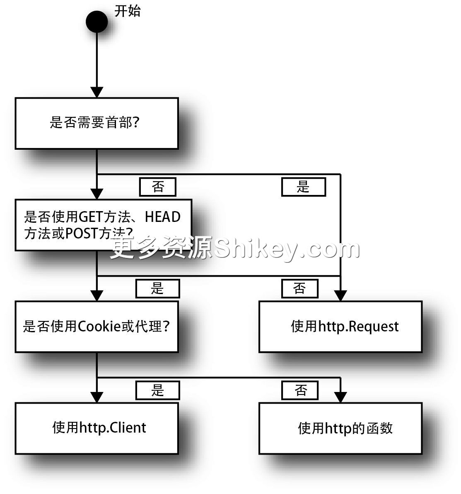

### 本资源由 itjc8.com 收集整理
# 第 3 章 使用 Go 语言实现 HTTP/1.0 客户端
第 1 章介绍了 HTTP 的如下 4 个基本元素，以及发送和接收这些基本元素的 curl 命令的写法。

> - 方法和路径
> - 首部
> - 主体
> - 状态码

本章我们来学习一下如何使用 Go 语言来编写发送和接收上述内容的代码。

> 　在前面的章节中，curl 命令都带有 HTTP/1.0
> 中的运行选项（ `--http1.0`），本章会省略该选项。虽然在执行 curl 命令时会像“HTTP/1.1”这样显示协议版本，但动作与 HTTP/1.0 并没有太大区别。

## 3.1　为何使用 Go 语言

Google 公司在 2007 年发布了 Go 语言。近年来，Go 语言得到广泛应用。Go 语言的优点体现在以下几个方面。

> - 拥有轻量级语言规范和丰富的标准库
> - 编译速度快，可与动态脚本语言的运行速度匹敌，会进行类型检查
> - 运行速度快，易于实现多核性能，节省内存
> - 易于交叉编译
> - 输出的是单一的二进制文件，易于发布

另外，本书之所以采用 Go 语言来实现 HTTP 代码，也是因为它是一门优秀的教学语言，具体体现在以下几个方面。

> - 语言规范少于其他编程语言，使用其他编程语言的用户也能轻松理解 Go 语言的运行方式，因此 Go 作为描述语言也非常优秀
> - Go 语言是编译语言，能够检查语法结构和类型，易于发现输入错误
> - 仅使用标准库即可创建访问 HTTP 的程序
> - 实际上，Go 语言也用作各种 Web 服务的 CLI 客户端的实现语言

单看每个特征，我们也能发现 Go 语言相比其他编程语言的优秀之处。例如，Go 语言的运行速度比 C 和 C++
快，生成的二进制文件也比较小。不过，交叉编译环境搭建起来比较费事，而且在编译和发布时，要把需要用到的库都集中起来创建编译环境，这也很麻烦。拥有包管理器的 Python、Ruby 和 Node.js
等脚本语言无须编译，但不会输出单一的二进制文件，运行速度比 Go 语言慢一点儿，内存消耗量方面也比 Go
语言大一点儿。我们在学生时代都参加过模拟考试，应该知道用自己擅长的学科弥补不擅长的学科是一件很难的事情，只有所有学科都取得好成绩，才能提高偏差值 1。Go
语言就是一种能够完美解决各种问题的语言。

本书不会详细介绍 Go 语言的基础知识，其他编程语言的使用者可通过在线教程“A Tour of Go”了解 Go 语言。如今，Go 语言的相关图书不断增多，学习也变得更加方便。大家还可以参考集中介绍了 Go 语法的“Java
to Go in-depth tutorial”。

## 3.2　Go 语言的 API 结构

Go 语言中提供的 HTTP 的客户端 API 大致分为如下 3 类。

> - 功能有限，但易于使用的 API
> - 能使用 Cookie 的、可稍加控制的 API
> - 原生的、可访问所有功能的 API

前两种 API 比较简单，写出来的代码也比较短，但在处理更详细的内容时，就需要使用最后一种 API 了。前两种 API 是基于后一种 API 构建的。我们首先使用比较简单的 API
来实现频繁使用的处理的代码，然后学习如何使用原生 API 来实现更加详细的 HTTP 访问。

## 3.3　本章的主要内容

第 1 章和第 2 章介绍了 HTTP 的基本结构，以及浏览器发送和接收信息的模式（表 3-1）。下面我们来学习一下如何使用 Go 语言来实现其中几个比较典型的模式。

**表 3-1　浏览器发送和接收信息的模式**

模式

方法

Go 语言的 API

使用 `GET` 获取信息

`GET`

`http.Get`

获取带查询的信息

`GET`

`http.Get`

使用 `HEAD` 获取首部

`HEAD`

`http.Head`

使用 `x-www-form-urlencoded` 发送表单

`POST`

`http.PostForm`

使用 `POST` 发送文件

`POST`

`http.Post`

使用 `multipart`/ `form-data` 发送文件

`POST`

`http.PostForm`

发送和接收 Cookie

`GET`、 `HEAD`、 `POST`

`http.Client`

代理

`GET`、 `HEAD`、 `POST`

`http.Client`

访问文件系统

`GET`、 `HEAD`、 `POST`

`http.Client`

发送任意方法

所有

`http.Request`、 `http.Client`

发送首部

所有

`http.Request`、 `http.Client`

表 3-1 中的前 6 项使用简单的 API，接下来笔者会首先介绍这部分内容，之后介绍用于把 Cookie 和代理设置为有效的 `http.Client` 的使用方法，最后介绍可以访问所有功能的
API，即 `http.Request` 和 `http.Client` 的组合。

很多读者可能使用的并不是 Go 语言，但各种编程语言的库基本上会提供与常用的 `GET` 和 `POST` 相关的 API 和专用方法，然后追加提供可以访问所有功能的 API。


## 3.4　GET 方法的发送及主体、状态码和首部的接收

首先来看最简单的发送 `GET` 方法的代码，它与下面的 curl 命令是等价的。

```
$ curl http://localhost:18888
```

代码清单 3-1 中的代码用于发送 `GET` 方法，并将响应主体输出到画面上。代码中也包含了错误处理。这是保持良好运行的最低限度的代码。

**代码清单 3-1　发送 GET 方法，并将响应主体输出到画面上**

```
package main                // ❶

import (                    // ❷
    "io/ioutil"
    "log"
    "net/http"
)

func main() {                // ❸
    resp, err := http.Get("http://localhost:18888")
    if err != nil {          // ❹
        panic(err)
    }
    defer resp.Body.Close()  // ❺
    body, err := ioutil.ReadAll(resp.Body) // ❻
    if err != nil {          // ❹
        panic(err)
    }
    log.Println(string(body))  // ❼
}
```

> ❶ 库之外的源代码必须以 `package main` 开始。
>
> ❷ 导入需要用到的包。在 Go 语言中，无法使用文件中未声明的包。
>
> ❸ 所有程序在最开始都会调用 `main` 包（❶ 中创建的包）中的 `main` 函数。
>
> ❹ Go 语言的错误处理代码。Go 语言的函数会将错误作为返回值返回，因此需要确认返回值是否为 `nil`。这里没有异常处理。 `panic`
> 用来显示错误并结束程序。库擅自结束程序会给使用的应用程序带来麻烦，因此在打包为库时，Go 语言通常会像 `http.Get()` 那样，将错误作为返回值的最终项返回。
>
> ❺ 这是后处理的代码。如果加上 `defer`，在跳出 `main` 函数后，就会执行该语句。这是通过套接字读取主体之后的处理。
>
> ❻ 将主体内容读取为字节序列。
>
> ❼ 将字节序列转换为 UTF-8 字符串并输出到画面上。

> 　关于 ❺ 处的
> `defer`，虽然运行的时间点不一样，但与资源的创建（接收）在相同的作用域内，所以可以利用 `defer` 机制编写结束处理，或者使其自动执行。在 C++
> 中，可以通过调用本地的析构函数，使用智能指针（smart pointer）来销毁栈。在 Ruby 中，可以像 `File.open` 方法那样使用代码块。在 Python 中，可以使用
> `with` 语法结构。在异常处理中，无论是否发生错误， `finally` 代码块都会被调用。拥有这种 `finally` 代码块的语言也会使用
> `defer`。

在 `simpleget` 文件夹中，创建一个名为 `main.go` 的文件（文件名任意），输入前面的代码，然后像下面这样在 `simpleget`
文件夹中进行编译。这里会生成一个与文件夹同名的执行文件，我们试着运行这个执行文件。

```
$ go build
$ ./simpleget
```

在 Windows 中，程序如下运行。

```
> go build
> simpleget.exe
```

如果像下面这样启动，则也可以像脚本语言一样，在运行时不关心编译内容。

```
$ go run main.go
```

代码清单 3-2 中的代码省略了错误检查，更加简短。

**代码清单 3-2　无错误检查的代码**

```
package main

import (
    "io/ioutil"
    "log"
    "net/http"
)

func main() {
    resp, _ := http.Get("http://localhost:18888")
    defer resp.Body.Close()
    body, _ := ioutil.ReadAll(resp.Body)
    log.Println(string(body))
}
```

`resp` 变量中保存的元素是 `http.Response` 类型的对象。该对象中保存着从服务器返回的各种信息。主体保存在成员变量 `Body`
中， `StatusCode` 中使用 `200` 之类的数值来保存状态码， `Status` 中使用 `"200 OK"`
之类的字符串来保存状态码。将代码清单 3-3 的代码插入到 `resp` 变量的定义后面，就会在控制台上显示状态码。

**代码清单 3-3　在控制台上显示状态码**

```
// 字符串 "200 OK"
log.Println("Status:", resp.Status)
// 数值 200
log.Println("StatusCode:", resp.StatusCode)
```

同样， `resp.Header` 中保存着首部。首部是字符串数组 `map` 类型。下面这行代码用于在控制台上输出响应首部。

**输出响应首部**

`log.Println("Headers:", resp.Header)`

也存在仅获取指定项目的开头元素的 `GET` 方法，如下所示。

**获取指定的首部**

`log.Println("Content-Length:", resp.Header.Get("Content-Length"))`

运行结果如下所示。

```
2016/06/08 01:43:38 <html><body>hello</body></html>
2016/06/08 01:43:38 Status: 200 OK
2016/06/08 01:43:38 StatusCode: 200
2016/06/08 01:43:38 Headers: map[Date:[Tue, 07 Jun 2016 16:43:38 GMT] Content-
Length:[32] Content-Type:[text/html; charset=utf-8]]
2016/06/08 01:43:38 Content-Length: 32
```

`http.Get()` 函数是一种高级 API，即使什么也不指定，也可以用它进行 10 次重定向等，而无须关心与浏览器的动作的差别。

### io.Reader

代码清单 3-1 中存在如下代码。

**读取整个主体数据，返回字节数组**

`body, err := ioutil.ReadAll(resp.Body) // ❻`

在 Go 语言中，数据流的输入和输出会抽象化为 `io.Reader` 接口和 `io.Writer`
接口。文件和套接字等处都会用到这些接口。 `http.Response` 类型的变量 `resp` 的成员变量 `Body` 也是一个持有
`io.Reader` 接口的对象。

准备一个字节数组的缓冲区，并调用 `Read()` 方法，即可直接处理 `io.Reader`。 `io.Writer()`
也一样，只需准备一个字节数组，然后调用 `Write()` 方法即可。它们都是原生的，因此实际中如果这样使用，代码行数就会增多。Go 语言提供了既能处理文件又能处理套接字的许多高级功能。

> `func ioutil.ReadAll(reader io.Reader) ([]byte, error)`
>
> 汇总 `io.Reader` 的内容，并将其读入字节数组。
>
> `func Copy(dst io.Writer, src io.Reader) (written int64, err error)`
>
> 将所有内容从 `io.Reader` 复制到 `io.Writer` 中。
>
> `bufio.NewReader(reader io.Reader) *bufio.Reader`
>
> 包装 `io.Reader`，添加缓冲结构，创建能够新增许多便捷方法的对象。
>
> `bytes.Buffer`
>
> 能够读写内存，并且可用作 `io.Reader` 和 `io.Writer`。
>
> `strings.Reader`
>
> 能够读取字符串，并且可用作 `io.Reader`。

另外，以下函数也很常用。

> `fmt.Fprintf(writer io.Writer, format string, ... variant{})`
>
> 将格式化的字符串写出到 `io.Writer` 中。

Go 语言拥有通过组合使用接口来提高代码抽象度的结构。因为我们需要记住一些库，所以一开始可能感觉比较难，不过熟悉之后，就可以对所有的输入和输出目标执行高级操作了 2。

## 3.5　使用 GET 方法发送查询

接下来介绍如何使用 `GET` 方法发送查询。我们来编写与下面的 curl 命令基本等价的代码。

```
$ curl -G --data-urlencode "query=hello world" http://localhost:18888
```

如果查询中没有空格或不可以在 URL 中使用的字符，就可以使用 `--data` 或者其缩写 `-d` 来代替
`--data-urlencode`。 `-G` 是 `--get` 的缩写。

代码清单 3-4 是使用 Go 语言实现的代码。

**代码清单 3-4　使用 GET 方法发送查询**

```
package main

import (
    "io/ioutil"
    "log"
    "net/http"
    "net/url"
)

func main() {
    values := url.Values{    // ❶
        "query": {"hello world"},
    }
    // ❷
    resp, _ := http.Get("http://localhost:18888" + "?" + values.Encode())
    defer resp.Body.Close()
    body, _ := ioutil.ReadAll(resp.Body)
    log.Println(string(body))
}
```

> ❶ 首先，创建查询字符串。查询字符串使用 `url.Values` 类型进行声明，调用 `value.Encode()` 方法来创建。字符串的转义也由该方法执行。
>
> ❷ 最后，在 URL 的末尾添加结果字符串。

如下所示，查看服务器端的日志就可以发现，URL 中附加了查询。另外，我们还能得知查询被正确传递，成了字符串数组的映射。

**接收查询的服务器端的日志**

```
URL: "/?query=hello+world"
Query: {
    "query": []string{
        "hello world",
    },
}
```

## 3.6　使用 HEAD 方法获取首部

`HEAD` 方法的实现很简单，只要将 `http.Get` 替换为 `http.Head()` 即可。下面的 curl 命令也可实现
`HEAD` 方法的处理。

```
$ curl --head http://localhost:18888
```

**代码清单 3-5　发送 HEAD 方法来获取首部**

```
package main

import (
    "log"
    "net/http"
)

func main() {
    resp, err := http.Head("http://localhost:18888")
    if err != nil {
        panic(err)
    }
    log.Println("Status:", resp.Status)
    log.Println("Headers:", resp.Header)
}
```

正如 `HEAD` 方法定义的那样，它无法获取主体。如果像 `GET` 方法那样读取主体，虽然不会发生错误，但会得到一个长度为 0 的字节数组。

## 3.7　使用 POST 方法发送 x-www-form-urlencoded 形式的表单

笔者最开始介绍了如何使用 `GET` 方法实现与普通的 Web 浏览器相同的操作，然后介绍了如何使用 `GET` 方法发送查询。从本节到 3.9 节，笔者将介绍 HTTP/1.0
中使用 `POST` 方法发送表单的相关内容。本节主要介绍在未改变编码的情况下，如何使用默认的 `x-www-form-urlencoded` 形式发送表单。

我们来回顾一下第 2 章的内容。在使用 curl 命令以与 `x-www-form-urlencoded` 相同的形式发送表单时，使用如下命令。

```
$ curl -d test=value http://localhost:18888
```

实际的 Go 语言代码如代码清单 3-6 所示。由于该代码仅进行发送，所以访问发送结果的主体等的相关内容请参考其他代码。

**代码清单 3-6　发送 x-www-form-urlencoded 形式的表单**

```
package main

import (
    "log"
    "net/http"
    "net/url"
)

func main() {
    values := url.Values{
        "test": {"value"},
    }

    resp, err := http.PostForm("http://localhost:18888", values)
    if err != nil {
        // 发送失败
        panic(err)
    }
    log.Println("Status:", resp.Status)
}
```

上面的代码中再次出现了 `url.Values`，但这里并未调用 `url.Values.Encode()` 方法，而是将 `url.Values` 传递给了
`http.PostForm()` 函数。第 2 章开头介绍过使用 `x-www-form-urlencode` 发送表单的相关内容，其中提到了 URL 编码可分为两类，但如果在
Go 语言中使用这种调用方法，就会执行基于 RFC 3986 的转换。

## 3.8　使用 POST 方法发送任意主体

使用 `POST` 方法可以将任意内容放入主体中发送。虽然无法使用 HTTP/1.0 的浏览器发送主体，但可以使用 HTTP/1.1 之后出现的 `XMLHttpRequest`
来实现。由于在介绍如何编写发送 multipart 表单的代码时需要用到这些内容，所以笔者提前对此进行介绍。

使用 curl 命令发送从文件中读取的任意内容的代码如下所示。

```
$ curl -T main.go -H "Content-Type: text/plain" http://localhost:18888
```

代码清单 3-7 是使用 Go 语言实现上述处理的代码。

**代码清单 3-7　使用 POST 方法发送任意的主体**

```
package main

import (
    "log"
    "net/http"
    "os"
)

func main() {
    file, err := os.Open("main.go")
    if err != nil {
        panic(err)
    }
    resp, err := http.Post("http://localhost:18888", "text/plain", file)
    if err != nil {
        // 发送失败
        panic(err)
    }
    log.Println("Status:", resp.Status)
}
```

`http.Post()` 方法的第 2 个参数中指定了 `Content-Type` 首部的内容。另外，发送的内容并不是采用文本形式传递的，而是采用了
`io.Reader` 的形式。 `os.Open()` 函数创建的 `os.File` 对象属于 `io.Reader`
接口，因此可以直接传递给 `http.Post()`。

在将程序中创建的文本（而不是文件）传递给 `http.Post` 时，如代码清单 3-8 所示，使用 `bytes.Buffer` 或
`strings.Reader` 将字符串实现为 `io.Reader` 接口。

**代码清单 3-8　将字符串实现为 io.Reader 接口**

```
package main

import (
    "log"
    "net/http"
    "strings"
)

func main() {
    reader := strings.NewReader(" 文本")
    resp, err := http.Post("http://localhost:18888", "text/plain", reader)
    if err != nil {
        // 发送失败
        panic(err)
    }
    log.Println("Status:", resp.Status)
}
```

## 3.9　使用 multipart/form-data 形式发送文件

在 HTTP/1.0 的 HTML 中，最复杂的发送处理就是使用 `multipart/form-data` 发送文件，相应的 curl 命令如下所示。

`$ curl -F "name=Michael Jackson" -F "thumbnail=@photo.jpg" http://localhost:18888`

该 curl 命令用于发送文本数据和文件。使用 Go 语言实现这一处理的代码如代码清单 3-9 所示。

**代码清单 3-9　使用 multipart/form-data 形式发送文件**

```
package main

import (
    "bytes"
    "io"
    "log"
    "mime/multipart"
    "net/http"
    "os"
)

func main() {
    var buffer bytes.Buffer                // ❶
    writer := multipart.NewWriter(&buffer) // ❷
    writer.WriteField("name", "Michael Jackson")       // ❸
    // ❹
    fileWriter, err := writer.CreateFormFile("thumbnail", "photo.jpg")
    if err != nil {
        panic(err)
    }
    readFile, err := os.Open("photo.jpg")   // ❺
    if err != nil {
        // 文件读取失败
        panic(err)
    }
    defer readFile.Close()
    io.Copy(fileWriter, readFile)           // ❻
    writer.Close()                          // ❼

    resp, err := http.Post("http://localhost:18888", writer.FormDataContentType(),
&buffer)
    if err != nil {
        // 发送失败
        panic(err)
    }
    log.Println("Status:", resp.Status)
}
```

> ❶ 声明缓冲区，用来存储 multipart 部分构建后的字节序列。
>
> ❷ 创建 `Writer`，用来构建 multipart。
>
> ❸ 文件以外的字段通过 `WriteField()` 方法进行登录。
>
> ❹ ❹ ~ ❻ 是文件的读取操作。首先创建写入单个文件的 `io.Writer`。
>
> ❺ 打开文件。
>
> ❻ 使用 `io.Copy()`，将文件的所有内容复制到用于写入文件的 `io.Writer` 中。
>
> ❼ 最后关闭 multipart 的 `io.Writer`，将所有内容写入到缓冲区中。

之后，像上一节一样使用 `http.Post()` 发送该缓冲区，就可以发送表单了。

代码行数有点多。最开始在作为 `io.Reader` 的 `bytes.Buffer` 中创建了 multipart 表单的发送内容。创建该内容时使用的是
`multipart.Writer` 对象。当通过该对象写入表单项和文件时，表单项和文件就会写入到作为 `multipart.NewWriter()` 的参数传递的
`bytes.Buffer` 中。这个 `bytes.Buffer` 既是 `io.Reader`，又是 `io.Writer`。


`Content-Type` 中需要放入边界字符串。边界字符串是 `multipart.Writer` 对象在内部使用随机数生成的。边界字符串可以通过
`Boundary()` 方法获取，因此，我们也可以按照代码清单 3-10 的方法构建
`Content-Type`。 `FormDataContentType()` 方法是该代码的“快捷方式”。

**代码清单 3-10　与 FormDataContentType() 作用相同的代码**

```
"multipart/form-data; boundary=" + writer.Boundary()
```

### 对发送的文件设置任意的 MIME 类型

上一节介绍的代码可以用来发送文件，不过各个文件的 `Content-Type` 实际变成了 `application/octet-stream` 类型。我们可以使用
`textproto.MIMEHeader` 来设置任意的 MIME 类型 3。试着对代码清单 3-9 中 ❹ ~ ❻ 的部分进行改写，将 MIME
类型设置为 `image/jpeg`，改写的部分如代码清单 3-11 所示。

**代码清单 3-11　将 MIME 类型设置为 image/jpeg**

```
import (
     "net/textproto"
)
︙
part := make(textproto.MIMEHeader)
part.Set("Content-Type", "image/jpeg")
part.Set("Content-Disposition", `form-data; name="thumbnail"; filename="photo.jpg"`)
fileWriter, err := writer.CreatePart(part)
if err != nil {
    panic(err)
}
readFile, err := os.Open("photo.jpg")
if err != nil {
    panic(err)
}
io.Copy(fileWriter, readFile)
︙
```

上一节使用的 `multipart.Writer.WriteField()` 方法和 `multipart.Writer.CreateFormFile()` 方法属于高级
API，可以在不直接操作 multipart 的构成元素的情况下创建内容，各部分持有的首部也可以自动设置。代码清单 3-11 中的代码是通过抽出各个方法中执行的详细处理来指定任意的
`Content-Type` 的。

## 3.10　Cookie 的发送和接收

前面介绍的代码仅执行一次发送 HTTP 的请求。HTTP 是无状态的，因此每次发送请求时使用的函数之间不会相互影响。如果服务器未持有状态，那么即使改变函数的调用顺序，结果也不会发生改变。

在使用 Cookie 的情况下，浏览器内部必须持有状态，这时就需要使用 `http.Client` 结构体，而不是前面介绍的各个函数，如代码清单 3-12 所示。

**代码清单 3-12　Cookie 的发送和接收**

```
package main

import (
    "log"
    "net/http"
    "net/http/cookiejar"
    "net/http/httputil"
)

func main() {
    jar, err := cookiejar.New(nil)   // ❶
    if err != nil {
        panic(err)
    }
    client := http.Client{           // ❷
        Jar: jar,
    }
    for i := 0; i < 2; i++ {         // ❸
        // ❹
        resp, err := client.Get("http://localhost:18888/cookie")
        if err != nil {
            panic(err)
        }
        dump, err := httputil.DumpResponse(resp, true)
        if err != nil {
            panic(err)
        }
        log.Println(string(dump))
    }
}
```

> ❶ 创建 `cookiejar`（Cookie 容器）的实例来保存 Cookie。
>
> ❷ 创建可保存 Cookie 的 `http.Client` 实例。
>
> ❸ 由于 Cookie 的结构是客户端第一次访问服务器时接收 Cookie，第二次及之后访问时向服务器发送 Cookie，因此这里进行两次访问。
>
> ❹ 使用所创建的客户端的 `Get()` 方法（而非 `http.Get()`）进行访问。

`net/http/cookiejar` 是作为内置库实现的 Cookie 的一个功能。Go 语言的 `http.Client` 将实现
`http.CookieJar` 接口的任意对象用作处理 Cookie 的后台。因为在默认的实现中，Cookie 仅保存在内存中，所以当程序再次启动时，Cookie 就被删掉了。标准库中并未提供可以将
Cookie 永久保存在文件中的实现，因此我们需要使用第三方实现，或者自己动手进行实现。

`http.Client` 结构体与 `http` 包一样，也实现了
`Get()`、 `Head()`、 `Post()` 和
`PostForm()`，我们可以直接按照前面介绍的方法使用这些函数。 `http` 包中的大部分函数在内部成了默认的 `http.Client`
结构体实例的各个方法的别名。像代码清单 3-13 那样改写默认的客户端可以使 Cookie 有效。当然，这会影响该流程中 `net/http`
包的运行，因此在改写默认的客户端时要注意其影响范围，比如只在可通过批处理立刻执行完毕的程序中执行该操作。

**代码清单 3-13　改写默认的客户端，使 Cookie 有效**

```
http.DefaultClient = &http.Client{
    Jar: jar,
}
︙
resp, err := http.Get("http://localhost:18888/cookie")
```

在本书中，我们主要通过赋初始值来创建 Go 语言的对象，如代码清单 3-14 所示。

**代码清单 3-14　使用 Go 语言创建对象的方法**

```
// 通过赋初始值来创建
a := Struct{
    Member: "Value",
}

// 使用 new() 函数进行初始化
a := new(Struct)

// 使用 make() 函数进行初始化
// 数组切片、映射和通道专用
a := make(map[string]string)

// 使用库提供的构造函数来创建
// 内部使用上述其中一种语法
a := library.New()
```

具体来说有两种做法：一种是结构体使用 `{}` 赋初始值，创建实例；另一种是使用 `new()` 函数进行初始化。另外，内置类型的数组切片、映射和通道使用
`make()` 函数进行初始化。在设置任意的 MIME 类型的示例代码中出现的 `textproto.MIMEHeader` 是 `map`
的别名，因此也使用 `make()` 函数。最后的方法是使用库提供的构造函数，当然其内部也使用了前面几种语法之一。

## 3.11　使用代理

在使用代理时也会用到 `http.Client`。在 Cookie 的情况下，可以通过设置 `Jar` 成员变量而使其有效，但这里使用的是
`Transport`。 `Transport` 是进行实际的通信的后台。下面是设置代理的 curl 命令。

```
$ curl -x http://localhost:18888 http://github.com
```

等价的 Go 语言代码如代码清单 3-15 所示。

**代码清单 3-15　通过 Transport 使用代理**

```
package main

import (
    "log"
    "net/http"
    "net/http/httputil"
    "net/url"
)

func main() {
    proxyUrl, err := url.Parse("http://localhost:18888")
    if err != nil {
        panic(err)
    }
    client := http.Client{
        Transport: &http.Transport{
            Proxy: http.ProxyURL(proxyUrl),
        },
    }
    resp, err := client.Get("http://github.com")
    if err != nil {
        panic(err)
    }
    dump, err := httputil.DumpResponse(resp, true)
    if err != nil {
        panic(err)
    }
    log.Println(string(dump))
}
```

虽然 `client.Get()`
的访问目标是外部站点，但代理指向的是本地的测试服务器。在运行上面的代码后，请求并没有被直接发送到外部，而是由本地服务器暂时接收。但由于本地服务器会直接返回响应，所以使用该代码并不能访问
`github.com`。

如果将代理的 URL 改为代码清单 3-16 的形式，就可以赋上 BASIC 认证中的用户名和密码了。

**代码清单 3-16　给代理设置 BASIC 认证信息**

```
http://用户名:密码@github.com
```

因为 `http.Client` 默认使用的代理参数会从环境变量中获取信息并设置代理，所以在设置了各种程序共用的环境变量的 `HTTP_PROXY` 和
`HTTPS_PROXY` 的情况下，客户端就会向环境变量中设置的代理发送请求。另外，在 `NO_PROXY`
中写上略去设置的主机名，客户端就可以在不经过代理的情况下直接与所设置的主机进行通信。

与使用 Cookie 时相同，如果像代码清单 3-17 那样添加代码，将 `http.Client` 中 `Transport` 类型的成员变量设置为
`http` 包的 `DefaultTransport`， `http.Get()` 等全局函数就可以使用代理了。

**代码清单 3-17　让全局函数也能使用代理**

```
http.DefaultTransport = &http.Transport{
    Proxy: http.ProxyURL(proxyUrl),
}
```

> 　mattn 的博客中介绍了如何通过 Go 语言使用
> Internet Explorer 中设置的代理信息（仅限于 Windows）。

## 3.12　访问文件系统

第 1 章在介绍 HTTP/1.0 时提到了 URL 结构中的方案。到目前为止的程序访问的都是 `http` 或 `https` 方案。 `file`
方案用于访问本地文件。如果执行下面的 curl 命令，作业文件夹中的文件内容就会输出到控制台上。

```
$ curl file://main.go
```

通信后台的 `http.Transport` 中存在 `RegisterProtocol` 方法，该方法用来添加这些方案之外的方案所用的
`Transport`。 `http.NewFileTransport()` 是用于文件访问的后台。使用这些方法和后台就可以访问本地文件。与前面示例中 URL
的记述方法稍有不同，本地文件的内容会存储在响应主体中返回（代码清单 3-18）。

**代码清单 3-18　访问本地文件**

```
package main

import (
    "log"
    "net/http"
    "net/http/httputil"
)

func main() {
    transport := &http.Transport{}
    transport.RegisterProtocol("file", http.NewFileTransport(http.Dir(".")))
    client := http.Client{
        Transport: transport,
    }
    resp, err := client.Get("file://./main.go")
    if err != nil {
        panic(err)
    }
    dump, err := httputil.DumpResponse(resp, true)
    if err != nil {
        panic(err)
    }
    log.Println(string(dump))
}
```

## 3.13　发送任意方法

前面的代码使用的都是 `http` 模块的函数或者 `http.Client` 结构体的方法，这些方法仅支持 `GET`、 `HEAD` 和
`POST`。当使用其他方法发送请求时，需要使用 `http.Request` 结构体的对象。使用下面的 curl 命令可以发送 `DELETE` 方法。


```
$ curl -X DELETE http://localhost:18888
```

代码清单 3-19 是使用 Go 语实现的代码。

**代码清单 3-19　使用 http.Request 结构体发送 DELETE 方法**

```
package main

import (
    "log"
    "net/http"
    "net/http/httputil"
)

func main() {
    client := &http.Client{}
    request, err := http.NewRequest("DELETE", "http://localhost:18888", nil)
    if err != nil {
        panic(err)
    }
    resp, err := client.Do(request)
    if err != nil {
        panic(err)
    }
    dump, err := httputil.DumpResponse(resp, true)
    if err != nil {
        panic(err)
    }
    log.Println(string(dump))
}
```

`http.Request` 结构体是通过构造函数 `http.NewRequest()` 创建的。函数的参数为方法、URL 和主体。与 `POST`
一样，主体中可以使用 `io.Reader`。因此，本章介绍的发送文件的代码和发送 multipart 表单的代码都可以直接使用。要想转换为通过 `PostForm`
发送的形式，就需要将 `url.Values` 转换为符合 `io.Reader` 接口的对象，如代码清单 3-20 所示。

**代码清单 3-20　转换为使用 PostForm 发送结构体的形式**

```
import (
    "strings"   // 添加该内容
    "net/url"
)

values := url.Values{"test": {"value"}}
reader := strings.NewReader(values.Encode())
```

## 3.14　发送首部

最后，我们来看一下如何发送首部。在 curl 命令中，需要指定 `-H` 选项来发送首部。

```
$ curl -H "Content-Type=image/jpeg" -d "@image.jpeg" http://localhost:18888
```

用于发送任意方法的 `http.Request` 结构体持有 `Header` 字段，它与 `http.Response` 结构体的
`Header` 字段是同一个字段。 `GET` 方法的示例代码中使用了 `Get()` 方法来获取首部的值，而添加首部需要使用
`Add()` 方法。

```
// 添加首部
request.Header.Add("Content-Type", "image/jpeg")
```

curl 命令中为特定的首部提供了便捷选项，比如用于 BASIC 认证的“ `--basic –u 用户名 : 密码`”选项，以及用于 Cookie 的“ `-c 文件`”选项等。Go
语言中也提供了类似的辅助方法作为 `http.Request` 结构体的方法，具体如下所示。

```
// BASIC 认证
request.SetBasicAuth(" 用户名", " 密码")
// 手动添加一个 Cookie
request.AddCookie(&http.Cookie)
```

即使首部中未设置 Cookie，也可以通过在 `http.Client` 的 `Jar` 中设置 `cookiejar.Jar` 的实例来发送和接收
Cookie。通过手动进行设置，也可以自由地发送未接收的 Cookie。

## 3.15　超时

我们可以在 curl 命令中使用 `-m` 选项来设置超时时间，具体如下所示。

```
$ curl -m 2 http://localhost:8080/slow_page
```

从版本 1.7 开始，Go 的标准库中引入了 Context 机制。Context 有以下两个功能。

> - 从外部停止所有的处理（类似于 C# 中的 `CancellationToken`）
> - 在与同一个请求相关的处理中（请求范围）共享值（类似于 Java 等编程语言中的线程本地存储）

第一个功能可以用于实现超时处理。Context 是 Go 语言中与应用程序设计紧密相关的功能，但本书的重点并不是介绍 Go 语言的编程方法，因此这里就不再详细介绍 Context 了。

> 　网上有许多关于 Context
> 的详细介绍，请读者自行查阅。本节仅介绍超时的相关内容。第二个功能将在第 12 章介绍。

Context 具有父子关系。根 Context（使用 `context.Background()` 创建）不会自动结束。拥有超时控制的 Context 要使用
`context.WithTimeout()` 函数创建。在创建请求时，使用 `http.NewRequestWithContext()` 代替
`http.NewRequest()`，在传入 Context 后，超时就设置好了。多个请求可以共享同一个 Context，这样一来，相关的所有请求就可以同时停止。

```
// 先创建 Context
ctx, cancel := context.WithTimeout(context.Background(), 2 * time.Second)
defer cancel()

// 创建拥有根 Context 的请求
req, _ := http.NewRequestWithContext(ctx, "GET", "http:/localhost:8080/slow_page,
nil)
// 然后正常发送请求
res, err := http.DefaultClient.Do(req)
```

在 Go 1.7 之前的版本中，我们可以使用 `http.Client` 的 `Timeout` 属性或 `http.Transport`
等方法实现超时，而如今，如无特殊要求，最好使用 Context。

## 3.16　国际化域名

第 1 章中介绍了与 URL 国际化有关的内容。当时介绍了用于转换的服务，而使用 Go 语言也可以进行转换。

`idna.ToASCII()` 和 `idna.ToUnicode()` 函数用来转换域名。在发送请求之前，通过 `idna.ToASCII()`
转换域名并使用前面介绍的 API，就可以获取域名的站点信息（代码清单 3-21）。

**代码清单 3-21　URL 国际化的应对方法**

```
package main

import (
    "fmt"
    "golang.org/x/net/idna"
)

func main() {
    src := " 握力王"
    ascii, err := idna.ToASCII(src)
    if err != nil {
        panic(err)
    }
    fmt.Printf("%s -> %s\n", src, ascii)
}
```

## 3.17　本章小结

本章介绍了如何使用 Go 语言实现 HTTP/1.0 中出现的各种请求模式。关于 Go 语言，我们对在阅读伪代码时比较难理解的实例的创建，以及只看语法的话难以理解其用法的 `io.Reader` 和
`io.Writer` 的处理进行了补充说明。

本章介绍了许多模式，我们可以通过图 3-1 来了解在各种模式下使用什么方法。



**图 3-1　各种模式下使用的方法**

第 1 章介绍了使用 curl 命令处理 4 个基本元素的方法，本章介绍了使用编程语言处理 4 个基本元素的方法。第 2 章提到过，HTTP 的许多功能是通过运用 4
个基本元素来实现的。如果按照浏览器来实现缓存结构，就要编写大量代码，而本章至少涵盖了与服务器直接通信的相关内容。本章介绍的 API 对 HTTP/2 也适用。如果只是使用 Web API，阅读本章的内容就足够了。