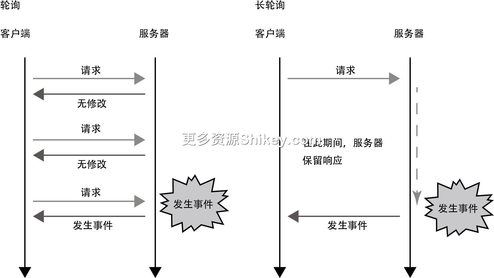
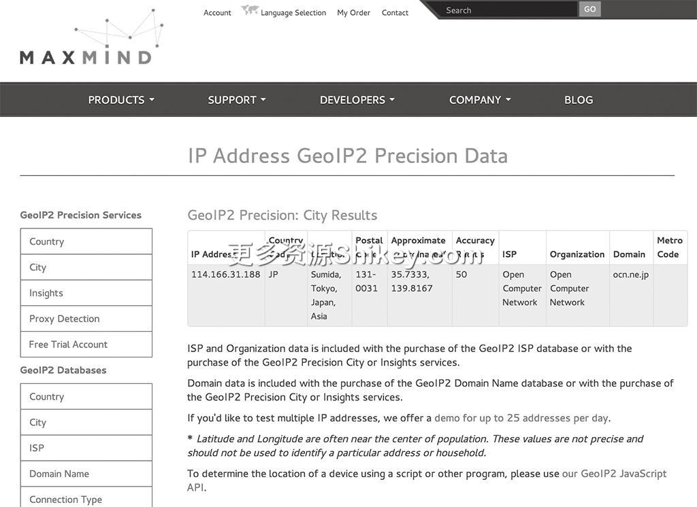

### 本资源由 itjc8.com 收集整理
# 第 5 章 HTTP/1.1 的语义：HTTP 的扩展功能(1)
进入 HTTP/1.1 时代后，互联网广泛普及，人们可以通过智能手机随时随地上网。家庭的网络环境也不断完善，多台计算机和多部智能手机能够同时通过路由器接入互联网。电视机和 Blu-Ray 播放器等家用电器也开始联网。HTTP
正朝着通用协议的方向发展。

关于 HTTP，笔者之前的同事 @sonots 曾这样说：

> “像 HTTP 负载均衡器这种面向 HTTP 的硬件和中间件已经有很多了。使用 Over HTTP 传输数据，就可以体会到这些硬件和中间件的好处。可以说 HTTP 已经成为基础设施了。”

本章将介绍 HTTP/1.1 之后扩展的协议和规范的各种应用示例，具体如下所示，既有浏览器和服务器之间的约定，也有面向通用应用程序的示例。

> - 下载文件（指定文件名）
> - 暂停和恢复下载（范围访问）
> - XMLHttpRequest
> - Geo-Location
> - X-Powered-By
> - 远程过程调用
> - WebDAV
> - 网站间共同的认证和授权平台

## 5.1　下载文件并保存到本地

浏览器根据服务器发来的 MIME 类型来处理文件。当用浏览器打开一个图像文件的链接时，如果 MIME 类型是 `image/png`，浏览器就会把该文件当成图像文件进行显示。如今，PDF
文件在默认情况下也会内嵌显示。如果是无法内嵌显示的 MIME 类型，浏览器则会下载文件。这是浏览器默认的操作。

浏览器会根据 `Content-Disposition` 首部的内容来改变动作。

### 5.1.1　保存文件的 Content-Disposition 首部

当服务器返回下面的首部时，浏览器会识别出这并不是用于显示的响应，而是用于下载文件并将其存储到本地的响应。有的浏览器会直接下载，有的浏览器会显示文件对话框。

```
Content-Disposition: attachment; filename=filename.xlsx
```

### 5.1.2　默认文件名使用中文

像下面这样，如果用 RFC 6266（以及 RFC 2231 和 RFC 5987）中定义的规则进行编码，就能在现代浏览器中使用 UTF-8 编码后的文件名，还可以处理中文文件名。MDN 中规定，如果没有 filename
属性，浏览器会显示文件名选择对话框，但在 Chrome 中，“下载”是一个设置项，不同的浏览器有不同的动作。

```
Content-Disposition: attachment; filename*=utf-8'' 文件名.xlsx; filename=filename.
xlsx
```

上面的代码中写了用 UTF-8 进行编码的名称和没有用 UTF-8 进行编码的名称，其中， `*=utf-8` 是遵循 RFC 5987 中记载的文件名的规则的名称，另一个是用于保证向后兼容的名称。

如果在 curl 命令中加上 `-J/--remote-header-name` 选项，就会使用 `Content-Disposition`
首部中设置的名称将文件保存到本地。不过，由于程序不会执行 URL 编码的解码操作，所以文件名中的 `%20` 等内容会直接输出。另外，如果存在同名文件，浏览器会以“附件
(2).xlsx”等名称保存文件，但在 curl 中会发生错误。在 `-0/--remote-name` 的情况下，curl 命令会直接按照 URL
名称保存文件。如果什么都没有添加，则不会保存文件，而是输出到控制台。

### 5.1.3　在浏览器中显示

如果使用下面的首部，浏览器就不会将文件保存到“下载”文件夹中，而是在浏览器中显式地进行内嵌显示，但我们并没有必要这么做。

```
Content-Disposition: inline
```

使用 `Content-Disposition` 首部下载文件的结构并不是为 HTTP 创建的，它原本是 RFC 1806 中定义的用于电子邮件附件的规范。HTTP/1.0 和早期的
HTTP/1.1（RFC 2068）中并未介绍该结构，在修订的 HTTP/1.1（RFC 2616）中，该结构才第一次被提及。虽然当时该结构没有在 HTTP 的 RFC 中标准化，但在一些浏览器中进行了实现。在 2011
年制定的 RFC 6266 中，该结构终于实现了标准化。

大家在下载文件的网站中可能见过下面这样的内容。

> 感谢下载。
>
> 如果下载未开始，请点击此处。

之所以会这样显示，是因为服务器提供了两个 URL：一个是实际下载文件的页面，在添加 `Content-Disposition` 首部后，下载文件可通过 `Body` 返回；另一个
URL 会返回 HTML 页面，其中包含感谢信息和下面的首部。

```
<meta http-equiv="refresh" content="0;URL=./download_file">
```

如果存在 `Content-Disposition` 首部，浏览器在显示页面时就不会重置页面的显示，而只是进行下载，这样就可以向用户显示下载完成页面。浏览器在显示该内容时会看到
`meta` 标签，于是会跳到标签指示的页面。由于跳转目标中存在 `Content-Disposition` 首部，所以浏览器会让指示跳转的页面保持显示状态并开始下载 1。

## 5.2　暂停和恢复下载

用于制作安装 Linux 所需的 CD/DVD 的镜像文件越大，下载时间就越长。时间越长，通信越不稳定，在下载过程中失败的概率就越高。在如今的宽带环境下，下载失败的情况少之又少。不过，从拨号连接时代就开始使用的 HTTP
提供了在下载暂停时恢复下载的方法。最初的规范定义在 RFC 2616 中，最新的规范定义在 RFC 7233 中。

所谓恢复下载，就是指定文件范围进行下载。服务器如果支持指定范围进行下载，就会在响应中加上 `Accept-Ranges` 首部。

```
Accept-Ranges: bytes
```

`Accept-Ranges` 首部的值有两种。

> `Accpet-Ranges:bytes`
>
> 允许指定范围下载。以字节为单位。
>
> `Accepte-Ranges:none`
>
> 不允许指定范围下载。

RFC 规范中允许使用字节之外的单位。可使用的单位登记在 IANA 的 HTTP Range Unit Registry 中，但目前只登记了 `bytes` 和 `none`
这两个。

另外，再次下载的对象文件如果中途发生改变，已经下载的文件片段就没有意义了，因此，我们需要检查文件是否发生了改变。对象文件的 `Etag` 首部也可以从服务器获取。

在发送请求时，将 `Range` 首部添加到请求中，以此来指定传输范围。

```
Range: bytes=1000-1999
```

指定的字节从 0 开始计算。另外，尾部也是下载对象。指定的传输范围为 `1000-1999`，这表示请求从第 1001 字节开始到第 2000 字节为止的 1000 字节的内容。如果是
`0-0`，就表示只请求开头的 1 字节的内容。这里也可以省略部分数值：如果是 `-999`，就表示获取前 1000 字节的内容；如果是
`2000-`，就表示获取从第 2001 字节起到最后的内容。

服务器会返回内容，不过与普通下载不同，内容中带有下面的状态码和响应首部。

```
HTTP/1.1 206 Partial Content
︙
Content-Length: 1000
Content-Ranges: 1000-1999/5000
```

`Content-Length` 首部中存储了实际发送的字节数。 `Content-Ranges` 是实际返回的范围。 `/`
后面存储的是总字节数。如果服务器本身也不知道具体范围，则 `Content-Ranges` 部分可设置为星号（ `*`）。除此之外，指定范围的 `GET`
访问与普通的 `GET` 访问无异。 `Content-Type` 也可以存储带有请求的文件的 MIME
类型。客户端通过把指定范围下载的文件与已经下载的数据片段进行连接，对文件进行还原。

当客户端指定的范围无效时，会收到服务器返回的如下响应。

```
HTTP/1.1 416 Range Not Satisfiable
︙
Content-Ranges: */5000
```

在内容被压缩的情况下，就会对压缩后的字节文件进行范围指定。根据该范围指定结构无法知道压缩前的文件大小和压缩方式，它是一个黑盒。

我们可以使用 `If-Range` 来执行带条件的 `GET`。在该首部中设置 `ETag`
或时间。对预先接收的内容与服务器的内容进行比较，如果符合条件（预先接收的内容与服务器的内容一致），服务器就会访问指定范围，返回响应。如果不符合条件，就代表服务器的内容被编辑了，这样一来，客户端本地下载的文件片段就无法使用了。在这种情况下，服务器就会把这个带条件的
`GET` 当作普通的 `GET` 访问，返回整个文件。

我们也可以在 curl 命令中使用 `--range`（缩写为 `-r`）选项来指定范围进行访问。

例如，以 1 MB 为单位下载文件，即使失败了，也可以从失败的地方开始重试，这可以通过 curl 命令实现，不过现在已经有一些专门的下载工具可以实现这一操作了。aria2 是通过命令行进行操作的。在发生错误时，aria2
会从失败的地方进行重试，不过这里使用的是 Range 访问。下面的请求表示的是在使用 aria2 下载的过程中，按 Ctrl + C 停止下载，然后使用同样的命令恢复下载时的日志。

```
GET /idea/ideaIC-2019.3.3.tar.gz HTTP/1.1
User-Agent: aria2/1.30.0
Accept: */*
Host: download-cf.jetbrains.com
Range: bytes=150241280-674600906
Want-Digest: SHA-512;q=1, SHA-256;q=1, SHA;q=0.1
```

### 5.2.1　指定多个范围进行下载

`Ranges` 首部也可以用来指定多个范围。在这种情况下，与 `multipart/form-data` 相似的 `multipart/byteranges`
会返回结果。响应示例引自 RFC 7233 的示例代码 2。在介绍响应之前，我们先来看一下引发响应的请求的示例代码。

```
Range: bytes=500-999,7000-7999
```

响应如下所示，与 `multipart/form-data` 基本相同。

```
HTTP/1.1 206 Partial Content
Date: Wed, 15 Nov 1995 06:25:24 GMT
Last-Modified: Wed, 15 Nov 1995 04:58:08 GMT
Content-Length: 1741
Content-Type: multipart/byteranges; boundary=THIS_STRING_SEPARATES

--THIS_STRING_SEPARATES
Content-Type: application/pdf
Content-Range: bytes 500-999/8000

（此处省略最开始指定的范围中的数据）
--THIS_STRING_SEPARATES
Content-Type: application/pdf
Content-Range: bytes 7000-7999/8000

（此处省略第 2 次指定的范围中的数据）
--THIS_STRING_SEPARATES--
```

`multipart/form-data` 用于在请求中包含许多数据， `multipart/byteranges` 用于在响应中包含许多数据片段。

### 5.2.2　并行下载

15 年前就出现了名为下载器的应用程序。当时的通信线路并不稳定，一到电话套餐 3
开始的时间，通信就会变得集中，经常出现连接不上服务器、通信中断等情况。如果使用下载器，我们就可以暂停或恢复下载，不会浪费之前的下载时间。

从那时开始，并行下载就成了下载器中最常见的功能之一。在服务器对各个会话限制带宽的情况下，我们可以通过划分区域实现并行访问，然后合并下载的数据片段来缩短整体的下载时间。如今仍有应用程序使用并行下载的功能。

不过，并行下载会加重服务器的负担，因此该功能不是很受欢迎。同时访问同一个网站的浏览器个数限制在 2~6
个。当中间线路达到瓶颈时，即使并行访问，速度也不会发生变化，还可能因拥挤而变得更加缓慢。如今，通过缓存静态文件来减轻服务器负担的 CDN
得到普及，集中下载时下载速度变慢的情况有所减少。虽然现在的视频文件较大，但只要读取一部分数据，视频就可以开始播放了，而无须等待整个文件下载完成。也就是说，与之前相比，下载需求减少了。在需要快速下载操作系统的镜像文件等较大的文件时，我们应该通过并行访问
BitTorrent 等多个节点来实现快速下载。

## 5.3　XMLHttpRequest

JavaScript 的 XMLHttpRequest 可以实现之前介绍的 curl 命令的功能。XMLHttpRequest 最初是 Microsoft 的 Internet Explorer 5 中的一个功能，后来
Firefox、Safari 和 Chrome 中也添加了该功能。现在该功能由 WHATWG 实现标准化，可供各种浏览器使用。

XMLHttpRequest 与前面介绍的 HTTP 通信一样，客户端向服务器发送请求，服务器向客户端返回数据作为响应。XMLHttpRequest 也可以发送首部、接收首部、控制缓存、发送 Cookie 和接收
Cookie，内容基本上没有发生变化。如果使用 `FormData` 类，还可以采用 `multipart/form-data`
形式发送文件。如果服务器发送过来重定向的状态码，客户端则向新的 URL 重新发送请求，XMLHttpRequest 在这一点上与 HTTP 通信一样。如果响应中带有 `Set-Cookie`
首部，则与普通的 Web 访问一样，在浏览器的 Cookie 存储库中登录 Cookie。

另外，XMLHttpRequest 也存在与 HTTP 一样的限制，即服务器不可以向客户端发送请求。当然，出于安全方面的考虑，有些功能也被限制使用。

```
var xhr = new XMLHttpRequest();
xhr.open("GET", "/json", true);
xhr.onload = function () {
    // 返回响应时调用的方法
    if (xhr.status === 200) {
        // 解析 JSON 并显示
        console.log(JSON.parse(xhr.responseText));
    }
};
xhr.setRequestHeader("MyHeader", "HeaderValue")
xhr.send();
```

笔者会在介绍 JavaScript 的 API 时讲解 XMLHttpRequest 的使用方法。

### 5.3.1　XMLHttpRequest 的诞生

说起现在的互联网，不得不提的一个组件就是 XMLHttpRequest 4，但它的诞生并不顺利。发布 XMLHttpRequest 的亚历克斯·霍普曼（Alex
Hopmann）在其博客中详细介绍了 XMLHttpRequest 的诞生过程，笔者在这里简单介绍一下。

当时，通过用于 Exchange 2000 服务器的 Outlook Web Access 功能，无须安装应用程序，在浏览器上就能使用电子邮件。该功能最开始的版本是在短时间内匆忙开发出来的，其结构是在服务器生成所有的
HTML，因此在性能和可扩展性方面存在问题。对此，当时 GM 为开发人员提供了两种方案：一种是生成 HTML 的方案；另一种是使用 DHTML5 的方案，具体来说就是使用
JavaScript 等来动态改变页面。第二种方案虽然让人眼前一亮，但通信部分仍使用 `POST` 表单，并未解决性能等问题。而就在那个周末，霍普曼做出了 XMLHttpRequest
的雏形。虽然该组件并没有提供异步支持，但对探讨 Outlook Web Access 功能来说已经足够了。

不过，这个组件在当时还未添加到浏览器中。当时的 Internet Explorer 可以通过安装 ActiveX 组件来扩展功能。虽然该组件也可以这样推出，但如此就不符合“只要有浏览器就可以从任何地方访问邮件”这一
Outlook Web Access 的基本要求了。因此，在最终测试版发布前的几周内，开发人员开始设法将这个组件搭载到 Internet Explorer 上。霍普曼将开发任务交给了肖恩·布雷斯韦尔（Shawn
Bracewell）。布雷斯韦尔改写了霍普曼原来编写的所有代码，开发出了质量可靠的组件，其中还加入了异步支持。

过去，Microsoft 公司也经常在发布的前几天推出重要功能，但这次来不及了。当时，霍普曼发现 Internet Explorer 中捆绑了用于 Windows 的 XML 处理库
MSXML，他与当时的项目组长联系，最终决定将该组件放入 MSXML 中发布。这个组件主要是用于 HTTP 通信的，与 XML 没有什么关系，不过，为了方便推广，就在其名称中加上了 XML。这就是
XMLHttpRequest 这一名称的由来。

之后，该组件接受了 Internet Explorer 团队的安全检查，但当时没人发现这个组件的脆弱程度，单纯认为该组件只有 Outlook Web Access 使用，即使有问题，也不过是少一个功能而已，于是将其搭载到了
Internet Explorer 5 的测试版中。布雷斯韦尔在 Internet Explorer 5 发布之前修改了许多漏洞，使该组件得以正常发布，在 Exchange 2000
发布时，市场上已经出现了许多可使用该组件的客户端。

在 XMLHttpRequest 出现之前，人们试图从服务器动态获取信息。具体来说就是使用 `iframe`，在不加载页面的情况下读取部分内容，然后通过 JavaScript 进行加载。缩小
`iframe`，使其显示不出来，就可以实现与 XMLHttpRequest 相似的功能。不过，该方法有不能获取结束码等缺点，所以渐渐没有人使用了。

### 5.3.2　XMLHttpRequest 与浏览器的 HTTP 请求的区别

使用 JavaScript 和 XMLHttpRequest 进行的处理与浏览器读取 HTML 并使用表单发送数据时的处理的不同点如下所示。

> - 在发送和接收数据时，HTML 的画面不会闪烁（重载）
> - 除 `GET` 方法和 `POST` 方法之外，可以使用其他方法发送数据
> - 在使用表单的情况下，只能发送键和值一一对应的数据，并通过浏览器显示响应，而使用 XMLHttpRequest 可以发送和接收纯文本、JSON、二进制数据和 XML 等各种形式
>
> - 存在一些安全限制（后面会进行介绍）

XMLHttpRequest 组件在 Web 2.0 运动中起到了核心作用。第 1 章和第 2 章中介绍过，浏览器使用 `GET` 方法和 `POST`
方法在首部和主体中存储数据，以此来发送和接收数据。不过，除了文件下载之外，在接收服务器的响应时，画面会被暂时清空，在浏览器中渲染新的页面 6。在使用
XMLHttpRequest 的情况下，由于 JavaScript 中已经完成了数据的发送和接收，所以我们可以在不清空画面的情况下从服务器获取最新信息。这种读取 Web 页面时不清空画面、错开时间多次进行更新的架构叫作
**Ajax**（Asynchronous JavaScript + XML），相信不少人听说过它。

### 5.3.3　Comet

无论是浏览器的 HTTP 请求，还是 XMLHttpRequest，都是客户端向服务器发送数据。假设要创建一个与其他用户进行沟通的聊天软件。当其他用户发送消息时，发送的消息只有立即显示在自己的画面上才能顺利沟通 7。有一种技术可以运用 XMLHttpRequest 实时进行双向通信，那就是 Comet。Comet
运用了最原始的结构，虽然性能不够好，但是可以在许多环境中使用。另外，笔者会在第 11 章介绍更高级的双向通信协议。

使用单向通信来实现双向通信的方法有两种：一种是 **轮询**（polling），另一种是长 **轮询**（long polling），如图 5-1 所示。



**图 5-1　轮询和长轮询**

轮询是接收通知的一方频繁询问是否存在通知的一种方式。在使用轮询的情况下，客户端会多次发送请求，所以在发送和接收消息时会消耗带宽和 CPU。如果客户端是移动终端，那么电量消耗也是一个问题。

Comet 使用了长轮询的方法 8。客户端会向服务器发送一次请求，但服务器并不会立即返回响应，而是将响应保留起来。在 HTTP
通信中，在是否结束通信的请求超时之前，客户端不会从服务器收到响应。Comet 利用服务器拥有结束连接的权限这一点，让服务器在任意时间点返回响应，将服务器伪装成发送请求的一方来发送信息。以前，Comet 也叫作反向 Ajax。


Comet 使用了原始的结构，因此它能在许多环境中使用。不过，Comet 也存在一些缺点。首先，HTTP 并不是从服务器向客户端发送消息的专用 API，它在发送消息时会包含 Cookie 和大量首部，因此，HTTP
与后面出现的结构相比，每次发送消息的开销比较大。另外，在服务器发送消息的情况下，如果客户端没有再次进行会话，就无法实现通信。Comet 不擅长应对服务器连续发送消息的情况。

使用第 4 章介绍的 Chunk 形式基于原始的 HTTP 创建的 Server-Sent Events 是一种响应性更好的通知结构。笔者将在第 11 章中介绍相关内容。

### 5.3.4　XMLHttpRequest 的安全性

与在本地执行的 curl 命令不同，出于安全方面的考虑，XMLHttpRequest 的使用存在一些限制。由于 XMLHttpRequest 的功能过于强大，所以 Web
页面中一旦注入恶意脚本，浏览器就会向认证的网站进行通信，这时数据就可能被篡改或者被盗取，还可能被发送到其他外部站点。因此，我们需要对 XMLHttpRequest 加以限制。

XMLHttpRequest 的安全性控制包含对访问信息的限制和发送限制这两种。

首先， **对访问信息的限制** 是指对 Cookie 加以限制。通过脚本访问 `document.cookie` 属性，就可以读取与在浏览器上打开的页面相关的所有
Cookie。如果因跨站脚本攻击而在 Web 页面中注入了任意脚本，那么通过 XMLHttpRequest，想要隐藏起来的登录会话的 Cookie 就可能流入其他站点。如果在 Cookie 中设置
`httpOnly` 属性，就无法通过脚本访问 Cookie，因此，即使注入任意的脚本，Cookie 泄露的风险也会降低 9。

**发送限制** 分为对域、方法和首部的限制这三种。首先，根据同源策略（same origin
policy），存在对能够发送请求的域的限制。如果浏览器能够通过脚本访问任意网站，就有可能将信息发送到恶意网站。为了防止该情况出现，浏览器默认只能访问正在访问的主机。在浏览器中广泛使用的跨域资源共享（CORS）这一访问控制结构可以用来访问其他网站。关于该结构，笔者将在第
14 章介绍。在使用 Google Chrome 的情况下，也不可以访问以 `file://` 开始的本地文件系统 10。

另一种发送限制是对可使用的方法的限制。如果指定 `CONNECT`、 `TRACE`、 `TRACK`（用于 IIS 的 `TRACE`
的别名），在调用 `open()` 方法时就会发送 `SecurityError` 异常。如果已经执行
`CONNECT`，那么在不小心打开恶意页面时，浏览器就会使用邮件服务器发送 SPAM 等。 `TRACE` 和 `TRACK`
是跨站跟踪（XST）的应对策略。

对首部的限制是指禁止使用影响当前协议规则或环境的首部、影响 Cookie 等的安全性的首部，以及浏览器不支持的内容等。所谓浏览器不支持的内容，是指无法将浏览器自身不支持的压缩格式指定给
`Accept-Encoding` 等。另外，为将来考虑，也要禁止使用以 `Sec-` 和 `Proxy-` 开始的键。

有时 Cookie 比 XMLHttpRequest 的限制更加严格。XMLHttpRequest 也和普通的浏览器访问一样，如果是同源，就发送接收到的
Cookie。例如，广告从业者为了了解用户的行为模式而收集各种网站的访问历史，此时向访问过的站点之外的其他站点发送 Cookie（第三方 Cookie）就会受到限制。在这种情况下，如果将
`withCredentials` 标志设为 `true`，就能确保请求顺利通过 CORS 访问控制，但也会向其他的源发送 Cookie。

虽然 Google Analytics 不是广告，但它使用 XMLHttpRequest 实现了类似于 Cookie 的结构。虽然在嵌入站点方面 Google Analytics 比 iframe
广告烦琐，需要注入脚本标签等，但它通过组合使用第一方 Cookie 和 XMLHttpRequest，突破了各种限制。

## 5.4　Geo-Location

近年来，使用进行通信的客户端的物理位置的服务不断增加。测定客户端物理位置的方法有两种：一种是客户端自己测定位置信息并发送给服务；另一种是由服务器推测客户端的位置。

### 5.4.1　客户端获取位置的方法

现在的浏览器都会提供 Geolocation API。以智能手机为例，其内置的 GPS 和基站信息可以用来返回位置信息。即使是不带 GPS 的计算机，也可以通过 Wi-Fi
推测客户端的大致位置，然后返回经纬度信息。位置信息与个人隐私直接相关，因此，使用时必须得到用户的许可。这样一来，除地图应用程序等用户有意授权的服务之外，其他服务很难使用位置信息。

另外，Wi-Fi 本身并不带有 GPS。Wi-Fi 定位采用的方法较为复杂且规模庞大 11。首先要创建 Wi-Fi 访问点的唯一
ID（BSSID）和包含经纬度信息的数据库。客户端利用操作系统的 API，获取自己当前可访问的访问点的 BSSID，然后询问服务器，获取经纬度信息。

BSSID 与人们从智能手机或计算机中选择 Wi-Fi 时所查看的名称（即 SSID，准确来说是 ESSID）不同。BSSID 是一个长度为 48 位的 Wi-Fi 设备标识符，每个硬件终端有唯一的数值。它相当于 MAC
地址。

根据 Wi-Fi 的访问点进行定位的技术最初由 Skyhook Wireless 实现了商业化。Skyhook Wireless 令人驱车前往各处，构建了一个存储有可访问的访问点的信息和位置信息的数据库。没有 GPS 的
iPod touch 中内嵌的就是这种结构。

之后，使用智能手机自动收集位置信息成为主流。由于智能手机本身可以测定经纬度，还可以使用 Wi-Fi，所以不用开车前往各处，智能手机也能收集信息。这种方法叫作众包 12（crowd sourcing）。众包在 2008 年左右作为 W3C Geolocation API 实现了标准化。Google 提供了 Google Maps 的
API，Microsoft 提供了 Microsoft Location Service。

在自动收集位置信息之后，通过 SSID 或 MAC 地址便可以推测出住址，这对个人隐私来说有很大的威胁。因此在 2006 年左右出现了许多关于自动收集信息和个人隐私的论文 13。

### 5.4.2　服务器推测客户端位置的方法

另一种方法叫作 GeoIP，该方法是通过 IP 地址来推测客户端位置的。IP 地址在不同地区有不同的注册机构，这些注册机构将 IP
地址分配给企业或服务提供商等。那么，是不是询问注册机构就可以知道客户端位置了呢？其实，这些注册机构管理的位置信息并没有那么准确。至于哪个服务提供商将哪个地址设置为哪个地区、企业如何给各个分公司分配地址等，注册机构并未进行管理。GeoIP
与 Geolocation 一样，也提供根据收集的数据返回位置信息的服务。

- MaxMind
- ip2location
- ipligence
- Doco Doco JP

MaxMind 依据知识共享许可协议（creative commons license）提供一部分数据，它经常用在获取位置信息的开源系统中。Apache 和 Nginx 中的模块会根据访问的地区来决定是否拒绝访问。Doco
Doco JP 是专门面向日本的服务。另外，虽然 Google 并未提供通过 IP 地址搜索位置的功能，但它提供了报告 IP 地址使用场所的表单，当我们使用 Google Maps
搜索当前位置时，如果没有其他可用的信息，Google 就会根据 IP 地址来显示大概位置。

图 5-2 是笔者在 MaxMind 网站上搜索自己家的 IP 地址的结果。笔者住在东京西北部的板桥区，但结果显示的是东部的墨田区，差了约 20 km。像这样，如果 IP
地址的数据库出现错误，定位结果就完全不同。MaxMind 的日本城市数据库的误差为 66%，虽然粒度不同，但专门面向日本的 Doco Doco JP，其都道府县级别的误差为
93%，这些数据在它们各自的网站上都能找到。这些网站也公开了可供用户自己申请修改信息的表单。



**图 5-2　MaxMind 的搜索结果**

GeoIP 虽然在准确性方面比不上误差在 10 m 以内的 GPS，但服务提供者可以在不经过用户许可的情况下获取位置信息。不过，对客户端来说，如果不使用代理，就无法隐藏位置信息。

GeoIP 还可以通过访问日志来分析哪些地区的用户比较多，从而可以按照地区来提供不同的广告，或者推送与当地天气相符的广告。

一些网站已经开始使用 GeoIP。当从日本访问美国 Amazon 时，网站会显示跳转到日本 Amazon 的提示。如果从与平时不同的地区访问，Google 的 Web
服务就会弹出安全警告，切断会话，提醒再次登录，以此来防止非法访问，保护用户。对于视频内容和游戏，不同国家有不同的代理商，视频网站会查看用户国籍，进行内容过滤。