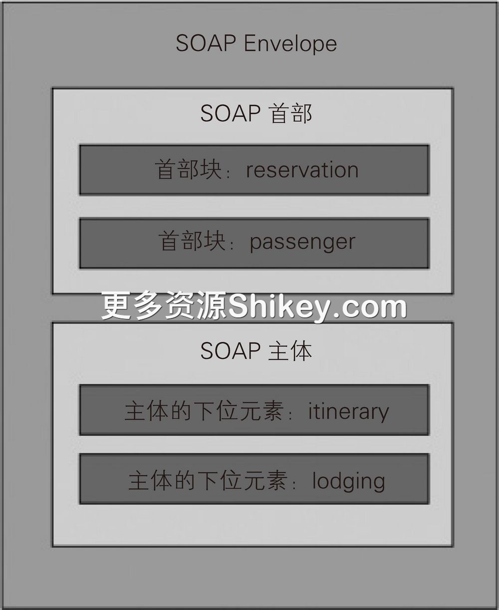
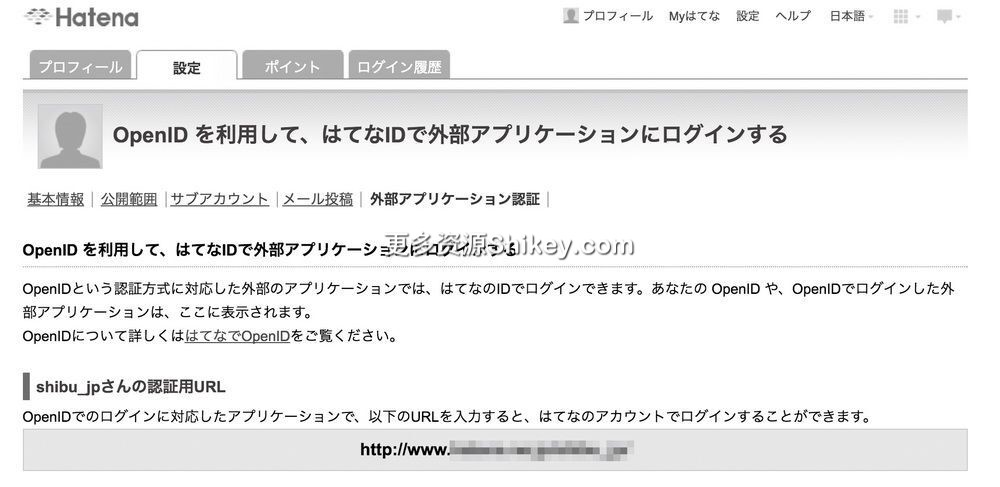
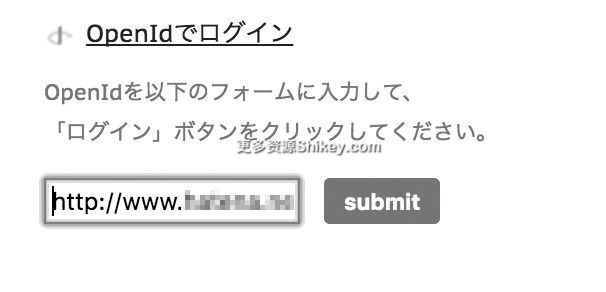
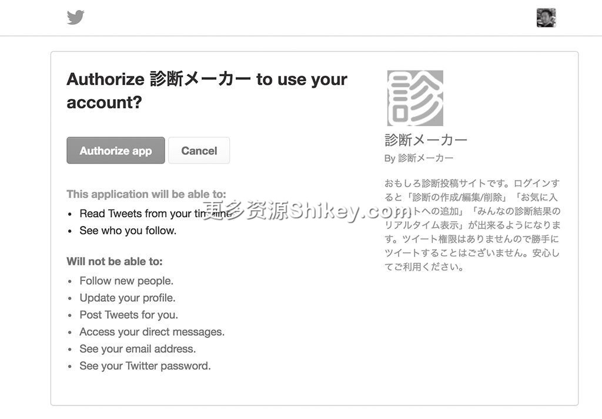
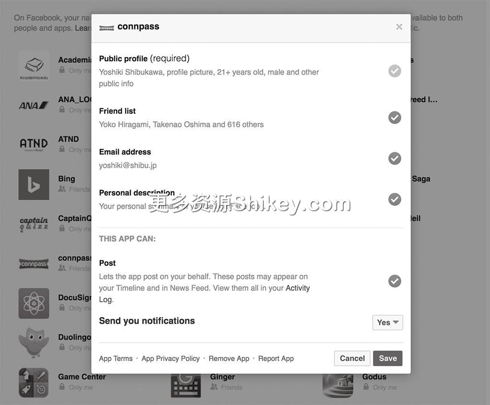

### 本资源由 itjc8.com 收集整理
# 第 5 章 HTTP/1.1 的语义：HTTP 的扩展功能(2)
## 5.5　X-Powered-By 首部

服务器向浏览器返回的响应中包含 `X-Powered-By` 首部。从带有 `X-` 这一点来看，它不是 RFC
规范中的首部。许多服务器用该首部返回系统名称，它也因此成为事实标准。这或许是受到了电子邮件应用程序用 X-Mail 来表明应用程序名称的影响吧。

日本在 2007 年左右曾掀起一场是否应该隐藏 `X-Powered-By` 首部的讨论。隐藏该首部的优点是响应内容变少、服务器名称引发安全漏洞的概率变小等。即使服务器本身没有安全漏洞，通过只支持
Windows 2000 的 IIS 5.0，Windows 的脆弱性也会暴露出来，服务的脆弱性也会因此显露无疑。奥一穗曾在博客中提到隐藏 `X-Powered-By` 首部的优点是，Firefox
的源代码会根据 `X-Powered-By` 首部改变客户端的动作，具体如代码清单 5-1 所示。

**代码清单 5-1　根据 X-Powered-By 改变客户端动作的 Firefox 源代码**

```
// the list of servers known to do bad things with pipelined requests
static const char *bad_servers[] = {
    "Microsoft-IIS/4.",
    "Microsoft-IIS/5.",
    "Netscape-Enterprise/3.",
    nsnull
};

for (const char **server = bad_servers; *server; ++server) {
    if (PL_strcasestr(val, *server) != nsnull) {
        LOG(("looks like this server does not support pipelining"));
        return PR_FALSE;
    }
}
```

上面的代码是判断是否支持管道技术的逻辑。虽然管道技术在 HTTP/1.1 中实现了标准化，但是有的服务器或者代理并未提供支持。因此，为了确认服务器是否支持管道技术，Mozilla 浏览器会确认服务器返回的
`X-Powered-By`。

如今的源代码中也存在类似的代码，但浏览器查看的并不是 `X-Powered-By`，而是在 RFC 1945 的 HTTP/1.0 中标准化的 `Server` 首部 14。Microsoft 的 IIS 5.0 已经使用了 `Server` 首部，再加上 Netscape Enterprise 最后一次更新是在
2002 年，已经没有什么人使用这个系统了，因此也不存在兼容性的问题。

RFC 1945 中还记载了服务器在显示该首部时存在安全方面的问题，规定 `X-Powered-By` 首部中不可以包含除服务器名称之外的信息，建议服务器开发人员将首部设置为可切换为显示或不显示的形式。对
HTTP/1.1 进行整理而重新定义的 RFC 7231 中追加记载了可以将该首部用于回避兼容性问题。

进行了大幅修改的 HTTP/2 及其前身 SPDY 中加入了协议协商功能，引入了在 HTTP/1.1 那一层对整个协议进行切换的方法。

今后还需要根据 `Server` 首部进行验证吗？笔者认为不需要。TLS 1.3 在 2017
年进行了最后的调整，其中，确认相互连接性这一项列在计划之中。另外，将缓存等结构设计为在客户端和服务器都不支持时可以忽略。HTTP 越来越重要，相关利益者不断增多，决策越来越慎重（从 HTTP/1.0 到 HTTP/1.1
用了 3 年，然后由此到 2014 年 HTTP/1.1 更新，中间用了 7 年），因此容易推翻的规范很难添加到 HTTP 中。

类似的还有 `Via` 首部。如代码清单 5-2 所示，该首部会添加一些信息，如代理服务器的名称和版本、通信内容的解释方式等。现在 TLS 成为标准，在通信时不可以改写内容，因此
`Via` 首部也就没有用武之地了。

**代码清单 5-2　HTTP 代理服务器 Varnish 的响应首部**

```
Via: 1.1 varnish (Varnish/5.2)
```

## 5.6　远程过程调用

**过程** 表示各种语言提供的函数、类方法（静态方法）等，也称为子程序。这一术语在最近的编程语言中已经不常用了。虽然根据编程语言的不同，有的过程存在返回值，有的没有返回值，但过程都是“罗列一连串处理的处理块”。


**远程过程调用**（Remote Procedure
Call，RPC）是指可以像调用自己的计算机中的功能一样来调用其他计算机中的功能，然后根据需要接收返回值。它也叫作 **远程方法调用**（Remote Method Invocation，RMI）。


RPC 的历史可以追溯到 20 世纪 80 年代。RPC 存在各种方式，随着互联网的普及，出现了一些以 HTTP 为基础的 RPC。

### 5.6.1　XML-RPC

最初实现标准化的是 XML-RPC。UserLand Software 和 Microsoft 于 1998 年开发了 XML-RPC。虽然 XML-RPC 本身并没有标准化，但有的 RFC（RFC 3529）是以
XML-RPC 为基础的。

在创建 XML-RPC 时，HTTP/1.1 已经存在，但规范的请求示例中使用的还是 HTTP/1.0。由于需要显式记述 `Content-Length`，所以 XML-RPC 不支持 HTTP/1.1
中的 Chunk 形式，最终 XML-RPC 是在简单协议的基础上构建的。发送请求使用的是 `POST` 方法，调用的参数和返回值使用 XML 格式表示，因此
`Content-Type` 一直为 `text/xml`。由于请求内容可能会被缓存，所以 `GET` 并不适合用于 RPC 通信。

如下所示为从 XML-RPC 规范页面引用的请求的示例代码（省略了 `Date` 首部和 `Server` 首部等）。

```
POST /RPC2 HTTP/1.0
Host: betty.userland.com
Content-Type: text/xml
Content-length: 181

<?xml version="1.0"?>
<methodCall>
    <methodName>examples.getStateName</methodName>
    <params>
        <param>
            <value><i4>41</i4></value>
        </param>
    </params>
</methodCall>
```

这里使用的路径是 `/RPC2`，其实我们可以指定任意路径作为入口点。 `<methodCall>`
标签是根标签，通过文本指定服务器上的方法名称。 `<params>` 标签用来指定参数。响应也基本上与此相同。

```
HTTP/1.1 200 OK
Connection: close
Content-Length: 158
Content-Type: text/xml

<?xml version="1.0"?>
<methodResponse>
    <params>
        <param>
            <value><string>South Dakota</string></value>
        </param>
    </params>
</methodResponse>
```

即使存在一些错误，公开 XML-RPC 的服务器返回的状态码也大多为 `200 OK`。

> 　一些应用程序服务器的开发者主张只返回
> `200 OK`。这是因为在与前端的反向代理或者 Apache 等系统连接错误的情况下，应用程序会将状态码设为 `200 OK`，并在 XML
> 中返回错误，以此来区分是设置问题导致请求未送达应用程序服务器，还是服务器代码出现了错误 15。XML-RPC 也是基于相同的思想进行设计的。

XML-RPC 的参数中可以使用以下类型（表 5-1）。

**表 5-1　XML-RPC 的参数中可以使用的类型**

标签名称

类型

`<i4>,<int>`

整数

`<boolean>`

布尔型

`<string>`

字符串类型

`<double>`

浮点型

`<dateTime.iso8601>`

日期类型

`<base64>`

采用 Base64 编码的二进制

`<struct>`

结构体

`<array>`

数组

XML-RPC 是 RPC，通信内容又是纯文本，因此开发者无须使用特殊工具就可以查看。Python 的标准库为 XML-RPC 服务器和客户端的创建提供了支持，不过本书使用的 Go 语言并没有该功能。

### 5.6.2　SOAP

**SOAP**（Simple Object Access Protocol，简单对象访问协议）是对 XML-RPC 的扩展。现在我们经常能听到微服务的相关话题，其实大约在 15 年前 SOAP
就已经引起了人们的关注，在面向服务架构中发挥着重要作用。

现在 SOAP 这个名称已经不被认为是什么的缩写，而由于当初是 Simple Object Access Protocol 的缩写，与 LDAP（L 表示
Lightweight，是“轻量”的意思）一样，名称与实际情况有很大不同，非常有意思。SOAP 是由 W3C 标准化的。W3C 的网站在 2000 年就登载了 HTTP/1.1 的规范。那时 Java 的 J2EE
兴起，整个行业开始以 Web 应用程序为导向。2007 年更新的版本 1.2 是 SOAP 的最新版本。SOAP 消息的结构如图 5-3 所示。



**图 5-3　SOAP 消息的结构**

SOAP 也比单纯作为 RPC 的 XML-RPC 要复杂。SOAP 本身是数据表示格式，SOAP 规范中还定义了使用 SOAP 的 RPC——SOAP-RPC。HTTP 中持有迷你 HTTP 结构。这样一来，我们也可以使用除
HTTP 之外的邮件传输协议（SMTP）来发送和接收 SOAP 消息。在首部中记述请求的方法和事务信息，在 Envelope 中存储数据。

从使用很多 XML 命名空间这一点来看，SOAP 也比 XML-RPC 复杂。SOAP 重视可移植性，比如支持 SMTP 等，因此设置了与 HTTP 具有相同功能的层，这也提高了其自身的复杂度。SOAP 规范是朝着配置
Schema 等的方向进行定义的。另外，与 SOAP 紧密关联的 WSDL（Web Services Description Language，网络服务描述语言）可以用于记述哪个 Web 服务器的哪个路径会接收什么样的
SOAP 消息、返回什么样的 SOAP 消息响应。这是 HTTP 接口本身的定义。

使用 C# 的 Windows Communication Framework 或者 Java 的 JAX-WS、Apache Axis 等结构，可以从源代码中的注解自动生成 WSDL。使用生成的 WSDL
来生成代码，还可以生成在客户端使用服务的桩代码（stub）。不过，除了 Microsoft 和 IBM 这种调动大量资源来支持生命周期的开发环境，其他开发环境都需要手动创建 WSDL。本书中并未介绍 WSDL
的示例。大家在网上搜索一下就会知道手动创建 WSDL 非常麻烦。另外，客户端的代码生成器也因编程语言的不同而时有时无。

> 　许多开发者认为 SOAP 和 WSDL
> 用起来很麻烦，原因主要有两个，其中一个就是 XML Schema。在记述数据结构时，我们需要用 XML 记述数据的规范。这时需要准备大量的 Schema 文件，或者记述根据需要转换 Schema 的 XSLT（它也是
> XML）。

还有一个问题就是 SOAP 和 WSDL 只是宏大蓝图的一部分。它们都以业务流程执行语言 BPEL 和注册服务 UDDI 为前提。即使只是单纯执行 RPC，也需要面对这些大型框架和大量的 XML。

### 5.6.3　JSON-RPC

**JSON-RPC** 是使用 JSON 代替 XML-RPC 的 XML 的远程过程调用。JSON-RPC 在 2006 年进行了第一次更新，在 2009 年发布了版本 2.0
的规范。JSON-RPC 的方针是要比 SOAP 更简单。该 RPC 与 XML-RPC 相同，二者的规范都不是由 IETF 或 W3C 发布的，而是记述在自己的官网中。JSON-RPC 在制定规范时也考虑到了使用 HTTP
以外的 TCP/IP 套接字等的情况。使用了 HTTP 的 RPC 在非 JSON-RPC 的网站上进行了标准化。虽说 JSON-RPC 很简单，但它也提供了一些与 XML-RPC 不同的功能。

我们先来看一下基本响应。

```
POST /jsonrpc HTTP/1.1
Host: api.××××.com
Content-Type: application/json
Content-Length: 94
Accept: application/json

{"jsonrpc": "2.0",
 "method": "subtract",
 "params": {"subtrahend": 23, "minuend": 42},
 "id": 3}

HTTP/1.1 200 OK
Content-Type: application/json
Content-Length: 41

{"jsonrpc": "2.0", "result": 19, "id": 3}
```

由于使用的是 JSON，所以写起来比 XML 简洁。在请求时需要用到 `Content-Type`、 `Content-Length` 和
`Accept`。在大多数情况下，最好使用 `POST` 方法。不过，在调用幂等且安全的方法时，也可以使用 `GET`
方法。在各个消息中， `"jsonrpc":"2.0"` 用来指定版本。 `id` 是处理请求和响应的 ID，可以是数值，也可以是字符串。 `method`
中记述的是字符串形式的方法名， `params` 中记述的是参数。参数可以是数组或者对象，也可以省略。输入时使用的 `id` 和数值本身会存储在
`result` 中返回。在发生错误的情况下，信息会存储在 `error` 成员中。

如果省略 `id`，服务器就不返回响应。这就是 Notification 模式。

```
HTTP/1.1 200 OK
Content-Type: application/json
Content-Length: 85

{"jsonrpc": "2.0",
 "method": "subtract",
 "params": {"subtrahend": 23, "minuend": 42}}

HTTP/1.1 204 No Response
```

在这种情况下，响应中不包含任何内容。XML-RPC 的状态码总为 `200 OK`，而 JSON-RPC 还有其他一些状态码。

> `200 OK`
>
> 正常结束。
>
> `204 No Response/202 Accepted`
>
> Notification 模式下的返回值。
>
> `307 Temporary Redirect/308 Permanent Redirect`
>
> 重定向（不会自动重新发送）。
>
> `405 Method Not Allowed`
>
> 在服务器不支持 `GET` 方法的情况下使用了 `GET` 方法。
>
> `415 Unsupported Media Type`
>
> `Content-Type` 不是 `application/json`。

Batch 模式是其他方法的调用规范。在 Batch 模式下，请求的多个 JSON 对象会汇总到数组中进行发送，在一次 HTTP 请求中会进行多个过程调用。在这种情况下，响应也会通过数组返回。

## 5.7　WebDAV

虽然 HTTP/1.1 中并不包含 WebDAV，但由于 WebDAV 是在 HTTP/1.1 那个时代创建的，许多环境也对其提供了支持，所以笔者在这里介绍一下。

通过对 HTTP 进行扩展，WebDAV 可用作分布式文件系统。WebDAV 由 Microsoft 开发，1999 年在 RFC 2518 中实现标准化。RFC 4918 对 WebDAV 进行了更新，RFC
3253（版本管理）、RFC 3744（访问控制）中也对 WebDAV 进行了定义。如果只是使用 WebDAV，则可以通过 Windows 的 Explorer（添加了网络位置）、macOS 的
Finder（连接服务器）、Linux 系列操作系统中的 GNOME 和 KDE 的标准文件管理器 Nautilus 和 Konqueror 等连接到 WebDAV。另外，RFC 4791 中还添加了
CalDAV。CalDAV 对 WebDAV 进行了进一步的扩展，可同步日历和 ToDo。

我们来整理一下 WebDAV 的相关术语。

> **资源（resource）**
>
> 在普通的文件系统中，存储数据的元素叫作文件，而在 WebDAV 中则叫作资源。
>
> **集合（collection）**
>
> 该元素相当于文件夹或者目录。
>
> **属性（property）**
>
> 资源和集合可以持有的追加的属性。创建时间、修改时间和最终修改者等信息属于属性。
>
> **锁（lock）**
>
> 在分布式文件系统中，多个人可以同时查看同一个文件，共享数据，也可以同时编辑同一个文件。如果多个人同时编辑同一个文件，除最后发送的内容之外，其他修改的内容会全部消失。为了防止此类情况发生，该结构只允许最先声明的人修改文件。

虽然可以直接使用 HTTP/1.1
的创建（ `POST`）、读取（ `GET`）、刷新（ `PUT`）和删除（ `DELETE`）等方法，但对于文件系统来说，仅有这些功能还不够，于是
WebDAV 还添加了其他方法。

首先添加了 `COPY` 和 `MOVE`。只要在 `GET` 后进行 `POST`（在使用 `MOVE`
的情况下，后面为 `DELETE`），这两个方法就都可以进行模拟，但在视频素材的大小为 10 GB
的情况下，如果把所有内容先保存到本地，再进行上传，效率就会非常低。远程进行移动或删除，并通知结果的做法比较高效。由于 `POST` 方法只可以创建资源，所以 WebDAV 中添加了创建集合的
`MKCOL` 方法。集合中的所有元素是通过属性获取的，所以使用 `PROPFIND` 方法。 `LOCK/UNLOCK` 方法用来控制文件的锁。

现在，人们经常使用 Dropbox、Box、Google Drive 和 OneDrive 等在线存储服务。WebDAV 与这些服务的不同之处在于，它以同步类型为前提。如果没有网络，则 WebDAV
根本无法获取文件。另外，Dropbox 等在本地持有备份，可以根据需要进行同步。WebDAV 与本地文件系统相比，性能还是低一点。如果采用后期进行同步的形式，则 WebDAV
在速度上并不逊色。另外，在存储受限的移动终端上，WebDAV 提供了能够同步访问文件的应用程序，可以按需获取文件。

## 5.8　网站间共用的认证和授权平台

随着互联网的普及，各种各样的 Web 服务应运而生。针对不同的 Web 服务，用户可以分别输入邮箱地址、用户 ID 和密码来创建账户。如果存在 100 种服务，就需要 100 个用户 ID
和密码，那将非常烦琐，因此，相应的简化工作正在跨组织地进行。

现在，1Password 和 KeePass 等密码管理工具得到广泛使用，人们开始对不同的服务设置不同的密码。人的记忆力有限，如果不使用工具，很多人就会对不同的服务使用相同的密码。如果一个 Web
服务遭到攻击，而该服务恰巧使用明文保存密码，那么其他网站就可能会因此而遭到入侵。这种攻击方式叫作列表攻击。即使网站系统没有漏洞也会遭到攻击，而且看不出与正常用户有什么差别，因此很难防御。

为每个服务创建用户 ID 和密码会让用户有心理负担。即使用户出于兴趣下载应用程序并访问网站，也可能会因感到麻烦而选择放弃，这容易造成用户流失。

于是，利用了外部服务提供的认证基础设施的结构应运而生。构建管理用户 ID 和密码的基础系统需要花费大量的时间和精力，比如为用户设置密保问题提供支持等 16。另外，兼顾安全性和便利性的需求日益增多，比如需要实现多因素身份验证、准备用于还原复杂密码的工作流、加入虚拟用户的机制等。还要考虑平台遭到攻击时的情况，在信息泄露时对用户进行赔偿。如果不进行平台的运营管理，并且不需要在公司内部对用户
ID 和密码进行管理，就可以从这种繁重的工作中脱身，专心开发服务，安全风险也会降低。

本节将简单介绍以下内容。

> - 单点登录
> - Kerberos 认证
> - SAML
> - OpenID
> - OpenSocial
> - OAuth
> - OpenID Connect

关于加强认证的结构，我们会在第 14 章进行介绍，这里先来确认一下重点术语。

> **认证**
>
> 确认要登录的用户是谁。确认操作浏览器的人是否是服务中注册的用户 ID 的持有者。
>
> **授权**
>
> 在知道认证的用户是谁后，决定对该用户赋予多大的权限。
>
> **联合登录（社交登录）**
>
> 使用其他服务管理的 ID 进行登录。

本节的目标是介绍各个规范“是什么”“能做什么”“不能做什么”。

想必读者大多会借助 OAuth 2.0 或者 OpenID Connect 来实现这些技术，不过在实现这些技术时，我们也有必要好好了解一下它们。幸运的是，在 OpenID Foundation 的网站上可以查看 RFC
等，也有相关的图书出版。即使有现成的库和示例代码，笔者也建议大家看一下规范的内容。

### 5.8.1　单点登录

如果企业内部使用的 Web 服务和系统不断增加，就需要考虑实现 **单点登录**（Single Sign
On，SSO）了。单点登录并非分开管理各个系统的账户，在实现单点登录的情况下，用户只要登录一次，就可以访问所有的系统。现在，单点登录仍广泛应用于企业内部。

单点登录与后面介绍的技术不同，不存在协议和既定的规则。单点登录也并不局限于 Web，它的实现方法有许多种。

各个服务各自访问认证服务器的方法最简单易懂。由于需要在各个服务中输入用户 ID 和密码，所以虽然不是单点登录，但是实现了用户 ID
的统一管理。认证系统的登录操作由应用程序代替执行。除此之外，还存在使用后面将介绍的票证（ticket）的方法。

还有一些方法可以用来实现单点登录，比如设置 HTTP 代理，由代理执行认证；加入代替执行认证的代理人，在登录时访问中央服务器，确认是否已经登录等。不过，这些方法仅限于 Web 服务。

### 5.8.2　Kerberos 认证

还有一个方法可以用来实现单点登录，那就是将最初的用户管理结构汇总为一个，供所有系统使用。该方法早于互联网出现。企业内部大多使用 RFC 2251 中定义的 LDAP（Lightweight Directory Acess
Protocol，轻量级目录访问协议）作为共同规范，其实现包括 OpenLDAP 和 Active Directory 等。LDAP
不是用于实现单点登录的结构，而是用于对用户、组织和服务器等企业内部信息进行统一管理的数据库。LDAP 与 v3 中添加的名为 SASL（Simple Authentication and Security
Layer，简单身份验证和安全层）的认证功能一起构成了企业内部的 Mater 认证体系。RFC 1510（最新的是 RFC 4120）中定义的 Kerberos 认证得到了广泛使用。

在使用 Kerberos 认证的情况下，我们可以获取票证授予服务器（TG）的访问令牌—— TGT（Ticket-Granting-Ticket），以及会话密钥（session key）。在使用服务或系统时，向票证授予服务器发送
TGT 和会话密钥，就可以获得客户端访问服务器所需的票证和会话密钥。票证和会话密钥通过服务持有的私人密钥进行加密。用户在使用服务时，通过向服务器发送这些票证和会话密钥来实现单点登录。

### 5.8.3　SAML

近年来，许多公司的内部系统以 Web 服务的形式实现。 **SAML**（Security Assertion Markup Language，安全断言标记语言）是以 Web
技术（HTTP/SOAP）为前提的单点登录结构。Onelogin 等 SaaS 也提供单点登录服务。SAML 是由 OASIS（Organization for the Advancement of Structured
Information Standards，结构化信息标准促进组织）制定的规范 17。遵循使用 Cookie 来管理会话的 Web
结构，能够实现跨域服务的单点登录。采用支持 SAML 的单点登录进行查询，可以发现许多 SaaS 的 Web 服务。这些 Web 服务可以与外部域中的 Google 的 G Suite、Cybozu 的
Kintone、Microsoft 的 Office 365、在线存储的 Dropbox 和 Box 等服务协作。

用于在服务间交换信息的元数据也是通用的。我们先来整理一下“出场角色”。

> **用户**
>
> 操作浏览器的人。
>
> **身份提供商（IdP）**
>
> 管理 ID 的服务。
>
> **服务提供商（SP）**
>
> 需要登录的服务。

实现方法有以下 6 种。

> - SAML SOAP 绑定
> - 反 SOAP（PAOS）绑定
> - HTTP 重定向绑定
> - HTTP POST 绑定
> - HTTP Artifact 绑定
> - SAML URI 绑定

本节将介绍 HTTP POST 绑定的实现。首先向身份提供商注册服务信息。注册时需要使用名为元数据的 XML 文件。虽然这里并不引用 XML 文件 18，但是其中包含以下几项。

> - 服务 ID（帮助身份提供商识别服务）
> - 身份提供商执行 `HTTP-POST` 的目标的端点 URL
> - 绑定（ `urn:oasis:names:tc:SAML:2.0:bindings:HTTP-POST` 等）
> - 在某些情况下公开密钥是 X.509 格式的

服务提供商也会注册身份提供商的信息。身份提供商会提供 XML 文件，其中包含在一系列的通信中使用的端点 URL 和证书。这一连串的流程之间形成信赖关系是通信的前提。

实际的通信比较简单。我们假设用户想使用服务而进行了访问。如果是尚未登录的状态，服务提供商会利用第 2 章介绍的方法，使用 HTTP 的 `POST` 重定向到身份提供商。在进行 HTTP
重定向绑定时会使用 `302` 状态码。

用户的浏览器中会显示身份提供商的画面。如果登录成功，身份提供商就会将登录信息 `POST` 给服务提供商。这时会自动返回执行 `POST` 的
HTML。服务提供商知道用户成功登录后，会返回用户最开始请求的页面内容。

SAML 比较有趣的一点是，在事先交换证书的情况下，只要通过浏览器进行重定向即可，身份提供商与服务提供商之间不用直接进行通信。即使认证服务器只能在公司内部网络中通过 VPN 使用，也可以利用基于 SAML
的私有认证服务器实现互联网上的服务认证。虽然后面介绍的 OpenID 和 OpenID Connect 正在成为事实标准，但在提供面向企业的 SaaS 服务时也依然会使用 SAML。

### 5.8.4　OpenID

**OpenID** 是一种能够使用已经注册的 Web 服务的用户信息来登录其他服务的结构，它不会集中对 ID 进行管理。OpenID 版本 1.0 和 2.0 的规范分别在 2005 年和 2007
年制定，但现在使用其后续的 OpenID Connect 的网站在不断增多，使用 OpenID 的服务在不断减少 19。下面笔者来介绍一下 OpenID 中特有的几个名称。


> **OpenID 提供商**
>
> OpenID 提供商指持有用户信息的 Web 服务。用户已经拥有该服务的 ID。现在，Yahoo! JAPAN 和 Hatena 已经对该 Web 服务提供了支持。
>
> **依赖方**
>
> 依赖方指用户想要使用的 Web 服务。
>
> **用户输入标识符**
>
> 用户输入标识符是 OpenID 提供商提供的各用户的 URL 形式的字符串。用户输入标识符会显示在 OpenID 提供商的用户资料页面等中。有时也会使用服务名称级别的标识符。

拥有 Yahoo! JAPAN 账户或者 Hatena 账户的用户可以通过该认证信息来登录其他网站。用户的操作步骤如下所示。这里介绍的是 OpenID 2.0 的步骤。

> 1. 首先，在 OpenID 提供商的网站中获取用户输入标识符（图 5-4）。
>
>    
>
>    **图 5-4　获取用户输入标识符 20**
>
> 2. 在浏览器中打开依赖方的网站，在登录页面选择 OpenID 登录。在依赖方的 OpenID 输入栏中输入 OpenID 的用户输入标识符（图 5-5）。
>
>    
>
>    **图 5-5　在 OpenID 输入栏中输入**
>
> 3. 重定向到 OpenID 提供商的网站，此时需要确认是否允许，点击表示允许的选项即可。
>
> 4. 返回依赖方的网站，这样就可以使用依赖方的服务了。如果需要额外的信息，则会显示输入信息的画面。

依赖方将用户输入的用户输入标识符传递给 OpenID 提供商后只会得到结果。依赖方不会接触用户保存在 OpenID 提供商那里的用户 ID 和密码。

在第 2 步和第 3 步之间，依赖方会使用 HTTP 与 OpenID 提供商交换信息，共享私人密钥。另外，在从依赖方跳转到 OpenID 提供商，或者从 OpenID 提供商跳转到依赖方时，会使用第 1 章中介绍的 HTTP
重定向。

OpenID 的作用是表明要使用依赖方的用户已经在其他服务中得到认证。有的 OpenID 提供商会向依赖方传递 ID 等追加信息。

另外，向依赖方发送的专用的 OpenID 标识符每次都会发生变化。我们可以在 OpenID 提供商的页面中查看已认证的依赖方，也可以在该页面中取消认证。

### 5.8.5　OpenSocial

为了对抗发展迅猛的 Facebook，进入 SNS 领域较晚的 Google 和紧追 Facebook 的 MySpace 联手，开发出了 OpenSocial 这一社交网络通用 API。OpenSocial 发布于 2007
年，现在被移交给 W3C 管理，W3C 正在制定将其作为社交网络协议的相关规范。现在我们已经无法查看 OpenSocail 原本的规范文档了。关于这方面的信息，可以参考北村英志和田中洋一郎的《利用 OpenSocial
创建插件！》21 一文和北村英志的幻灯片等。

除了认证，OpenSocial 还有很多功能，比如获取会员信息或朋友关系信息的 Person & Friend API、创建 Activity 的 Activities API、保存和共享信息的 Persistence
API、向其他成员发送消息的 requestSendMessage 等。OpenSocial 的目标没有停留在认证方面，而是朝着平台的方向发展。

OpenSocial 在日本掀起了一股热潮。当时，在日本号称用户数量最多的 mixi 开始允许第三方开发者发布应用程序。另外，在 iPhone 发布之前，日本的移动互联网市场已经兴起，面向功能手机的游戏平台 Mobage
Town、GREE 等已经开始使用 OpenSocial，吸引了一大批用户。之后，DMM 公司的游戏平台也使用了 OpenSocial（表 5-2）。

**表 5-2　社交平台与 API 化**

年代

事件

国家

2007 年 10 月

Google 发布 OpenSocial

美国

2008 年 1 月

Facebook 发布 Facebook API

美国

2009 年 5 月

NTT Resonant 升级“goo 首页”，支持 OpenSocial 插件

日本

2009 年 8 月

mixi 推出“mixi 应用程序”

日本

2010 年 1 月

DeNA 在 Mobage Town 推出 Mobage API

日本

2010 年 6 月

GREE 推出 GREE Platform

日本

2012 年 1 月

DMM 推出 DMM GAMES

日本

在 OpenID 依赖方的情况下，服务端基本没有限制，在 OpenID 提供商和依赖方之间也不需要事先进行登录。在 OpenSocial 的情况下，社交网络服务的提供者相当于 OpenID
提供商。认证和授权都在这里执行。相当于依赖方的第三方应用程序的服务器在 SNS 外部，UI 部分被称为插件，按照事先确定的规则创建 XML 文件，使用 JavaScript 和 AJAX 操作获取朋友列表等的各种
API，以此开发应用程序。与 OpenID 相比，各个内容之间的联系更加紧密了。

从 HTTP 的层面来看，如果只是登录使用了 OpenSocial 的社交网络服务，浏览器就没有使用特殊的功能。虽然会使用 HTML 的 iframe 来访问第三方应用程序，但该插件服务器支持从浏览器使用 JavaScript
的 AJAX API，以及跨域请求外部服务器的资源等。

插件提供者和平台提供者之间的通信就是本书介绍的 HTTP 本身。插件的 XML 设置文件位于外部服务器，插件服务器通过 HTTP 获取。客户端浏览器的请求被插件服务器中继，然后使用 HTTP
发送给外部服务器。外部服务器在获取用户信息时，需要使用 HTTP 来访问 RESTful API。

### 5.8.6　OAuth

OAuth 是用于授权的结构，现在仍被广泛使用。相信很多人见过图 5-6 这样的页面。2006 年末，OAuth 开始被讨论，2008 年的 RFC 5849 中定义了 OAuth 1.0，2012 年的 RFC 6749 和
RFC 6750 中定义了最新版的 OAuth 2.0。后来，RFC 8628 中又增加了新流程。像这样，OAuth 不断更新，仍在扩展。目前，人们正在整合这些更新的地方，向着版本 2.1 的方向努力。本节将介绍一下版本
2.0 的相关内容。



**图 5-6　OAuth 的确认页面**

前面介绍的都是判断用户是谁的认证流程，而 OAuth 是专门用于授权的结构。关于认证与授权的不同之处，笔者在前面已经进行了讲解，不过用于授权的结构还是第一次讲到。开发 OAuth
的契机原本就是“没有用于授权（权限转让）的开放的结构”，所以 OAuth 的开发没有可以借鉴的东西。

> **授权服务器**
>
> OpenID 中的 OpenID 提供商。用户持有该授权服务器的账号。
>
> **资源服务器**
>
> 用户在允许的权限内能够自由访问的对象。在 Twitter 和 Facebook 中，与授权服务器相同。
>
> **客户端**
>
> OpenID 中的依赖方，也就是用户今后会使用的服务和应用程序。与 OpenID 不同，OAuth 需要在授权服务器中注册应用程序的信息，获取专门的 ID（ `client_id` 和
> `client_secret`），该 ID 也叫凭证（credencial）。

OpenID 和 OAuth 的页面跳转方式相似。当用户要使用新的 Web 服务时，页面就会跳转到持有账户的服务（Twitter 或者 Facebook）的网站。如果用户点击确认按钮，就会跳转到最开始打开的 Web
服务页面，然后用户就可以使用服务了。客户端接触不到用户 ID 和密码，在这一点上，OpenID 和 OAuth 也是一样的（不过存在例外情况）。

虽然页面跳转方式相似，不过与认证相比，授权的影响范围更广。比如，为了支付电费和煤气费而保存信用卡卡号，这就是 OAuth 所做的事情。比如，在使用 OpenID 的情况下，用户要使用的 Web 服务会询问信用卡公司 Bob
是不是其用户，然后得到“是”或“否”的回答，而在使用 OAuth 的情况下，网站最后会得到 Bob 的信用卡卡号，网站可以请求该卡的可用额度。

上面提到的信用卡的示例稍微有些极端，实际上，外部 Web 服务（客户端）可以做什么是由作用域（scope）决定的。OAuth 与 OpenID 一样，之后也可以在授权服务器的设置页面取消授权，或者修改允许的作用域（图
5-7）。



**图 5-7　确认 OAuth 的作用域**

最新的 OAuth 提供了 3 种流程，OAuth 也可以用于 Web 服务之外的领域。

> **Authorization Code**
>
> Authorization Code 是最常用的流程。也存在 PKCE 这一追加了确认流程的模式。
>
> **Client Credentials Grant**
>
> Client Credentials Grant 是无须用户同意，仅使用 `client_id` 和 `client_secret`
> 就可以进行访问的流程。由于仅进行使用了 `client_secret` 的客户端认证，所以该流程可用于服务器间的通信等不涉及用户操作的通信中。该流程可以在能够将服务器站点等的
> `client_secret` 对外隐匿的环境中使用。
>
> **Device Code Grant**
>
> 这是新增加的流程，适用于没有用于输入密码的键盘等嵌入式设备的情况。

Password Grant 和 Implicit Flow 现在已不推荐使用。

**PKCE**

在 Authorization Code 中，服务器通过重定向返回“代码”，客户端会交换该代码和访问码。不过，在移动应用程序中，其他应用程序可能会拦截重定向。为了防止这种情况发生，RFC 7636 中添加了
**PKCE**（Proof Key for Code Exchange）。

客户端会提出计算问题。计算问题包含 3
个元素，分别是计算的输入值（ `code_verifier`）、计算方法（ `code_challenge_method`）和计算结果（ `code_challenge`）。很多人可能觉得计算结果用
`code_verifier` 这个名称更容易理解，但因为最终验证时发送的数据是计算的输入值，所以计算结果用了该名称。

首先，客户端生成计算问题。客户端在请求时发送计算的类型和答案，服务器负责保存它们。在收到代码后，客户端将计算的输入值也放在获取令牌的请求中一起发送。这时服务器会收到问题、计算方法及答案。服务器自身也会进行同样的计算，如果结果相同，就可以确认发送获取令牌请求的客户端就是最初发送请求的客户端。


即使代码被拦截，由于没有客户端之前发送的问题信息，所以在交换代码时，服务器也无法返回正确的问题。这样一来，即使恶意程序拦截了代码，也无法获取令牌，于是就保证了安全。

另外，现在在 IANA 注册的计算方法只有 `S256` 这一 SHA256 的散列计算。

**认证流程的区分使用**

3 种流程如下区分使用。

> 1. 当客户端是资源拥有者的服务器，或者不是人们操作的浏览器时，使用 Client Credentials Grant。
> 2. 如果是应用程序在服务器上执行的 Web 应用程序，则使用 Authorization Code。
> 3. 当客户端是单页面应用程序或本地应用程序时，使用带 PKCE 的 Authorization Code。
> 4. 在无键盘设备的情况下使用 Device Code Grant。

### 5.8.7　OpenIDConnect

OpenID Connect 在 OAuth 2.0 的基础上进行了扩展，除授权之外，还可以用于认证。OpenID Connect 于 2014 年 2
月发布。由于它既可以用于认证，又可以用于授权，而且不难实现，所以今后肯定会成为事实标准。如今，Google、Yahoo! JAPAN 和 mixi 等服务都在作为 OpenID Connect 提供商提供服务。

从客户端来看，OpenID Connect 与 OAuth 2.0 的不同之处在于，访问用户资料的方法实现了标准化。由此，任何一个服务都可以采用同一个方法向 OpenID 提供商请求用户 ID 等信息，并进行认证。OpenID
Connect 会发行与普通访问令牌不同的 ID 令牌，用户可以使用这个 ID 令牌访问服务。从用户的角度来看，OpenID Connect 的流程和 OpenID、OAuth 的流程是一样的。

为了获取访问令牌和 ID 令牌，OpenID Connect 中定义了 2 个端点和 3 个流程。

> **授权端点**
>
> 授权端点是客户端发送授权请求的服务窗口。在进行客户端认证的流程中，授权端点会返回用来访问令牌端点的密钥（授权码）。在非认证流程中，授权端点会返回访问令牌和 ID 令牌。
>
> **令牌端点**
>
> 令牌端点是返回访问令牌和 ID 令牌的窗口。令牌端点通过认证客户端来返回权限较高的令牌。

3 个流程如下所示。

> **Authorization Code Flow**
>
> 它与 OAuth 的 Authorization Code 相同。该流程面向能够隐匿 `client_secret`
> 的服务器环境。客户端在访问授权端点获取代码之后，访问令牌端点获取令牌。由于可以使用客户端认证，所以能授予最高权限。
>
> **Implicit Flow**
>
> 它与 OAuth 的 Implicit Grant 相同。该流程面向 HTML 上的 JavaScript 等无法隐匿 `client_secret`
> 的客户端环境。访问授权端点，同时获取授权和令牌。
>
> **Hybrid Flow**
>
> 虽然它与 Implicit Flow 相似，但使用授权端点能够获得通信所需的令牌，以及获取额外信息所需的授权码。该授权码还可以用来访问令牌端点。

在 OAuth 2.0 中，使用 Implicit Grant 进行用户认证被形容为“连汽车都能通过的安全漏洞”22。OpenID Connect
对此进行了改善，以能够使用散列码对各种令牌进行验证。

Hybrid Flow 与 OAuth 2.0 的差异最大。OAuth 的目标是提供下面三者之间的工作流。

> - 用户
> - 客户端
> - 授权服务器

随着移动应用程序的普及，客户端又分为两种，于是就需要以下四者之间的工作流。

> - 用户
> - 客户端 1：智能手机终端上的应用程序
> - 客户端 2：后台的 Web 服务
> - 授权服务器

在 Hybrid Flow 中，由客户端 1 使用 Implicit Flow 面向无法隐匿 `client_secret` 的环境进行授权之后，由客户端 2
执行客户端认证，并向令牌端点发送请求，由此能够获得权限更加稳固的令牌。

### 5.8.8　JWT

认证令牌用来证明“已认证”的事实，JWT（JSON Web Token）是用于认证令牌的一种解决方案，它基于 JSON，通过添加签名来防止篡改。JWT 定义在 RFC 7519 中。

JWT 是将 3 个 Base64 编码的字符串用“.”拼接而成的字符串。这 3 个 Base64 编码的字符串分别是头部、负载（payload）和签名。头部中存储有签名的形式等。负载中存储有已登录的用户的信息。

读取程序先根据头部中记载的签名算法来验证签名。我们可以将证书的公开密钥或隐私分发给解析 JWT 的各个服务器进行验证，也可以将令牌发送给发行 JWT 的服务来验证。

JWT 中包含“已登录”的实际信息和已登录的用户的详细信息。在验证成功的情况下，只要是负载中的信息，无须再与认证服务确认，就可以获取用户信息。这就是 JWT 令牌的方便之处。

负载中包含如表 5-3 所示的声明，我们也可以向负载中添加应用程序特有的声明。

**表 5-3　声明类型**

声明

说明

`iss`

令牌发行者（认证服务）的标识符

`sub`

已认证的用户的标识符

`aud`

令牌接收者（服务提供商）的标识符

`exp`

令牌的有效期限

`iat`

令牌的发行日期

`jti`

各令牌的标识符

需要注意的是，JWT 本身就包含所需的信息，不进行无效判断，所以使用时可能容易大意。应用程序在使用时如果不确认签名，或者不确认有效期限，或者不判断发行者的服务是否与自己的应用程序一样，就会产生安全漏洞。

除此之外，JWT 中一个常见的话题就是退出处理。在 JWT 的情况下，只要有客户端发送的信息就可以完成退出。因此，要想在服务器端禁用令牌，需要花费一些时间。我们可以缩短令牌本身的寿命，重新获取（刷新）令牌，也可以将退出的
JWT 中包含的 ID（ `jti` 声明的内容）保存到数据库中，将其作为无效令牌。

除 JWT 之外，还存在传统的随机字符串。它不会在客户端增加多余的信息，也不会造成无效判断的错误。

> **CBOR**
>
> JSON 是 Web 世界中常用的数据交换格式，不过该格式存在数据冗余的情况，所以人们多次挑战使用二进制来表示。MongoDB 中使用的 BSON，以及 Fluentd 中使用的 MessagePack
> 就是二进制格式。
>
> 其中，将来可能会受到关注的是在 RFC 7049 中标准化的 CBOR。与 JSON 一样，CBOR 的加密、签名、类似 JWT 的 CWT（CBOR Web Tokent）等也实现了 RFC
> 化。一些网络规范中已将其作为序列化格式使用。

### 5.8.9　实际服务对认证系统提供支持时的陷阱

现在，与认证相关的中间件、服务和库等有很多，不过即使说明上写着“支持 OAuth 2.0”，我们也并不清楚它是作为客户端支持，还是作为服务器支持（图 5-8）。


**图 5-8　认证系统**

例如，KeyCloak 和 Auth0 等 ID 管理系统写着支持 OpenID Connect 和 SAML。这些 ID 管理系统拥有服务器功能，在客户端和认证服务之间可以使用 OpenID Connect 或 SAML
进行通信。它们拥有自己的用户 ID 数据库，还支持外部登录、ID 和密码登录。另外，它们还支持使用外部服务的联合登录 23，能够与外部服务进行通信，拥有客户端的功能。如果一个认证系统存在多个客户端，就属于单点登录。

## 5.9　本章小结

本章介绍了 HTTP/1.1 之后增加的各种 HTTP 语义。使用浏览器的用户迅速增多，文件下载等日常使用的功能实现了标准化；暂停和恢复下载的功能有助于降低传输量，提高稳定程度；AJAX 通信所必需的
XMLHttpRequest 使得浏览器的显示能力提高，让服务的重心从桌面转移到了网络上。

在 HTTP/1.1 中，HTTP 的应用范围也进一步扩展，已经不仅限于在浏览器中使用了，以服务器、桌面和移动应用程序的通信为前提的功能也在不断增多。远程过程调用、WebDAV 和 Facebook 等都需要与 Web
服务进行协作。另外，服务间的协作变得频繁，认证和授权的结构也得到完善。即使不针对各个服务创建 ID 和密码，也可以正常使用服务。另外，在不传递 ID 和密码的情况下也能够访问其他服务的资源的结构也普及开来。

针对实现不够成熟的服务器，为了防止处理停止，客户端还可以查看 `X-Powered-By` 首部以调整处理。另外，为了提高安全性和便利性，用于推测位置的 Geo-IP 等也被开发了出来。

上一章介绍的 HTTP/1.1 的语法并没有停留在方法、首部、状态码、主体等简单的结构上，为了提高效率，底层也进行了各种修改。本章的内容难度稍高，但语法上是 HTTP/1.0 的延续，并没有跳出 4 个基本元素的范畴。