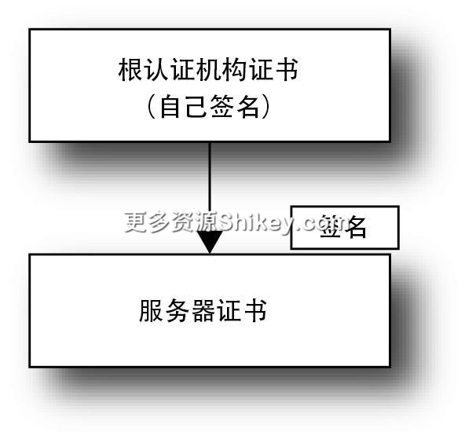

### 本资源由 itjc8.com 收集整理
# 第 6 章 使用 Go 语言实现 HTTP/1.1 客户端
本章我们将使用 Go 语言来实现第 4 章和第 5 章介绍的一些功能。使用 Go 语言的目的是向读者展示创建向 API 服务器发送请求的客户端的方法。另外，笔者也希望读者能通过代码加深对知识的理解。即使一些功能不会用于 API
客户端，我们也能通过再次阅读第 4 章和第 5
章的内容来进一步理解。笔者在学习软件方面的论文和难度较高的算法时，都会一并阅读代码，或者使用自己擅长的语言再次进行实现，以此来巩固知识。理解得不透彻，就无法编写代码，通过实际编写代码，能够确认自己的理解是否正确。

第 3 章仅介绍了向用于测试的服务器发送请求的客户端代码，而在 HTTP/1.1
中，即使从客户端的角度来看语义（通信内容及含义）没有发生变化，很多时候语法（通信协议）也发生了变化。为了能在一些项目中实际连接客户端来确认运行情况，笔者先来介绍一下服务器的代码。

## 6.1　Keep-Alive

即使不对 Go 语言的 HTTP API 进行任何设置，Keep-Alive 也是默认有效的。在通信正常结束后，会话仍会继续。不过，文档中明确记载了客户端必须在读取完 `response.Body`
后将其关闭。由于这是将套接字管道按时间分割来共享的结构，所以如果不声明主体已经读取完毕，程序就无法判断何时开始下一个任务，也就无法重复使用套接字。如果之前的 HTTP
访问失败， `response.Body()` 中会存储 `nil`；而在访问成功的情况下，即使是 `Content-Length:0`
这种主体为空的情况， `io.Reader` 的主体也一定会保存到 `response.Body()` 中。因此，在未发生错误时，有必要像代码清单 6-1 那样读取完毕。

本章介绍的示例代码都是 HTTP 下层的详细的控制代码，所以我们无法使用，但只要是普通的 HTTP 客户端，就完全可以使用第 3 章介绍的代码。 `defer` 是函数结束时调用的后处理。

**代码清单 6-1　将服务器响应读取完毕**

```
resp, err := http.Get("http://...")
if err != nil {
    // 发生错误
    panic(err)
}
// 跳出后关闭
defer resp.Body.Close()
// 使用 ioutil.ReadAll 将服务器响应读取完毕
body, err := ioutil.ReadAll(resp.Body)
```

## 6.2　TLS

在使用 Go 语言的情况下，如代码清单 6-2 所示，将 URL 变为 `https://`，即可实现使用标准库的 TLS 通信。Go 语言的标准库使用的不是 `openssl`
之类的库，而是采用模型编写的代码。

**代码清单 6-2　在使用 Go 语言的情况下，仅修改指定的 URL 即可支持 TLS**

```
resp, err := client.Get("https://××××.com")
```

本节将介绍如何自己创建证书，并对服务器进行设置，以进行 TLS 通信。

### 6.2.1　创建证书

默认使用系统持有的证书来确认证书。为了能在测试环境中使用，我们也可以使用自己创建的证书 1。

创建单个证书的基本流程如下所示。

> - 使用 OpenSSL 命令创建私人密钥文件
> - 创建证书签名请求文件
> - 在证书签名请求文件中签名，完成证书的创建

在一般情况下，前两步由需要证书的人来完成，签名则由认证机构有偿完成。这次我们只是试着创建一下证书，所以签名也由自己进行。笔者在第 4
章中介绍过，自己签名的证书可以用来隐藏通信线路，但这种做法无法保证服务器的身份。在各个计算机中安装证书时，我们可以手动告诉计算机该证书值得信赖。

这里要创建的证书如图 6-1 所示。



**图 6-1　证书的结构**

首先，复制 `openssl.cnf` 文件并修改设置。由于有些项目无法仅通过命令行进行设置，所以需要编辑设置文件。 `openssl.cnf` 文件的原型在
`/etc/local/openssl/openssl.cnf`、 `/etc/ssl/openssl.cnf` 和
`C:\OpenSSL\bin\openssl.cnf` 中（代码清单 6-3）。我们在末尾加上创建认证机构、服务器和客户端这 3 种证书所需的设置。

**代码清单 6-3　设置文件的原型**

```
[CA]
basicConstraints=critical,CA:TRUE,pathlen:0
keyUsage=digitalSignature,keyCertSign,cRLSign

[Server]
basicConstraints=CA:FALSE
keyUsage=digitalSignature,dataEncipherment
extendedKeyUsage=serverAuth

[Client]
basicConstraints=CA:FALSE
keyUsage=digitalSignature,dataEncipherment
extendedKeyUsage=clientAuth
```

代码清单 6-4 中预先设置了一些被频繁询问的项目。

**代码清单 6-4　预先设置一些被频繁询问的项目**

```
[req_distinguished_name]
# 默认的国家代码
-countryName_default         = JP
# 默认的县/ 州
stateOrProvinceName_default = Tokyo
# 默认的城市名称
localityName_default        = Itabashi
# 默认的组织名称
0.organizationName_default  = ××××.com
# 默认的管理员的邮箱地址
emailAddress_default        = webmaster@××××.com
```

在 Erlang 的 `ssl` 模块等环境中，如果注册的证书中的 `basicConstraints` 不是
`CA:TRUE`，环境就不会运行。另外，有些实现还引用了 `keyUsage`。我们需要通过设置文件来指定这些内容。OpenSSL
的设置是由各种节（section）组成的，因为并不是所有的节都要用到，所以我们可以使用 `-extensions` 选项来指定需要的节，以此来切换设置。

首先，按照以下步骤来创建自己签名的根认证机构证书。以下内容操作一次即可。

```
# 创建 2048 位的 RSA 私人密钥文件
$ openssl genrsa -out ca.key 2048

# 创建证书签名请求（CSR）文件
$ openssl req -new -sha256 -key ca.key -out ca.csr -config openssl.cnf

# 使用自己的私人密钥签名，创建证书
$ openssl x509 -in ca.csr -days 365 -req -signkey ca.key -sha256 -out ca.crt
-extfile ./openssl.cnf -extensions CA
```

除 RSA 之外，椭圆曲线加密算法中的 ECDSA 等算法也支持私人密钥，但椭圆曲线加密算法很少用于证书，RSA 2048 位是目前的事实标准。另外，虽然有办法用一个命令来创建私人密钥文件和证书签名请求文件，如 AWS IAM
等，但有的环境不接收使用该方法创建的证书，因此，本书中会分开创建私人密钥文件和证书签名请求文件。

在创建证书签名请求文件时，需要用到所在地信息（国家、城市名称）和组织信息（组织名称、部门名称、组织的常用名称和
URL）等。这些信息会写入证书中，以供用户确认证书的持有者。另外， `Challenge password` 是废除证书时使用的密码，自己签名的证书不需要该密码，不过有的认证机构需要用到该密码。

另外，下面的命令用来确认各个项目中创建的文件。

```
# 确认私人密钥文件
$ openssl rsa -in ca.key -text

# 确认证书签名请求（CSR）文件
$ openssl req -in ca.csr -text

# 确认证书文件
$ openssl x509 -in ca.crt -text
```

接下来，我们按照以下步骤创建服务器的证书。有多少台服务器就执行多少次操作。前面将组织名称等设为了 `Common Name`，这里可以使用 FQDN（Fully Qualified Domain
Name，完全合格域名）。

```
# 创建 2048 位的 RSA 私人密钥文件
$ openssl genrsa -out server.key 2048

# 创建证书签名请求（CSR）文件
$ openssl req -new -nodes -sha256 -key server.key -out server.csr -config openssl.
cnf

# 使用自己的私人密钥签名，创建证书
$ openssl x509 -req -days 365 -in server.csr -sha256 -out server.crt -CA ca.crt
-CAkey ca.key -CAcreateserial -extfile ./openssl.cnf -extensions Server
```

与认证机构不同，在服务器的证书中，在 `Common Name` 中需要准确输入主机名，否则客户端就会认为连接的是其他服务器，从而切断连接。这就是域名认证。这里请输入
`localhost`。证书无法共用，因此我们要给每个服务器创建一个证书。

与创建根认证机构证书时不同，这里的第 2 行代码设置了 `-nodes`。如果不这样设置，每次启动服务器时都要提供密码。还有一处不同是， `-CA`
之后的设置内容用来传递认证机构使用的私人密钥和证书，以及设置 `-CAcreateserial` 选项。另外， `-extensions` 用来读取服务器的设置内容。

这样我们就完成了所有的准备工作。生成的文件名如表 6-1 所示。

**表 6-1　文件名一览表**

文件

用于 CA

用于服务器

私人密钥

ca.key

server.key

证书签名请求

ca.csr

server.csr

证书

ca.crt

server.crt

实际上，服务器使用的是私人密钥文件和证书文件。在证书创建完成之后，证书签名请求文件就没有用了。

### 6.2.2　HTTPS 服务器和注册证书

为了测试 HTTPS 连接，我们准备一个 HTTPS 服务器，如代码清单 6-5 所示。

**代码清单 6-5　用于测试的 HTTPS 服务器**

```
package main

import (
    "fmt"
    "log"
    "net/http"
    "net/http/httputil"
)

func handler(w http.ResponseWriter, r *http.Request) {
    dump, err := httputil.DumpRequest(r, true)
    if err != nil {
        http.Error(w, fmt.Sprint(err), http.StatusInternalServerError)
        return
    }
    fmt.Println(string(dump))
    fmt.Fprintf(w, "<html><body>hello</body></html>\n")
}

func main() {
    http.HandleFunc("/", handler)
    log.Println("start http listening :18443")
    err := http.ListenAndServeTLS(":18443", "server.crt", "server.key", nil)
    log.Println(err)
}
```

代码与 HTTP 的代码几乎没有差别，只是最后的 `ListenAndServe` 改为了 `ListenAndServeTLS`
函数。该函数的参数接收前面创建的证书文件和私人密钥文件的文件名。

我们来运行一下代码。

```
$ curl https://localhost:18443

curl: (60) SSL certificate problem: unable to get local issuer certificate
```

这里发生了错误，原因是 curl 命令无法找到证书。为了让其找到证书，可以仅使用 curl 来解决，或者将证书注册到操作系统中。最简单的方法是将前面创建的认证机构的证书作为 命令行参数进行传递，具体如下所示。

```
$ curl --cacert ca.crt https://localhost:18443
```

在使用 curl 命令查看的证书列表中添加前面创建的证书也能解决上述问题。只要注册一次，就无须通过选项指定证书了。根据 curl 命令的编译方法的不同，处理方法也有所不同。我们来查看一下版本信息。

```
$ curl --version
curl 7.43.0 (x86_64-apple-darwin15.0) libcurl/7.43.0 SecureTransport zlib/1.2.5
︙
```

`libcurl` 后面是实现 TLS 时使用的库名。

> `OpenSSL`
>
> OpenSSL（可移植库）。
>
> `Schannel`
>
> Windows 安全管理系统。
>
> `SecureTransport`
>
> macOS 安全管理系统。
>
> `NSS`
>
> 一些 Linux 发行版中使用的安全管理系统。

在使用 `Schannel` 和 `SecureTransport` 时，可以使用系统提供的功能来注册证书：Windows 中可以使用控制面板的网络选项，macOS
中可以使用名为钥匙串访问（keychain access）的应用程序。在使用 `NSS` 的情况下，可以使用命令行工具 `p11-kit-nss-trust` 来注册证书。

另外， `OpenSSL` 会将证书添加到默认使用的证书 bundle 文件中。执行下面的命令即可查看搜索目录。

```
$ openssl version -d
OPENSSLDIR: "/opt/local/etc/openssl"
```

在使用 macOS 的情况下，可以通过在 `cert.pem` 文件的末尾添加前面创建的认证机构的证书 `ca.crt` 的内容来访问。在使用 Linux（Ubuntu
16.04）的情况下，要将 `ca.crt` 复制到搜索目录中的 `certs` 目录中。不过，在 Node.js 和 Python 的 `requests`
包等环境中，由于自己持有根证书列表，所以无法使用该方法。由于这些环境也会读取证书文件等，所以可以通过自己将证书添加列表中来应对。curl 的网站上提供了原始的证书 bundle 文件。

除此之外，也可以使用 `--insecure/-k` 选项 2，不对主机进行确认，仅对 HTTPS 的通信线路进行加密。这是最后的手段。

### 6.2.3　使用 Go 语言实现客户端

使用 Go 语言实现客户端的代码非常简单，如代码清单 6-6 所示。

**代码清单 6-6　使用 Go 语言实现客户端**

```
package main

import (
    "log"
    "net/http"
    "net/http/httputil"
)

func main() {
    resp, err := http.Get("https://localhost:18443")
    if err != nil {
        panic(err)
    }
    defer resp.Body.Close()
    dump, err := httputil.DumpResponse(resp, true)
    if err != nil {
        panic(err)
    }
    log.Println(string(dump))
}
```

这里使用的 API 与前面的代码相同，只是将 URL 改为了 `https://` 而已。该代码能够运行吗？由于 Go
语言默认使用系统中注册的根证书，所以如果按上一节介绍的方法将证书注册到操作系统中，代码就可以正常运行，否则就不会运行。

代码清单 6-7 的代码直接通过应用程序来处理未注册到系统中的证书，并进行 HTTPS 通信。

**代码清单 6-7　使用未注册到系统中的证书进行通信**

```
package main

import (
    "crypto/tls"
    "crypto/x509"
    "io/ioutil"
    "log"
    "net/http"
    "net/http/httputil"
)

func main() {
    // 读取证书
    cert, err := ioutil.ReadFile("ca.crt")
    if err != nil {
        panic(err)
    }
    certPool := x509.NewCertPool()
    certPool.AppendCertsFromPEM(cert)
    tlsConfig := &tls.Config{
        RootCAs: certPool,
    }
    tlsConfig.BuildNameToCertificate()

    // 创建客户端
    client := &http.Client{
        Transport: &http.Transport{
            TLSClientConfig: tlsConfig,
        },
    }

    // 进行通信
    resp, err := client.Get("https://localhost:18443")
    if err != nil {
        panic(err)
    }
    defer resp.Body.Close()
    dump, err := httputil.DumpResponse(resp, true)
    if err != nil {
        panic(err)
    }
    log.Println(string(dump))
}
```

这里出现了两个不太常见的术语，笔者来介绍一下。 `x509` 是 ISO 制定的证书格式。 `PEM` 是对采用 Base64
编码的二进制数据添加页眉和页脚的数据结构。用视频和声音文件方面的术语来讲，就是容器（container）。在本章的示例代码中，私人密钥文件、证书签名请求文件和证书文件的扩展名分别是
`.key`、 `.csr` 和 `.crt`，但作为文件容器，它们使用的都是 PEM，因此有些网站的讲解中会使用 `.pem` 来代替
`.key`、 `.csr` 和 `.crt`。PEM 定义在 RFC 2459 中，其结构如代码清单 6-8 所示。

**代码清单 6-8　PEM**

```
------BEGIN CERTIFICATE REQUEST-----
    MIIC4DCCAcgCAQAwgZoxCzAJBgNVBAYTAkpBMQ4wDAYDVQQIDAVUb2t5bzERMA8G
    A1UEBwwISXRhYmFzaGkxGTAXBgNVBAoMEEV4YW1wbGUgQ28uLEx0ZC4xFjAUBgNV
    ︙
    H3di7oDHNvKSj1/0oZuzgPFyJAthdsJGZb0gjmnUTTAc1+N9E3QdZS9l5wcpLgfV
    7S27ED4qFoC4lL3B9ktZEwKJbUE=
------END CERTIFICATE REQUEST-----
```

Go 语言也提供了允许安全性较低的 TLS 连接的选项。在上面的代码中， `tlsConfig` 的初始化可以不采用传递证书池的方法，而是按照代码清单 6-9 的方式进行设置。

**代码清单 6-9　不确认证书的设置方式**

```
tlsConfig := &tls.Config{
    InsecureSkipVerify: true,
}
```

### 6.2.4　客户端证书

利用客户端证书的 **客户端认证** 与普通的 TLS 功能相反，服务器向客户端请求证书，在验证通过之后才能进行通信。

我们先来修改服务器代码，将客户端认证设置为必须执行的内容。

第 3 章介绍了客户端 API 分为简单 API、使用 `http.Client` 的详细 API 和使用 `http.Request`
的详细请求等几种。由于本书重点介绍的是客户端，所以服务器仅使用了简单 API，但服务器的代码中也有详细 API，比如使用 `http.Server` 进行服务器设置、使用
`http.ServeMux` 请求 Handler 处理的详细 API。TLS 的连接设置需要用到 `http.Server` 结构体，不过这里不涉及
`http.ServeMux`，使用代码清单 6-10 的代码即可创建 `http.Server` 来请求客户端证书。

**代码清单 6-10　请求客户端证书**

```
import (
    "crypto/tls"
    "fmt"
    "log"
    "net/http"
    "net/http/httputil"
)

// 由于 handle 没有变化，所以这里省略

func main() {
    server := &http.Server{
        TLSConfig: &tls.Config{
            ClientAuth: tls.RequireAndVerifyClientCert,
            MinVersion: tls.VersionTLS12,
        },
        Addr: ":18443",
    }
    http.HandleFunc("/", handler)
    log.Println("start http listening :18443")
    err := server.ListenAndServeTLS("server.crt", "server.key")
    log.Println(err)
}
```

在这种状态下，运行前面创建的 HTTPS 客户端代码，来确认连接是否被拒绝。

```
$ go run main.go
panic: Get https://localhost:18443: dial tcp [::1]:18443: getsockopt: connection refused
```

在初始化服务器时，对 `TLSConfig` 成员变量进行了设置。由于该设置使用的是 `tls.Config` 结构体，所以在使用系统证书之外的证书时，可以使用上一节介绍的方法。


`ClientAuth` 成员变量可以设置为以下任意一种类型，客户端证书所涉及的动作会根据设置而发生变化。

> `NoClientCert`
>
> 不请求客户端证书（默认）。
>
> `RequestClientCert`
>
> 请求客户端证书。
>
> `RequireAnyClientCert`
>
> 请求任意客户端证书。
>
> `VerifyClientIfGiven`
>
> 如果客户端提供了证书，服务器就会验证客户端证书。
>
> `RequireAndVerifyClientCert`
>
> 请求并验证客户端证书。

上面的示例代码中设置了最严格的条件。接下来，我们创建客户端证书。

```
# 创建 2048 位的 RSA 私人密钥文件
$ openssl genrsa -out client.key 2048

# 创建证书签名请求（CSR）文件
$ openssl req -new -nodes -sha256 -key client.key -out client.csr -config openssl.
cnf

# 使用自己的私人密钥签名，创建证书
$ openssl x509 -req -days 365 -in client.csr -sha256 -out client.crt -CA ca.crt
-CAkey ca.key -CAcreateserial -extfile ./openssl.cnf -extensions Client
```

代码清单 6-11 是使用客户端证书的 Go 语言代码。具体来说就是，加载证书和私人密钥，并设置 `tls.Config` 的 `Certificates` 成员，创建持有该设置的
`http.Transport` 结构体，并将其传递给 `http.Client`。拥有证书和私人密钥的客户端在接到服务器的请求时会发送证书。

**代码清单 6-11　使用客户端证书**

```
package main

import (
    "crypto/tls"
    "log"
    "net/http"
    "net/http/httputil"
)

func main() {
    cert, err := tls.LoadX509KeyPair("client.crt", "client.key")
    if err != nil {
        panic(err)
    }

    client := &http.Client{
        Transport: &http.Transport{
            TLSClientConfig: &tls.Config{
                Certificates: []tls.Certificate,
            },
        },
    }
    // 以下和前面的代码一样
}
```

## 6.3　协议升级

协议升级的目的是在通信中途进行非 HTTP 通信。虽然标准的 `net/http` 包提供了许多功能，但升级后通信方式就不再是 HTTP 了，服务器和客户端会直接发送和接收套接字。

升级的协议原本也需要像 HTTP 一样有详细的发送和接收数据的规范，但本书的示例代码仅实现了进行简单的发送和接收的协议。

### 6.3.1　服务器代码

服务器也需要进行特殊的通信，因此我们要创建 Handler。请不要忘记在 `main()` 中注册 Handler。如果包含代码清单 6-12 的首部，则服务器返回
`101 Switching Protocols`，并进行之前的通信。该 MyProtocol 协议通过换行来互相发送数字，进行不符合 HTTP 规范的通信。

**代码清单 6-12　开始通信时的首部示例**

```
Upgrade: MyProtocol
Connection: Upgrade
```

代码清单 6-13 是服务器代码，比第 3 章中介绍的代码要长很多。

**代码清单 6-13　执行协议升级的服务器代码**

```
func handlerUpgrade(w http.ResponseWriter, r *http.Request) {
    // 该端点只接收变更
    if r.Header.Get("Connection") != "Upgrade" || r.Header.Get("Upgrade") !=
"MyProtocol" {
        w.WriteHeader(400)
        return
    }
    fmt.Println("Upgrade to MyProtocol")

    // 获取底层套接字
    hijacker := w.(http.Hijacker)
    conn, readWriter, err := hijacker.Hijack()
    if err != nil {
        panic(err)
        return
    }
    defer conn.Close()

    // 发送表示协议变更的响应
    response := http.Response{
        StatusCode: 101,
        Header:     make(http.Header),
    }
    response.Header.Set("Upgrade", "MyProtocol")
    response.Header.Set("Connection", "Upgrade")
    response.Write(conn)

    // 开始通信
    for i := 1; i <= 10; i++ {
        fmt.Fprintf(readWriter, "%d\n", i)
        fmt.Println("->", i)
        readWriter.Flush() // Trigger "chunked" encoding and send a chunk...
        recv, err := readWriter.ReadBytes('\n')
        if err == io.EOF {
            break
        }
        fmt.Printf("<- %s", string(recv))
        time.Sleep(500 * time.Millisecond)
    }
}
```

代码中有两个关键点。首先，将 `http.ResponseWriter` 转换为 `http.Hijacker`，劫持 HTTP
请求。这样一来， `http.ResponseWriter` 就不再发送任何消息，也不再发送首部和状态码。而底层套接字变得可直接操作，程序员负责关闭套接字。

另一个关键点是创建 `http.Response`，使用 `response.Write()` 手动向套接字写入响应。在直接读写套接字时，虽然可以使用
`conn.Write()` 直接写入 HTTP 响应，但如果使用该辅助方法，就不用手动将输出格式调整为 HTTP 了，这样就可以在保持连接的情况下返回 HTTP 响应。

劫持时的第二个响应是对底层套接字进行包装的 `bufio.ReadWriter`。它是用于读写数据的接口，为 `io.Reader` 追加了便于读取数据的
`bufio.Reader` 功能和便于写入数据的 `bufio.Writer` 功能。劫持该接口，就可以获取内部使用的对象，我们可以直接使用这个对象。这里使用了
`ReadBytes()` 方法一直读取到指定字符（ `'\n'`），然后将这些数据汇总并返回。

`bufio.ReadWriter` 还提供了许多用来写入的方法，但没有指定格式进行输出的功能。如果要指定格式进行输出，可以使用 `fmt` 包，像其他编程语言一样执行
`printf` 输出。

### 6.3.2　客户端代码

执行协议升级的客户端代码如代码清单 6-14 所示。客户端代码也直接处理套接字。与服务器代码相比，客户端代码是从更底层的操作开始的。由于没有服务器那样的劫持结构，所以客户端需要在通信开始时处理套接字。尽管如此，代码清单
6-14 中的代码行数也比用 C 语言实现相同内容时少一半。

**代码清单 6-14　执行协议升级的客户端代码**

```
package main

import (
    "bufio"
    "bytes"
    "fmt"
    "io"
    "log"
    "net"
    "net/http"
    "time"
)

func main() {
    // 打开 TCP 套接字
    dialer := &net.Dialer{
        Timeout:   30 * time.Second,
        KeepAlive: 30 * time.Second,
    }
    conn, err := dialer.Dial("tcp", "localhost:18888")
    if err != nil {
        panic(err)
    }
    defer conn.Close()
    reader := bufio.NewReader(conn)

    // 创建请求，并将其直接写入套接字中
    request, _ := http.NewRequest("GET", "http://localhost:18888/upgrade", nil)
    request.Header.Set("Connection", "Upgrade")
    request.Header.Set("Upgrade", "MyProtocol")
    err = request.Write(conn)
    if err != nil {
        panic(err)
    }

    // 从套接字直接读取数据，解析响应
    resp, err := http.ReadResponse(reader, request)
    if err != nil {
        panic(err)
    }
    log.Println("Status:", resp.Status)
    log.Println("Headers:", resp.Header)

    // 开始通信
    counter := 10
    for {
        data, err := reader.ReadBytes('\n')
        if err == io.EOF {
            break
        }
        fmt.Println("<-", string(bytes.TrimSpace(data)))
        fmt.Fprintf(conn, "%d\n", counter)
        fmt.Println("->", counter)
        counter--
    }
}
```

首先，使用 `net.Dialer` 结构体打开 TCP 套接字。然后，与服务器的操作一样，创建请求，并使用 `request.Write`
直接将请求写入套接字中。请求中包含服务器期待的升级信息的首部。之后，使用 `http.ReadResponse` 函数读取响应，并创建 `http.Response`
结构体。在使用 Go 语言直接处理套接字的情况下，客户端也可以使用高级协议轻松地进行读写。

与服务器代码相同，这里也使用了 `bufio.Reader` 的 `ReadBytes()` 方法。套接字通信的底层接口
`net.Conn`、 `os.File` 和启动外部进程之后执行的 `StdinPipe()` 等持有各处返回的 `io.Reader`
接口的对象可以像代码清单 6-15 这样，使用 `bufio.Reader` 进行简单的包装，添加便捷的方法。

**代码清单 6-15　创建 bufio.Reader 来强化方法**

```
reader := bufio.NewReader(conn)
```

## 6.4　Chunk

Go 语言最初就已经在 `net/http` 包的各个功能中加入了对 Chunk 的支持。在使用第 3 章介绍的 API 的情况下，如果只是进行简单的数据的发送和接收，则无须关注通信是否是以 Chunk
形式进行的。代码清单 6-16 中的代码可以用来接收 Chunk 形式的服务器响应。不过，由于是否使用了 Chunk 形式进行通信这一点完全被隐藏了起来，所以外部无法得知。

**代码清单 6-16　使用该代码也可以处理 Chunk 形式的响应**

```
resp, _ := http.Get("http://localhost:18888")
defer resp.Body.Close()
body, _ := ioutil.ReadAll(resp.Body)
```

当使用 `http.Post` 发送大小超过 2048 字节的文件时，如果没有设置 `Request.ContentLength` 而直接发送文件，文件就会自动以 Chunk
形式上传。

如果调用 `ioutil.ReadAll()`，就会在读取结束之前发生阻塞。如果每秒分 10 次接收数据，客户端就会在 10 秒之后一并返回通信结果。一般情况下，这么做不会出现什么问题。本节将介绍如何使用
Go 语言实现以下内容。

> - 服务器采用 Chunk 形式发送数据
> - 客户端依次接收数据（简易版）
> - 客户端依次接收数据（完整版）
> - 从客户端发送数据

### 6.4.1　服务器发送数据

服务器采用 Chunk 形式发送数据的方法非常简单。将 `http.ResponseWriter` 转换为 `http.Flusher` 接口，就可以使用隐藏的
`Flush()` 方法。

如代码清单 6-17 所示，在使用 `ResponseWriter` 写入数据后发送 `Flush()` 方法，就可以将前面写入的内容提前发送给客户端。

**代码清单 6-17　服务器采用 Chunk 形式发送数据**

```
func handlerChunkedResponse(w http.ResponseWriter, r *http.Request) {
    flusher, ok := w.(http.Flusher)
    if !ok {
        panic("expected http.ResponseWriter to be an http.Flusher")
    }
    for i := 1; i <= 10; i++ {
        fmt.Fprintf(w, "Chunk #%d\n", i)
        flusher.Flush()
        time.Sleep(500 * time.Millisecond)
    }
    flusher.Flush()
}

// 在 main 中注册 Handler，以采用/chunked 路径按 Chunk 形式发送数据
http.HandleFunc("/chunked", handlerChunkedResponse)
```

代码清单 6-17 中的代码每 0.5 秒就会给客户端返回一次文本。前面的代码都是在写入操作结束之后将所有的消息返回给客户端的，如果每写入一次数据就调用一次
`Flush()`，客户端就可以在各个循环中接收结果。先发送数据大小再发送主体的 Chunk 发送方法由 Go 语言执行。我们使用 curl 命令来试验一下。

```
$ curl http://localhost:18888/chunked
Chunk #1
Chunk #2
Chunk #3
```

请注释掉循环中的 `Flush()`，并确认动作的变化。

### 6.4.2　客户端依次接收数据（简易版）

直接使用第 3 章介绍的 API 一边确认服务器发送的内容的分隔符，一边接收数据，也可以处理 Chunk。在解析 XML 和 JSON 的同时进行读取非常麻烦，但如果在数据末尾加上特定的分隔符，代码写起来就十分简单了。代码清单
6-18 的代码是以使用换行符从服务器发送数据为前提的。

**代码清单 6-18　客户端依次接收数据**

```
package main

import (
    "bufio"
    "bytes"
    "io"
    "log"
    "net/http"
)

func main() {
    resp, err := http.Get("http://localhost:18888/chunked")
    if err != nil {
        log.Fatal(err)
    }
    defer resp.Body.Close()
    reader := bufio.NewReader(resp.Body)
    for {
        line, err := reader.ReadBytes('\n')
        if err == io.EOF {
            break
        }
        log.Println(string(bytes.TrimSpace(line)))
    }
}
```

代码清单 6-18 中的代码使用 `bufio.Reader` 的 `ReadBytes()` 来读取到分隔符为止的内容。如果服务器每秒发送一行，则
`ReadBytes()` 方法在收到响应之前会发生阻塞。

该结构可以让服务器在任何时候都能返回响应。使用该方法的前提是，使用者以正确的格式发送数据。如果末尾存在分隔符之外的内容，处理就会发生阻塞。

### 6.4.3　客户端依次接收数据（完整版）

在协议升级的实现中，使用 TCP 套接字可以支持任意的协议。我们也可以使用相同的方法来直接处理 Chunk。

Chunk 的功能非常简单。

> - 以十六进制数的形式发送 Chunk 长度
> - 发送指定长度的数据
> - 当发送的 Chunk 长度为 0 时，服务器的响应结束

使用底层套接字直接读取 Chunk 的代码如代码清单 6-19 所示。

**代码清单 6-19　使用底层套接字直接读取 Chunk**

```
package main

import (
    "bufio"
    "io"
    "log"
    "net"
    "net/http"
    "strconv"
    "time"
)

func main() {
    // 打开 TCP 套接字
    dialer := &net.Dialer{
        Timeout:   30 * time.Second,
        KeepAlive: 30 * time.Second,
    }
    conn, err := dialer.Dial("tcp", "localhost:18888")
    if err != nil {
        panic(err)
    }
    defer conn.Close()

    // 发送请求
    request, err := http.NewRequest("GET", "http://localhost:18888/chunked", nil)
    err = request.Write(conn)
    if err != nil {
        panic(err)
    }
    // 读取
    reader := bufio.NewReader(conn)
    // 读取首部
    resp, err := http.ReadResponse(reader, request)
    if err != nil {
        panic(err)
    }
    if resp.TransferEncoding[0] != "chunked" {
        panic("wrong transfer encoding")
    }
    for {
        // 获取 Chunk 长度
        sizeStr, err := reader.ReadBytes('\n')
        if err == io.EOF {
            break
        }
        // 传递用十六进制数表示的 Chunk 长度，Chunk 长度为 0 时关闭
        size, err := strconv.ParseInt(string(sizeStr[:len(sizeStr)-2]), 16, 64)
        if size == 0 {
            break
        }
        if err != nil {
            panic(err)
        }
        // 按指定长度开辟缓冲区，读取数据
        line := make([]byte, int(size))
        reader.Read(line)
        reader.Discard(2)
        log.Println(" ", string(line))
    }
}
```

在循环的过程中获取 Chunk 长度，在其他情况下，将十六进制的 Chunk 长度转换为 `int` 类型。如果 Chunk 长度为 0，则跳出循环，在其他情况下，开辟与所获取的 Chunk
长度相应的缓冲区，读取数据并输出到控制台。

## 6.5　远程过程调用

Go 语言的 `net/rpc` 包中提供了用于实现 **远程过程调用**（RPC）的框架。在创建对象并进行注册后，就可以从外部进行访问。Go 语言默认使用序列化格式 gob
来进行服务器和客户端之间的通信，但我们也可以指定编解码器来切换通信方式。标准库中也提供了 JSON-RPC 的编解码器。

`net/rpc` 中公开的方法需要满足以下条件。

> - 方法所属的结构体类型是公开的
> - 方法是公开的
> - 方法接收的两个参数都是公开的嵌入类型
> - 方法的第二个参数是指针
> - 方法持有 `error` 类型的返回值
>
> 　在 Go 语言中，名称以大写字母开头的类型是“公开的”。

代码清单 6-20 和代码清单 6-21 分别是 JSON-RPC 服务器和 JSON-RPC 客户端的代码。

**代码清单 6-20　JSON-RPC 服务器**

```
package main

import (
    "log"
    "net"
    "net/http"
    "net/rpc"
    "net/rpc/jsonrpc"
)

// 方法所属的结构体
type Calculator int

// 使用远程过程调用从外部调用的方法
func (c *Calculator) Multiply(args Args, result *int) error {
    log.Printf("Multiply called: %d, %d\n", args.A, args.B)
    *result = args.A * args.B
    return nil
}

// 从外部调用时的参数
type Args struct {
    A, B int
}

func main() {
    calculator := new(Calculator)
    server := rpc.NewServer()
    server.Register(calculator)
    http.Handle(rpc.DefaultRPCPath, server)
    log.Println("start http listening :18888")
    listener, err := net.Listen("tcp", ":18888")
    if err != nil {
        panic(err)
    }
    for {
        conn, err := listener.Accept()
        if err != nil {
            panic(err)
        }
        go server.ServeCodec(jsonrpc.NewServerCodec(conn))
    }
}
```

在服务器代码中创建 `net.rpc.Server`，添加执行该处理的结构体，并将其注册为 HTTP Handler。之后，每当客户端进行连接时，就会创建 JSON-RPC
的编解码器，并将其注册到服务器中。

客户端代码非常简单。由于在调用 `jsonrpc.Dial` 函数时会返回设置了编解码器的客户端，所以我们可以使用 `Call` 方法来调用服务器的方法。

**代码清单 6-21　JSON-RPC 客户端**

```
package main

import (
    "log"
    "net/rpc/jsonrpc"
)

// 参数
type Args struct {
    A, B int
}

func main() {
    client, err := jsonrpc.Dial("tcp", "localhost:18888")
    if err != nil {
        panic(err)
    }
    var result int
    args := &Args
    err = client.Call("Calculator.Multiply", args, &result)
    if err != nil {
        panic(err)
    }
    log.Printf("4 x 5 = %d\n", result)
}
```

不过，虽然 Go 语言将远程过程调用相关的功能作为标准 API 提供，但质量并不是很高。Go 语言也没有提供可以同时简单地指定等待方的路径和编解码器的 API，只是提供了默认使用某个路径和编解码器的方法。默认路径是
`/_goRPC_`，方法名固定为 **结构体名 . 方法名**，它的可移植性也不是很好。

另外，还有一些可以实现远程过程调用的方法，比如 Go 语言的 Web 应用程序框架 Gorilla Web 工具套件提供了 `PRC` 包。还存在用于该 Gorilla 的第三方包，如
`XML-RPC` 包。

`zenrpc` 包也可以自动公开结构体的方法并实现远程过程调用，不过它还具有 Service Mapping Description（SMD）功能，可以生成返回远程过程调用的方法或参数信息的
JSON。虽然还未看到具体实现，但我们可以根据该信息生成客户端，或事先进行错误检查。

## 6.6　本章小结

本章我们使用 Go 语言实现了第 4 章和第 5 章介绍的各种功能，还介绍了 TLS 的相关内容，以及用于实现 TLS 通信的准备工作。TLS 是 HTTP/2 的基础，非常重要。此外，为了便于读者理解，笔者还介绍了协议升级和
Chunk 等在实际工作中不怎么会用到的内容。

有些内容虽然在第 5 章提到过，但当时并未介绍其实现，比如 WebDAV。Go 语言的标准库中虽然有 WebDAV 服务器，但没有客户端的
API。如果是不涉及属性访问的单纯的上传和下载操作，那么在客户端方面，我们只要对前面的知识加以延伸就可以了。另外，笔者也没有介绍 Geo-IP。这不是客户端的实现，而是服务器的实现，在许多情况下需要用到 Web
服务器的插件等。