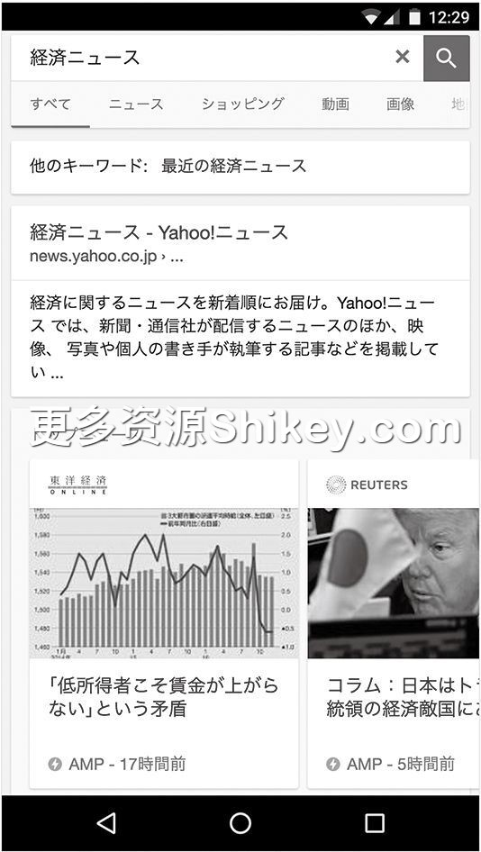
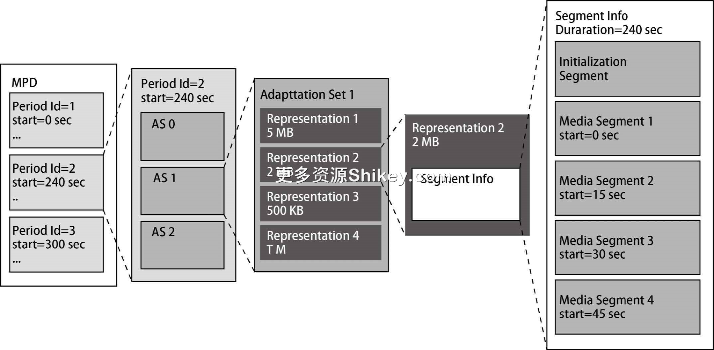

### 本资源由 itjc8.com 收集整理
# 第 8 章 HTTP/2 的语义：新的用例
第 2 章和第 4
章介绍了浏览器中追加的功能。本章也将介绍各种功能，但这些功能中只有极少的一部分是面向浏览器的。如今，搜索引擎和社交媒体越来越普及，这些系统中添加了许多使内容价值最大化的结构。本章不以浏览器和服务器之间的通信为中心，而以搜索引擎和社交媒体所理解的协议为中心进行介绍。本章不使用
curl 命令。

## 8.1　响应式设计

正如第 2 章中介绍的那样，以前，通过查看用户代理信息来传送面向移动端的内容是主流做法。而在智能手机时代，由于各运营商公开了 IP
地址范围一览表，所以有的网站会查看该一览表来进行移动端的判断。然而，用户代理是非正规化的信息，因此可能会无法正确进行判断。

现在被广泛使用的 **响应式设计** 可以使得页面在各种用例中适当地显示，比如切换为适合小屏用户的布局、最适合平板终端的尺寸的布局等。

笔者先来介绍一下 CSS 像素。现在发售的许多智能手机的屏幕分辨率超过了全高清（1920×1080）。不过，浏览器会识别成逻辑分辨率小一圈的显示器的连接并进行显示。

例如，第一次搭载 Retina 显示器的 iPhone 4 的实际分辨率是 640×960，而其内部的分辨率为 320×480，与 iPhone 3GS 等旧机型兼容。这种浏览器的逻辑分辨率（逻辑屏幕大小）叫作
**CSS 像素**。逻辑分辨率和物理分辨率的比率叫作 **设备像素比**。响应式设计中最重要的就是 CSS 像素和设备像素比。

智能手机的 CSS 像素宽度小于 480。我们将第 2 章介绍的 Chrome 开发者模式的移动模拟模式设置为有效，在控制台选项卡中查看实际使用的数据。这里试着选择 Nexus 6P 来查看一下数据。

```
> window.innerWidth
412
> window.innerHeight
732
> window.devicePixelRatio
3.5
```

由上面的代码可知，CSS 像素的宽度为 412 像素，高度为 732 像素。设备像素比为 3.5。进行乘法运算后得出的 2562×1442 与实际的物理分辨率 2560×1440 基本一致。

我们也能够使用 JavaScript 获取信息，通过程序来改变布局。另外，样式表也可以根据设备的逻辑屏幕大小进行设置。

```
/* 面向桌面端 */
@media screen and ( min-width:480px ) {
    .text: {
        color: blue;
    }
}
/* 面向移动端 */
@media screen and ( max-width:479px ) {
    .text: {
        color: blue;
    }
}
```

另外，不管是面向桌面端创建的网站，还是面向移动端创建的网站，默认面向移动端的浏览器都会进行渲染，同时确定屏幕放大和缩小的比例，以尽可能地不给用户造成负担。在响应式设计中，为了让网站端（非浏览器端）控制内容的显示，需要让浏览器不执行放大和缩小操作。将下面的
`meta` 标签添加到首部中，响应式设计的准备工作就完成了。

```
<meta name="viewport" content="width=device-width, initial-scale=1.0">
```

这样就解决了布局问题。不过，还有一个问题没有解决。即使物理分辨率达到全高清，在显示宽度为 400 像素的图像时，也会存在明显的锯齿。为此，可以使用 `srcset`
属性指定多个图像源，让浏览器可以选择合适的文件（代码清单 8-1）。

**代码清单 8-1　从多个源选择接近设备像素比的图像**

```

```

除设备像素比之外， `srcset` 属性还拥有根据实际的显示大小进行选择等各种功能。另外，样式表中可以使用 `image-set()` 函数来实现相同的功能，具体请参考 Google
的 Web Fundamentals 官网。

> 　响应式设计的作用并不仅仅是切换移动端和桌面端。根据平板终端的画面是纵向还是横向，让侧边栏一直显示，或者只在点击图标时显示，这样就能创建适用于各种屏幕尺寸的网站。与功能手机时代的用户代理方式不同，移动终端的显示效果并不比计算机差，能够实现这一效果的关键因素就是能够解析同样的
> CSS。为了解决当时不同的运营商有不同的表情文字这一问题，只能让服务器基于用户代理信息返回其他内容。

## 8.2　语义网

**语义网** 使 Web 能够处理“含义”，而非表面上的“文本”“文档”，于是进一步扩展了 Web 的可能性。语义网的概念是由“Web 之父”蒂姆·伯纳斯·李（Tim Berners-Lee）提出的。


普通 Web（非语义网）使用 HTTP 传送文本，由人阅读文本并理解其含义。沿着链接查找下一层信息，或者查找搜索源等也都由人来完成。以前的搜索引擎称为目录搜索引擎，网站信息汇总在搜索引擎管理的目录结构的页面中。之后，通过
Google 开发的网页排序算法（PageRank
Algorithm），网站信息按照关键字和被链接数量等指标实现了数字化和索引化，从而形成了一种不依赖于含义的结构。虽然现在的搜索引擎并不是根据单纯的链接数量对网站信息进行排序的，但使用统计算法（而非手动输入的信息）实现自动化这一点并没有发生变化。


本节开头提到的“处理含义”是指，在分析页面中包含的信息，以及收集或查找信息时不借用人力。为此，我们需要将数据标准化，变为程序能够处理的形式。语义网这个概念很早就已经出现了，十几年前笔者就在庆应大学了解到了语义网的相关内容。语义网研究者神崎正英的网站中记录了
2000 年之后语义网的发展历程、格式等。

语义网原本的目的是像维基百科那样，通过含义将整个互联网连接在一起，形成一个巨大的知识库。虽然现在还没有实现当初的目标，但语义网可以用作向搜索引擎提供元信息的解决方案。后文将会介绍的开放内容协议和 AMP 也是用来向 SNS
或者搜索引擎等其他系统（而非使用浏览器的用户）传输网站元信息的功能。

### 8.2.1　RDF

人们一直把语义网看作 Web 的未来，因此各个时期 Web 相关的图书中都会提到语义网。这些图书中介绍的各种技巧可能会在构建内网等企业内部系统时作为数据格式使用，但很遗憾，也有一些技巧未在现在的互联网中得到应用。

语义网最初采用了通用的方法，使用 XML 等来记述含义，记述时采用 **RDF**（Resource Description Framework，资源描述框架）格式。RDF 记述由 URI
标识的实体间的关系。RDF 中没有共同的 Schema，因此要针对每个服务创建 Schema。

在语义网中，要说明的对象元素叫作“主语”，主语的属性叫作“宾语”，它们之间的关系叫作“谓语”。各种元素在“主语”“谓语”“宾语”的关系中链接起来，以此描述世界的含义。“主语”“谓语”“宾语”叫作三元组，它们是最重要的关键字。


最开始的这种格式现在叫作 RDF/XML。网站是用 HTML 记述的，所以无法直接插入 RDF，我们需要将 RDF 放在页面外部。

### 8.2.2　都柏林核心

**都柏林核心**（Dublin Core，DC）是 RFC 5013 和 ISO
中定义的记述元数据的词汇集。名称取自相关研讨会的首次举办地——美国俄亥俄州的城市都柏林。都柏林核心提出了计算机专家之外的人也容易理解的术语。大部分资源是一些人的著作，不过其中也定义了著作的特性。与语义网相关的各种技术也使用了都柏林核心，本章的其他地方也有涉及。


现在，最熟悉都柏林核心的应该是电子书从业人员吧。Open eBook（OEB）规范中包含的存储文件列表和图书信息的 Open eBook Package Format（OPF）文件是 EPUB 文件的核心。在每个 EPUB
文件中都包含的 `.opf` 文件中，以 `dc:` 开始的元数据是都柏林核心的组成元素，也是图书、音乐等作品中通用的元数据。

### 8.2.3　RSS

最成功的 RDF 用例当属 RSS（RDF Site Summary，RDF 站点摘要）。RSS 是一个关于网站更新历史摘要的术语。RSS
阅读器一时间受到人们的青睐，成为一种网上冲浪的方式。比如，当博客或者网站更新时，博客引擎或者内容管理系统会自动更新 RSS。RSS 文件按从新到旧的顺序存储内容摘要。

即使未使用浏览器查看网站，专用的阅读器也会检查所登录的 RSS 的更新情况，将未读的条目集中起来，这有助于提高阅读效率。有的 RSS 阅读器以单机工具的形式存在，有的则内嵌在 Internet Explorer 或
Safari 中。另外，Firefox 和 Chrome 以扩展功能的方式实现了 RSS 登录和未读管理。还存在 feedly、Google 阅读器（服务终止）和 livedoor Reader（现在移交给了
Dwango，更名为 Live Dwango Reader）等 Web 服务。

### 8.2.4　微格式

**微格式**（microformat）曾经在日本很流行。技术评论社出版的《Web 核心技术》1 一书中也提到了微格式，Mynavi
也出版了关于微格式的图书。

与 RDF 不同，微格式使用的是 HTML 的标签和类。另外，微格式一开始就将网站之间共同的词汇（Schema）目录化，以加强信息流通。微格式的网站中收录了许多词汇，其中也包含一些候选词汇。

通过对 CSS 加以精心设计，也可以将微格式直接插入到网站中。

Google 等搜索引擎曾经也支持微格式。在搜索引擎显示结果时会额外显示一些信息。例如，用 5 颗星表示电影评分等。虽然现在很多搜索引擎仍然支持微格式，但更推荐使用后面介绍的微数据。

微格式的可移植性比 RDF 好，但由于使用的名称容易与 CSS 的类名发生冲突，所以存在布局混乱、必须大幅修改样式的风险。

### 8.2.5　微数据

**微数据**（microdata）是 WHATWG、W3C 等一直探讨的可以插入 HTML 中的语义表示形式，它定义在 W3C 中。与微格式一样，微数据中也持有词汇集，搜索引擎现在仍对其提供支持。


与微格式不同，为了不与已有的 HTML 的属性发生冲突，微数据中使用源属性，使用的属性有 `itemscope`、 `itemtype` 和
`itemprop`。

现在，微数据的词汇集迁移到了 Schema 网站上，汇总为与 RDFa、JSON-LD 统一的词汇集。通过 Wayback Machine
确认迁移之前的页面，可以发现微数据仅支持以下词汇集，数量也比微格式少很多。不过，大多数搜索引擎会使用这里定义的内容。

> - Event
> - Organization
> - Person
> - Product
> - Review
> - Review-aggregate
> - Breadcrumb
> - Offer
> - Offer-aggregate

### 8.2.6　RDF 的逆袭

虽然 RDF 本身并未得到广泛使用，但它后来派生出很多格式。RDF Primer 中介绍的记述语义的格式如表 8-1 所示。

**表 8-1　记述语义的格式**

名称

记述方法

说明

演化

RDF/XML

使用 XML 记述

基本格式

RDF 1.0 XML、RDF 1.1 XML

Turtle

源

易于记述的接近纯文本的格式

N-Triples、TriG、N-Quads

JSON-LD

JSON

使用 JSON 记述，插入到 `<script>` 标签中

RDFa

HTML 属性

人们也能够直接使用浏览器查看的形式

RDFa、RDFa Lite、HTML/RDFa

RDF 中的标准词汇比微格式和微数据更充实。现在，Schema 网站中收录了大量词汇，在笔者编写本书时就已经有了 583 种类型。示例数据包括前面介绍的微数据、RDFa 和 JSON-LD 这 3 种，其中 Google
推荐使用 JSON-LD，这也应该会成为今后最常用的格式。

JSON-LD 不是 HTML，所以无法插入到正文中，不过 W3C 的规范中有使用 `script` 标签在 HTML
中记述的方法，使用该方法不会影响到已有的内容。当搜索引擎读取包含该标签的页面时，会将标签作为页面附带的元数据进行特殊处理。

使用 JSON-LD 表示的内容也会显示在搜索结果中。在点击搜索结果并跳转到相应页面之前会显示很多信息，因此用户访问感兴趣的网站的机会也变多了。现在 JSON-LD 支持如下数据形式。

> - 面包屑（breadcrumb）列表
> - 网站信息—网站名—企业的咨询窗口—LOGO—社交媒体信息
> - 创作物—新闻—图书—教育课程—音乐—食谱—评论—电视节目、电影—视频
> - 商业—本地业务—活动—商品
> - 科学—科学数据集

### 8.2.7　RDF 系列之外的数据

除 RDF 系列的数据之外，还有很多数据通过 HTTP 或其他协议发送。

**vCard**

**vCard** 是用于交换联系方式的格式，定义在 RFC 2425 和 RFC 2426 中，后来统一为 RFC 6350。MIME 类型是
`text/vcard`。vCard 可以使用 HTTP 进行传送，也可以作为扩展名为 .vcf，的文件使用。vCard 还可以放入 QR 码中，通过智能手机直接读取。

vCard 是一种简单的文本格式。如代码清单 8-2 所示，在 `BEGIN:VCARD` 和 `END:VCARD`
之间的文本块中，每行排列一个属性。属性名定义为地址（ `ADR`）、姓名（ `N`）等，属性名后面是实际的值。除了地址、电话号码、邮箱等常用项目，还包含公司名、职位、商标等日常使用的通信录应用程序所涉及的大部分项目。


**代码清单 8-2　vCard 示例代码**

```
BEGIN:VCARD
VERSION:3.0
ADR:;; 四谷坂町 12-22; 新宿区; 東京都;160-0002; 日本
N: 渋川; よしき;;;
TEL:(+81) 3-3356-5227
END:VCARD
```

保存该文件并双击，就能够将这些信息登录到操作系统的通信录应用程序中（图 8-1）。


**图 8-1　在 macOS 上双击 vCard 文件**

**iCalendar**

**iCalendar**（iCal）是用于交换日程、日历、TODO 的常用格式，定义在 RFC 2445 中，最新发布的版本是 RFC 5545。MIME 类型是
`text/calendar`。iCalendar 可以使用 HTTP 传送，也可以作为扩展名为 .ics 的文件使用。它以前名为 vCalendar，可以使用扩展名 .vcs。iCalendar
还可以放入 QR 码中，通过智能手机直接读取。

iCalendar 采用了与 vCard 类似的文本格式，但除开始时间、结束时间和标签之外，iCalendar
还可处理各种元素，如时区信息、闹钟、空闲和繁忙时间、循环、事件的位置信息等，与此相应，构成元素和规则也增加了。vCard 中只有一组
`BEGIN:VCARD` ~ `END:VCARD`，而 iCalendar
是一种复合格式， `BEGIN:VCALENDAR` ~ `END:VCALENDAR` 中还包含
`BEGIN:VEVENT` ~ `END:VEVENT` 等构成元素。

例如，包含一个 `VEVENT` 事件信息的 iCalendar 的示例代码如代码清单 8-3 所示。

**代码清单 8-3　iCalendar 的示例代码**

```
BEGIN:VCALENDAR
VERSION:2.0
BEGIN:VEVENT
CREATED:20190712T010443Z
LAST-MODIFIED:20190712T010443Z
DTSTART:20190713T000000Z
DTEND:20190713T010000Z
SUMMARY:GoConference'19 summer in Fukuoka
DESCRIPTION:Go and Enjoy Fukuoka!
LOCATION:Fukuoka Growth Next
URL:https://××××
END:VEVENT
END:VCALENDAR
```

保存该文件并双击，就能够将这些信息登录到操作系统的日历应用程序中（图 8-2）。


**图 8-2　在 macOS 上双击 iCalendar 文件**

有的格式比较简单，仅使用 `BEGIN:VEVENT` ~ `END:VEVENT`。在这种情况下，有的应用程序可能会将其视作非法数据。通过将这种简单的格式放入 QR
码中，就可以将事件信息登录到智能手机的日历应用程序中。

另外，当服务器返回其内容时，通过将 URL 登录到 Google 的日历中，客户端可以定期获取日历信息，并自动登录或更新事件。

## 8.3　开放内容协议

近年来，在提供 Web 服务时实现 **开放内容协议**（Open Graph Protocol，OGP）已经几乎成了共识。前面介绍的数据格式主要用于搜索引擎，开放内容协议是在社交网络中使用的元数据，由
Facebook 开发。如果将设置了开放内容协议的网站的 URL 粘贴到 SNS 中，就会引用一部分内容，也会显示图像。与单纯显示 URL 相比，这更能引起其他用户的兴趣。现在有许多网站支持开放内容协议。图 8-3
是笔者将投稿到 Qiita 上的文章链接粘贴到 Twitter 上时的屏幕截图，图 8-4 是将同样的内容粘贴到 Facebook 上时的屏幕截图。


**图 8-3　将链接粘贴到 Twitter 上**


**图 8-4　将链接粘贴到 Facebook 上**

根据网站末尾的说明，由于涉及都柏林核心、第 1 章介绍的标准 URL、微格式和 RDFa，所以开放内容协议也属于语义网的“后代”。

要想使用开放内容协议，就需要先声明 `<html>` 标签的 `xmlns:og="http://ogp.me/ns#"` 命名空间，如代码清单 8-4 所示。

**代码清单 8-4　声明开放内容协议的命名空间**

```
<html xmlns:og="http://ogp.me/ns#">
```

然后，将面向 SNS 的信息作为元标签记述。常用的基本元素如下所示。

> `og:title`
>
> 标题。
>
> `og:type`
>
> 类型。
>
> `og:url`
>
> URL。
>
> `og:image`
>
> 图像。
>
> `og:description`
>
> 粘贴到引用页面的文本。

除 `og:description` 之外，其他元素是必不可少的。在如今的社交媒体时代，图像已经成为不可或缺的元数据。

在开放内容协议中，能够通过选项指定的元素如下所示。

> `og:audio`
>
> 声音文件。
>
> `og:determiner`
>
> 冠词 a、the 等。
>
> `og:locale`
>
> 页面内容的语言环境。
>
> `og:local:alternate`
>
> 该页面提供的其他语言。
>
> `og:site_name`
>
> 网站名。
>
> `og:video`
>
> 视频文件。

还有一些指定图像、视频、声音的大小和格式的结构化属性，具体请参考开放内容协议的网站。另外，还可以指定多个相同的选项（数组化）。代码清单 8-5 中指定了多个图像，并使用结构化属性指定了图像的大小。

**代码清单 8-5　使用结构化属性指定多个图像的大小**

```
<meta property="og:image" content="http://××××.com/rock.jpg" />
<meta property="og:image:width" content="300" />
<meta property="og:image:height" content="300" />
<meta property="og:image" content="http://××××.com/rock2.jpg" />
<meta property="og:image:height" content="1000" />
```

Twitter Card 与开放内容协议类似。在 Twitter 上粘贴链接时，将一部分链接目标页面的内容在 Twitter 上展开，以提高点击率。Twitter Card 可以说在开放内容协议的基础上添加了用于
Twitter 的信息，面向 Twitter 开发者的网站中也提到 Twitter Card 以开放内容协议为基础。仅使用 Twitter Card 中定义的属性也能够记述所有需要的信息。虽然 Twitter Card
和开放内容协议中存在重复的属性，但当 Twitter 根据 Twitter Card 的属性无法找到需要的信息时，会查看开放内容协议的属性，因此没有必要记述 Twitter Card 和开放内容协议的所有属性。

`og:title`、 `og:url`、 `og:image` 和 `og:description` 是 Twitter 和
Facebook 共同的元素，因此，只要以开放内容协议的形式记述，Twitter 和 Facebook 就都可以使用这些元素。带有 `twitter:` 前缀的属性是 Twitter
专用的属性， `og:type`、 `og:site_name` 和 `og:admins` 是 Facebook 专用的属性。

## 8.4　QR 码

随着移动终端的普及，QR 码被用于各个方面，广受欢迎。QR 码源于大型汽车零部件制造商日本电装株式会社（现为 Denso Wave）在 1994 年开发的二维条码，现已成为 JIS 和 ISO
等各种工业标准，在这些标准的范围内，使用 QR 码无须支付专利费。由 IBM 公司开发的存储 13 位数值的 UPC 码也是一种条码，现在大部分商品附有 UPC 码 2，而
QR 码容量较大，最大可支持 7000 位的数值，另外，印刷面积小、读取速度快也是其优点 3。QR 码还具有在图片稍微倾斜的情况下也能读取、稍有残缺也可还原等特性。

现在，IPv6、物联网（Internet of Things，IoT）和数字孪生等让所有物体都拥有 ID，在个别情况下甚至能实现通信，但它们都要求能识别大量物体。以商品条码为例，如果知道商品的类型，就可以使用 POS
获取金额，进行结算。如果还想涵盖追踪信息，就需要识别出特定的某个商品，比如何年何月在哪个印刷厂印刷的、哪个批次的某本书等。这就需要给每本书添加唯一的 ID。由此，需要用到的信息就会增加很多。

QR 码本身还拥有可以最大限度地填充数字的模式，以及使用特殊编码填充汉字的特殊模式。在英文模式下，QR 码最多可存储 4296
个字符，但不可以使用小写字母。虽然可以使用空格、“$”“%”“\*”“+”“-”“.”“/”“:”等符号，但不可以使用 URL 中的“&”“?”“#”。常用的模式为二进制模式，最大可存储 2953 字节。另外，QR
码有 4 个纠错等级，如果设置为缺失 50% 的信息也能还原的等级，则最大存储字节就会降到 1273 字节。如果 URL 中不使用 QR 码中禁用的字符，且可以使用大写字母表示，那么该 URL 也可以使用英文模式的 QR
码来表示。

### QR 码和方案

之所以介绍 QR 码，是因为它与 HTTP 的元素相关。我们可以在 QR 码中使用英文和数字来记录 URL 那样的字符串。当然，QR 码中也可以存储 URL 本身。图 8-5 就是
`https://www.oreilly.co.jp/books/9784873119038/` 这一字符串的 QR 码。读取 QR 码的应用程序在从 QR
码中读取文本时会解析方案，调用相应的应用程序。


**图 8-5　存储 URL 的 QR 码示例**

实际上并不存在关于 QR 码的方案的统一标准，但对普通用户来说，由于 QR 码与智能手机有很强的亲和性，所以得到广泛使用。除了 URL 之外，QR 码还可以存储各种内容，因此可以说是标准化的 URI 的上位概念。

虽然 QR 码还没有可实际处理的数据类型相关的标准，但 Google 提供的用于创建和读取 QR 码的开源库 ZXing4
的文档基本成为事实标准。作为数据类型和解析方法，文档中还保留着用于功能手机的内容。有的 QR 码阅读器可能不支持某些方案。另外，QR 码还可以用于收付款、多因素身份验证的登录等。

> **URL**
>
> 即第 1 章中介绍的 URL。
>
> **邮箱地址**
>
> 像 `mailto:wozozo@gmail.com` 这样的以 `mailto:` 开头的字符串。使用
> `?sub ject=%E3%82%BF%E3%82%B3%E5%85%AC%E5%9C%92`
> 这类查询，可以设定在启动电子邮箱时的邮件标题、抄送的邮箱地址和正文等的默认值。另外，包括添加的查询在内，HTML 的 `a`
> 标签也可以使用该方案。在点击链接时，浏览器会启动注册的邮件应用程序。该查询形式定义在 RFC 2368 中，也就是后来的 RFC 6068 中。
>
> **电话、SMS、MMS、FaceTime**
>
> 以 `tel:` 开头的方案表示电话号码。该写法采用国际电话的形式。以日本的电话号码 03-3356-5227（O'Reilly Japan 的电话号码）为例，去掉开头的
> 0，然后加上日本的国际区号 +81，写成 `tel: +81-3-3356-5227`。QR 码阅读器在读取时会启动电话应用程序，并在拨号栏显示该号码。同样，当加上
> `sms:` 或 `mms:` 时，就会启动 SMS 或 MMS 应用程序。Apple 公司的 FaceTime 是一种视频电话、IP 语音通话服务，能够在持有 Apple
> 设备的人之间使用。在使用 FaceTime 的情况下，可以使用对方的电话号码或作为 Apple ID 使用的邮箱地址，并加上 `facetime:` 或
> `facetime-audio:`。
>
> **Wi-Fi 网络设置**
>
> 在 Android 或 iOS 11 之后的 iOS 版本中，Wi-Fi 的网络设置可以设计成 QR 码。将 QR 码贴在活动会场或 Wi-Fi 路由器上，可方便人们轻松连接 Wi-Fi。Wi-Fi 的设置方法是在
> `WIFI:` 方案后面加上用分号分隔的连接设置，如 `WIFI:T:WPA;S:myne twork;P:mypass;;` 这种字符串。 `T:`
> 是加密方式， `S:` 是 SSID， `P:` 是密码。另外， `H:true` 表示隐藏的 SSID。
>
> **vCard 和 iCalendar**
>
> 本章介绍的 vCard 和 iCalendar 也可以放入 QR 码中。用智能手机扫描 QR 码，就可以将联系方式添加到通信录中，或者将事件添加到日历中。
>
> **TOTP 的密钥**
>
> 在多因素身份认证中使用的 TOTP 算法的密钥的登录可以使用 QR 码。在读取 QR 码后，密钥会登录到密钥管理应用程序中。该应用程序将当前时刻与该密钥信息组合，生成一个 6
> 位的数值。在用户输入该数值后，服务器就可以判断密钥是否相同，详细内容将在第 14 章进行介绍。

这些形式已经成为通用标准，另外，这些形式还可用于特定的应用程序，比如电子机票、付款等。

## 8.5　AMP

**AMP**（Accelerated Mobile Pages，移动页面加速）是用于实现移动端的高速化的结构。如今，关于 AMP 是否对 SEO（Search Engine
Optimization，搜索引擎优化）有利这个话题经常被人们讨论，但其强调的性能问题并未引起关注。不过，对网络状况较差的国家来说，AMP
能够使用户体验得到很大提升。移动站点会按照优先顺序显示内容，并带有“AMP”标志，方便用户选择可以快速显示的页面。另外，如果页面中设置了必要的信息，那么这些信息就会以轮播（carousel）形式与新闻摘要一起显示（图
8-6）。



**图 8-6　AMP 的显示示例**

不过，并不是任何页面都可以通过 AMP 实现高速化，AMP 有自己适用的情况。Google 的博客中记载了如下内容。

> AMP 在所有类型的静态 Web 内容（新闻、食谱、电影信息、商品页面、评论、博客等）中能发挥出显著的作用，而 AMP 对动态的、重视双向性的单一页面的服务（地图的路线导航、邮件、社交网络等）没有多大效果。

在新闻网站中，首页可以保持原样，只将各种新闻文章 AMP 化。现在的网站都是使用复杂的 JavaScript 构建的。AMP 的出发点就是创建移动端专用的轻量级页面。

另外，在加上 JSON-LD 标签之后，就可以在搜索主界面的轮播中突出显示。搜索顺序越靠前，看到的用户就越多，用户访问数量就会不断增多，从这一方面考虑，在搜索结果靠前的轮播中显示与搜索顺序上升的效果相同。

在 AMP 页面中插入图像和视频需要使用专用的标签。AMP 中无法使用自定义的标签，只允许使用根据规则确定的子集或者特殊的替代表示。也有专门用于 Twitter 和 YouTube 的显示的标签。

最后，创建 AMP 页面到非 AMP 页面（大部分是已有的新闻网站等的页面）的链接和非 AMP 页面到 AMP 页面的链接。当只存在 AMP 页面时，只创建 AMP 页面到非 AMP 页面的链接。

从技术层面来说，网站提供端的工作就到此结束了。

现在的网站非常复杂，需要使用大量资源来创建。如果创建方式不当，那么在下载完所需的全部内容之前，页面显示会被阻塞，用户必须长时间面对空白的画面 5。AMP
通过在创建方式上进行严格的限制，来防止“创建方式不当导致显示延迟”的情况发生。JavaScript 也不可以随意使用，脚本只能是指定的 JavaScript 的子集或者指定的自定义标签。因此，之后无法使用 Ajax
获取内容，只能显示静态内容。

AMP 能够实现高速化的秘密不仅仅在于内容的创建方面，还在于内容的分发方面。为搜索引擎收集信息的程序叫作“爬虫”或者“蜘蛛”。当爬虫发现 AMP 或者 `<link>` 标签的目标中存在
AMP 页面时，就会将所发现的内容全部复制到 Google 持有的专门用于分发内容的高速缓存服务器（CDN）中。

从技术层面来看，AMP 是由以下 4 种高速化方法构成的。

> - 通过固定页面的结构来实现页面的高速化
> - 页面结构固定，更容易对 CDN 提供支持
> - 通过从 CDN 获取内容，易于将 JavaScript 文件放到缓存中
> - 当从服务器端获取内容时，通过改写标签实现高速化（不在规范内）

有的读者可能认为构成 AMP 的各个技术是相互独立的，但其实各个技术就像齿轮一样相互配合，环环相扣。

AMP 除了用来实现高速化，还提供了一些便于创建着陆页的便捷控件。BMW 网站的非 AMP 的常规页面中使用了 AMP 组件。

## 8.6　通过移动应用程序使浏览环境多样化

HTTP 是服务器与客户端之间的通信协议。过去用户主要使用桌面浏览器，随着智能手机的普及，使用移动浏览器的用户不断增加，不使用浏览器而使用 Twitter 或 LINE 等专用应用程序的用户也在增加。StatCounter
公司的统计结果显示，2016 年智能手机和平板的总流量超过了计算机。根据思科公司的报告，移动端的流量正在以年均 45% 的速度增加 6。

智能手机在浏览特定的网站时，还可以使用网站专用的应用程序。虽然 Web 中也在不断加入通知或后台通信等单个应用程序所具有的功能，但 Web
的功能还不足以处理复杂操作，比如在上传照片或视频时，首先会进行过滤并重新编码，然后再上传等。随着 iOS 和 Android 的版本升级，将网站和应用程序无缝连接的功能在不断增加。在操作系统中添加根据 URL
等信息来调用应用程序的特定功能的结构，以从 Web 链接应用程序的形式进行动作，这种结构称为 DeepLink。DeepLink 的具体实现方式在 Android 和 iOS 中稍有不同。

当从移动应用程序访问网站时，可以使用具有浏览器功能的 UI 控件（WebView），也可以直接启动 Chrome 或 Safari 之类的浏览器。不过，在使用 UI
控件的情况下，如果想使用共享功能等与其他系统协作，就必须在使用 WebView 的应用程序端进行集成。

在应用程序运行时需要在 SNS 上发布消息的情况下，如果从 WebView 启动，则由于 UI 控件无法访问 Cookie 信息和密码管理功能，所以用户必须自己输入 ID
和密码。在已经在标准浏览器上登录的情况下，可以减少烦琐的登录操作，立即看到发布画面。即使未在浏览器上使用 SNS，也可以调用专用应用程序，弹出发布画面。像这样，除了从 Web
调用应用程序，我们还可以进行横向协作，从应用程序调用 Web 浏览器，然后再调用应用程序……

### 8.6.1　iOS 的 DeepLink

iOS 9 新增了 Universal Link 结构。这是面向网站拥有者的功能，用于让自己的网站和访问自己的网站的应用程序密切协作。要使用 Universal Link，需要在网站上设置记述应用程序信息的 JSON
文件和签名文件。

除此之外，还有一种使用 **自定义方案** 的方法，比如使用 `line://` 方案启动 LINE
应用程序。在使用该方法的情况下，仅在网站上放置链接即可，当从网站之外启动应用程序时，会显示要启动的应用程序选择画面，Web 和应用程序之间不会顺畅迁移，用户会觉得自己离开了 Web 世界，进入到了应用程序的世界中。

### 8.6.2　Android 的 DeepLink

当从未考虑与移动应用程序协作的网站访问指定的 URL 时，Android 也可以获取该访问，并启动应用程序。这里使用了一种名为 **intent**
**过滤器** 的结构。当安装的应用程序与过滤条件匹配时，该应用程序就会启动。

还有一种叫作 App Indexing 的结构。要使用该结构，需要在服务器端放置文件，并进行各种准备工作，不过我们也可以从 Google 的搜索结果直接启动应用程序。

## 8.7　使用 HTTPLiveStreaming 播放视频流

**HTTP Live Streaming**（以下简称 HLS）是 Apple 公司在 2009 年提出的视频流播放结构。后来 Apple 公司内部不断对其进行改善，直到 2017 年，HLS 才在
RFC 8216 中实现标准化。现在，移动端的 Safari、Chrome 和桌面端的 Safari、Edge 对其提供了支持。HLS 在移动端得到了广泛应用。

> - 可以用于会议（几乎）实时转播等的流中
> - 能够根据通信线路的比特率选择分辨率合适的视频
> - 也支持字幕管理、声音切换
> - 视频格式为用于数字电视广播系统的 MPEG2-TS（.ts）和 ISO 定义的 Fragmented MPEG-4
> - 虽然规范中并未指定视频形式，但 Apple 的实现中支持 H.264 和 H.265，声音形式支持 AAC、MP3 和 AC-3

HLS 的内部处理非常简单，对于已经深入理解 HTTP 的基本内容和基于 HTTP 的框架构建的浏览器的各种功能的读者来说，简直小菜一碟。

### 8.7.1　HLS 的视频标签

笔者先来介绍一下使用 HLS 的 HTML。在 WWDC 2016 中，介绍 HLS 的页面像下面这样使用了 `<video>` 标签。由于不同的浏览器能够使用的视频格式不同，所以
`<video>` 中能够记述多个源。不过，这里使用的后一个文件是一个只显示“Streaming is available in Safari, and through the WWDC
app.”的短视频文件，前一个文件是 HLS 的 manifest 文件。

```
<video class="video center" controls="" autoplay data-id="1251">
    <source src="http://devstreaming.apple..（略）../hls_vod_mvp.m3u8"/>
    <source src="/videos/images/ogg_bumper_no_tv.ogv" type='video/ogg'>
</video>
```

### 8.7.2　Master 的.m3u8 文件

.m3u8 文件是包含文件信息的文本文件，它是 UTF-8 格式的播放列表。.m3u8 文件有时会引用其他 .m3u8 文件。以下示例代码恰巧涵盖了 HLS 的常用功能，我们一起来看一下。

```
#EXTM3U
#EXT-X-MEDIA:TYPE=SUBTITLES,GROUP-ID="subs",NAME="English",DEFAULT=YES,AUTOSELECT=Y
ES,FORCED=NO,LANGUAGE="English",URI="subtitles/eng/prog_index.m3u8"

#EXT-X-STREAM-INF:BANDWIDTH=1193108,CODECS="avc1.77.30,mp4a.40.2",RESOLUTION=640x26
6,SUBTITLES="subs"
0640/0640.m3u8
#EXT-X-STREAM-INF:BANDWIDTH=6807315,CODECS="avc1.580028,mp4a.40.2",RESOLUTION=1920x
800,SUBTITLES="subs"
1920/1920.m3u8
#EXT-X-STREAM-INF:BANDWIDTH=4668760,CODECS="avc1.4d401f,mp4a.40.2",RESOLUTION=1280x
532,SUBTITLES="subs"
1280/1280.m3u8
#EXT-X-STREAM-INF:BANDWIDTH=2805788,CODECS="avc1.4d401f,mp4a.40.2",RESOLUTION=960x4
00,SUBTITLES="subs"
0960/0960.m3u8
#EXT-X-STREAM-INF:BANDWIDTH=532635,CODECS="avc1.42c015,mp4a.40.5",RESOLUTION=480x20
0,SUBTITLES="subs"
0480/0480.m3u8
```

开头先指定了包含字幕信息的.m3u8 文件的路径，然后是推荐的带宽以及相应的 .m3u8 文件的列表。虽然这里既包含视频（以 `avc1` 开头的代码），也包含声音（以 `mp4a`
开头的代码），但只提供了声道，在带宽极小的环境下，也可以只返回声音的流。

客户端首先使用最开始记述的索引，然后查看线路的剩余情况，以切换所使用的索引。除最开始的项目之外，其他项目无论怎样排序都不会影响运行。

### 8.7.3　字幕的.m3u8 文件

字幕文件每 60 秒分割出一个。.m3u8 根文件与整合这些字幕文件的 .m3u8 文件进行链接。这里我们只引用文件的开头部分。

```
#EXTM3U
#EXT-X-TARGETDURATION:60
#EXT-X-VERSION:3
#EXT-X-MEDIA-SEQUENCE:0
#EXT-X-PLAYLIST-TYPE:VOD
#EXTINF:60.00000,
fileSequence0.webvtt
#EXTINF:60.00000,
fileSequence1.webvtt
#EXTINF:60.00000,
fileSequence2.webvtt
#EXTINF:60.00000,
fileSequence3.webvtt
#EXTINF:60.00000,
fileSequence4.webvtt
︙
```

34 分钟的视频有 34 个文件。我们来看一下开头的字幕文件。这里笔者也只介绍开头部分。

```
WEBVTT
X-TIMESTAMP-MAP=MPEGTS:181083,LOCAL:00:00:00.000

00:00:07.516 --> 00:00:20.936 A:middle
[ Music ]

00:00:21.436 --> 00:00:22.216 A:middle
&gt;&gt; Is this thing on?

00:00:23.516 --> 00:00:25.866 A:middle
[ Applause ]

00:00:26.366 --> 00:00:27.116 A:middle
Good afternoon.

00:00:27.536 --> 00:00:29.226 A:middle
I'm Roger Pantos.

00:00:29.226 --> 00:00:32.046 A:middle
This is what's new in
HTTP Live Streaming.
```

代码开头也写着，这是 WEBVTT 形式的字幕脚本。WEBVTT 不是 HLS 专用的格式，而是 W3C 定义的一种 Web 标准。作为 `<video>` 标签和
`<audio>` 标签的子标签，WEBVTT 被添加在 HTML5 中，用来设置字幕。现在，包含移动端在内，大部分浏览器支持 WEBVTT。

WEBVTT 的内容被分割成块。各个块中记述了开始时间、结束时间，以及在什么位置显示什么文本。

### 8.7.4　视频文件

主索引 .m3u8 引用的索引叫作二级索引。这里列举了视频文件的例子，它与字幕文件 .m3u8 的结构基本相同。

```
#EXTM3U
#EXT-X-VERSION:3
#EXT-X-TARGETDURATION:13
#EXT-X-MEDIA-SEQUENCE:1
#EXT-X-PLAYLIST-TYPE:VOD
#EXTINF:12.012,
0640_00001.ts
#EXTINF:12.012,
0640_00002.ts
#EXTINF:12.012,
0640_00003.ts
#EXTINF:12.012,
0640_00004.ts
#EXTINF:12.012,
0640_00005.ts
```

客户端按此处的顺序加载视频并显示。这里以 12.012 秒为单位，总共分成了 171 个文件。该文件是事件结束后的文件，在直播的情况下会使用 `#EXT-X-PLAYLIST-TYPE:EVENT`。


在直播之后，如果将视频文件用于视频点播（在出现请求时，从最开始播放视频），则将上面的标签设置为 `VOD`，并在末尾加上 `#EXT-X-ENDLIST`。

如果不考虑重播，只进行实况转播，则可以在更新时删掉播放完的视频，只保留最新的视频。

### 8.7.5　HLS 的优点和缺点

HLS 的优点是，服务器和客户端之间的通信使用的并不是特殊的协议，而是支持所有路由器的 HTTP。在使用特殊协议的情况下，我们需要安装专用的服务器，释放中途的通信线路的端口。由于 HLS 使用的是
HTTP，所以它可以使用与普通 Web 一样的服务器，也可以使用内容分发网络。

服务器只需要设置 MIME 类型和缓存的存活时间（Time To Live，TTL）。

在直播的情况下，二级索引文件会被频繁加载。如果对其进行了缓存，那么即使添加新的视频，客户端也不会有所察觉。在视频点播的情况下不存在缓存问题。

HLS 的缺点是，虽说使用了流，但本质上采用的是渐进式下载（progressive download）的方式。如果没有下载完所有的 Chunk，就无法开始播放视频，因此总会发生延迟。Apple 的资料中提到，延迟大概有 30
秒。对于 12 秒的 Chunk，如果以线路所能允许的最高画质进行播放，就会发生“12 秒×2+ 编码时间”的延迟，大概是 30 秒的时间。

HLS 还有一个更大的缺点，那就是没有得到很多环境的支持，特别是桌面系统。虽然 Chrome 的移动版支持 HLS，但桌面版不支持，需要安装第三方插件。在桌面系统中，Flash 和 Silverlight
是通用的视频播放工具，不难想象，HLS 并不是那么重要。不过，在本书出版时，所有的浏览器都已经删除了包含 Flash 播放器的浏览器插件功能。

除此之外，HLS 还有一些缺点，比如用于保护内容的 DRM 存在一些限制等。

### 8.7.6　HLS 出现前后的视频流相关的历史

最后来介绍一下 HLS 出现前后的视频流相关的历史。

在浏览器中的流技术出现之前，人们使用的是 Microsoft 的 Windows Media Player、Apple 的 QuickTime、Real 的 RealPlayer 等专门的播放器应用程序的流。

在浏览器上的视频流播放方面，Macromedia7 的 Flash 播放器支持的 RTMP（Real Time Messaging
Protocol，实时消息传输协议）得到广泛普及。该协议与 HTTP 不同，它通过减小首部和缩短通信的等待时间来加强实时性。2007 年，RTMP 搭载了需要支付 H.264 和 AAC
等的专利费的高级编解码器，成为计算机浏览器的视频流播放环境的事实标准。YouTube 和 niconico 动画中也使用了 RTMP。

之后，Microsoft 也通过浏览器插件 Silverlight 支持视频播放。Silverlight 支持 Windows Media Video（WMV1、WMV2、WMV3、WMVA、WMVC1）和一些
RTSP（Real Time Streaming Protocol，实时连续流协议）。

在 Apple 公司发布 HLS 之后，各公司开始提供 HTTP 渐进式下载。2009 年，Microsoft 在 manifest 文件中使用了 XML，开发了采用 VC-18 和 H.264 编码的 Smooth Streaming 协议，并添加到 Silverlight 中。另外，Adobe 虽然发布了 HDS（HTTP Dynamic
Streaming，HTTP 动态流技术），但 Flash 播放器也为 HLS 提供了支持。在移动端的 Android 中，从版本 3.0 开始支持使用了 WebM 的 HLS，从版本 4.0 开始支持可以使用 H.264
的 HLS。

## 8.8　使用 MPEG-DASH 播放视频流

HLS 是 Apple 公司提出的方式，其他浏览器厂商通过提出了众多视频格式的 MPEG 组织推动了视频流播放结构的标准化，并在 2013 年实现了 ISO/IEC 23001-6 标准。

DASH 这个名称取自 Dynamic Adaptive Streaming over HTTP 的首字母，意思是使用 HTTP 以合适的比特率来动态执行流。MPEG-DASH 是公开的规范，在这一点上与 HLS
不同，但二者的目标基本相同，MPEG-DASH 在 HLS 的基础上进行了大幅扩展。

MPEG-DASH 也是以使用 HTTP 的渐进式下载为核心的流媒体技术，它的参考实现中提供了 video.js 库。在使用该库的情况下，可以在浏览器上使用 MPEG-DASH。

> - 在容器格式方面，支持基于 ISO 的媒体文件格式（MPEG4 Part 12/SBMFF）、MPEG2-TS 和 WebM
> - 在编解码器方面，主要使用 H.264、h.265、VP8 和 VP9
> - HLS 会在最开始选择比特率，MPEG-DASH 可以根据线路动态切换比特率
> - 支持多角度（multi angle）和广告

### 8.8.1　MPEG-DASH 与 HLS 在播放方法上的区别

MPEG-DASH 和 HLS 的核心元素都是“通过使用了 HTTP 的渐进式下载来播放视频”，但二者的播放方法并不相同。

HLS 与其说是在 HTML 上进行播放，不如说是在浏览器中嵌入了一种系统来解析 HLS 的 .m3u8 文件并进行播放。另外，macOS 和 iOS 等可以使用 MediaPlayer 框架在浏览器之外的地方播放视频。


MPEG-DASH 中也存在浏览器以外的播放器，它的参考实现中提供了用 JavaScript 创建的视频播放器 dash.js。浏览器不会直接解析协议，而是使用 JavaScript 来解析数据，使用 HTML5 Media
Source Extensions 这一 API 播放视频。该 Media Source Extensions 与提供加密功能的 HTML5 Encrypted Media Extensions 都是 MPEG-DASH
的成果。现在，iOS 的 Safari 以外的许多浏览器支持 HTML5 Media Source Extensions。

虽然 Apple 公司没有提供支持，但现在有的视频播放器已经能够使用与 MPEG-DASH 一样的 Media Source Extensions，在不支持 MPEG-DASH 的浏览器中播放
HLS。由于各种程序和库对这两种方式都提供了支持，所以我们也可以忽略二者的区别。在 2016 年的 WWDC 上，Apple 公司宣布对 MPEG-DASH 让步，开始对 Fragmented MPEG4
提供支持，由此，Apple 也能够使用与 MPEG-DASH 相同的媒体了。虽然 DASH 还支持其他格式，HLS 也支持 MPEG2-TS，但通用的 Fragmented MPEG-4 才是今后的主流。

Google 公司提供的开源的视频播放器 JavaScript 库 Shaka Player 支持 HLS、DASH，以及随后介绍的 CMAF 等所有格式。

### 8.8.2　MediaPresentationDescription 文件的结构

MPEG-DASH 的白皮书 Media Presentation Description（以下简称 MPD）文件的扩展名是 .mpd，主体使用 XML 表示。MPD 的结构如图 8-7 所示。



**图 8-7　MPD 的结构**

MPD 也可以使用 XML 的 XLink 功能，将文件分割成多个。

在 YouTube 提供的 MPEG-DASH 中，MPD 的结构由 `profiles` 属性决定。与 HLS 一样，在直播的情况下，MPD 文件会被动态改写，客户端会定期进行加载，以获取最新的数据。


HLS 中不存在 `<Period>` 标签这一概念，该标签用于划分 DVD 等的章节或每个广告的时间段。 `<Period>` 标签至少需要一个。当存在多个
`<Period>` 标签时，需要在 `<Period>` 中设置 `start` 或者 `duration`
属性。根据 `<MPD>` 标签的 `type` 属性是 `static` 还是
`dynamic`， `start` 的表现形式不同，但使用这些值，我们可以根据时间来找出重播部分的开头。

各个 `<Period>` 标签中记述了与 HLS 的 Master 相同的元素。表示媒体构成元素的 `<AdaptationSet>`
标签的个数与元素个数相同。另外，包含各个理想带宽下实际使用的媒体链接的 `<Representation>` 标签存在多个。

```
<AdaptationSet mimeType="audio/webm" subsegmentAlignment="true">
    <Representation id="171" codecs="vorbis" audioSamplingRate="44100"
startWithSAP="1" bandwidth="129553">
        ︙
    </Representation>
    <Representation id="172" codecs="vorbis" audioSamplingRate="44100"
startWithSAP="1" bandwidth="188041">
        ︙
    </Representation>
</AdaptationSet>
<AdaptationSet mimeType="video/webm" subsegmentAlignment="true">
    <Representation id="245" codecs="vp9" width="854" height="480" startWithSAP="1"
bandwidth="1431499">
        ︙
    </Representation>
    <Representation id="247" codecs="vp9" width="1280" height="720" startWithSAP="1"
bandwidth="3915200">
        ︙
    </Representation>
</AdaptationSet>
```

接下来，我们来看一下 `<Representation>` 标签。首先从音频开始。

```
<Representation id="171" codecs="vorbis" audioSamplingRate="44100" startWithSAP="1"
bandwidth="129553">
    <AudioChannelConfiguration
        schemeIdUri="urn:mpeg:dash:23003:3:audio_channel_configuration:2011"
        value="2" />
    <BaseURL>feelings_vp9-20130806-171.webm</BaseURL>
    <SegmentBase indexRange="4452-4686" indexRangeExact="true">
        <Initialization range="0-4451" />
    </SegmentBase>
</Representation>
```

MPEG-DASH（ISO 23001-6）之外定义了 `<AudioChannelConfiguration>` 中可以指定的内容。从 `schemaIdUri`
的内容可以看出， `<AudioChannelConfiguration>` 需要引用 ISO 23003-3，它表示“扬声器的位置”， `2` 表示中置音箱。ISO
23001-8 中有定义了扬声器的位置的表。 `schemaIdUri` 中还有以 `tag:dolby.com`
开头的方案，还可以指示企业持有的专利技术。 `<BaseURL>` 用于指定媒体文件。

在视频的情况下，如代码清单 8-6 所示，视频中也定义了分辨率、带宽等用于选择媒体的结构。

**代码清单 8-6　指定视频文件**

```
<Representation id="242" codecs="vp9" width="426" height="240" startWithSAP="1"
bandwidth="490208">
    <BaseURL>feelings_vp9-20130806-242.webm</BaseURL>
    <SegmentBase indexRange="234-682" indexRangeExact="true">
        <Initialization range="0-233" />
    </SegmentBase>
</Representation>
```

`SAP`、 `<SegmentBase>` 标签、 `<indexRange>` 标签和
`<Initialization>` 标签是用于准确指示文件中有效（必不可少）的数据的信息。视频文件的容器中可以放入许多数据。

前面介绍了 HLS 和 MPEG-DASH 的文件格式，它们都基于 HTTP，这一点想必各位读者已经感受到了。HLS 比较简单，但 MPEG-DASH 非常复杂，不过这些文件基本上不需要我们自己来编辑。

> - 可以使用 MP4Box 工具来生成 MPEG-DASH 的 MPD 文件
> - 可以使用 Amazon AWS 的 Elastic Transcoder 来转换 MPEG-DASH 和 HLS

## 8.9　CMAF

**CMAF**（Common Media Application Format，通用媒体应用程序格式）是由 Apple 公司和 Microsoft 公司共同制定的，于 2018
年实现了标准化。作为媒体文件格式，CMAF 也使用与 HLS 和 DASH 一样的 Fragmented MPEG-4（fMP4）。

CMAF 直接使用 HLS 和 DASH 的 manifest 文件，并为降低延迟采取了各种对策。首先，CMAF 采用第 4 章介绍的 Chunk 形式来获取内容。Chunk 越小，与 HTTP
相比，往返时间就越少，首部开销就越小。另外，CMAF 的分段文件以更小的 Chunk 为单位进行分割。

通常，在使用 HLS 等形式播放流的情况下会发生延迟，延迟时间与段的大小（分割的视频的秒数）成比例。即使编码时间为 0 秒，段大小为 6
秒的视频文件也是在最初的帧开始输入、最后的帧输入结束之后生成的，因此即使立即读取并播放该视频文件，也还是会产生与段大小相应长度的延迟。当然，这里包含了通信时间。在将一段视频文件下载完并读取之后，编码才开始。另外，为了防止画面因一点点通信延迟而停止，我们可以先下载几个段的文件（缓冲）再播放。


CMAF 可以将段分割成 Chunk 这种更小的单位来加载，这样就可以大大降低延迟。Akamai 公司宣布，通过将段缓存到 CDN 中并利用 QUIC，可以进一步缩短延迟时间。

## 8.10　本章小结

本章主要介绍了 HTML5 时代和 HTTP/2 时代的各种实用的技术元素，不过其中许多技术并不是针对浏览器提出的。

> - 响应式设计是根据屏幕大小来显示内容的结构。除了确认屏幕大小之外，也能够进行适合高分辨率的智能手机的图像传送等
> - 由语义网引出的 JSON-LD 等结构化数据可用来修饰搜索引擎的结果
> - 开放内容协议中制定了面向 Facebook 的元信息的形式
> - Twitter Card 生成面向 Twitter 的元信息
> - QR 码被广泛用作包含 HTTP 路径的通用链接，以及向应用程序传递信息的基础设施
> - AMP 旨在实现移动端的高速化，但接收 AMP 信息的是用于启动搜索引擎的蜘蛛
> - 智能手机的应用程序拥有 DeepLink 结构，可以将浏览器与应用程序连接
> - 视频流是一种将碎片图像连接起来进行显示的结构。根据带宽的不同，可以获取不同分辨率的图像
> - 除 Web 之外，QR 码也作为传递各种信息的手段不断普及。QR 码可以使用 URL 方案等向应用程序传递信息

下一章将使用 Go 语言来实现 HTML5 时代和 HTTP/2 时代的通信协议。