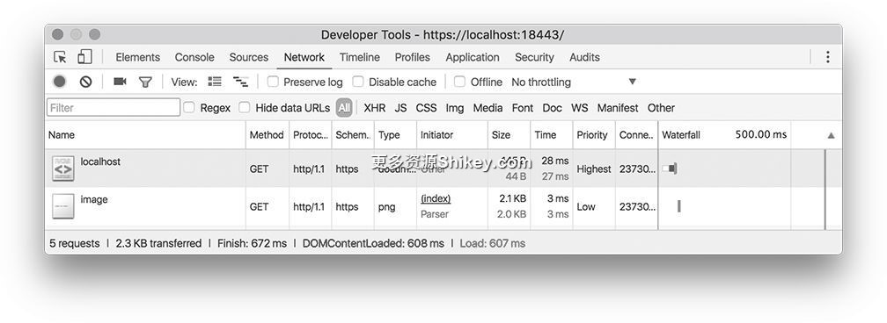
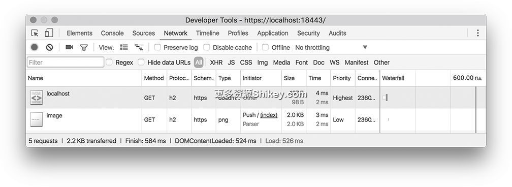
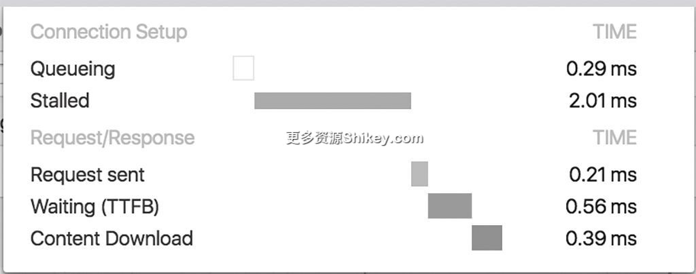
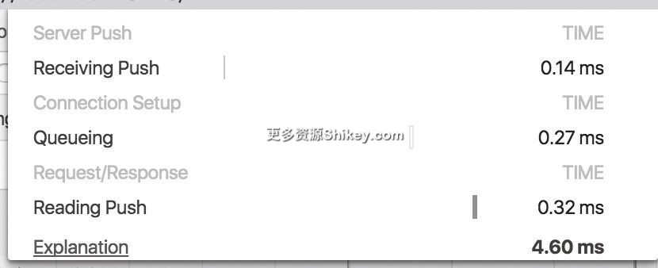

### 本资源由 itjc8.com 收集整理
# 第 9 章 使用 Go 语言实现 HTTP/2、HTML5 的协议
本章将使用 Go 语言来实现第 7 章介绍的一部分协议。由于第 8 章介绍的大部分是面向服务器端的功能，以及与 CSS 和视频流技术相关的内容，所以这里省略其实现。

## 9.1　HTTP/2

Go 语言从 2016 年 2 月发布的版本 1.6 开始对 HTTP/2 提供支持。仅通过设置 HTTPS 通信，表示 HTTP/2 的 `h2` 就会添加到第 4 章介绍的 NPN/ALPN
协商的候补中。如果客户端和服务器通过协商能够确认对方支持 HTTP/2，就可以使用 HTTP/2 进行通信。

代码清单 9-1 用于与 Google 进行通信，并确认协议版本。

**代码清单 9-1　确认 HTTP 协议版本**

```
package main

import (
    "fmt"
    "net/http"
)

func main() {
    resp, err := http.Get("https://google.com/")
    if err != nil {
        panic(err)
    }
    defer resp.Body.Close()
    fmt.Printf("Protocol Version: %s\n", resp.Proto)
}
```

Go 语言能够通过环境变量来控制是否支持 HTTP/2（表 9-1）。

**表 9-1　使用 GODEBUG 环境变量来控制 HTTP/2 的功能**

环境变量

说明

`http2client=0`

将客户端的 HTTP/2 支持设为无效

`http2server=0`

将服务器的 HTTP/2 支持设为无效

`http2debug=1`

将 HTTP/2 相关的调试日志设为有效

`http2debug=2`

输出清除帧等更多的调试日志

我们加上这些环境变量来运行一下代码。由于最详细的日志（ `http2debug=2`）中的数据量太大，所以这里省略了一部分。该模式可能是为修改 HTTP/2
层的代码的人设计的。从下面的代码中可以看出，应用程序的创建者仅使用简单的环境变量（ `http2debug=1`）就能查看通信记录。

```
$ go run try_http2.go
Protocol Version: HTTP/2.0

$ GODEBUG=http2client=0 go run try_http2.go
Protocol Version: HTTP/1.1

$ GODEBUG=http2debug=1 go run try_http2.go
2017/02/13 00:49:10 http2: Transport failed to get client conn for google.com:443:
    http2: no cached connection was available
2017/02/13 00:49:10 http2: Transport creating client conn 0xc420001ba0 to
    216.58.197.238:443
2017/02/13 00:49:10 http2: Transport encoding header ":authority" = "google.com"
2017/02/13 00:49:10 http2: Transport encoding header ":method" = "GET"
2017/02/13 00:49:10 http2: Transport encoding header ":path" = "/"
2017/02/13 00:49:10 http2: Transport encoding header ":scheme" = "https"
2017/02/13 00:49:10 http2: Transport encoding header "accept-encoding" = "gzip"
2017/02/13 00:49:10 http2: Transport encoding header "user-agent" = "Go-http-
    client/2.0"
2017/02/13 00:49:10 http2: Transport received SETTINGS len=18, settings:
    MAX_CONCURRENT_STREAMS=100, INITIAL_WINDOW_SIZE=1048576, MAX_HEADER_LIST_
    SIZE=16384
2017/02/13 00:49:10 Unhandled Setting: [MAX_HEADER_LIST_SIZE = 16384]
2017/02/13 00:49:10 http2: Transport received WINDOW_UPDATE len=4 (conn)
    incr=983041
2017/02/13 00:49:10 http2: Transport received SETTINGS flags=ACK len=0
2017/02/13 00:49:10 http2: Transport received HEADERS flags=END_HEADERS stream=1
    len=150
2017/02/13 00:49:10 http2: Transport received DATA flags=END_STREAM stream=1
    len=262
    data="....</H" (6 bytes omitted)
Protocol Version: HTTP/2.0
```

deeeet 在博客文章《Go 语言和 HTTP/2》1 中写了详细的实现，以及通过 Go 语言使用创建帧的 API 和 HPACK 的示例代码。Go 语言的版本 1.6
与版本 1.8 之间的区别在于下一节介绍的服务器推送。

## 9.2　HTTP/2 的服务器推送

Go 语言从版本 1.8 开始支持服务器推送，提供了与第 4 章介绍的 Chunk 形式的传输方式相似的 API。

```
func handler(w http.ResponseWriter, r *http.Request) {
    pusher, ok := w.(http.Pusher)
    if ok {
        pusher.Push("/style.css", nil)
    }
    // 通常的事件处理器的处理
}
```

在 Chunk 形式的传输方式中，会将 `http.ResponseWriter` 转换为 `http.Flusher` 来访问特殊的方法
`Flush()`，而在 HTTP/2 的服务器推送中，则是转换为 `http.Pusher` 来使用。

使用 Go 语言来实现服务器推送的代码如代码清单 9-2 所示。

**代码清单 9-2　服务器推送**

```
package main

import (
    "fmt"
    "io/ioutil"
    "net/http"
)

var image []byte

// 准备图像文件
func init() {
    var err error
    image, err = ioutil.ReadFile("./image.png")
    if err != nil {
        panic(err)
    }
}

// 将 HTML 发送给浏览器
// 推送图像
func handlerHtml(w http.ResponseWriter, r *http.Request) {
    // 如果可以转换为 Pusher，则（在使用 HTTP/2 连接的情况下）进行推送
    pusher, ok := w.(http.Pusher)
    if ok {
        pusher.Push("/image", nil)
    }
    w.Header().Add("Content-Type", "text/html")
    fmt.Fprintf(w, `<html><body></body></html>`)
}

// 将图像文件发送给浏览器
func handlerImage(w http.ResponseWriter, r *http.Request) {
    w.Header().Set("Content-Type", "image/png")
    w.Write(image)
}

func main() {
    http.HandleFunc("/", handlerHtml)
    http.HandleFunc("/image", handlerImage)
    fmt.Println("start http listening :18443")
    err := http.ListenAndServeTLS(":18443", "server.crt", "server.key", nil)
    fmt.Println(err)
}
```

准备一个用于推送的图像文件（ `image.png`）。服务器为第 6 章介绍的使用了 TLS 的服务器，Handler 准备了 HTML 和图像。当访问 HTML 时，服务器推送图像的 URL。

将路径传入 `Push()` 方法的第一个参数中。具体的内部动作是，模拟访问服务器，在获取 `/image.png` 的内容后，将其作为
`PUSH_PROMISE` 帧发送给客户端。

HTTP/2 的代码与 HTTP/1.1 的代码的不同之处在于，如果可以转换为 `Pusher`，则进行推送。不管是推送时还是请求时，使用的都是发送图像的
Handler。通过最小程度的刷新，就可以进行服务器推送。另外，如果存在检查是否可以转换的代码，则可以向后兼容，因此在 HTTP/1.1 环境下也能够运行。

下面，我们加上 `GODEBUG=http2server=0`，与 HTTP/1.1 中的运行结果进行比较。打开 Chrome 开发工具的网络选项卡来比较一下。HTTP/1.1 的状态如图 9-1
所示，HTTP/2 的状态如图 9-2 所示。



**图 9-1　HTTP/1.1 的网络选项卡的状态**



**图 9-2　HTTP/2 的网络选项卡的状态**

在图 9-2 中，Initiator 栏中写着 `Push`，右侧的写着时间序列的处理内容的 Waterfall 栏的情况也与 HTTP/1.1
有很大不同。将鼠标放在上面，就会显示详细的时间轴。HTTP/1.1 时间轴的详细内容如图 9-3 所示，HTTP/2 时间轴的详细内容如图 9-4 所示。



**图 9-3　HTTP/1.1 时间轴的详细内容**



**图 9-4　HTTP/2 时间轴的详细内容**

由于是本地服务器且图像文件很小，所以单位很小，但在 HTTP/1.1 中，从发送请求到下载完毕要花费约 1.2 ms。发送请求的准备时间也有约 2 ms。

在 HTTP/2 中，由于图像文件已经下载完毕并保存在了本地，所以只要从缓存中读取即可。花费的时间约为 0.3 ms。

### HTTP/2 的补充说明

在 Go 语言的 HTTP/2 实现中，我们介绍了使用模拟请求来创建推送的内容。因为是模拟请求，所以传递给 Handler 的 `r *http.Request` 也是虚构的。除了必不可少的
`Host` 首部，该实现中没有任何首部。据笔者所知，所有的客户端发送的 `User-Agent`
首部也是空的。在测试时可能会改变用于推送的内容和一般请求返回的内容，不过实际的解决方案中不会出现这种做法。

另外，推送对象并不是只有在 HTML 中使用的 asset，在接下来跳转的未请求的页面中使用的图像等也可以推送。这一技术今后很可能会用于广告分发等。

## 9.3　Server-SentEvents

Server-Sent Events 是 Chunk 形式的应用，因此我们可以使用第 6 章介绍的 `http.Flusher` 来实现。

### 9.3.1　服务器的实现

我们来创建一个连续显示质数的服务，这里分为两个文件来实现。

> - 服务器
> - HTML 视图

首先是服务器部分。我们使用 Go 语言的标准库中计算质数的 `ProbablyPrime()` 方法，代码如下。

```
package main

import (
    "fmt"
    "io/ioutil"
    "math/big"
    "net/http"
    "time"
)

var html []byte

// 将 HTML 发送给浏览器
func handlerHtml(w http.ResponseWriter, r *http.Request) {
    // 如果可以转换为 Pusher，则进行推送
    w.Header().Add("Content-Type", "text/html")
    w.Write(html)
}

// 将质数发送给浏览器
func handlerPrimeSSE(w http.ResponseWriter, r *http.Request) {
    flusher, ok := w.(http.Flusher)
    if !ok {
        http.Error(w, "Streaming unsupported!", http.StatusInternalServerError)
        return
    }
    // 获取上下文以检测连接中断
    ctx := r.Context()
    w.Header().Set("Content-Type", "text/event-stream")
    w.Header().Set("Cache-Control", "no-cache")
    w.Header().Set("Connection", "keep-alive")
    w.Header().Set("Access-Control-Allow-Origin", "*")

    var num int64 = 1
    for id := 1; id <= 100; id++ {
        // 通信中断时结束
        select {
        case <-ctx.Done():
            fmt.Println("Connection closed from client")
            return
        default:
            // do nothing
        }
        for {
            num++
            // 计算质数
            if big.NewInt(num).ProbablyPrime(20) {
                fmt.Println(num)
                fmt.Fprintf(w, "data: {\"id\": %d, \"number\": %d}\n\n", id, num)
                flusher.Flush()
                time.Sleep(time.Second)
                break
            }
        }
        time.Sleep(time.Second)
    }
    // 超过 100 个后结束发送
    fmt.Println("Connection closed from server")
}

func main() {
    var err error
    html, err = ioutil.ReadFile("index.html")
    if err != nil {
        panic(err)
    }
    http.HandleFunc("/", handlerHtml)
    http.HandleFunc("/prime", handlerPrimeSSE)
    fmt.Println("start http listening :18888")
    err = http.ListenAndServe(":18888", nil)
    fmt.Println(err)
}
```

这里定义了两个 Handler，前者只用于返回静态的 HTML，后者用于 Server-Sent Events。在设置完需要的首部后，循环进行多次输出质数并调用 `Flush()` 的处理。这里只是根据
`data:` 和 `event:`（这里并未使用）等 Server-Sent Events 的语法来输出文本并调用
`Flush()`。为了能每秒显示一个质数，代码中还加入了等待处理。

一旦浏览器关闭，就会通过 `CloseNotify` 通道传递信息。示例代码中的 `select` 语句是用于从质数通道和结束通知的通道这两个通道中选择处于激活状态的那个通道的 Go
语言的语法。

最后是 HTML 视图。在使用 Server-Sent Events 刷新页面的地方使用了 MVC 框架 Mithril。由于未使用编译器等，所以以下代码可以直接运行。

```
<!DOCTYPE html>
<html>
    <head>
        <meta charset="UTF-8">
        <meta name="viewport" content="width=device-width, initial-scale=1" />
        <title> 质数</title>
        <script src="//unpkg.com/mithril/mithril.js"></script>
        <script src="//unpkg.com/mithril-stream"></script>
    </head>
    <body>
        <div id="root"></div>
        <script>
        const component = {
            oninit: function(vnode) {
                this.primes = stream([]);
                const sse = new EventSource('/prime');
                sse.onmessage = (event) => {
                    this.primes().splice(0, 0, JSON.parse(event.data));
                    m.redraw();
                };
            },
            view: function() {
                return m("div", [
                    m("ul", this.primes().map((prime) => {
                        return m("li", , prime.number);
                    }))
                ]);
            }
        };
        m.mount(document.getElementById("root"), component);
        </script>
    </body>
</html>
```

与往常一样，运行服务器程序，在 `localhost:18888` 等待。我们使用浏览器来访问一下。

上面的代码是客户端和服务器一对一的示例。实际上，HTML 视图多用于聊天室等，以在访问 Web
的多个用户之间共享信息。为了向各组的用户发送数据，使用数组来管理针对每个用户创建的消息和关闭通知的通道，并广播消息，类似这样的结构会被创建出来 2。在介绍
WebSocket 时讲解的示例代码中就有处理房间的内容。

### 9.3.2　客户端的实现

我们也可以使用 Go 语言来实现客户端。Server-Sent Events 是预先知道分隔符是换行符的 Chunk 形式，所以我们可以使用第 6 章介绍的客户端实现方法中的简单的方法来实现客户端，如下所示。

```
package main

import (
    "bufio"
    "bytes"
    "context"
    "fmt"
    "io"
    "net/http"
    "os"
)

type Event struct {
    Name string
    ID   string
    Data string
}

func EventSource(url string) (chan Event, context.Context, error) {
    req, err := http.NewRequest("GET", url, nil)
    if err != nil {
        return nil, nil, err
    }
    ctx, cancel := context.WithCancel(req.Context())
    res, err := http.DefaultClient.Do(req)
    if err != nil {
        return nil, nil, err
    }
    if res.StatusCode != 200 {
        return nil, nil, fmt.Errorf("Response Status Code should be 200, but %d\n",
res.StatusCode)
    }
    events := make(chan Event)
    go receiveSSE(events, cancel, res)
    return events, ctx, nil
}

func receiveSSE(events chan Event, cancel context.CancelFunc, res *http.Response) {
    reader := bufio.NewReader(res.Body)
    var buffer bytes.Buffer
    event := Event{}
    for {
        line, err := reader.ReadBytes('\n')
        if err != nil {
            close(events)
            if err == io.EOF {
                cancel()
                return
            }
            panic(err)
        }
        switch {
        case bytes.HasPrefix(line, []byte(":ok")):
            // 跳过
        case bytes.HasPrefix(line, []byte("id:")):
            event.ID = string(line[4 : len(line)-1])
        case bytes.HasPrefix(line, []byte("event:")):
            event.Name = string(line[7 : len(line)-1])
        case bytes.HasPrefix(line, []byte("data:")):
            buffer.Write(line[6:])
        case bytes.Equal(line, []byte("\n")):
            event.Data = buffer.String()
            buffer.Reset()
            if event.Data != "" {
                events <- event
            }
            event = Event{}
        default:
            fmt.Fprintf(os.Stderr, "Parse Error: %s\n", line)
            cancel()
            close(events)
        }
    }
}

func main() {
    events, ctx, err := EventSource("http://localhost:18888/prime")
    if err != nil {
        panic(err)
    }
    for {
        select {
        case <-ctx.Done():
            return
        case event := <-events:
            fmt.Printf("Event(Id=%s, Event=%s): %s\n", event.ID, event.Name, event.
Data)
        }
    }
}
```

代码有点长，主要由 HTTP 连接部分（ `EventSource()`）、通过内部处理来进行 Server-Sent Events
的传递处理的方法（ `receiveSSE()`）和利用前两部分的代码的客户端代码（ `main()`）这三部分构成。

传递处理部分只是以换行符为单位对数据进行分隔，然后将其放入 `Event` 结构体，并发送到通道中。

在客户端代码中，当通信中断时（从 `ctx.Done()` 通道接收数据时），可以像 JavaScript 的 API 那样重新进行连接。

```
for {
    select {
    case <-ctx.Done():
        fmt.Println("Connection close from server")
        events, ctx, err = EventSource("http://localhost:18888/prime")
        if err != nil {
            panic(err)
        }
        continue
    case event := <-events:
        fmt.Printf("Event(Id=%s, Event=%s): %s\n", event.ID, event.Name, event.
Data)
    }
}
```

## 9.4　WebSocket

面向 Go 语言的 WebSocket 的实现有很多种。虽然也有准标准库（ `golang.org/x/net/websocket`），但该准标准库的 README 中写了不推荐使用该库。推荐使用的代替库是
Go 语言的 Web 应用程序框架 Gorilla 提供的 WebSocket 实现。该库既提供了面向服务器的功能，也提供了面向客户端的功能。

WebSocket 很难实现，所以笔者来介绍一下。第 1 章也介绍过，在使用第三方库和准标准库时，需要提前下载并安装。

如果源代码中已经使用了库，就可以使用以下命令来一次性获取这些库。

**一次性获取当前文件夹的源代码中使用的库**

```
$ go get
```

后面笔者会介绍使用方法，但由于该库中已经有了许多示例代码，所以本书中就不再创建示例代码进行讲解了。

### 9.4.1　服务器的实现

我们来看一下实现 WebSocket 的发送和接收的简单的示例代码。

服务器在前面出现的 HTTP 服务器的 `handler` 函数中进行协议升级，获取 `websocket.Conn` 的指针类型的变量 `c`。

```
var upgrader = websocket.Upgrader{} // use default options

func echo(w http.ResponseWriter, r *http.Request) {
    c, err := upgrader.Upgrade(w, r, nil)
    if err != nil {
        log.Print("upgrade:", err)
        return
    }
    ︙
}
```

这里的关键在于 `Upgrade()` 方法执行的处理，不过这与第 6 章介绍的内容并没有什么不同。

在取出一些必要的首部进行确认后，使用 `http.Hijacker` 方法取出内部的套接字。

```
h, ok := w.(http.Hijacker)
var rw *bufio.ReadWriter
netConn, rw, err = h.Hijack()
```

创建包含下述响应首部的通信响应，然后直接使用该套接字返回响应，这样升级就完成了。虽然 `*websocket.Conn` 与 `net.Conn` 不兼容，但它们拥有几个相同的方法。


```
HTTP/1.1 101 Switching Protocols
Upgrade: websocket
Connection: Upgrade
```

在升级完成后，通信时主要会使用代码清单 9-3 中的两个方法。除了会接收和返回消息类型，这两个方法与 `net.Conn` 的 `Read()` 方法和
`Write()` 方法一样。

**代码清单 9-3　通信时使用的方法**

```
// 写入方法
ws.WriteMessage(messageType int, data []byte) error

// 读取方法
ws.ReadMessage() (messageType int, data []byte, err error)
```

消息类型如表 9-2 所示。

**表 9-2　消息类型**

常量

值

含义

`websocket.TextMessage`

1

UTF-8 字符串

`websocket.BinaryMessage`

2

二进制数据

`websocket.CloseMessage`

8

请求关闭

`websocket.PingMessage`

9

发送心跳（用于确认是否可以通信）

`websocket.PongMessage`

10

接收心跳

普通消息中使用 `websocket.TextMessage` 和 `websocket.BinaryMessage`。

其他控制命令主要是关于通信的连接和切断的。 `websocket.CloseMessage` 用来传递切断通信的指示。 `websocket.PingMessage` 和
`websocket.PongMessage` 配套使用。为了表明通信未中断，客户端会定期向服务器发送 `PingMessage`。

`PongMessage` 是用于接收消息的 ID，不能在发送消息时使用。如果像代码清单 9-4 那样设置了事件处理器，服务器就会执行对方在发送消息时指定的处理。该代码选自聊天示例。当心跳 3 被定期发送来时，服务器就会更新套接字的超时设置。如果客户端的通信中断了，则超时时间就不再更新，超时后自动关闭套接字。

**代码清单 9-4　设置事件处理器**

```
conn.SetPongHandler(
    func(string) error {
        conn.SetReadDeadline(
            time.Now().Add(pongWait));
    return nil}
)
```

### 9.4.2　客户端的实现

客户端代码也能够使用模拟 Go 语言标准库 `net.Dial` 的 API 来轻松实现连接。

**WebSocket 的客户端代码**

`c, _, err := websocket.DefaultDialer.Dial(u.String(), nil)`

将 URL 传递给参数后，会返回与 `*websocket.Conn` 类型相同的套接字，然后就可以使用与服务器相同的 API 进行双向通信了。

与服务器一样，客户端进行的是第 6 章介绍的协议升级。使用 `net.Request` 结构体，将 `GET` 的 HTTP 请求发送给对方 URL 的服务器。如果响应中返回了
`101` 状态码，就获取需要的首部来初始化客户端的套接字结构体。

### 9.4.3　房间的实现

无论是 Server-Sent Events，还是 WebSocket，要想用来交流，就需要实现“房间”功能。“房间”是在线游戏中的概念。房间里的成员进行实时通信，一起打游戏，这是游戏团队的最小单位。访问同一个 URL
的人会进入同一个房间，而在大型服务中，还需要准备用于选择进入房间的成员的大厅。

Gorilla 的 chat 的示例代码中实现了一个名为“Hub”的房间，如下所示。

```
type Hub struct {
    // 登录的客户端
    clients map[*Client]bool
    // 客户端发来的消息
    broadcast chan []byte
    // 客户端的登录请求
    register chan *Client
    // 客户端的注销请求
    unregister chan *Client
}

// 初始化后通过 goroutine 执行的方法
func (h *Hub) run() {
    for {
        select {
        case client := <-h.register:
            h.clients[client] = true
        case client := <-h.unregister:
            if _, ok := h.clients[client]; ok {
                delete(h.clients, client)
                close(client.send)
            }
        case message := <-h.broadcast:
            for client := range h.clients {
                select {
                case client.send <- message:
                default:
                    close(client.send)
                    delete(h.clients, client)
                }
            }
        }
    }
}
```

示例代码里有在初始化时管理客户端的 `map`，以及接收客户端发来的异步消息的 3 个通道（消息、登录、注销）。另外，该示例代码中还执行了连接和切断处理。

## 9.5　本章小结

本章介绍了 HTTP/2、Server-Sent Events 和 WebSocket 的相关实现。

我们了解了 HTTP/2 的内部实现非常复杂，但从 Go 语言的 API 层面来看，通过最小程度的修改就可以实现服务器推送等。另外，Server-Sent Events 是第 6 章介绍的 Chunk
形式的延伸，WebSocket 是第 6 章介绍的协议升级的延伸。客户端使用在 HTML 上运行的 JavaScript 来执行 Server-Sent Events 和 WebSocket，这种情况应该占一大半，而使用
Go 语言也可以执行。

本章并未涉及 WebRTC 的相关内容。在本书第 1 版出版时，WebRTC 规范本身还未确定，修改比较频繁，当时还没有能让人放心使用的 Go 语言库。虽然现在有了 `pion` 库，但从 awesome
pion 页面可以看出， `pion` 有很多种用法，很难通过 HTTP 参考书的部分篇幅来进行全面的介绍。另外，通信机器的拓扑结构也与前面介绍的 HTTP
服务器和浏览器的组合存在很大不同，这也带来了一定的困难。WebRTC 到底有多难，大家可以参考一下 Voluntas 写的《工作中的 WebRTC》4。笔者也希望有人能将这些内容单独写成一本书。

到本章为止，关于 HTTP/1.1 之前、HTTP/1.1 和 HTTP/2 之后的内容，笔者分别使用了 3
章进行介绍。从下一章开始，笔者介绍的内容将不涉及具体版本。这是因为，与其再按版本分开讲解，不如针对某一课题进行探讨比较好。接下来会介绍关于 RESTful、JavaScript 的前端 API、Web
服务提供端的结构和安全等的内容。