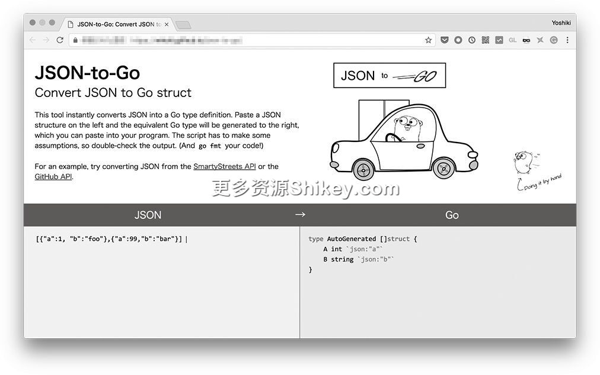

### 本资源由 itjc8.com 收集整理
# 附录
# 附录

## A.1　状态码一览表

这里我们将详细介绍一下 HTTP 的状态码。状态码是由使用 HTTP 实现远程存储的 WebDAV 规范扩展而来的。

在制定新的 RFC 规范时，状态码也会增加。状态码的含义和处理方式等详细信息都会记述在 RFC 中。另外，在状态码被定义时，IANA 的数据库也会随之更新，该网站中的状态码一览表用起来非常方便。

### A.1.1　1 字头（信息）

首先介绍一下 1 字头状态码（表 A-1）。1 字头状态码表示确定请求成功或失败之前的状态。

**表 A-1　1 字头状态码**

状态码

用途

`100 Continue`

这是第 4 章中介绍过的状态码。客户端先只向服务器发送请求首部，征求服务器的允许，服务器向客户端返回该状态码，表示已接收其发送的部分请求

`101 Switching Protocols`

这是第 4 章中介绍过的状态码。当客户端请求切换到 HTTP 以外的协议时，服务器返回该状态码，表示已受理其请求。该状态码不可以用于 API

`103 Early Hints`

在内容还未准备好之前，优先返回用于 HTTP/2 的服务器推送的提示信息

### A.1.2　2 字头（成功）

当请求正常结束时，返回 2 字头状态码（表 A-2）作为响应。

**表 A-2　2 字头状态码**

状态码

用途

`200 OK`

正常结束。这是最常见的响应

`201 Created`

可对 `POST` 方法返回该状态码。当新的资源创建成功时返回该状态码

`202 Accepted`

服务器已经收到请求，但尚未处理完成

`203 Non-Authoritative Information`

请求本身已成功，但不能信任进行中继的代理服务器

`204 No Content`

可对 `DELETE` 方法返回该状态码。页面中没有内容，也不可以包含主体

`205 Reset Content`

服务器通知客户端重置画面，返回初始状态

`206 Partial Content`

在下载中断后，当重新开始时使用该状态码

### A.1.3　3 字头（重定向）

3 字头状态码（表 A-3）用于重定向和缓存无变化时的通知。重定向在第 1 章中进行了介绍，缓存在第 2 章中进行了介绍。注意，这里没有状态码 `306`（ `306`
已不再被使用）。

**表 A-3　3 字头状态码**

状态码

用途

`300 Multiple Choices`

用于存在多个重定向分支的情况。该状态码极少使用

`301 Moved Permanently`

重定向到 `Location` 首部的 URL。用于因域迁移、网站迁移和 HTTPS 化而页面已永久迁移的情况。结果会被缓存。方法可改变

`302 Found`

重定向到 `Location` 首部的 URL。用于临时维护等原有的 URL
今后仍然有效的情况。如果存在用于缓存的首部，则会执行缓存。方法可改变

`303 See Other`

重定向到 `Location` 首部的 URL。作为 `POST`
操作的返回结果，重定向到一个新的资源。不可以进行缓存。方法可改变

`304 Not Modified`

与使用 `If-Modified-Since` 首部或 `If-None-Match`
首部发送过来的下载内容的信息相比，内容未改变（可以再次使用缓存）

`305 Use Proxy`

现在不建议使用

`307 Temporary Redirect`

重定向到 `Location` 首部的 URL。这是 RFC 7231
中新增的状态码，表示临时迁移。如果存在用于缓存的首部，则会执行缓存。改变方法需要得到允许

`308 Moved Permanently`

重定向到 `Location` 首部的 URL。这是 RFC 7538 中新增的状态码，表示永久迁移。会进行缓存。改变方法需要得到允许

### A.1.4　4 字头（客户端错误）

4 字头状态码（表 A-4）表示客户端引起的错误。当请求目标的 URL 发生错误、所需首部不完整、主体的形式发生错误时，服务器就会返回这类状态码。

**表 A-4　4 字头状态码**

状态码

用途

`400 Bad Request`

当客户端的请求中存在问题时返回该状态码。在其他更具体的状态码不适用的情况下使用

`401 Unauthorized`

当需要认证时返回该状态码。如果 `WWW-Authenticate` 首部中指定 BASIC 认证或 Digest 认证，浏览器会发送用户 ID
和密码的输入表单

`403 Forbidden`

当访问禁止使用的资源时返回该状态码。有的站点会返回 `404`

`404 Not Found`

当未发现资源时返回该状态码

`405 Method Not Allowed`

当使用了不允许使用的方法时返回该状态码

`406 Not Acceptable`

当第 2 章中介绍的内容协商的结果、MIME 类型、显示语言、字符集和压缩格式中的任意一项未找到服务器和客户端都理解的形式时返回该状态码

`407 Proxy Authentication Required`

由代理返回。客户端首先需要认证代理

`408 Request Timeout`

当请求未在服务器等待的时间到来时返回该状态码

`409 Conflict`

当无法正常执行处理时返回该状态码。HTTP/1.1 中还添加了在类似的情况下使用的 `428`

`410 Gone`

当过去应该存在的资源消失时返回该状态码。有的站点会返回 `404`

`411 Length Required`

主体是必需的，但在不存在 `Content-Length` 首部的情况下，返回该状态码

`412 Precondition Failed`

当未满足先决条件时返回该状态码

`413 Payload Too Large`

当主体的大小超出服务器允许的范围时返回该状态码

`414 URI Too Long`

当 URL 的长度超出服务器允许的范围时返回该状态码。RFC 7231 中添加了该状态码

`415 Unsupported Media Type`

当不支持指定的媒体类型时返回该状态码

`416 Range Not Satisfiable`

当指定范围下载时，如果指定的范围无效，则返回该状态码

`417 Expectation Failed`

Expect 首部中不允许放入 `100-continue` 之外的值，当放入其他值时会返回该状态码

`421 Misdirected Request`

当不支持向服务器请求的 Schema 时返回该状态码。HTTP/2 的 RFC 7540 中添加了该状态码

`425 Too Early`

在 TLS 1.3 的会话重启时以 0 RTT 一起发送信息的情况下，因为担心请求被重放，服务器要求从握手开始重来，此时返回该状态码

`426 Upgrade Required`

正如第 4 章的协议升级中介绍的那样，当向客户端请求变更协议时返回该状态码

`428 Precondition Required`

当先决条件错误时返回该状态码。RFC 2685 中设想的情况与 `409 Conflict` 类似。对之前 `GET`
的内容进行加工，然后进行 `PUT`，中间如果有其他人修改，就会发生错误。所谓先决条件，就是设想修改源数据的 `ETag`

`429 Too Many Requests`

当发送大量请求时返回该状态码。例如，在 Google 的服务中，API 限制每秒发送 10 次。如果发送请求的次数超过该限制，就会返回该状态码

`431 Request Header Fields Too Large`

当请求首部过大时返回该状态码

`451 Unavailable For Legal Ressons`

用于出于法律原因而拒绝访问的情况，这是 `403 Forbidden` 的一种特殊情况

表 A-5 的状态码虽然也进行了定义，但 RFC 中并未规定浏览器应该如何运行。

**表 A-5　特殊的 4 字头状态码**

状态码

用途

`402 Payment Required`

当需要付钱时返回该状态码

### A.1.5　5 字头（服务器错误）

5 字头状态码（表 A-6）表示服务器引起的错误。虽然有很多种，但由于客户端的请求不存在什么问题，所以需要等待服务器恢复正常。

**表 A-6　5 字头的状态码**

状态码

用途

`500 Internal Server Error`

服务器内部的错误

`501 Not Implemented`

服务器应该实现的功能还未实现

`502 Bad Gateway`

在请求到达服务之前，网关或代理服务器拒绝请求时返回该状态码。在 AWS 的负载均衡器（ELB）与对象服务器交流失败（响应无法解析）时也返回该状态码

`503 Service Unavailable`

在服务器未启动等情况下，代理服务器或者负载均衡器返回该状态码。有时在维护时也会返回该状态码

`504 Gateway Timeout`

在请求到达服务之前，网关或者代理服务器无法到达最终目的地的服务器，超时后返回该状态码

`505 HTTP Version Not Supported`

当请求不支持的 HTTP 版本时返回该状态码

`509 Bandwidth Limit Exceeded`

当通信带宽用尽时返回该状态码

`511 Network Authentication Required`

在需要在建立网络连接之前进行验证的情况下返回该状态码

## A.2　首部字段一览表

下面介绍一下本书中介绍过的首部（表 A-7~表 A-15）。首部有很多类型，除 HTTP 之外，电子邮件和新闻组中也会使用首部，我们可以在 IANA 网站上查看最新的 RFC 等中定义的所有首部。

**表 A-7　基本的首部**

首部名

发送

接收

说明

`Host`

√

指定发送目的地的主机名。由此，即使 IP 地址相同，也可以运行多个 Web 服务（虚拟主机）

`Referer`

√

指定页面跳转时的前一个页面的 URL。使用 `Referrer-Policy` 首部可以控制是否在从 HTTPS 到 HTTP
时发送该首部、是否在发送该首部时仅发送域名、是否返回绝对路径等

`Date`

√

服务器返回响应时的日期

`Location`

√

在服务器返回用于重定向的
`301`、 `302`、 `303`、 `307`、 `308` 状态码时，指定跳转目标


`User-Agent`

√

浏览器的名称。在功能机盛行时代，该首部用来根据运营商改写表情文字

`X-Powered-By`

√

表示服务器信息的首部。虽然它不是正式发布的首部，但会经常用到

`Server`

√

`X-Powered-By` 实现标准化的首部

`:authority`

√

用于 HTTP/2 之后，替代 `Host` 首部

`:path`

√

用于 HTTP/2 之后，将路径作为首部发送

`:method`

√

用于 HTTP/2 之后，将方法作为首部发送

`:status`

√

用于 HTTP/2 之后，将状态作为首部接收。不可记述原因内容

`:scheme`

√

指 http、https 等。用于 HTTP/2

`:protocol`

√

在 Websocket 等非 HTTP 的情况下添加

**表 A-8　内容信息的首部**

首部名

发送

接收

说明

`Accept`

√

浏览器发送图片类型等可处理的多媒体类型列表，服务器将该列表与自身支持的类型进行比较，确定返回的文件类型

`Content-Type`

√

√

指定发送、接收的文件和信息的 MIME 类型，如 `text/html`、 `image/png`
等。还存在同时包含语法和词汇的 MIME 类型，使用 `image/svg+xml` 这种 XML 来表示 SVG

`Content-Length`

√

√

设置所发送的主体大小。在压缩的情况下，指压缩后的大小

`Accept-Encoding`

√

发送客户端能够理解的压缩格式列表

`Content-Encoding`

√

指定压缩主体时的格式，从客户端发送的可使用的格式中选择

`Accept-Language`

√

当可以选择内容的语言时，客户端发送可接收的语言列表

`Content-Language`

√

指定发送给客户端的内容的语言，从客户端发送的可使用的语言中选择

`Content-Disposition`

√

指定文件是以浏览器内联的形式显示，还是下载并保存到本地。当保存到本地时，可以指定文件名

`Accept-Ranges`

√

服务器在支持部分下载时返回 `bytes`，否则返回 `none`

`Ranges`

√

在部分下载的情况下，用于设置客户端要下载的范围

`If-Range`

√

在部分下载的情况下，如果内容被改写，即使与下载完的部分进行组合，数据仍是破损状态。因此，该首部通过添加 `ETag` 或
`Last-Modified` 信息，在存在修改的情况下，能够由部分下载变为全部下载

`Content-Range`

√

针对客户端的请求，返回实际返回的内容的范围

**表 A-9　缓存相关的首部**

首部名

发送

接收

说明

`Pragma: no-cache`

√

要求通信线路上的代理不进行缓存。这是 HTTP/1.0 中的首部，现在已经不被推荐使用了。如果存在 `Cache-Control`，请忽略该首部


`Expires`

√

设置新鲜度保持期间。在新鲜度保持期间，使用缓存，不执行 HTTP 访问。这是 HTTP/1.0 中的首部，如果存在
`Cache-Control`，请忽略该首部

`Cache-Control`

√

√

这是客户端的请求和服务器的响应中都可以使用的缓存控制首部

`Last-Modified`

√

返回内容的最后修改时间。客户端在下次访问服务器时将该日期作为 `If-Modified-Since` 发送，服务器以此来判断缓存是否有效

`If-Modified-Since`

√

与 `Last-Modified` 配套使用

`ETag`

√

可在服务器端设置条件（例如内容的散列等除日期之外的条件）的缓存的键。客户端在下次访问服务器时将该信息作为 `If-None-Match`
发送，服务器以此来判断缓存是否有效

`If-None-Match`

√

与 `ETag` 配套使用

`Vary`

√

即使是相同的 URL，内容也会随着语言、移动端或 PC
端等发生变化，在这种情况下，该首部用来防止过度缓存。通过列举哪个首部对内容差异有影响，来判断浏览器是否应该使用缓存

`Link`

√

存储当前显示的资源的相关信息的链接，如索引或作者信息等文档的相关信息、用于书签的永久链接、RESTful 资源的前端和后端等的信息、应该预加载的 CSS
文件等。IANA 定义了可使用的类型

**表 A-10　HTTP/1.1 中导入的通信方式相关的首部**

首部名

发送

接收

说明

`Connection: Keep-Alive`

√

√

将 HTTP/1.1 中的 Keep-Alive 设为有效。客户端发送该首部，服务器返回相同的首部来使其有效

`Connection: Close`

√

当强行关闭 Keep-Alive 时发送该首部。在超时的情况下也可关闭网络连接

`Connection: Upgrade`

√

当升级为 WebSocket 等协议时返回该首部。与 `Upgrade` 首部配套使用

`Upgrade`

√

用于记述升级目标的协议

`Expect: 100-continue`

√

在客户端发送大型文件的情况下，客户端向服务器确认是否接收即将使用 `Content-Length` 首部发送的数据量。如果服务器同意，则返回
`100 continue`

`Transfer-Encoding: chunked`

√

当以 Chunk 形式返回主体时，服务器发送该首部

`Transfer-Encoding: ( 其他 )`

√

`Content-Encoding` 只是对主体进行压缩，而该首部用于压缩整个通信线路

`Trailer`

√

当在主体后面发送某些首部时，通知浏览器之后要发送哪些首部

`Allow`

√

当浏览器使用 `OPTION` 方法来确认可使用的方法时，服务器使用该首部返回可使用的方法信息

`Via`

√

√

在使用代理等的情况下，该首部用来记录中继服务器的信息

`X-Forwarded-For`

√

用于识别代理服务器在中途连接的 IP 地址

`Fowarded`

√

与 `X-Forwarded-For` 一样，但它是 RFC 中的标准首部

**表 A-11　认证、会话相关的首部**

首部名

发送

接收

说明

`WWW-Authenticate`

√

当需要认证时（ `401`），服务器将其使用的认证方式通知给浏览器。浏览器能够支持 Basic 认证和 Digest 认证

`Authorization`

√

该首部用来发送认证所需的信息（如 ID+ 密码、访问令牌等）

`Set-Cookie`

√

服务器发送希望浏览器保存的信息，浏览器在下次访问指定范围（域、路径）时，使用 `Cookie` 首部将保存的信息添加到请求中

`Cookie`

√

该首部用来将之前接收的 Cookie 信息发送给服务器

**表 A-12　用于 WebSocket 的首部**

首部名

发送

接收

说明

`Sec-WebSocket-Key`

√

HTTP/1.1 中浏览器发送的随机字符串

`Sec-WebSocket-Accept`

√

HTTP/1.1 中服务器返回的字符串。基于 `Sec-WebSocket-Key` 生成该首部

`Sec-WebSocket-Protocol`

√

√

指定子协议。发送端发送使用逗号分隔的列表，服务器返回选择的那一项

`Sec-WebSocket-Extensions`

√

将以消息为单位进行压缩等扩展功能设为有效

`Sec-WebSocket-Version: 13`

√

WebSocket 的版本号，当前固定为 13

**表 A-13　安全相关的首部**

首部名

发送

接收

说明

`X-XSS-Protection`

√

当检测到跨站脚本攻击时，使浏览器停止动作

`Content-Security-Policy`

√

详细定义网站中使用的内容的安全策略

`Content-Security-Policy-Report-Only`

√

与 `Content-Security-Policy` 一样，但不停止动作，只是报告错误

`Strict-Transport-Security`

√

服务器请求使用 HTTPS 连接

`Public-Key-Pins`

√

为了防止认证机构遭受 MITM 攻击，网站提供所持有的证书的散列，以便浏览器可以检验证书。由于存在应用负载较大等问题，所以提出规范的 Google 本身的
Chrome 已经停止支持该首部

`Public-Key-Pins-Report-Only`

√

与 `Public-Key-Pins` 一样，但不停止动作，只是报告错误

`Expect-CT`

√

它是 `Public-Key-Pins`
强有力的替代者，返回签名证书的时间戳。结合认证机构之外的日志服务器发行的签名证书的时间戳信息，浏览器可以检验证书

`X-Frame-Options`

√

该首部用来通知浏览器禁止在 iframe 的内部显示网站，以防止点击劫持。在 IE
之外的浏览器中， `Content-Security-Policy: frame-ancestors` 也可以实现同样的功能

`X-Content-Type-Options: nosniff`

√

这是禁用通过文件内容嗅探 MIME 类型的功能，而非禁用 MIME 类型，以防止非预期的脚本被执行

`Referrer-Policy`

√

当在网站内部跳转或跳转到外部网站时，该首部用来控制可以展示哪些信息

`X-Robots-Tag`

√

告诉搜索引擎等的爬虫，内容是否被索引

**表 A-14　CORS 相关的首部**

首部名

发送

接收

说明

`Origin`

√

指定通信源网页的域名

`Access-Control-Request-Method`

√

用逗号分隔要获得允许的通信方法

`Access-Control-Request-Headers`

√

用逗号分隔要获得允许的首部

`Access-Control-Allow-Origin`

√

指定允许通信的源名。在未使用 Cookie 的情况下，可以设置为通配符（ `*`）

`Access-Control-Allow-Method`

√

目标 URL 允许的方法名列表。不需要预检请求的方法可以省略该首部

`Access-Control-Allow-Headers`

√

目标 URL 允许的首部名列表。不需要预检请求的方法可以省略该首部

`Access-Control-Allow-Credentials`

√

当允许服务器接收 Cookie 等资格信息时添加该首部。该首部只可以设为 `true`

`Access-Control-Expose-Headers`

√

在服务器返回的不可被外部引用的响应首部中，指定可以通过脚本引用的首部名称

`Access-Control-Max-Age`

√

指定预检请求结果的有效期

**表 A-15　Web 推送相关的首部**

首部名

发送

接收

说明

`Prefer`

√

指定 Web 推送的设置

`TTL`

√

在发送一旦过时就失去价值的推送信息的情况下，设定其寿命的秒数

`Topic`

√

表示话题的标识符。在发送相同标识符的推送信息时，旧的推送信息会被删除，仅通知用户最新的信息

`Urgency`

√

表示消息的紧急度。如果为 `high`，即使终端电量不足，也会通知；如果为 `low`，只要未连接电源或
Wi-Fi，就忽略

## A.3　InternetExplorer 与 Content-Security-Policy 首部

虽然从 Internet Explorer 到 Edge、Chrominum Edge，浏览器不断更新换代，但随着操作系统开始支持 HTTP 通信，Internet Explorer 也继续支持 HTTP
通信。由于某些新功能无法使用，所以我们需要使用 Internet Explorer 的旧功能来代替。

例如，缓存结构不运行只会使系统变慢，并不会存在其他影响。不过，安全问题影响很大，我们还需努力应对。

本节将介绍一下 Internet Explorer 仍然需要应对的安全相关的问题。

### A.3.1　X-Content-Security-Policy 首部

Internet Explorer 只可以使用 `X-Content-Security-Policy` 来指定 `Content-Security-Policy`。另外，也只可以使用
`sandbox` 指令实现 `X-Content-Security-Policy` 首部。

### A.3.2　X-XSS-Protection 首部

使用 `X-XSS-Protection` 首部可以检测到明显可疑的情况，比如通过 HTML 内联来使用脚本标签等。虽然现代浏览器使用的是
`Content-Security-Policy` 首部（代码清单 A-2），但 Internet Explorer 使用的是 `X-XSS-Protection` 首部（代码清单
A-1）。由于只是根据模式匹配来判断，所以本来没有问题的代码模式可能会被判定为存在问题，即假阳性。因此，当向既有网站中引入 `X-XSS-Protection`
首部时，至今能正常运行的功能可能变得无法运行，需要进行修改。

**代码清单 A-1　用于 Internet Explorer 的 X-XSS-Protection 首部的设置示例**

```
X-XSS-Protection: 1; mode=block
```

**代码清单 A-2　现代浏览器中的设置示例**

```
Content-Security-Policy: script-src https: 'unsafe-inline'
```

### A.3.3　X-Frame-Options 首部

笔者介绍过，在 IFRAME 内部显示网站会增加点击劫持的风险。 `Content-Security-Policy` 首部虽然可以防止点击劫持，但 Internet Explorer
并未实现该功能，而是使用了 `X-Frame-Options` 首部来代替。

> `X-Frame-Options: DENY`
>
> 不允许在框架内使用。等同于 `Content-Security-Policy: frame-ancestors 'none'`。
>
> `X-Frame-Options: SAMEORIGIN`
>
> 不允许在不同 URL 的框架内使用。等同于 `Content-Security-Policy: frame-ancestors 'self'`。
>
> `X-Frame-Options: ALLOW-FROM http://××××.com`
>
> 仅允许从指定的 URL 调用时在框架内显示。

为了保持向后兼容，其他浏览器中也保留了该首部，但内容安全策略中规定 `Content-Security-Policy` 首部的优先级高于该首部。

## A.4　使用 Go 语言进行 JSON 解析

最近的语言处理系统基本上是使用标准库来进行 JSON 解析的。Go 语言标准库中的 `encoding/json` 包能够用于 JSON 解析。

许多语言的标准 JSON 解析器会创建对象类型或者字典类型等嵌入类型的实例，而 Go 语言的 JSON 解析器与此不同，它执行对预先创建的结构体的映射。 `encoding/json`
是静态类型语言中常用的一个包。

不过，有些数据预先并不知道存在什么样的键。例如，有的 JSON 会按关键字让数据行形成一览表的形式，以用于搜索引擎，并且关键字会根据文档发生改变，这种情况就非常难办了。这时可以按通用的数据类型进行转换。

下面，笔者先来介绍一下使用 Go 语言中常用的结构体进行 JSON 解析的相关内容。

### A.4.1　使用 Go 语言的结构体标签进行 JSON 解析

我们将图书信息的 JSON 转换为结构体。在代码清单 A-3 中，首先创建记录图书数据的 `Book` 结构体。与一般的成员变量声明不同， `Book`
结构体中会附上名为标签的注解。这样一来，就可以与 JSON 的键进行对应了。

**代码清单 A-3　将 JSON 转换为结构体**

```
package main

import (
    "encoding/json"
    "fmt"
)

type Book struct {
    Title string `json:"title"`
    Author string `json:"author"`
}

var jsonString = []byte(`
[
    {"title": "The Art of Community", "author": "Jono Bacon"},
    {"title": "Mithril", "author": "Yoshiki Shibukawa"}
]`)

func main() {
    var books []Book
    err := json.Unmarshal(jsonString, &books)
    if err != nil {
        panic(err)
    }
    for _, book := range books {
        fmt.Println(book)
    }
}
```

另外，即使未声明标签，上述的 JSON 也可以读取。由于 Go 语言结构体的公开成员必须以大写字母开头，所以我们不能随意决定使用大写还是小写。Go 语言的 `encoding/json` 包也可以用来生成
JSON 字符串，但这时 JSON 的键会与变量名称一致，变成以大写字母开头的 `Title`。另外，如果名称的首字母是小写，那么 `encoding/json`
包也会忽略该成员，既不会进行读取，也不会进行写入。键中很少会用到大写字母，因此，在进行读写的情况下，要声明标签。

结构化标签有一些新增的记述方法。

> `json:"–"`
>
> 在输入和输出时忽略成员。用于结构体中不持有临时缓存数据的情况。
>
> `json:" 键名 , omitempty"`
>
> 与输入无关，当输出为空时，省略该键。

通常只使用这些规则就足够了，但在个别情况下这些规则不适用。关于这些情况，笔者将在后面的内容中详细进行讲解。

> **自动生成结构体**
>
> 在如今这个 AI 和机器学习盛行的时代，我们无须手动执行所有的定义。使用 JSON-to-Go（图 A-1）等工具（笔者认为其内部并未使用 AI），通过传递 JSON 即可生成声明语句，声明加载数据的 Go
> 语言结构体。
>
> 
>
> **图 A-1　JSON-to-Go**
>
> 当然，需要手动完成的工作也没有完全消失，上一节介绍的内容，比如判断生成的标签是否正确、修改为更适合的设置等也还是有用的。另外，接下来笔者还会介绍一些应用性的话题，具体来说就是使 Go
> 语言更容易使用自动生成的结构体。不过，基于工具生成源代码，这一过程还是省去了很多手动作业。

### A.4.2　判断值到底是省略了，还是为 0

在 Go 语言中，变量一定会初始化为默认值。例如，数值会初始化为 0，字符串会初始化为空字符串（ `" "`）。因此，除了表示日期的变量（比如一定会输入 1 到 12 的整数这样的变量）外，JSON
中无法区分是放入了数值 0，还是省略了值，这样一来，在将数据差分作为 JSON 接收的情况下就非常麻烦了。笔者来介绍一个示例。

代码清单 A-4 是持有商品修改记录的结构体。假设服务器仅将修改过的值以 JSON 返回。

**代码清单 A-4　持有商品修改记录的结构体**

```
type EditHistory struct {
    ID    int    `json:"id"`
    Name  string `json:"name"`
    Price int    `json:"price"`
}
```

如果使用 `json.Unmarshal` 来读取该结构体的值，就无法区分价格是设置成了 0，还是原本就没有包含在 JSON 中。如果像代码清单 A-5 一样改用指针变量，那么在 JSON
中未包含价格的情况下，通过判断变量是否为 `nil`，就可以知道 JSON 中是否包含价格了。

**代码清单 A-5　使用指针显式判断值是否存在**

```
type EditHistory struct {
    ID    int     `json:"id"`
    Name  *string `json:"name"`
    Price *int    `json:"price"`
}

if history.Price != nil {
    // JSON 中放入了值
    fmt.Println(*history.Price)
}
```

### A.4.3　想要执行特殊类型转换的情况

JSON 与程序适合处理的格式不一定相同。JSON 中不存在表示日期的数据类型，但程序中可以使用各种编程语言的表示日期的类或者结构体。在 PAY.JP 的 API
中，服务器发送来的数据是纪元秒，因此需要将其转换为编程语言的日期类型。

这时，通过自己定义类型，并定义 `UnmarshalJSON()` 方法，就可以实现类型转换。在 Go 语言中，持有该方法的结构体满足 `json.Unmarshaler`
接口。Go 语言的服务器在持有该接口的对象中使用该转换方法，如代码清单 A-6 所示。

**代码清单 A-6　在读取 JSON 时执行类型转换，转换为读取的日期类型**

```
type DueDate struct {
    time.Time
}

func (d *DueDate) UnmarshalJSON(raw []byte) error {
    epoch, err := strconv.Atoi(string(raw))
    if err != nil {
        return err
    }
    d.Time = time.Unix(int64(epoch), 0)
    return nil
}
```

首先，使用 `type` 声明，创建填充了 `time.Time` 的 `DueDate` 类型。当进行填充时， `time.Time`
的方法也都可以使用。

然后，重新定义 `UnmarshalJSON()` 方法。该方法中传入了字节序列，因此，根据该类型的规则解析字节序列，初始化实例。这里传递的值是纪元秒，因此，首先要将其转换为表示秒的数值类型，使用
`time.Unix()` 函数创建 `time.Time` 结构体对象。最后将该结构体对象赋给填充的变量（默认创建与类型名称同名的实例变量）。

嵌入了该结构体的示例代码如代码清单 A-7 所示。与字符串和数值等一样，只需设置结构体的成员，并附上标签，就可以执行类型转换了。

**代码清单 A-7　嵌入 DueDate**

```
package main

import (
    "encoding/json"
    "fmt"
    "strconv"
    "time"
)

// 在这里写前面记述的 DueDate 类型的定义

type ToDo struct {
    Task string `json:"task"`
    Time DueDate `json:"due"`
}

var jsonString = []byte(`[
    {"task": " 去幼儿园", "due": 1486600200},
    {"task": " 去参加研究会", "due": 1486634400}
]`)

func main() {
    var todos []ToDo
    err := json.Unmarshal(jsonString, &todos)
    if err != nil {
        panic(err)
    }
    for _, todo := range todos {
        fmt.Printf("%s: %v\n", todo.Task, todo.Time)
    }
}
```

关于实现 `UnmarshalJSON()` 的位置，除各种数据类型之外，还可以将其赋给上一层的 `ToDo` 结构体。

## A.5　JSON 相关的应用话题

到目前为止，笔者介绍了 Go 语言的 JSON 的基本处理方法。这些基本的处理方法无法应对所有的情况，所以笔者接下来再介绍一些可实际应用的方法。

### A.5.1　在输出时对输出内容进行加工

像代码清单 A-8 那样，将结构体的实例传递给 `json.Marshal()`，就可以输出 JSON 了。

**代码清单 A-8　输出 JSON**

```
d, _ := json.Marshal(Book{" 领悟！ JavaScript", "Cody Lindley"})
log.Println(string(d))
// {"title":"领悟！ JavaScript","author":"Cody Lindley"}
```

结构体中的标签不仅用于读取数据，还用于写入数据。

在读取数据时，如果定义了 `UnmarshalJSON()`，就可以自定义读取处理，如果定义了 `MarshalJSON()` 方法，也可以自定义写入处理。在
`ToDo` 中加上结束标签 `Done`，在输出时，将输出完成的项目从 JSON 中去除。

我们将 `ToDo` 数组声明为 `ToDoList` 类型，并定义该类型的 `MarshalJSON`（代码清单 A-9）。在 Go 语言中，可以使用
`type` 以既有的类型等为基础来创建新的类型，数组也可以被创建为类型。前面创建的 `Due` 结构体中还创建了输出转换函数。代码清单 A-9 仅创建并输出
`Done` 标志位为假的项目的数组。

**代码清单 A-9　MarshalJSON 的定义**

```
// 对日期进行序列化
func (d *DueDate) MarshalJSON() ([]byte, error) {
    return []byte(strconv.Itoa(int(d.Unix()))), nil
}

type ToDoList []ToDo

// 在过滤列表后进行序列化
func (l ToDoList) MarshalJSON() ([]byte, error) {
    tmpList := make([]ToDo, 0, len(l))
    for _, todo := range l {
        if !todo.Done {
            tmpList = append(tmpList, todo)
        }
    }
    return json.Marshal(tmpList)
}
```

在使用该代码时，需要先转换 `[]ToDo`，然后调用 `json.Marshal()`。

```
d, _ := json.Marshal(ToDoList(todos))
```

这里分两步进行序列化处理：第一步是对 `ToDoList` 进行过滤；第二步是使用项目内部的 `DueDate` 将值转换为纪元时间。在过滤处理的内部还会再调用
`json.Marshal()`。使用层次化结构，在修改较小的情况下，通过创建修改后的对象并再次执行，就能够实现序列化处理。也可以自己创建并返回完整的字节序列作为 JSON 片段。在
`DueDate` 结构体中会创建并返回整数的字节序列。

> `ToDoList` 的最后会调用
> `json.Marshal`，但这里为了调用 `[]ToDo` 类型（非 `ToDoList` 类型），不会无限循环。

### A.5.2　类型因情况而改变的 JSON 的解析

虽说 JSON 只要能映射到简单的结构体即可，但在某些 API 中，需要灵活地对 JSON 进行解析。例如，其他 API 引起的信息变更操作也会触发 PAY.JP 的事件。返回的 JSON 的
`data` 属性会因事件类型而变化。如果是支付事件，则将 `Charge` 的 JSON 分配给 `data` 属性；如果是更新顾客信息，则将
`Customer` 的 JSON 分配给 `data` 属性。像这样，完全无关的对象很少会放入同一个变量中，虽然这些对象很少用作 API，但在处理 JSON
数据时，采用面向对象设计的、共享通用接口的其他类型的对象也可以放入变量中。

在这种情况下，我们可以使用 `json.Unmarshal()` 和 `json.RawMessage` 来解析。在代码清单 A-10 中， `type`
属性的值用于确定 `data` 属性。

**代码清单 A-10　data 部分的类型因事件类型而变化的示例代码**

```
{
    "created": 1442288882,
    "data": {
        "email": null,
        "id": "cus_a16c7b4df01168eb82557fe93de4",
        "object": "customer"
    },
    "id": "evnt_54db4d63c7886256acdbc784ccf",
    "object": "event",
    "type": "customer"
}
```

如代码清单 A-11 所示，类型不确定的数据会被设为 `json.RawMessage`，这是 `[]byte`
的别名，它用于临时存储解析到一半而暂停的内容。然后，只要按照顾客类型或者支付类型等使用的类型准备转换方法，用户就可以使用解析完的数据了。

**代码清单 A-11　不确定 data 的类型的事件信息（其 1）**

```
type Event struct {
    Created EpochDate       `json:"create"`
    Data    json.RawMessage `json:"data"`
    Id      string          `json:"id"`
    Object  string          `json:"object"`
    Type    string          `json:"type"`
}

// 将 data 看作顾客进行解析并返回
func (e Event) GetCustomerData() (*Customer, error) {
    if e.Type !== "customer" {
        return nil, fmt.Errorf(" 数据类型不是 customer%s", e.Type)
    }
    customer := &Customer{}
    err := json.Unmarshal(e.data, customer)
    if err != nil {
        return nil, err
    }
    return customer, nil
}
```

如果拥有通用接口，就可以将用于公开的结构体和用于读取的结构体分开。 `Data` 中会放入持有通用接口的结构体。如代码清单 A-12 所示，代码会变长，但由于可以使用 Go
语言的基于类型的分支处理，所以使用端的代码就更像 Go 语言了。

**代码清单 A-12　不确定 data 的类型的事件信息（其 2）**

```
// 公开的结构体
type Event struct {
    Created time.Time
    Data    EventData
    Id      string
    Object  string
}

// 小写的、不向外部公开的、用于读写 JSON 的结构体
type tmpEvent struct {
    Created EpochDate       `json:"create"`
    Data    json.RawMessage `json:"data"`
    Id      string          `json:"id"`
    Object  string          `json:"object"`
    Type    string          `json:"type"`
}

func (e *Event) UnmarshalJSON(raw []byte) error {
    // 通过用于读写 JSON 的结构体进行解析
    tmp := &tmpEvent{}
    err := json.Unmarshal(raw, &tmp)
    if err != nil {
        return err
    }
    e.Created = time.Time(tmp.Created)
    e.Id      = tmp.Id
    e.Object  = tmp.Object
    // 根据 Data 内部的类型，创建各自的结构体实例
    switch tmp.Type {
    case "customer":
        customer := &Customer{}
        json.Unmarshal(tmp.Data, customer)
        e.Data = customer
    case "charge":
        charge := &Charge{}
        json.Unmarshal(tmp.Data, charge)
        e.Data = charge
    }
}
```

### A.5.3　转换为通用的数据类型

还有一个更加简便的方法，那就是不声明结构体。使用 Go 语言中的 `interface{}` 类型，解析器就会生成与 JSON 的数据结构相应的接口。

```
func main() {
    var books []interface{}
    err := json.Unmarshal(jsonString, &books)
    if err != nil {
        log.Fatal(err)
    }
    for _, book := range books {
        log.Println(book)
    }
}
```

在这种情况下，以在 JSON 中放入了某个数组为前提传递 `interface{}` 数组。当然，如果知道对象来了，还可以使用
`map[string]interface{}`，也可以使用原始类型的 `float64`、 `string` 和 `bool`。JSON
规范中使用的类型与 JavaScript 相同，因此数值的数据类型只能是 `float64`，无法按整数进行处理。

实际上，在代码中处理时会进行类型转换。Go
语言的转换大致分为两种。在知道特定类型到来的情况下，可以使用一个变量来接收结果，但如果放入了不同类型的数据，就会造成混乱，导致程序运行结束。对于第二种形式，在处理不同类型的情况下，通过在 `ok`
变量中放入 `false`，程序就不会异常结束了。

在不知道处理什么类型的情况下，可以使用 `switch` 语句。

这几种转换方法的示例代码如代码清单 A-13 所示。

**代码清单 A-13　Go 语言的转换方法**

```
// 转换为特定类型（1）
bookList := books.([]interface{})

// 转换为特定类型（2）
bookMap, ok := book.(map[string]interface{})

// switch 语句
switch v := value.(type) {
case bool:
     log.Println("bool", value)
case float64:
     log.Println("float64", value)
case string:
     log.Println("string", value)
case map[string]interface{}:
     log.Println("map", value)
case []interface{}:
     log.Println("array", value)
}
```

### A.5.4　JSON Schema

Go 语言的 JSON 库会执行将 JSON 映射到结构体的操作，看起来似乎可以执行正确的转换，但是很遗憾，我们无法保证转换正确。即使读入的 JSON 和结构体的键不匹配，除了 JSON
语法错误的情况，其他情况下并不会发生错误。要想确认是否有符合预期的键，就需要用到 Schema。

虽然 Go 语言的标准库中没有 JSON Schema，但存在 JSON Schema 的第三方库，可以用来执行 JSON Schema 的验证。

JSON Schema 是由“JSON Schema Core”“JSON Schema Validation”“JSON Hyper-Schema”3 个规范构成的 1， `gojsonschema` 支持前两个规范。 `gojsonschema` 对应的是版本 4，而版本 5 目前正在制定，有望由
IETF 实现标准化。

由于 JSON Schema 的第三方库是非标准库，所以我们要先使用 `go get` 获取这个库。

代码清单 A-14 是引自 json-schema.org 的示例代码。

**代码清单 A-14　使用 JSON Schema 进行验证的 JSON**

```
{
    "id": 1,
    "name": "A green door",
    "price": 12.50,
    "tags": ["home", "green"]
}
```

Schema 的示例代码有很多，我们看一下代码清单 A-15 的 Schema。

**代码清单 A-15　JSON Schema 示例代码**

```
{
    "$schema": "http://json-schema.org/draft-04/schema#",
    "title": "Product",
    "description": "A product from Acme's catalog",
    "type": "object",
    "properties": {
        "id": {
            "description": "The unique identifier for a product",
            "type": "integer"
        },
        "name": {
            "description": "Name of the product",
            "type": "string"
        },
        "price": {
            "type": "number",
            "minimum": 0,
            "exclusiveMinimum": true
        }
    },
    "required": ["id", "name", "price"]
}
```

该 Schema 中定义了关于 `Product` 对象的 Schema。该 Schema 中有 3 个必要属性： `id` 是整数， `name`
是字符串， `price` 是包含小数的数值，最小为 0（非负）。

代码清单 A-16 用于解析该 Schema 并进行确认。

**代码清单 A-16　运行 JSON Schema 的代码**

```
package main

import (
    "fmt"
    "github.com/xeipuuv/gojsonschema"
    "io/ioutil"
)

func main() {
    // 从文件中读取 Schema
    schema, err := ioutil.ReadFile("schema.json")
    if err != nil {
        panic(err)
    }
    schemaLoader := gojsonschema.NewBytesLoader(schema)

    // 从文件中读取验证对象的文件
    document, err := ioutil.ReadFile("document.json")
    if err != nil {
        panic(err)
    }
    documentLoader := gojsonschema.NewBytesLoader(document)

    result, err := gojsonschema.Validate(schemaLoader, documentLoader)
    if err != nil {
        panic(err)
    }

    if result.Valid() {
        fmt.Printf("The document is valid\n")
    } else {
        fmt.Printf("The document is not valid. see errors :\n"
        for _, desc := range result.Errors() {
            fmt.Printf("- %s\n", desc)
        }
    }
}
```

该代码执行的处理很简单，在读取 Schema 后，使用 `gojsonschema.Validate()` 函数进行确认。本书中只尝试了基本功能，但其实该包中提供了多个方法，比如读取时的
`Loader` 和确认方法等。

至此，笔者介绍了从 JSON 创建结构体时的自动生成工具。在传递 JSON 时，有些工具还会返回相应的基本的 JSON Schema。